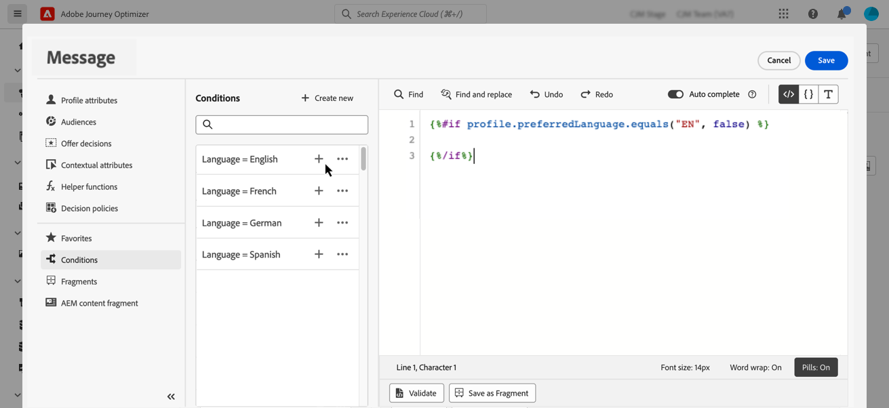
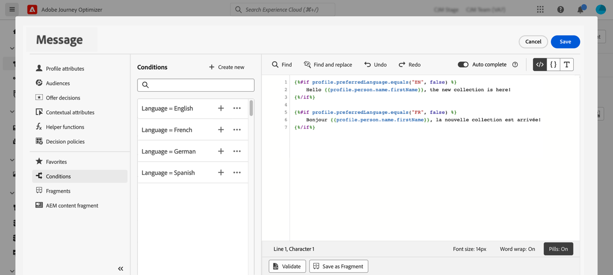
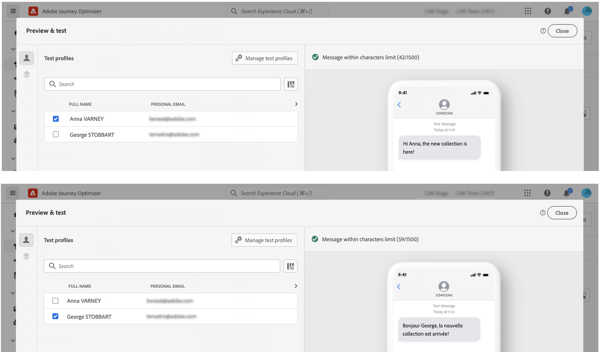
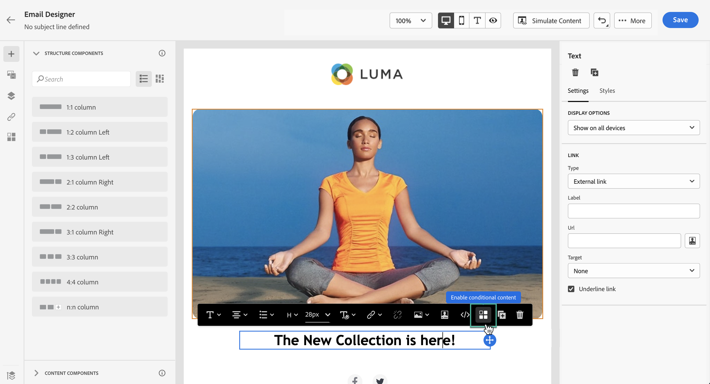
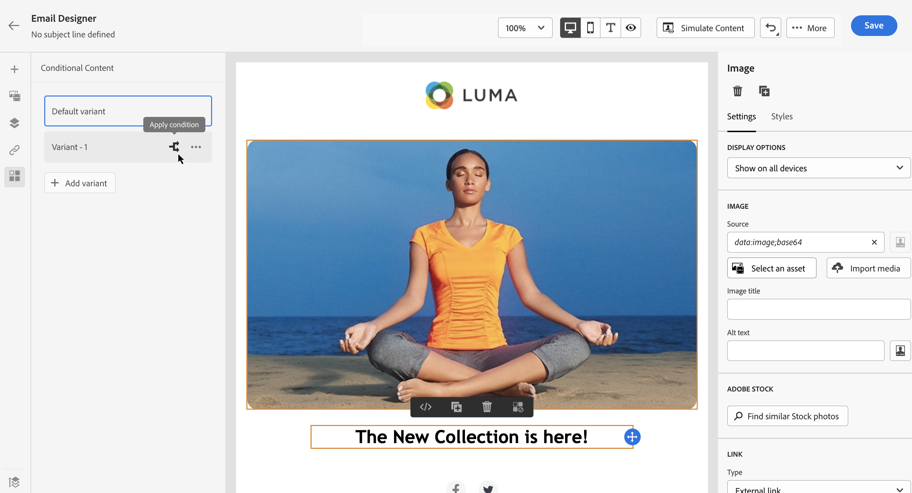
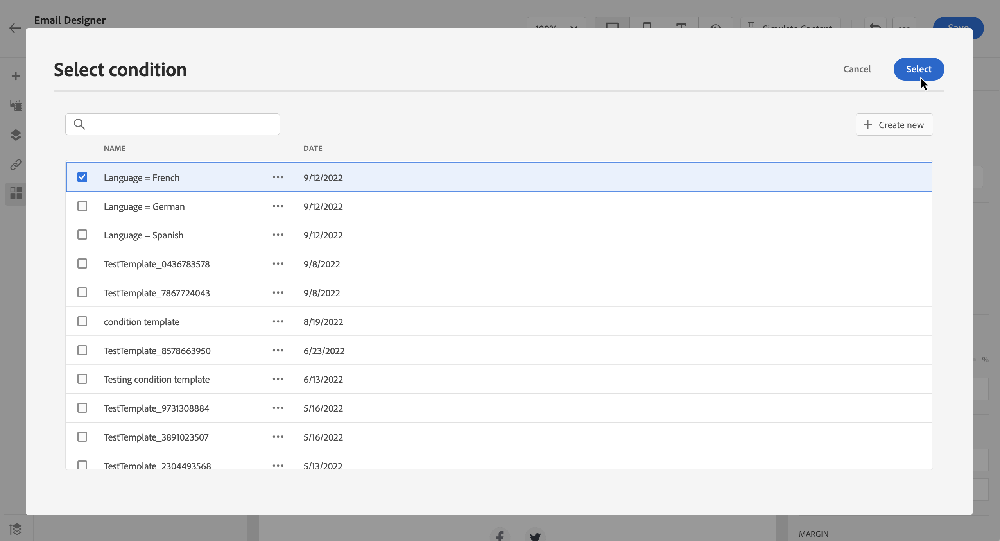
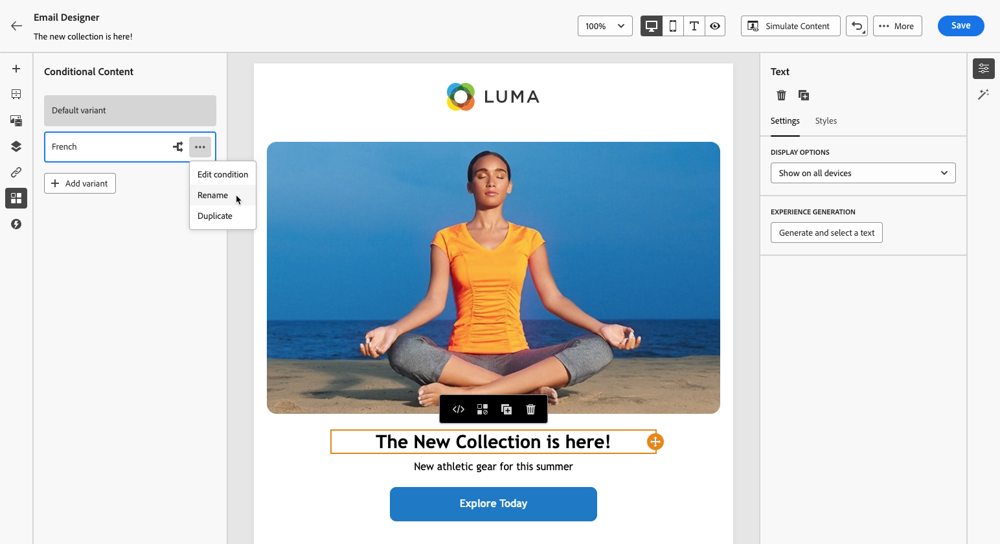
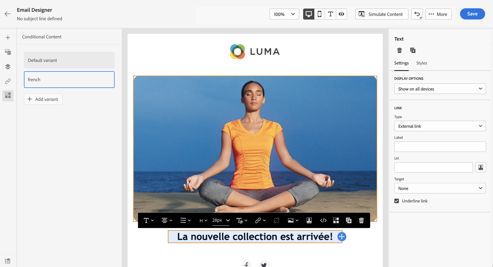
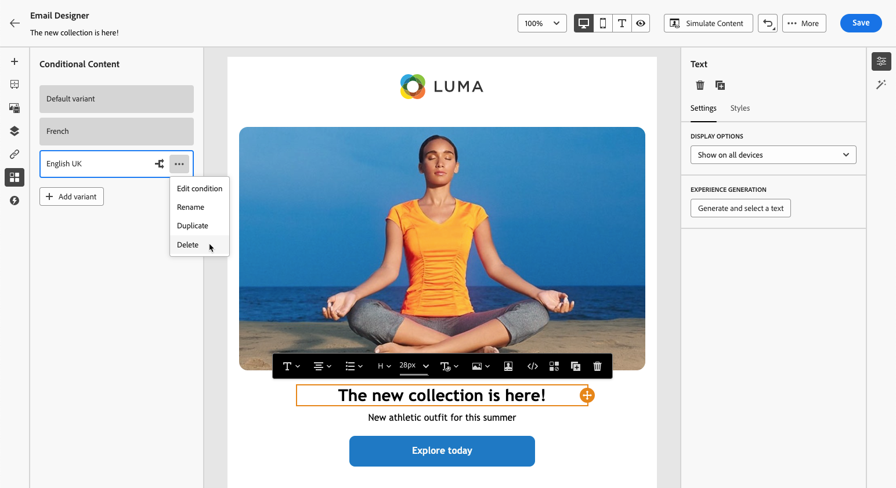

# Create dynamic content {#dynamic-content}

>[!BEGINSHADEBOX]

**On this page:** Learn how to use conditional rules to add dynamic content into your messages, both in personalization expressions and as content component variants in the Email Designer.

>[!ENDSHADEBOX]

Adobe Journey Optimizer allows you to leverage conditional rules created in the library to add dynamic content into your messages.

Dynamic content can be created into any field where you can add personalization using the personalization editor. This includes subject line, links, push notifications content, or text-type offers' representations. [Learn more about personalization](personalize.md)

Additionally, you can use conditional rules in the Email Designer to create multiple variants of a content component.

## Add dynamic content into expressions {#perso-expressions}

The steps to add dynamic content in expressions are as follows:

1. Navigate to the field where you want to add dynamic content, then open the personalization editor.

1. Select the **[!UICONTROL Conditions]** menu to display the list of available conditional rules. Click the + button next to a rule to add it into the current expression.

    You can also create a new rule by selecting **[!UICONTROL Create new]**. [Learn how to create conditions](create-conditions.md)

    

1. Add between the `{%if}` and `{%/if}` tags the content that you want to display if the conditional rule is met. You can add as many rules as needed to create several variants of an expression.

    In the example below, two variants have been created for an SMS content, depending on the recipient's preferred language.

    

1. Once your content is ready, you can preview different variants using either simulation method: click **[!UICONTROL Simulate content]** to test content variations with sample input data or AI auto-generation, or click **[!UICONTROL Simulate content]**, then select **[!UICONTROL Simulate content (AEP profiles)]** from the dropdown to preview with test profiles. [Learn how to test and preview messages](../content-management/preview-test.md)

    

>[!CAUTION]
>
>If the Email Designer fails to render properly after adding conditional blocks, verify that each new condition's syntax is correct and that no duplicate or conflicting statements exist. If issues persist, consider rebuilding problematic sections in a fresh template and test each conditional block incrementally.

## Add dynamic content into emails {#emails}

>[!CONTEXTUALHELP]
>id="ac_conditional_content"
>title="Conditional content"
>abstract="Use conditional rules to create multiple variants of a content component. If none of the conditions are met when sending the message, the content from the Default variant will display."

>[!CONTEXTUALHELP]
>id="ac_conditional_content_select"
>title="Conditional content"
>abstract="Use a conditional rule saved into the library or create a new one."

The steps to create variants of a content component in the Email Designer are as follows:

1. In the [Email Designer](../email/content-from-scratch.md), select a content component, then click **[!UICONTROL Enable conditional content]**.

    

1. The **[!UICONTROL Conditional Content]** pane displays on the left. In this pane, you can create multiple variants of the selected content component using conditions.
    
    Configure your first variant by selecting the **[!UICONTROL Select condition]** button.

    

1. The conditions library display. Select the conditional rule to associate to the variant, then click **[!UICONTROL Select]**. In this example, we want to adapt the component text depending on the recipient's preferred language.

    

    You can also create a new rule by clicking **[!UICONTROL Create new]**. [Learn how to create conditions](create-conditions.md)

1. The conditional rule is associated to the variant. For better readability, rename the variant by selecting the **[!UICONTROL Rename]** action from the More actions icon.

    

1. Configure how the component should display if the rule is met when sending the message. In this example, we want to display the text in French if it is the recipient's preferred language.

    

1. Add as many variants as needed for the content component. You can switch at any time between the different variants to check how the content component will display depending on the conditional rules.

    >[!NOTE]
    >
    >* If none of the rules defined in the variants are met when sending the message, the content component will display the content defined in the **[!UICONTROL Default variant]**.
    >
    >* Conditional content will be evaluated against associated rules in the order in which the variants are displayed. The default variant is always displayed if no other conditions are met.
    >
    >* When simulating or rendering proofs for emails containing multiple conditional variants, Journey Optimizer may require more processing time. If you experience timeouts or error messages, consider reducing the total number of variants or simplifying conditional rules. Learn more about testing your content on [this page](../content-management/preview-test.md).
    

1. To delete a variant, click the More actions icon next to the desired variant and select **[!UICONTROL Delete]**.

    

## Quick reference {#quick-reference}

This section contains structured knowledge intended to support interpretation, retrieval, and question answering related to this topic.

For complete understanding, this information should be combined with the documentation on this page. Neither source is intended to stand alone; the page describes the feature, while this section provides additional context that helps disambiguate terminology, intent, applicability, and constraints.

>[!BEGINTABS]

>[!TAB Overview]

**TL;DR**

This page explains how to use conditional rules to add dynamic content to messages — either via expression tags in the personalization editor or as content component variants in the Email Designer.

**Intents**

* Add dynamic content to personalization expressions using `` / `` conditional tags
* Preview multiple dynamic content variants using simulation
* Enable conditional content on an Email Designer content component
* Create multiple component variants each linked to a conditional rule
* Manage the Default variant displayed when no conditions are met at send time

>[!TAB Glossary]

* **Dynamic content**: Message content that varies based on conditional rules; different content is displayed depending on whether defined conditions are met at send time. *(product-specific)*
* **Conditional content**: An Email Designer feature that applies conditional rules to a content component, creating multiple display variants. *(product-specific)*
* **Default variant**: The content displayed for a component when none of the defined conditional rules are met when sending the message. *(product-specific)*
* **`` / `` tags**: Personalization editor expression syntax used to wrap content blocks that display only when a conditional rule is met.

>[!TAB Terminology]

* **Canonical name:** dynamic content — variants: conditional content, personalized content
* **Synonyms:** "conditional content" (Email Designer UI label) = "dynamic content" (general term used throughout)
* **Do not confuse:** adding dynamic content in expressions (using `` tags in the personalization editor) ≠ adding dynamic content in emails (creating component variants in the Email Designer — two distinct workflows)
* **Do not confuse:** "Default variant" (displayed when no conditional rules are met) ≠ a named variant (each associated with a specific conditional rule)

>[!TAB Guardrails & Limitations]

* Conditional content variants are evaluated against their associated rules in the order they are displayed; the Default variant is always displayed if no other conditions are met.
* When simulating or rendering proofs for emails with multiple conditional variants, Journey Optimizer may require more processing time; consider reducing the number of variants or simplifying conditional rules if timeouts or errors occur.
* If the Email Designer fails to render properly after adding conditional blocks, verify that each condition's syntax is correct and that no duplicate or conflicting statements exist.

>[!TAB FAQ]

**Q: What happens if none of the defined conditions are met when the message is sent?**

The content component displays the content defined in the Default variant.

**Q: In what order are conditional content variants evaluated?**

Variants are evaluated against their associated rules in the order they are displayed. The Default variant is always shown if no other conditions are met.

**Q: Where can dynamic content be added in Journey Optimizer?**

In any field where personalization can be added — including subject lines, links, push notification content, and text-type offer representations — via the personalization editor, and in Email Designer content components via conditional variants.

**Q: What should I do if the Email Designer fails to render after adding conditional blocks?**

Verify that each condition's syntax is correct and that no duplicate or conflicting statements exist. If issues persist, rebuild the problematic sections in a fresh template and test each conditional block incrementally.

>[!ENDTABS]

<!-- ai-section-version: 1 | source-hash: e6005d80 -->
