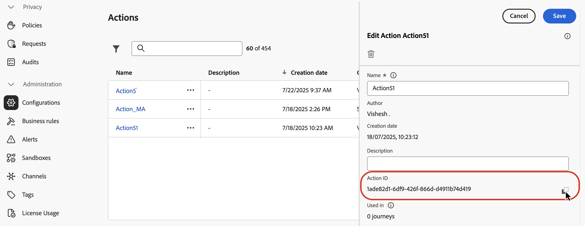
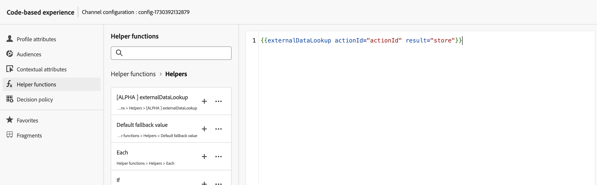
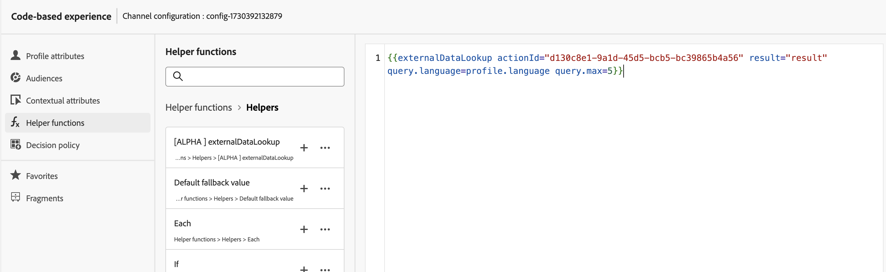
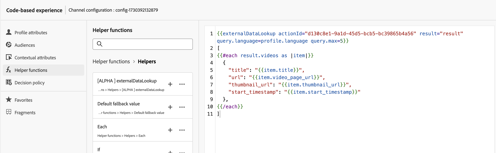
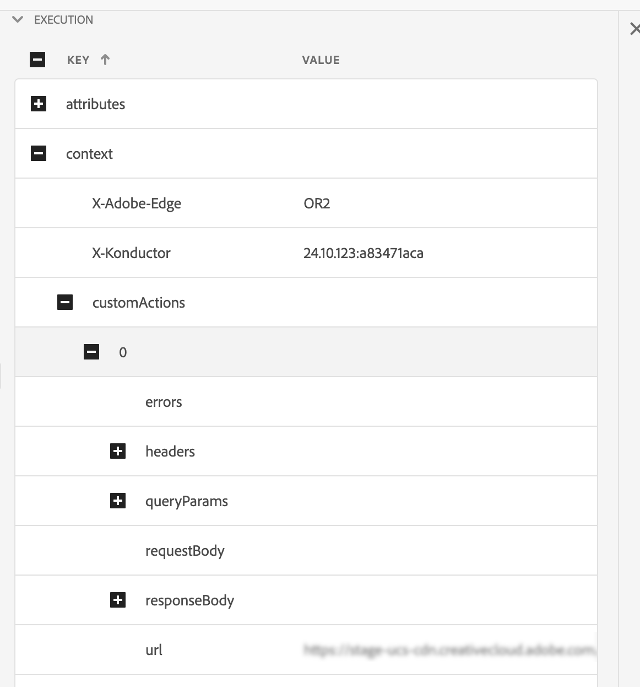

# External data lookup helper

The `externalDataLookup` helper in the [!DNL Journey Optimizer] personalization Editor can be used to dynamically fetch data from an external endpoint for use in generating content for inbound channels like the Code-based Experience, Web and In-App Message channels.

>[!AVAILABILITY]
>
>This capability is only available for a set of organizations (Limited Availability).

To use the helper, you must first define an Action in the **[!UICONTROL Administration]** > **[!UICONTROL Configurations]** menu. An Action is where you configure details about an external endpoint, such as URL, GET vs. POST method, header parameters, query parameters, POST body JSON schema and response JSON schema. 

Once the Action has been defined, it can be used both:

* In journeys, in a Custom Action activity to fetch content,
* In journeys and inbound campaigns, in an externalDataLookup helper to fetch data in an inbound action.

## Guardrails and Limitations

Please refer to Custom Actions in [!DNL Journey Optimizer] Inbound Channels Campaigns and Journeys#GuardrailsandGuidelines as well.

* **Default timeout** - By default, [!DNL Journey Optimizer] uses a timeout of 300ms when calling an external endpoint. Contact your Adobe representative to increase this timeout for an endpoint.
* **Response schema browsing & expression validation** - In the personalization editor, you cannot browse the schema of the endpoint response when inserting expressions. [!DNL Journey Optimizer] does not validate references to JSON attributes from the response used in expressions.
* **Supported data types for parameters** - The supported datatypes for payload variable parameters to be substituted via externalDataLookup helper are `String`, `Integer`, `Decimal`, `Boolean`, `listString`, `listInt`, `listInteger`, `listDecimal`.
* **Auto-refresh for updated actions** - Changes to an Action configuration are not reflected in the corresponding externalDataLookup calls in live campaigns and journeys. In order for a change to be reflected, you need to copy or modify any live campaigns or journeys that are using the Action in an externalDataLookup helper.
* **Variable substitution** - For now, usage of variables is not supported within the externalDataLookup helper parameters.
* **Dynamic path** - For now, dynamic URL path is not supported.
* **Multi-pass rendering** - Multi-pass rendering is supported.
* **Authentication** - For now, authentication options in the Action configuration are not supported by the externalDataLookup helper. In the meantime, for API key-based authentication or other plaintext authorization keys, you can specify them as header fields in the Action configuration.

## Configure an action and use the helper

To define an action and use the helper for personalization, follow these steps:

1. Create an Action to configure the endpoint for the lookup. This only needs to be done once for each endpoint and should be done by a technical user. [Learn how to configure a custom action](../action/about-custom-action-configuration.md)

    Note the Action ID and copy it.

    

1. Create an inbound campaign or journey action. For this example, we are showing how to use the externalDataLookup helper in a Code-based Experience JSON action, but it can be used in a personalization field in any inbound channel.

1. Edit the content of the action, go to Helper functions in the personalization editor, and navigate to **[!UICONTROL Helper functions]** > **[!UICONTROL Helpers]**.

1. Click the `+` button to insert the externalDataLookup helper. The helper expression is inserted in the editor, with placeholder values for the `actionId` and `result`.

    

    Replace the placeholder values as follows:
    
    * `actionId`: Paste the Action ID copied earlier.
    * `result`: Set the name of your choice. You'll use this result variable to access the fetched content.

1. Add any variable parameter values to be passed as part of the endpoint call. For example, here is how you might pass a language parameter and a max items parameter.

    

1. Use the result variable to access the fetched data and insert it into the content for the inbound action. For example, here is how you might return a JSON array of items fetched from the endpoint.

    

## How it works

### Runtime Execution

When an inbound action includes an externalDataLookup helper, the endpoint is called dynamically at the time the [!DNL Journey Optimizer] personalization request is received and processed by the AEP Edge Network.

This means the external endpoint needs to be able to handle at least as much concurrent load and throughput as the client is sending for the given surface to the AEP Edge Network.

### Syntax

`{{externalDataLookup actionId="d130c8e2-9a2d-45d5-bcb6-bc39865b4a56" result="result" optional-parameters...}}`

### Passing Parameters

When the external endpoint is called, all constant header values, query parameters and request payload value defined in the Action will be sent with the values given in the Action configuration.

For any variable header values, query/path parameters or request payload values, you can pass values dynamically using parameters to the externalDataLookup helper.

Parameter names:

* Header parameters: `header.<parameter-name>`
* Query parameters: `query.<parameter-name>`
* Payload parameters: `payload.<parameter-name>`
* Path Parameters: `dynamic_path.<parameter-name>`

For example:

```
{{externalDataLookup actionId="..." result="result" header.myHeaderParameter="value1" query.myQueryParameter="value2" payload.myPayloadParameter="value3"}}`
```

Parameter values can be fixed values or they can be personalized by referencing profile fields or other contextual attributes, e.g.:

```
{{externalDataLookup actionId="..." result="result" query.myQueryParameter=profile.myProfileValue}}
```

Payload parameters can be provided using dot notation to reference nested JSON attributes, e.g.:

```
{{externalDataLookup actionId="..." result="result" payload.context.channel="web"}}
```

### Accessing the result

To access the data fetched from an external endpoint lookup call, you can reference fields defined in the response payload in the Action definition using personalization expressions and helper functions.

For example, if the response payload in the Action looks like this:

```

{
    "videos": [
        {
            "id": "integer",
            "title": "string",
            "description": "string",
            "thumbnail_url": "string",
            "video_page_url": "string",
            "url": "string",
            "video_type": "string",
            "start_timestamp": "dateOnly",
            "created_on": "dateOnly",
            ...
        }
    ]
}

```

Then for example you could fetch and access the description of the first video in a Code-based Experience HTML action like this:

```

{{externalDataLookup actionId="d130c8e2-9a2d-45d5-bcb6-bc39865b4a56" result="result"}}
 
First video description: <b>result.videos[0].description</b>

```

Or for example you could fetch and loop through the items in order to return an item array in a Code-based Experience JSON action like this:

```

{{externalDataLookup actionId="d130c8e2-9a2d-45d5-bcb6-bc39865b4a56" result="result"}}
 
[
{{#each result.videos as |item|}}
    {                                                  
        "title": "{{item.title}}",
        "url": "{{item.video_page_url}}",
        "thumbnail_url": "{{item.thumbnail_url}}",
        "start_timestamp": "{{item.start_timestamp}}"
    },
{{/each}}
]

```

## Troubleshooting

### Timeouts and error handling

[!DNL Journey Optimizer] uses a strict timeout when calling the external endpoint in order to maintain low-latency, high-throughput performance characteristics for the Adobe Experience Platform Edge Network.

If the endpoint times out or there is any other sort of error reaching the endpoint, the result variable will be empty. Any references to attributes within the result variable in this case will also be empty. If you are simply displaying the attribute in the content, it will show as blank. If you are attempting to loop through an array attribute in the result, it will return no items.

If you want to more gracefully handle timeouts or errors by showing fallback content, you can check if the result of the lookup is empty and display fallback content in that case.

For example, you can show a fallback value for a single attribute like this:

```
First video description: 
```

or you can conditionally render an entire block of content like this:

```

{{externalDataLookup actionId="d130c8e2-9a2d-45d5-bcb6-bc39865b4a56" result="result"}}
 

   ... do something with result ...

    ... return fallback content ...


```

### Debugging

To help with debugging, timeout and error details for external data lookups are included in the Edge Delivery view in Adobe Experience Platform Assurance. If you are not seeing expected results for an externalDataLookup helper in an inbound action, you can start an Assurance session, initiate a [!DNL Journey Optimizer] call from a web or mobile implementation, and use the Edge Delivery view to check for timeout or error details.

For example:

Under the Edge Delivery Section of assurance trace as part of execution details a new customActions block has been added with request and response details similar to the one below. The errors section should help with debugging if there were any issues while executing custom action



## Frequently asked questions {#faq-external-data}

You will find below Frequently Asked Questions about External Data Lookup helper.

Need more details? Use the feedback options at the bottom of this page to raise your question, or connect with [Adobe Journey Optimizer community](https://experienceleaguecommunities.adobe.com/t5/adobe-journey-optimizer/ct-p/journey-optimizer?profile.language=en){target="_blank"}.

+++ How to pass a contextual attribute from the request as parameter to an external data lookup?

Use the Contextual Attributes > Datastream > Event menu to browse the Experience Event schema you're using and insert the relevant attribute as a parameter value like this: 

```
{{externalDataLookup actionId="..." result="result" query.myQueryParameter=context.datastream.event.<schemaId>.my.xdm.attribute}}
```

+++

+++ Does [!DNL Journey Optimizer] do any caching of external endpoint responses?

Not currently. This feature will be supported in the future.

+++
