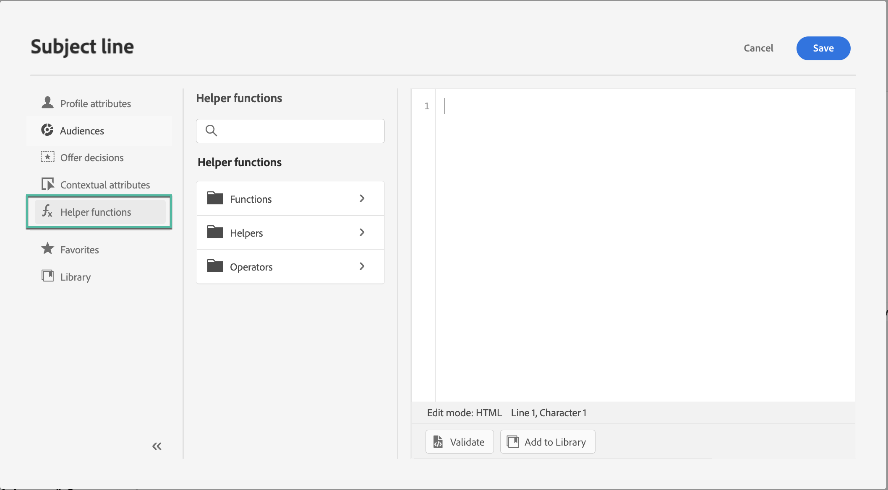

# Templating language and helper functions {#functionsL}

## About templating language

Use Journey Optimizer templating language to perform operations on data, such as calculations, data formatting or conversions, conditions, and manipulate them in the context of personalization.

Available functions are listed in these pages:

* [Operators](operators.md)
* [Aggregation](aggregation.md)
* [Arrays and list](arrays-list.md)
* [Maths](maths.md)
* [Maps](maps.md)
* [Objects](objects.md)
* [String](string.md)

Templating language is leveraged in helper functions available in the expression editor personalization drop-down list. 

They are grouped into three categories: [Functions](#functions-helper), [Helpers](#helper-helper) and [Operators](#operators-helper).

### Functions{#functions-helper}

**Array Functions**
 
<table>
    <tr><td><a href="aggregation.md#average">Average</a></td><td><a href="arrays-list.md#in">In</a></td><td><a href="aggregation.md#minimum">Minimum</a></td></tr>
    <tr><td>[Count](aggregation.md#count)</td><td>[Includes](arrays-list.md#includes)</td><td>[Not in](arrays-list.md#notin) (notIn)</td></tr>
    <tr><td>[Distinct](arrays-list.md#distinct)</td><td>[Intersects](arrays-list.md#intersects)</td><td>[Subset of](arrays-list.md#subset)</td></tr>
    <tr><td>[First item](arrays-list.md#head) (head)</td><td>[Last n in array](arrays-list.md#last-n) (lastN)</td><td>Sum</td></tr>
    <tr><td>[First n in array](arrays-list.md#first-n) (topN)</td><td>[Maximum](aggregation.md#maximum) (max)</td><td>[Superset of](arrays-list.md#superset)</td></tr>
</table>

**Map Functions**

* [Get](maps.md#get)
* [Keys](maps.md#keys)
* [Values](maps.md#values)

**Object Functions**

* [Is not null](objects.md#isNotNull)
* [Is null](objects.md#isNull)

**String Functions**

<table>
    <tr>
        <td>[Average](aggregation.md#average)</td>
        <td>[In](arrays-list.md#in)</td>
        <td>[Minimum](aggregation.md#minimum) (min)</td>
    </tr>
    <tr>
        <td>[Count](aggregation.md#count)</td>
        <td>[Includes](arrays-list.md#includes)</td>
        <td>[Not in](arrays-list.md#notin) (notIn)</td>
    </tr>
    <tr>
        <td>[Distinct](arrays-list.md#distinct)</td>
        <td>[Intersects](arrays-list.md#intersects)</td>
        <td>[Subset of](arrays-list.md#subset)</td>
    </tr>
    <tr>
        <td>[First item](arrays-list.md#head) (head)</td>
        <td>[Last n in array](arrays-list.md#last-n) (lastN)</td>
        <td>Sum</td>
    </tr>
    <tr>
        <td>[First n in array](arrays-list.md#first-n) (topN)</td>
        <td>[Maximum](aggregation.md#maximum) (max)</td>
        <td>[Superset of](arrays-list.md#superset)</td>
    </tr>
</table>

    
<table>
    <tr>
        <td>Camel Case</td>
        <td>Concat</td>
        <td>[Contains](string.md#contains)</td>
    </tr>
    <tr>
        <td>[Does not contain](string.md#doesNotContain)</td>
        <td>[Does not end with](string.md#doesNotEndWith)</td>
        <td>[Does not start with](string.md#doesNotStartWith)</td>
    </tr>
    <tr>
        <td>Encode64</td>
        <td>[Ends with](string.md#endsWith)</td>
        <td>[Equals](string.md#equals)</td>
    </tr>
    <tr>
        <td>EqualsIgnoreCase</td>
        <td>IsEmpty</td>
        <td>Length</td>
    </tr>
    <tr>
        <td>[Like](string.md#like)</td>
        <td>[Lower Case](string.md#lower)</td>
        <td>[Matches](string.md#matches)</td>
    </tr>
    <tr>
        <td> MD5</td>
        <td>[Not equal to](string.md#notEqualTo)</td>
        <td>[Regular expression group](string.md#regexGroup) (regexGroup)</td>
    </tr>
    <tr>
        <td>Replace</td><td>ReplaceAll</td>
        <td>Split</td>
        <td>[Starts with](string.md#startsWith)</td>
    </tr>
    <tr>
        <td>Title Case</td>
        <td>Trim</td>
        <td>[Upper Case](string.md#upper)</td>
    </tr>
</table>

### Helpers{#helper-helper}

* [Each](../personalization-syntax.md#each)
* [if](../personalization-syntax.md#if)
* let
* [unless](../personalization-syntax.md#unless)
* [with](../personalization-syntax.md#with)

### Operators{#operators-helper}

These operators can only be used with numbers.

<table>
    <tr>
        <td>[Addition](maths.md#add) (+)</td>
        <td>This operator adds two numbers</td>
    </tr>
    <tr>
        <td>[And](operators.md#and) (and)</td>
        <td>This operator creates a logical conjunction</td>
    </tr>
    <tr>
        <td>[Division](maths.md#divide) (/)</td>
        <td>This operator is used to find the quotient of two numbers</td>
    </tr>
    <tr>
        <td>[Equals to](operators.md#and) (=)</td>
        <td>This operation checks if values are equal</td>
    </tr>
    <tr>
        <td>[Greater than](operators.md#greaterthan)</td>
        <td>This operator checks if first value is greater than the second value</td>
    </tr>
    <tr>
        <td>[Greater or equals to](operators.md#greaterthanorequal)</td>
        <td>This operator checks if first value is greater than or equal to the second value</td>
    </tr>
    <tr>
        <td>[Multiplication](maths.md#multiply) (*) </td>
        <td>This operator multiplies two numbers</td>
    </tr>
    <tr>
        <td>[Negation](operators.md#not) (!) </td>
        <td>This operator creates a logical negation</td>
    </tr>
    <tr>
        <td>[Not equals to](operators.md#notequal) (=!) </td>
        <td>This operator checks if given expression not equal to give value</td>
    </tr>
    <tr>
        <td>[Or](operators.md#or) (or) </td>
        <td>This operator creates a logical disjunction</td>
    </tr>
    <tr>
        <td>[Remainder](maths.md#remainder) (%) </td>
        <td>This operator is used to calculate the remaindes after dividing two numbers</td>
    </tr>
    <tr>
        <td>Smaller than</td>
        <td>This operator checks if first value is less than the second value</td>
    </tr>
    <tr>
        <td>Smaller or equals to</td>
        <td>This operator checks if first value is less than or equal to the second value</td>
    </tr>
    <tr>
        <td>[Substraction](maths.md#substract) (-) </td>
        <td>This operator substracts two numbers</td>
    </tr>
</table>
