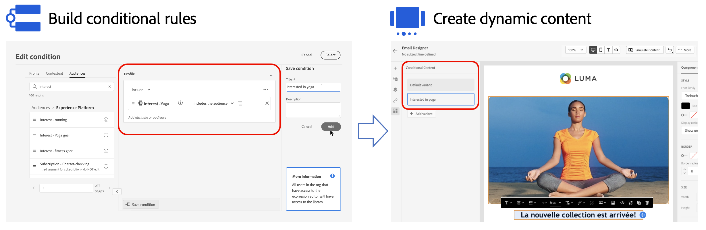

# Get started with dynamic content {#start-dynamic-content}

>[!BEGINSHADEBOX]

**On this page:** Understand how dynamic content uses conditional rules built from profile attributes, contextual events, and audiences to adapt your messages to targeted profiles.

>[!ENDSHADEBOX]

>[!CONTEXTUALHELP]
>id="ajo_conditions_list"
>title="Conditions"
>abstract="Conditional rules allow you to display multiple content variants in your messages based on profile attributes, contextual events or audiences." 

Dynamic content allows you to adapt the content of your messages based on **conditional rules** that can be made up of profile attributes, contextual events or audiences. Conditional rules are created using a visual rule builder within the personalization editor, where you can store them for further reuse across your journeys and campaigns. 

Conditional rules can be leveraged into the Email Designer and the personalization editor to **create dynamic content** which will adapt to the profiles targeted in your messages. 

* [Learn how to work with conditional rules](create-conditions.md)
* [Learn how to create dynamic content](dynamic-content.md)

## How-to video {#video}

Learn how to Create dynamic content with the condition rule builder.

>[!VIDEO](https://video.tv.adobe.com/v/3409815?quality=12)
