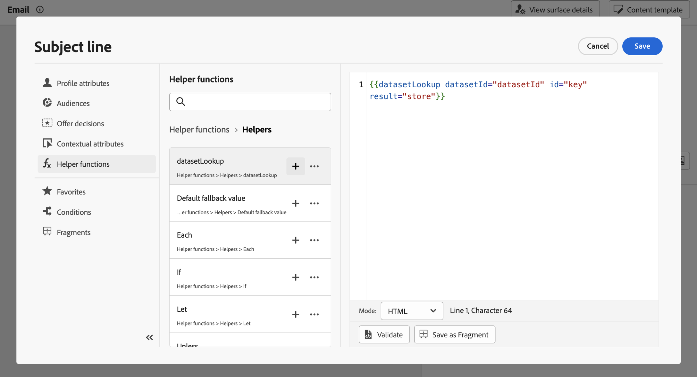
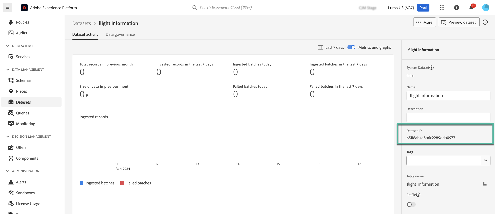
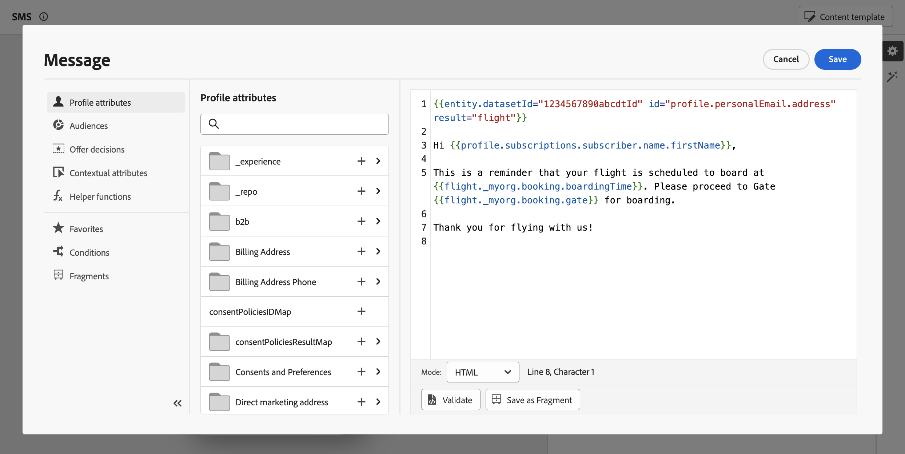

# Use Adobe Experience Platform data for personalization (beta) {#aep-data}

>[!AVAILABILITY]
>
>This feature is currently only available as a private beta.
>
>For now, it is only available for the **email channel** and for testing purposes in the non-production sandbox you have provided to Adobe and for the datasets requested for the beta.

Journey Optimizer allows you to leverage data from Adobe Experience Platform in the personalization editor to [personalize your content](../personalization/personalize.md). The steps are as follows: 

1. Open the personalization editor, which is available in every context where you can define personalization such as messages. [Learn how to work with the personalization editor](../personalization/personalization-build-expressions.md)

1. Navigate to the helper functions list and add the **datasetLookup** helper function to the code pane.

    

1. This function provides a predefined syntax to allow you to call fields from your Adobe Experience Platform datasets. The syntax is as follows:

    ```

    {{entity.datasetId="datasetId" id="key" result="store"}}

    ```
    <!-- remove double quotes for ID here ? need to confirm if syntax will be corrected for the helper-->

    * **entity.datasetId** is the ID of the dataset you are working with.
    * **id** is the ID of the source column that should be joined with the primary identity of the look up dataset. 

        >[!NOTE]
        >
        >The value entered for this field can be either a field ID (*profile.couponValue*), a field passed in a journey event (*context.journey.events.event_ID.couponValue*), or a static value (*couponAbcd*). In any case, the system will use the value and lookup into the dataset to check if it matches a a key.

    * **result** is an arbitrary name that you need to provide to reference all the field values you are going to retrieve from the dataset. This value will be used in your code to call each field.

    +++Where to retrieve a dataset ID?

    Dataset IDs can be retrieved in Adobe Experience Platform user interface. Learn how to work with datasets in the [Adobe Experience Platform documentation](https://experienceleague.adobe.com/en/docs/experience-platform/catalog/datasets/user-guide#view-datasets){target="_blank"}.

    

    +++

1. Adapt the syntax to suit your needs. In this example, we want to retrieve data related to passengers' flights. The syntax is as follows:

    ```

    {{entity.datasetId="1234567890abcdtId" id=profile.upcomingFlightId result="flight"}}

    ```
    
    * We are working in the dataset whose ID is "1234567890abcdtId",
    * The field we want to use to make a join with the look up dataset is *profile.upcomingFlightId*,
    * We want to include all the field values under the "flight" reference.

1. Once that the syntax to call in the Adobe Experience Platform dataset has been configured, you can specify which fields you want to retrieve. The syntax is as follows:

    ```

    {{result.fieldId}}

    ```

    * **result** is the value that you have assigned to the **result** parameter in the **MultiEntity** helper function. In this example "flight".
    * **fieldID** is the ID of the field you want to retrieve. This ID is visible in Adobe Experience Platform user interface when browsing your dataset. Expand the section below to display an example:

        +++Where to retrieve a field ID?

        Fields IDs can be retrieved when previewing a dataset in Adobe Experience Platform user interface. Learn how to preview datasets in the [Adobe Experience Platform documentation](https://experienceleague.adobe.com/en/docs/experience-platform/catalog/datasets/user-guide#preview){target="_blank"}.

        

        +++

    In this example, we want to use information related to the passengers' boarding time and gate. We therefore add these two lines:

    * `{{flight._myorg.booking.boardingTime}}`
    * `{{flight._myorg.booking.gate}}`

1. Now that your code is ready, you can complete your content as usual, and test it using the **Simulate content** button to check the personalization. [Learn how to preview and test content](../content-management/preview-test.md)


    
