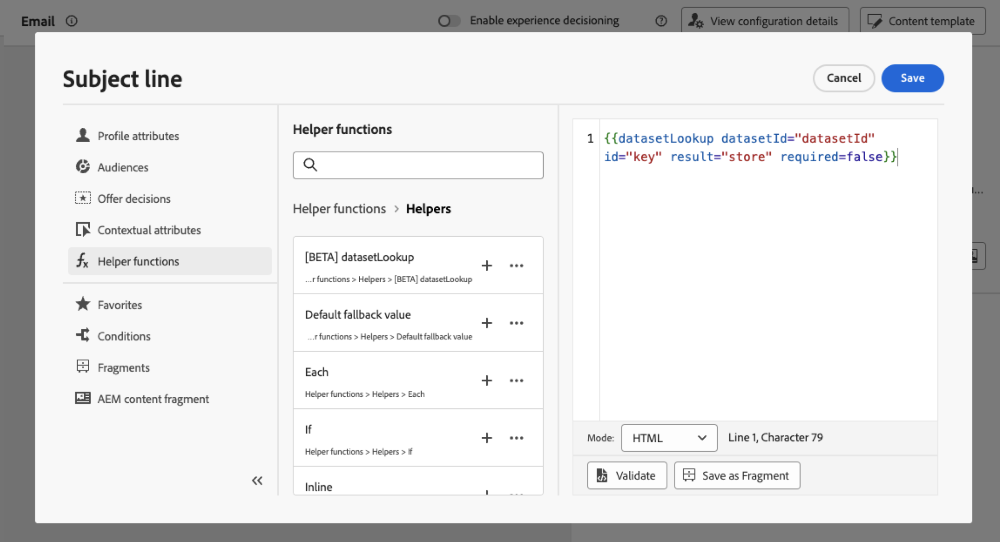
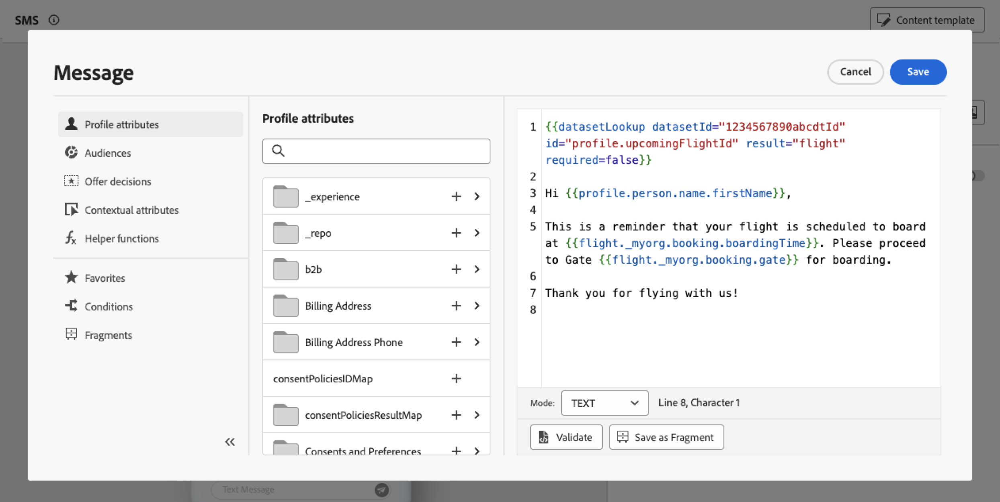

# Use Adobe Experience Platform data for personalization{#aep-data}

>[!AVAILABILITY]
>
>This feature is currently available to all customers as a public beta.
>
>In order to use this capability, you must first accept beta terms for your organization that display when adding the new "datasetLookup" helper functions in the personalization editor.

Journey Optimizer allows you to leverage data from Adobe Experience Platform in the personalization editor to [personalize your content](../personalization/personalize.md). To do this, datasets needed for lookup personalization must first be enabled through an API call as described below. Once done, you can use their data to personalize your content into [!DNL Journey Optimizer].

## Beta restrictions and guidelines {#guidelines}

Before you begin, please review the following restrictions and guidelines:

### Datasets enablement {#enablement}

* **Dataset size** is limited to 5GB for production datasets and 1GB for dev sandbox datasets
* **A maximum of 50 datasets can be enabled** for lookup per organization at any time.
* **Number of records** is restricted to 5M in production datasets and 1M in dev sandbox datasets.
* **Data Usage Labelling and Enforcement** is not enforced at this time for datasets enabled for lookup.
* **Datasets enabled for lookup and used in personalization are not protected from deletion**. It is up to you to keep track of which datasets are being used for personalization to ensure they are not deleted or removed.

### Personalization using [!DNL Adobe Experience Platform] data {#perso}

* **Supported channels**: For now, this capability is only available for usage within email, SMS and direct mail channels.
* **Data Usage Labelling and Enforcement** is not enforced at this time for datasets enabled for lookup.
* **Fragments**: Dataset lookup personalization cannot be placed within expression or visual fragments at this time.

## Enable a dataset for data lookup {#enable}

In order to leverage data from your dataset for personalization, you need to use an API call to retrieve its status and enable lookup service.

### Prerequisites {#prerequisites-enable}

* Follow the directions detailed in [this documentation](https://developer.adobe.com/journey-optimizer-apis/references/authentication/) to configure your environment to send API commands.
* The developer project must have the Adobe Journey Optimizer and Adobe Experience Platform APIs added to their project.

    

* You must have manage datasets permission as part of your role.
* The schema for which the dataset is based on must contain a **primary identity** that can act as the lookup key.

### API call structure {#call}

```

curl -s -XPATCH "https://platform.adobe.io/data/core/entity/lookup/dataSets/${DATASET_ID}/${ACTION}" \ -H "Authorization: Bearer ${ACCESS_TOKEN}" \ -H "x-api-key: ${API_KEY}" \ -H "x-gw-ims-org-id: ${IMS_ORG}" \ -H "x-sandbox-name: ${SANDBOX_NAME}"

```

Where:

* **URL** is `https://platform.adobe.io/data/core/entity/lookup/dataSets/${DATASET_ID}/${ACTION}`
* **Dataset ID** is the dataset for which you wish to enable.
* **Action** is enable OR disable.
* **Access token** can be retrieved from the developer console.
* **API key** can be retrieved from the developer console.
* **IMS Org ID** is your Adobe organization.
* **Sandbox Name** is the sandbox name the dataset is in (i.e. prod, dev etc.).

>[!NOTE]
>
>If you encounter the error below when attempting an API call to enable datasets, try removing the Adobe Journey Optimizer APIs from your developer console project and then re-adding them.
>
>```
>
>"error_code": "403003", 
>"message": "Api Key is invalid"
>
>```

## Leverage a dataset for personalization {#leverage}

Once a dataset has been enabled for lookup personalization using an API call, you can use its data to personalize your content into [!DNL Journey Optimizer].

1. Open the personalization editor, which is available in every context where you can define personalization such as messages. [Learn how to work with the personalization editor](../personalization/personalization-build-expressions.md)

1. Navigate to the helper functions list and add the **datasetLookup** helper function to the code pane.

    

1. This function provides a predefined syntax to allow you to call fields from your Adobe Experience Platform datasets. The syntax is as follows:

    ```

    {{datasetLookup datasetId="datasetId" id="key" result="store" required=false}}

    ```

    * **datasetId** is the ID of the dataset you are working with.
    * **id** is the ID of the source column that should be joined with the primary identity of the look up dataset. 

        >[!NOTE]
        >
        >The value entered for this field can be either a field ID (*profile.packages.packageSKU*), a field passed in a journey event (*context.journey.events.event_ID.productSKU*), or a static value (*sku007653*). In any case, the system will use the value and lookup into the dataset to check if it matches a key.
        >
        >If using a literal string value for the key, keep the text in quotes. Eg: `{{datasetLookup datasetId="datasetId" id="SKU1234" result="store" required=false}}`. If using an attribute value as a dynamic key, remove the quotes. Eg: `{{datasetLookup datasetId="datasetId" id=category.product.SKU result="SKU" required=false}}`

    * **result** is an arbitrary name that you need to provide to reference all the field values you are going to retrieve from the dataset. This value will be used in your code to call each field.

    * **required=false**: If required is set to TRUE, the message will only be delivered if a matching key is found. If set to false, a matching key is not required and the message can still be delivered. Note that, if set to false, it is recommended that you account for fallback or default values in your message content.

    +++Where to retrieve a dataset ID?

    Dataset IDs can be retrieved in Adobe Experience Platform user interface. Learn how to work with datasets in the [Adobe Experience Platform documentation](https://experienceleague.adobe.com/en/docs/experience-platform/catalog/datasets/user-guide#view-datasets){target="_blank"}.

    

    +++

1. Adapt the syntax to suit your needs. In this example, we want to retrieve data related to passengers' flights. The syntax is as follows:

    ```

    {{datasetLookup datasetId="1234567890abcdtId" id=profile.upcomingFlightId result="flight"}}

    ```
    
    * We are working in the dataset whose ID is "1234567890abcdtId",
    * The field we want to use to make a join with the look up dataset is *profile.upcomingFlightId*,
    * We want to include all the field values under the "flight" reference.

1. Once that the syntax to call in the Adobe Experience Platform dataset has been configured, you can specify which fields you want to retrieve. The syntax is as follows:

    ```

    {{result.fieldId}}

    ```

    >[!NOTE]
    >
    >When referencing a dataset field, make sure that you match the full field path as defined within the schema.

    * **result** is the value that you have assigned to the **result** parameter in the **MultiEntity** helper function. In this example "flight".
    * **fieldID** is the ID of the field you want to retrieve. This ID is visible in [!DNL Adobe Experience Platform] user interface when browsing the record schema related to your dataset:

        +++Where to retrieve a field ID?

        Fields IDs can be retrieved when previewing a dataset in Adobe Experience Platform user interface. Learn how to preview datasets in the [Adobe Experience Platform documentation](https://experienceleague.adobe.com/en/docs/experience-platform/catalog/datasets/user-guide#preview){target="_blank"}.

        

        +++

    In this example, we want to use information related to the passengers' boarding time and gate. We therefore add these two lines:

    * `{{flight._myorg.booking.boardingTime}}`
    * `{{flight._myorg.booking.gate}}`

1. Now that your code is ready, you can complete your content as usual, and test it using the **Simulate content** button to check the personalization. [Learn how to preview and test content](../content-management/preview-test.md)


    
