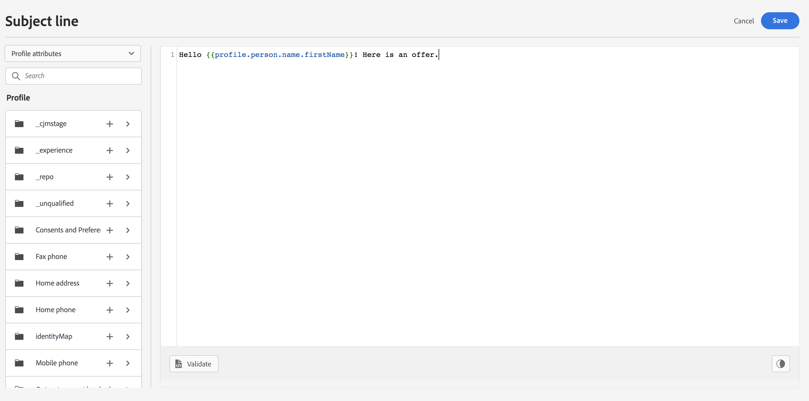
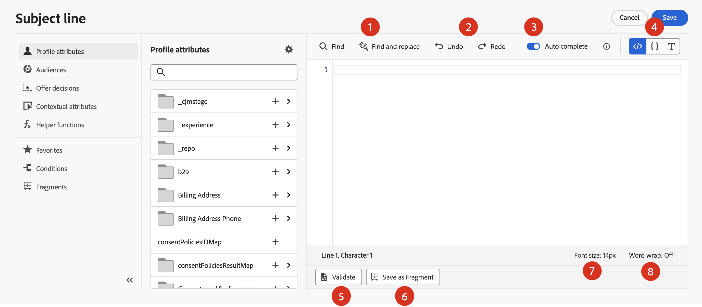
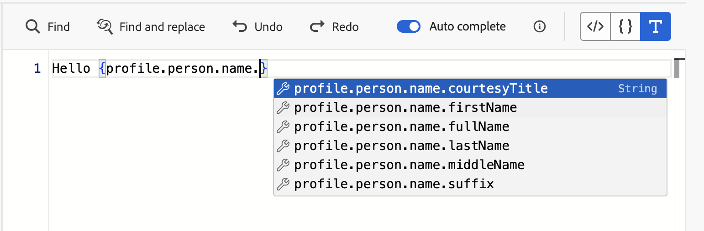
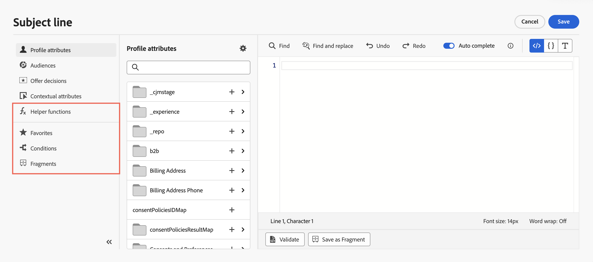

# Get started with the personalization editor {#build-personalization-expressions}

>[!CONTEXTUALHELP]
>id="ajo_perso_editor"
>title="About the personalization editor"
>abstract="The personalization editor allows you to select, arrange, customize and validate all the data to create a customized personalization for your content."

The personalization editor is the centerpiece of the personalization in [!DNL Journey Optimizer]. It is available in every context where you need to define personalization like emails, push and offers.

In the personalization editor interface, you will select, arrange, customize and validate all the data to create a customized personalization for your content.

 

## Personalization sources {#sources}

The left part of the screen displays a domain selector that lets you select the source for personalization. Available sources are:

* **[!UICONTROL Profile attributes]** : lists all the references associated to the profile schema described in [Adobe Experience Platform Data Model (XDM) documentation](https://experienceleague.adobe.com/docs/experience-platform/xdm/home.html){target="_blank"}.
* **[!UICONTROL Audiences]** : lists all the audiences created in Adobe Experience Platform Segmentation service. More information on segmentation available [here](https://experienceleague.adobe.com/docs/experience-platform/segmentation/home.html){target="_blank"}.
* **[!UICONTROL Offer decisions]** : lists all the offers associated to a specific placement. Select the placement then insert the offers in your content. For a complete documentation on how to manage offers, refer to [this section](../offers/get-started/starting-offer-decisioning.md).
* **[!UICONTROL Contextual attributes]** : when a channel action activity (Email, push, SMS) is used in a journey or campaign, contextual attributes related to events and properties are available for personalization. An exemple of personalization leveraging contextual attributes is presented in [this section](personalization-use-case.md).

>[!NOTE]
>
>If you are targeting an audience with enrichment attributes generated using a composition workflow, you can leverage these enrichment attributes to personalize your message. [Learn how to use audiences enrichment attributes](../audience/about-audiences.md#enrichment)

## Add personalization {#add}

>[!CONTEXTUALHELP]
>id="ajo_perso_editor_autocomplete"
>title="Auto complete"
>abstract="Toggling on this option allows the system to automatically suggest and complete code as you type. This feature is available only for HTML and Text formats and supports Profile and Context attributes. If disabled via the toggle, the editor will provide native HTML code auto-completion instead."

The central workspace is where you build your personalization syntax. To use an attribute to personalize your message, locate it into the left navigation pane and click the `+` button to add it into the expression.

The ellipsis menu next to the `+` icon allows you to get more details for each attribute and to add your most frequently used attributes to favorites. Attributes added to favorites are accessible from the **[!UICONTROL Favorites]** menu in the left navigation pane.

Additionally, you can define default fallback text that will display if a string-type profile attribute is empty. To do this, click the ellipsis button next to the attribute and select **[!UICONTROL Insert with fallback text]**. Write the text that should display by default if the attribute's value is empty for a profile then click **[!UICONTROL Add]**.

In the following example, the personalization editor lets you select the profiles that have their birthday today then complete the customization by inserting a specific offer corresponding to this day.

 

## Tools for expression editing

The central workspace provides various tools to help you write your personalization expression.

Available options are:

1. **[!UICONTROL Find]** / **[!UICONTROL Find and replace]**: Search through your expression and automatically replace portions of code.
1. **[!UICONTROL Undo]** / **[!UICONTROL Redo]**: Undo / Redo the last operation.
1. **[!UICONTROL Auto complete]**: Automatically suggests and completes code as you type. This feature is available only for HTML and Text formats and supports Profile and Context attributes. If disabled via the toggle, the editor will provide native HTML code auto-completion instead.

    {width="70%" align="center" zoomable="yes"}

1. **[!UICONTROL HTML]** / **[!UICONTROL JSON]** / **[!UICONTROL Text]**: Identify the format of your code. This allows the system to adapt the validation and auto complete feature based on the selected language.
1. **[!UICONTROL Validate]**: Check the syntax of your expression. Learn more in [this section](personalization-validation.md).
1. **[!UICONTROL Save as fragment]**: Save your expression as an expression fragment. Learn more in [this section](../content-management/save-fragments.md#save-as-expression-fragment)  
1. **[!UICONTROL Font size]**: Adjusts the font size for the contents inside the editor for better readability.
1. **[!UICONTROL Word wrap]**: Enables or disables word wrapping, allowing long expressions to be displayed on a single line or wrapped within the editor. Options include:
    * **Off** (Default) - No word wrapping. Long lines extend beyond the editor view and require horizontal scrolling.
    * **On** - Wraps lines at the width of the editor.
    * **Word wrap column** - Wraps lines when a line characters reach 80 characters.
    * **Bounded** - Wraps lines at either the editor width or at 80 characters, whichever is smaller.

In the navigation pane, additional features are available to help you build your personalization expression.

* **[!UICONTROL Helper functions]** - Helper functions allow you to perform operations on data, such as calculations, data formatting or conversions, conditions, and manipulate them in the context of personalization. [Learn more on available helper functions](functions/functions.md)

* **[!UICONTROL Favorites]** - Attributes that you have added to favorites display in this list. This allows you to quickly access to your most frequency used items. To add an attribute to your favorites, click the ellipsis menu and choose **[!UICONTROL Add to favorites]**.

* **[!UICONTROL Conditions]** - Leverage conditional rules created in the library to add dynamic content into your messages. This allows you to create multiple variants of your message based on conditions. [Learn how to create dynamic content](../personalization/get-started-dynamic-content.md)

* **[!UICONTROL Fragments]** - Leverage expression fragments that have been created or saved to the current sandbox. A fragment is a reusable component that can be referenced across [!DNL Journey Optimizer] campaigns and journeys. This functionality allows to prebuild multiple custom content blocks that can be used by marketing users to quickly assemble contents in an improved design process. [Learn how to use expression fragments for personalization](../personalization/use-expression-fragments.md)

Once your personalization expression is ready, you need to have it validated by the personalization editor. Learn more in [this section](personalization-validation.md).
