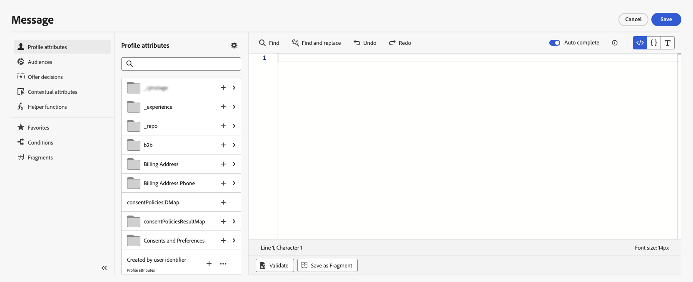

# Add personalization {#build-personalization-expressions}

>[!CONTEXTUALHELP]
>id="ajo_perso_editor"
>title="About the personalization editor"
>abstract="The personalization editor allows you to select, arrange, customize and validate all the data to create a customized personalization for your content."

The personalization editor is the centerpiece of the personalization in [!DNL Journey Optimizer]. It is available in every context where you need to define personalization like emails, push and offers. 

In the personalization editor interface, you can select, arrange, customize and validate all the data to create a customized personalization for your content.

 

## Where can I add personalization

You can add personalization in **[!DNL Journey Optimizer]** in every fields with the  icon. Expand the sections below for more details.

+++Messages

In messages, personalization can be added at different locations in your messages, such as the **[!UICONTROL Subject line]** field.


It can also be added in other sections of your content. For example, for [push notifications](../push/push-gs.md), personalization can be added in **Title**, **Body**, **Custom sound**, **Badges** and **Custom data** fields.

+++

+++Email Designer

When editing email content in the [Email Designer](../email/get-started-email-design.md), you can add personalization in text blocks and in URLs using the icon in the contextual tool bar.


+++

+++Offers

You can add personalization when using text-type content in your **offers' representations**. [Learn how to create personalized offers](../offers/offer-library/creating-personalized-offers.md)

+++

+++URLs

Journey Optimizer also allows you to personalize **URLs** in your message.  Personalized URLs take recipients to specific pages of a website, or to a personalized microsite, depending on the profile attributes. URL personalization is available for these types of links: **External link**, **Unsubscription link** and **Opt-Out**.

   Sample personalized URLs:

* `https://www.adobe.com/users/{{profile.person.name.lastName}}` 
* `https://www.adobe.com/users?uid={{profile.person.name.firstName}}`
* `https://www.adobe.com/usera?uid={{context.journey.technicalProperties.journeyUID}}`
* `https://www.adobe.com/users?uid={{profile.person.crmid}}&token={{context.token}}`

{width="50%"}

>[!NOTE]
>
>When editing a personnalized URL in the personalization editor, helper functions and audiences membership are disabled for security reasons.
>
>Spaces are not supported in the personalization tokens used inside urls.

+++

## Personalization sources {#sources}

The navigation pane lets you select the source for personalization. Available sources are:

* **[!UICONTROL Profile attributes]** : lists all the references associated to the profile schema described in [Adobe Experience Platform Data Model (XDM) documentation](https://experienceleague.adobe.com/docs/experience-platform/xdm/home.html){target="_blank"}.
* **[!UICONTROL Audiences]** : lists all the audiences created in Adobe Experience Platform Segmentation service. More information on segmentation available [here](https://experienceleague.adobe.com/docs/experience-platform/segmentation/home.html){target="_blank"}.
* **[!UICONTROL Offer decisions]** : lists all the offers associated to a specific placement. Select the placement then insert the offers in your content. For a complete documentation on how to manage offers, refer to [this section](../offers/get-started/starting-offer-decisioning.md).
* **[!UICONTROL Contextual attributes]** : when a channel action activity (Email, push, SMS) is used in a journey or campaign, contextual attributes related to events and properties are available for personalization. An exemple of personalization leveraging contextual attributes is presented in [this section](personalization-use-case.md).

>[!NOTE]
>
>If you are targeting an audience with enrichment attributes generated using a composition workflow, you can leverage these enrichment attributes to personalize your message. [Learn how to use audiences enrichment attributes](../audience/about-audiences.md#enrichment)

## Add personalization {#add}

>[!CONTEXTUALHELP]
>id="ajo_perso_editor_autocomplete"
>title="Auto complete"
>abstract="Toggling on this option allows the system to automatically suggest and complete code as you type. This feature is available only for HTML and Text formats and supports Profile and Context attributes. If disabled via the toggle, the editor will provide native HTML code auto-completion instead."

The central workspace is where you build your personalization syntax. To use an attribute to personalize your message, locate it into the navigation pane and click the `+` button to add it into the expression.

The ellipsis menu next to the `+` icon allows you to get more details for each attribute and to add your most frequently used attributes to favorites. Attributes added to favorites are accessible from the **[!UICONTROL Favorites]** menu in the navigation pane.

Additionally, you can define default fallback text that will display if a string-type profile attribute is empty. To do this, click the ellipsis button next to the attribute and select **[!UICONTROL Insert with fallback text]**. Write the text that should display by default if the attribute's value is empty for a profile then click **[!UICONTROL Add]**.


In the following example, the personalization editor lets you select the profiles that have their birthday today then complete the customization by inserting a specific offer corresponding to this day.

 

## Tools for expression editing

The central workspace provides various tools to help you write your personalization expression.


Available options are:

1. **[!UICONTROL Find]** / **[!UICONTROL Find and replace]**: Search through your expression and automatically replace portions of code.
1. **[!UICONTROL Undo]** / **[!UICONTROL Redo]**: Undo / Redo the last operation.
1. **[!UICONTROL Auto complete]**: Automatically suggests and completes code as you type. This feature is available only for HTML and Text formats and supports Profile and Context attributes. If disabled via the toggle, the editor will provide native HTML code auto-completion instead.

    {width="70%" align="center" zoomable="yes"}

1. **[!UICONTROL HTML]** / **[!UICONTROL JSON]** / **[!UICONTROL Text]**: Identify the format of your code. This allows the system to adapt the validation and auto complete feature based on the selected language.
1. **[!UICONTROL Validate]**: Check the syntax of your expression. Learn more in [this section](../personalization/personalization-build-expressions.md).
1. **[!UICONTROL Save as fragment]**: Save your expression as an expression fragment. Learn more in [this section](../content-management/save-fragments.md#save-as-expression-fragment)  
1. **[!UICONTROL Font size]**: Adjusts the font size for the contents inside the editor for better readability.
1. **[!UICONTROL Word wrap]**: Enables or disables word wrapping, allowing long expressions to be displayed on a single line or wrapped within the editor. Options include:
    * **Off** (Default) - No word wrapping. Long lines extend beyond the editor view and require horizontal scrolling.
    * **On** - Wraps lines at the width of the editor.
    * **Word wrap column** - Wraps lines when a line characters reach 80 characters.
    * **Bounded** - Wraps lines at either the editor width or at 80 characters, whichever is smaller.

In the navigation pane, additional features are available to help you build your personalization expression.


* **[!UICONTROL Helper functions]** - Helper functions allow you to perform operations on data, such as calculations, data formatting or conversions, conditions, and manipulate them in the context of personalization. [Learn more on available helper functions](functions/functions.md)

* **[!UICONTROL Favorites]** - Attributes that you have added to favorites display in this list. This allows you to quickly access to your most frequency used items. To add an attribute to your favorites, click the ellipsis menu and choose **[!UICONTROL Add to favorites]**.

* **[!UICONTROL Conditions]** - Leverage conditional rules created in the library to add dynamic content into your messages. This allows you to create multiple variants of your message based on conditions. [Learn how to create dynamic content](../personalization/get-started-dynamic-content.md)

* **[!UICONTROL Fragments]** - Leverage expression fragments that have been created or saved to the current sandbox. A fragment is a reusable component that can be referenced across [!DNL Journey Optimizer] campaigns and journeys. This functionality allows to prebuild multiple custom content blocks that can be used by marketing users to quickly assemble contents in an improved design process. [Learn how to use expression fragments for personalization](../personalization/use-expression-fragments.md)

Once your personalization expression is ready, you need to have it validated by the personalization editor. Learn more in [this section](../personalization/personalization-build-expressions.md).

## Validation mechanisms {#validation-mechanisms}

The validation of your expression is automatically executed when you click on the **Add** button to close the editor window. You can also use the **Validate** button to check your personalization syntax.


Expand the section below to see common errors that may occur when validating personalization.

+++Common errors

* **Path "XYZ" not found**

When trying to reference a field that is not defined in the schema. 

In this case **firstName1** is not defined as attribute in the profile schema:

```

{{profile.person.name.firstName1}}

```

* **Type mismatch for variable "XYZ". Expected array. Found string.**

 When trying to iterate over a string instead of array.
 
 In this case **product** is not an array:

 ```
 {{each profile.person.name.firstName as |product|}}
  {{product.productName}}
 {{/each}}
 ```

* **Invalid handlebars syntax. Found `‘[XYZ}}’`**

 When invalid handlebars syntax is used.

  Handlebars expressions are surrounded with **{{expression}}**

 ```
    {{[profile.person.name.firstName}}
 ```

* **Invalid segment definition**

```
No segment definition found for 988afe9f0-d4ae-42c8-a0be-8d90e66e151
```

+++

For offers, specific errors may occur. Expand the section below for more details:

+++ Specific errors related to offers

The errors related to offers integration in an Email or Push message have the following pattern : 

```
Offer.<offerType>.[PlacementID].[ActivityID].<offer-attribute>
```

The validation is performed during personalization content validation in the personalization editor.

<table> 
 <thead> 
  <tr> 
   <th> Error title<br /> </th> 
   <th> Validation / Resolution <br /> </th> 
  </tr> 
 </thead> 
 <tbody> 
  <tr> 
   <td>Resource with id placementID and type OfferPlacement not found <br/>
Resource with id activityID and type OfferActivity not found<br/></td> 
   <td>Check if ActivityID and/or PlacementID are available</td> 
  </tr> 
   <tr> 
   <td>Resource could not be validated.</td> 
   <td>The componentType in the Placement should match the offerType offer</td> 
  </tr> 
   <tr> 
   <td>The public URL is not present in offer offerId.</td> 
   <td>The Image Offers (all Personalized and fallback associated with the decision and placement pair) should have public URL populated (deliveryURL should not be empty).</td> 
  </tr> 
  <tr> 
   <td>The decision contains non-profile attributes.</td> 
   <td>Offers Model usage should contain only the profile attributes.</td> 
  </tr> 
  <tr> 
   <td>An error occurred while fetching the decision usage.</td> 
   <td>This error could occur when the API is trying to fetch the offer model.</td> 
  </tr>
  <tr> 
   <td>Offer Attribute offer-attribute is invalid.</td> 
   <td>Check if the offer-attribute referenced in offer drp is valid. Following are the valid attributes: <br/>
Image: deliveryURL, linkURL<br/>
Text: content<br/>
HTML: content<br/></td> 
  </tr> 
 </tbody> 
</table>

+++
