# Personalization use case: order status notification {#personalization-use-case}

>[!BEGINSHADEBOX]

**On this page:** Follow an order status use case that combines profile, offer decision, and contextual journey data to personalize a push notification in Adobe Journey Optimizer.

>[!ENDSHADEBOX]

In this use case, you will see how to use multiple types of personalization in a single push notification message. Three types of personalization will be used:

* **Profile**: message personalization based on a profile field
* **Offer decision**: personalization based on decision management variables
* **Context**: personalization based on contextual data from the journey

The goal of this example is to push an event to [!DNL Journey Optimizer] every time a customer order is updated. A push notification is then sent to the customer with information on the order and a personalized offer.

For this use case, the following prerequisites are needed:

* configure an order event including the order number, status and item name. Refer to this [section](../event/about-events.md).
* create a decision, refer to this [section](../offers/offer-activities/create-offer-activities.md).

➡️ [Discover a similar use case in video](#video) 

## Step 1 - Create the journey {#create-journey}

1. Click the **[!UICONTROL Journeys]** menu and create a new journey.

   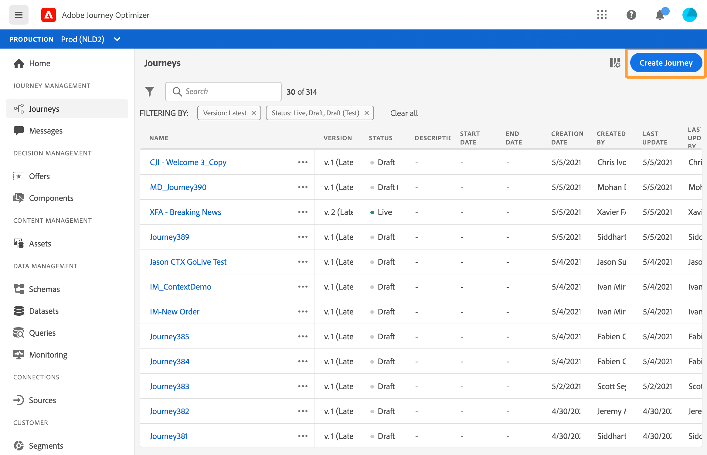

1. Add your entry event, and a **Push** action activity.

   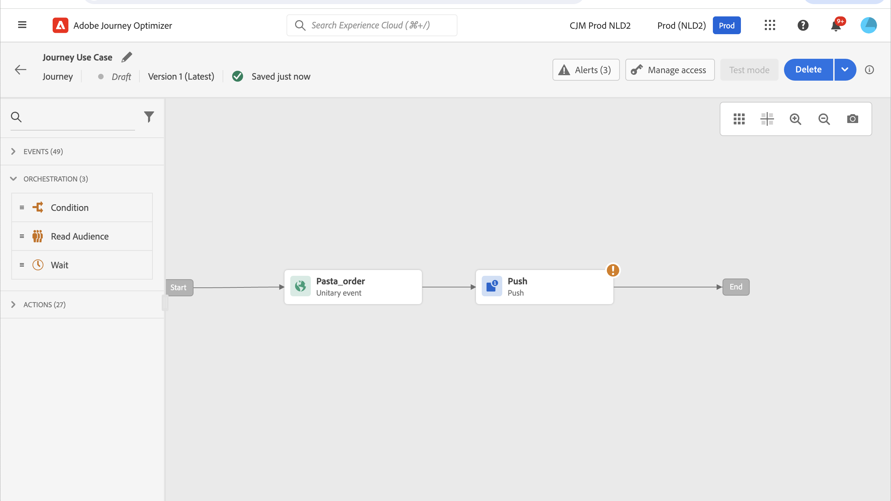

1. Configure and design your push notification message. Refer to this [section](../push/create-push.md).

## Step 2 - Add personalization on profile {#add-perso}

1. In the **Push** activity, click **Edit content**.

1. Click the **Title** field.

   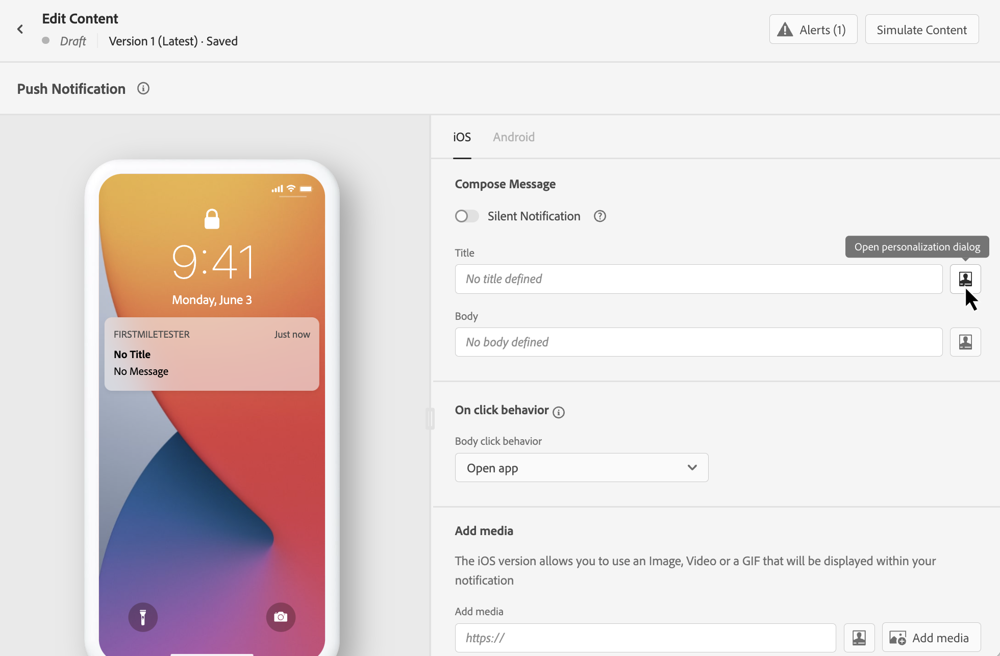

1. Enter the subject and add profile personalization. Use the search bar to find the profile's first name field. In the subject text, place the cursor where you want to insert the personalization field, and click the **+** icon. Click **Save**.

   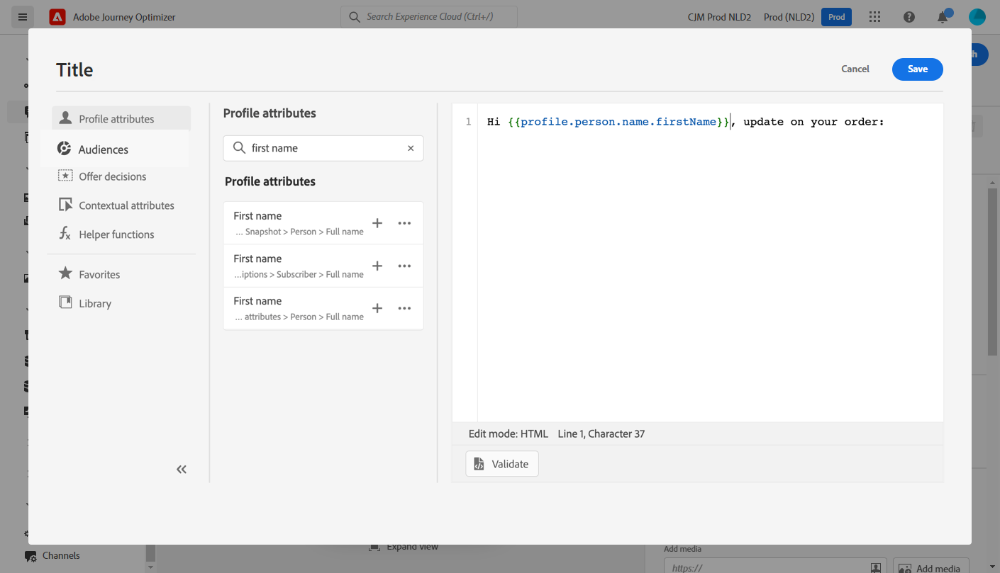

## Step 3 - Add personalization on contextual data {#add-perso-contextual-data}

1. In the **Push** activity, click **Edit content** and click the **Title** field.

   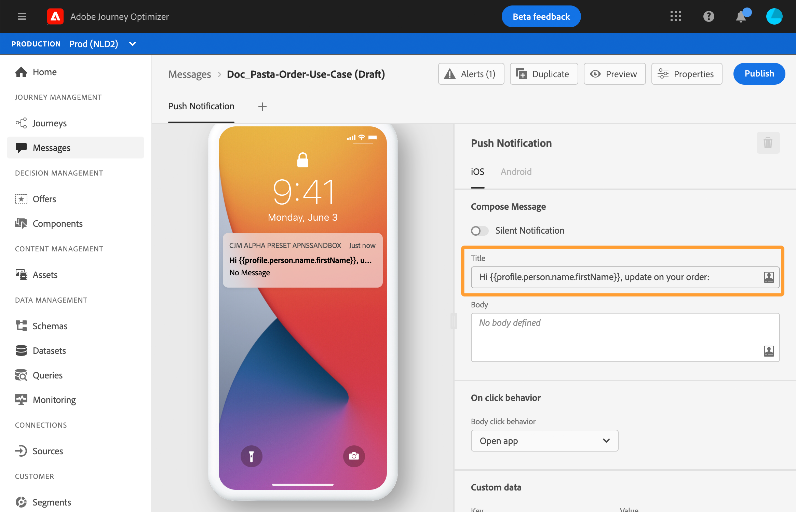

1. Select the **Contextual attributes** menu. Contextual attributes are only available if a journey has passed contextual data to the message. Click **Journey Orchestration**. The following contextual information appears:

   * **Events**: this category regroups all fields from the event(s) placed before the channel action activity in the journey.
   * **Journey Properties**: the technical fields related to the journey for a given profile, for example the journey ID or the specific errors encountered. Learn more in [Journey Orchestration documentation](../building-journeys/expression/journey-properties.md).

   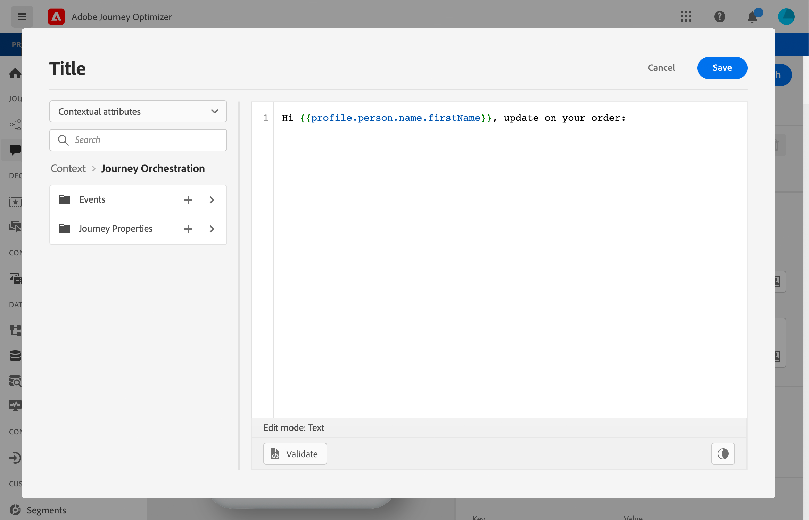

1. Expand the **Events** item, and look for the order number field related to your event. You can also use the search box. Click the **+** icon to insert the personalization field in the subject text. Click **Save**.

   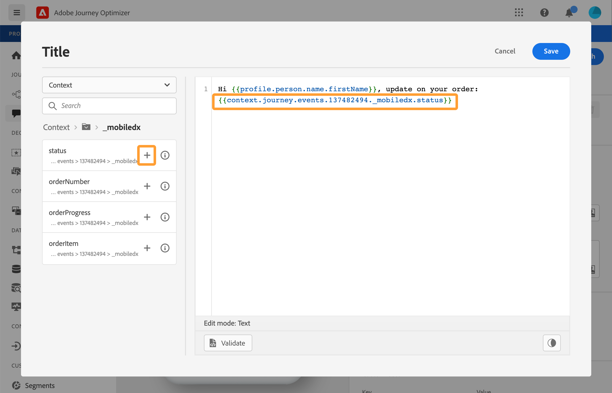

1. Now click the **Body** field.

   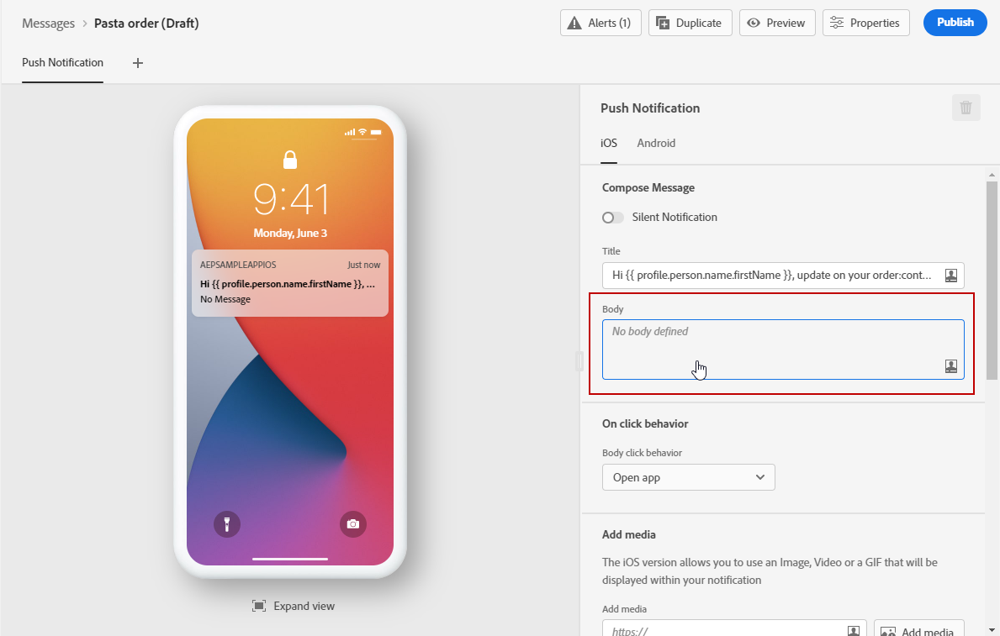

1. Type the message and insert, from the **[!UICONTROL Contextual attributes]** menu, the order item name and the order progress. 

   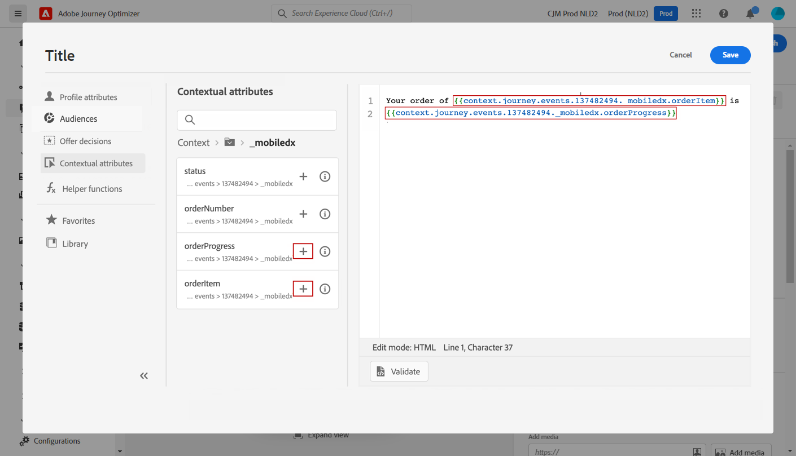

1. From the left menu, select **Offer decisions** to insert a decisioning variable. Select the placement and click the **+** icon next to the decision to add it to the body.  

   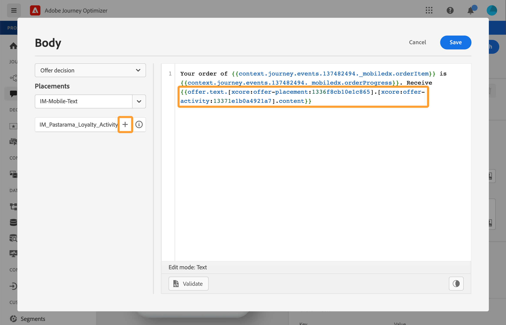

1. Click validate to make sure that there are no errors, and click **Save**.

   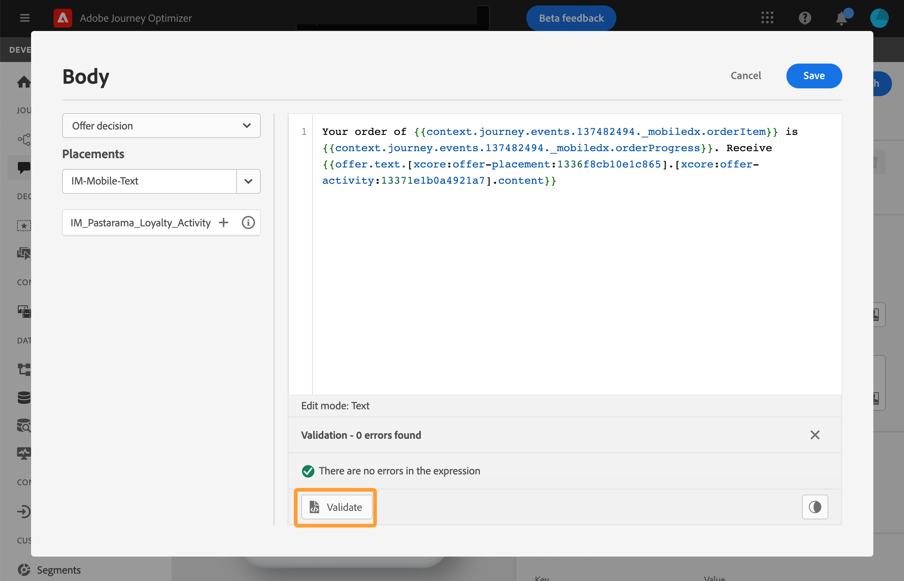

## Step 4 - Test and publish the journey {#test-publish}

1. Click the **Test** button, then click **Trigger an event**.

   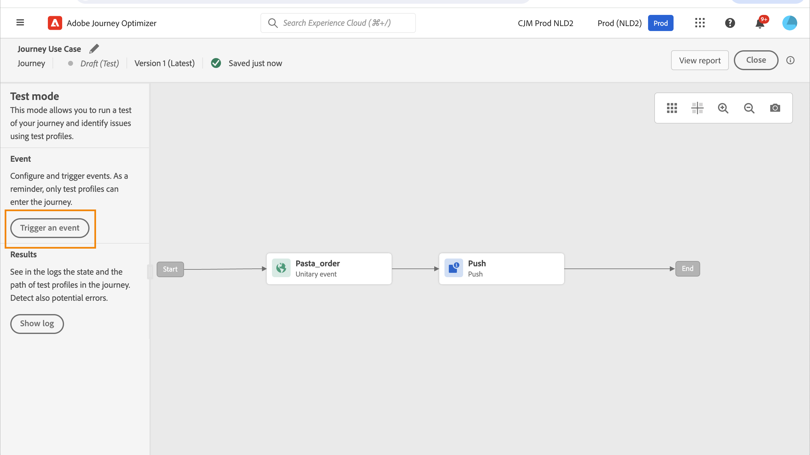

1. Enter the different values to pass in the test. Test mode only works with test profiles. The profile identifier needs to correspond to a test profile. Click **Send**.

   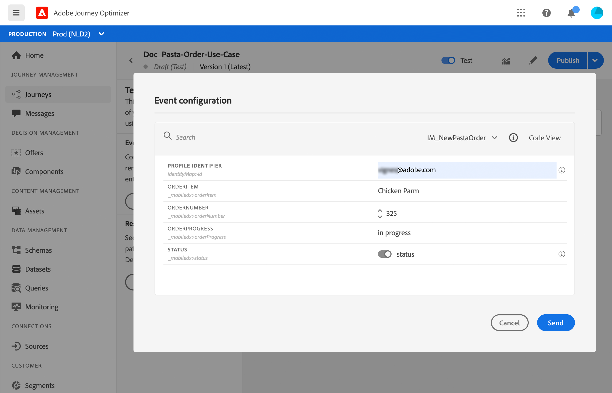

   The push notification is sent and displayed on the test profile's mobile phone.

    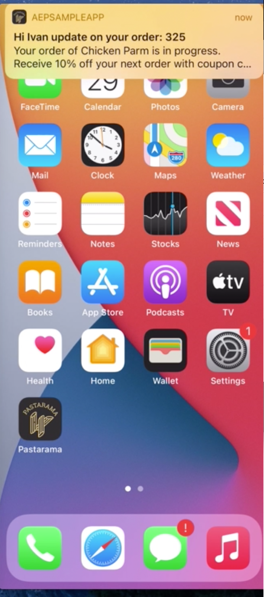

1. Verify that there is no error and publish the journey.

## How-to video {#video}

The video below shows a similar use case leveraging contextual data from a journey to personalize an email.

>[!VIDEO](https://video.tv.adobe.com/v/3425027?quality=12)

## Quick reference {#quick-reference}

This section contains structured knowledge intended to support interpretation, retrieval, and question answering related to this topic.

For complete understanding, this information should be combined with the documentation on this page. Neither source is intended to stand alone; the page describes the feature, while this section provides additional context that helps disambiguate terminology, intent, applicability, and constraints.

>[!BEGINTABS]

>[!TAB Overview]

**TL;DR**

This page walks through an order status push notification use case combining three types of personalization — profile field, offer decision, and contextual journey data — in a single message.

**Intents**

* Create a journey with an order event and a Push action activity
* Add profile-based personalization (customer's first name) to the push title
* Add contextual data personalization (order number, item name, order progress) from the journey event
* Add offer decision personalization to the push body
* Test the journey in test mode and publish

>[!TAB Glossary]

* **Profile personalization**: Personalization based on a profile field such as first name, accessed via `profile.*` attributes. *(product-specific)*
* **Offer decision**: Personalization based on decision management variables; inserted from the Offer decisions menu in the personalization editor. *(product-specific)*
* **Contextual personalization**: Personalization based on data from the journey — event fields (e.g., order number, item name, order progress) and journey properties (e.g., journey ID, errors). Available only when a journey has passed contextual data to the message. *(product-specific)*
* **Journey Properties**: Technical fields related to the journey for a given profile — such as journey ID or errors encountered — accessible under Contextual attributes > Journey Orchestration. *(product-specific)*

>[!TAB Terminology]

* **Canonical name:** contextual personalization — variants: context-based personalization, journey context personalization
* **Synonyms:** "Journey Orchestration" (UI label under Contextual attributes menu) = contextual journey data source
* **Do not confuse:** Profile personalization (static profile field values, always available) ≠ Contextual personalization (journey event and properties data, only available after journey context has been passed to the message) ≠ Offer decision personalization (decision management variables)

>[!TAB Guardrails & Limitations]

* Contextual attributes are available in the personalization editor only if a journey has passed contextual data to the message.
* Test mode works only with test profiles; the profile identifier entered in the event configuration must correspond to an existing test profile.

>[!TAB FAQ]

**Q: What three types of personalization are combined in this use case?**

Profile personalization (customer's first name from `profile.*`), contextual data personalization (order number, item name, and order progress from the journey event), and offer decision personalization (a decision management offer inserted in the body).

**Q: Where do contextual attributes come from in the personalization editor?**

Contextual attributes come from events placed before the channel action activity in the journey, and from journey technical properties. They appear in the personalization editor under Contextual attributes > Journey Orchestration > Events (event fields) or Journey Properties (journey metadata).

**Q: What are the prerequisites for this use case?**

An order event must be configured with order number, status, and item name fields, and a decision must exist in decision management.

**Q: How do I test the push notification in this use case?**

Click the Test button in the journey, then click "Trigger an event" and enter the event values in the Event configuration window. Test mode only works with test profiles; the profile identifier must correspond to an existing test profile.

>[!ENDTABS]

<!-- ai-section-version: 1 | source-hash: ae5284c7 -->
