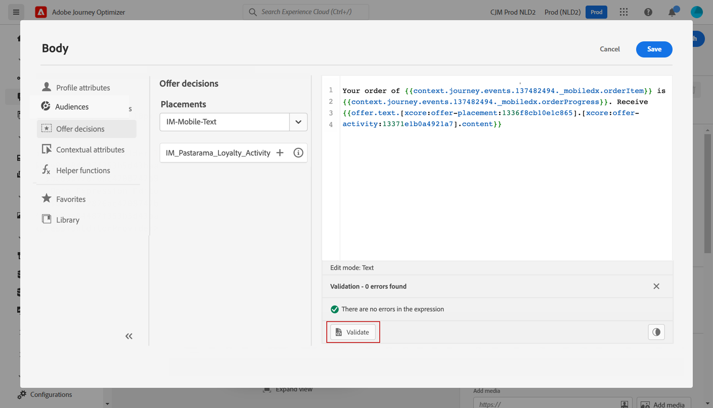

# Personalization use case {#personalization-use-case}

In this use case, you will see how to use multiple types of personalization in a single push notification message. Three types of personalization will be used:

* Profile: message personalization based on a profile field
* Offer management: personalized offer
* Context: contuextual data from the journey event

Every time a customer order is updated, an event is pushed to Journey Optimizer. A push notification is then sent to the customer with the status of the order and a personalized offer.

For this use case, you need to perform the following actions:

* create a personalized offer, refer to this [section](../offers/offer-library/creating-personalized-offers.md).
* create and design a push notification message, without publishing it. Refer to this [section](../create-message.md).
* configure an event including the order number and status. Refer to this [section](../event/about-events.md).

1. Click the **[!UICONTROL Message]** menu, and select your message.

   

1. Click the **Title** field.

   

1. Type in the subject and add profile personalization. Use the seach bar to find the profile's first name field. In the subject text, place the cursor where you want to insert the personalization field, and click the + icon. Click **Save**.

   

   >[!NOTE]
   >
   >Leave the message in draft. Do not publish it yet.

1. Click the **[!UICONTROL Journeys]** menu, and create a new journey.

   

1. Add your entry event, a **Message** and an **End** activity.

   

1. In the **Message** activity, select the message previously created. Click **Ok**

   

   A message is displayed to inform you that the event and journey data are passed to the message.

   >[!NOTE]
   >
   >The message appears with a warning icon. This is because the message is not published yet.

   

1. From the **Message** activity, open the message. The message opens in a new tab.

   

1. Click the **Title** field.

   

1. Select the **Context** category. This item is only available is a journey has passed contextual data to the message. Click **Journey Orchestration**. The following contextual information appears:

   * **Events**: all fields from the event
   * **Journey Properties**: the technical fields related to the journey for a given profile, for example the journey ID or the specific errors encountered. Refer to the [Journey Orchestration documentation](https://experienceleague.adobe.com/docs/journeys/using/building-advanced-conditions-journeys/syntax/journey-properties.html?lang=en#building-advanced-conditions-journeys)

   

1. Using the arrow icon, expand the **Events** item, and look for the order number field. You can also use the search box. Click the + icon to insert the personalization field in the subject text. Click **Save**

   

1. Now click the **Body** field.

   

1. Type the message and insert, from the **Context** category, the order item name and the order progress. 

   

1. From the drop-down, select **Offer decision** to insert an offer decisionning variable. Select the placement and click the + icon next to the personalized offer to add it to the body.  

   

1. Click validate to make sure that there are no errors, and click **Save**.

   

1. Now, publish the message. 

   

1. Open the journey again. If the journey is already open, make sure you refresh the page. Now that the message is published, you can see that there is no error in the journey. Click the **Test** button, then click **Trigger an event**.

   

1. Enter the different values to pass in the test and click **Send**.

   

   The push notification is sent to the test profile.

    
