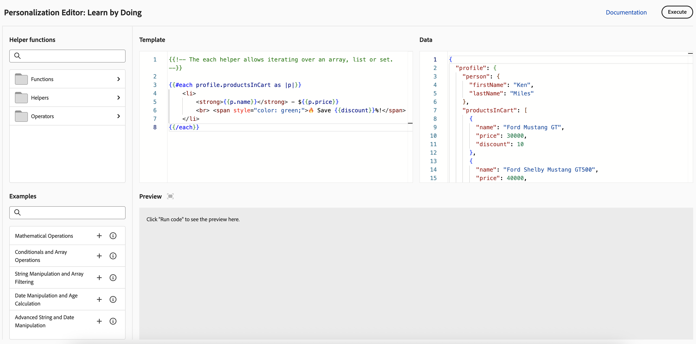

# Get started with personalization{#add-personalization}

>[!CONTEXTUALHELP]
>id="ajo_homepage_card5"
>title="Personalize experiences"
>abstract="Use **Adobe Journey Optimizer** to adapt your messages to each specific recipient by leveraging the data and information you have about them. It can be their first name, interests, where they live, what they bought, and more."

[!DNL Adobe Journey Optimizer] personalization capabilities allow you to adapt your messages to each specific recipient by leveraging the data and information you have about them. It can be their first name, interests, where they live, what they bought, and more.  

## How personalization works

Using the **personalization editor**, you can select, arrange, customize and validate all the data to create a customized personalization for your content, and leverage various tools such as helper functions or predefined expressions to tailor messages effectively.

Journey Optimizer employs an inline personalization syntax based on Handlebars which allows you to create expressions with contents enclosed by double curly braces **`{{}}`**.

When processing the message, Journey Optimizer replaces the expression with the data contained in the Experience Platform dataset. For example, `Hello {{profile.person.name.firstName}} {{profile.person.name.lastName}}` dynamically becomes `Hello John Doe`. Using this syntax, you can personalize messages across multiple fields, including email subject lines, message bodies, push notifications, or URLs.

## Generate personalization with AI {#ai-personalization-expressions}

In the **[!UICONTROL Personalization Editor]**, **[!UICONTROL AI Assistant]** helps you create, edit, and understand personalization expressions from natural language. You can ask for new logic, refine a selection, or get a short explanation of existing code, then review **[!UICONTROL Reasoning]** and insert the suggestion when it matches your intent. Availability and language support depend on your organization and release.

➡️ [Generate personalization with AI](../content-management/generative-personalization-expressions.md)

## Data used for personalization

Personalization is based on the profile data that are managed by the **XDM Individual Profile** schema defined in Adobe Experience Platform. The **XDM Individual Profile** schema is the only schema you can use to personalize content in [!DNL Journey Optimizer]. Learn more in [Adobe Experience Platform Data Model (XDM) documentation](https://experienceleague.adobe.com/docs/experience-platform/xdm/home.html){target="_blank"}.

You can also leverage **computed attributes** to personalize your content. Computed attributes allow you to summarize individual behavioral events into computed profile attributes available on Adobe Experience Platform. [Learn how to work with computed attributes](../audience/computed-attributes.md)

In addition, [!DNL Journey Optimizer] allows you to leverage data from Adobe Experience Platform in the personalization editor to personalize your content. To do this, datasets needed for lookup personalization must first be enabled through an API call. Once done, you can use their data to personalize your content into Journey Optimizer. This feature is currently available in beta. [Learn more](../personalization/aep-data-perso.md)

## Learn and experiment with personalization {#playground}

**[!DNL Adobe Journey Optimizer]** includes an interactive tool designed to help you learn and experiment with personalization capabilities.

This playground provides a simulated environment to write and test personalization code using sample data without requiring live datasets. You can leverage predefined code samples, edit dummy profile payloads, and preview the output of your personalization code in real-time. 

➡️ [Access the personalization playground](https://experienceleague.adobe.com/en/apps/journey-optimizer/ajo-personalization){target="_blank"}

## Let's dive deeper

Now that you have an understanding of personalization in **[!DNL Journey Optimizer]**, it's time to dive deeper into these documentation sections to start working with the feature.

<table style="table-layout:fixed"><tr style="border: 0;">
<td>

<a href="personalization-build-expressions.md"><strong>Add personalization</strong></a>

</td>
<td>

<a href="../personalization/personalization-syntax.md"><strong>Personalization syntax</strong>

</td>
<td>

<a href="../personalization/functions/functions.md"><strong>Helper functions list</strong></a>

</td>
<td>

<a href="../personalization/personalization-use-case.md"><strong>Personalization use cases</strong></a>

</td>
</tr></table>

## How-to videos{#video-perso}

Learn how to use contextual event information from a journey to personalize a message.

>[!VIDEO](https://video.tv.adobe.com/v/334165?quality=12)

Learn how to add profile-based personalization to a message and how to use audience membership as a pre-condition to a personalization block.

>[!VIDEO](https://video.tv.adobe.com/v/334078?quality=12)

Learn how to leverage the personalization editor playground to write and test personalization code using sample data.

>[!VIDEO](https://video.tv.adobe.com/v/3457868?quality=12)

Explore more video tutorials on personalization features and best practices in [Personalization tutorials](https://experienceleague.adobe.com/en/docs/journey-optimizer-learn/tutorials/personalize-content/personalization-editor-overview){target="_blank"}
