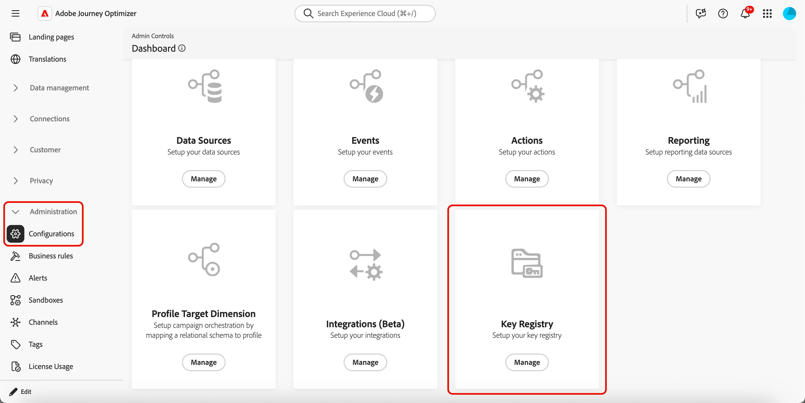
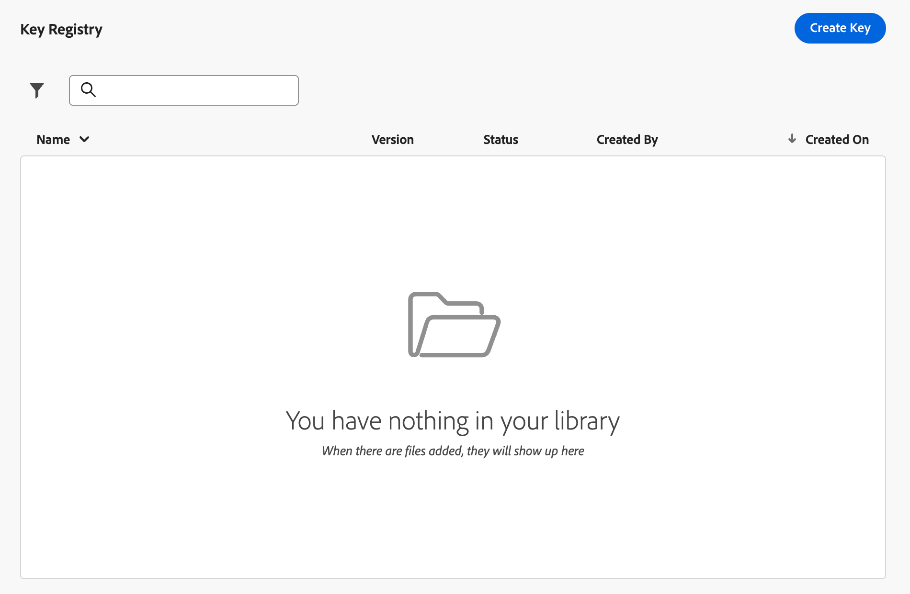
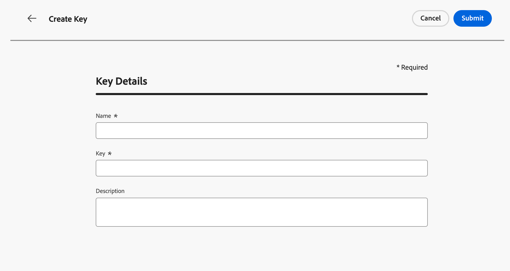

# Encrypt URL parameters {#url-parameter-encryption}

>[!AVAILABILITY]
>
>This feature is available in Limited Availability. Contact your Adobe representative to gain access.
>
>This capability is currently only available for the Email channel.

## Why use URL parameter encryption? {#why-url-parameter-encryption}

Personalized tracking links and landing page URLs often include profile attributes, identifiers, tokens, or other values in the query string. Those parameters are usually visible as plain text in the email or SMS, and they stay readable if someone copies, shares, or bookmarks the link. This can be a security and privacy risk when the values can include personally identifiable information (PII) or other sensitive data they must protect.

[!DNL Journey Optimizer] provides an encryption helper in the personalization editor so you can encrypt any expression value at render time (for example a profile attribute, a token, or a string you built from several fields). Encryption always requires a key from your organization's registry.

You encrypt only the query parameters you choose, using keys that administrators manage in a sandbox-level registry, so confidential values are not left exposed in clear text when the link is shared or inspected.

### How it works {#how-it-works}

* **Administrators** use the key registry to [create keys](#create-keys) and [manage keys](#manage-keys) in accordance with your organization's security policies.
* **Marketers** insert the `Encrypt` helper in the personalization editor and pass the value to protect plus an active key identifier from the registry. For syntax and options, see [this section](functions/helpers.md#url-parameter-encryption-helper).

>[!IMPORTANT]
>
>Decryption is your organization's responsibility. [!DNL Journey Optimizer] encrypts values when the message is rendered. Your website, app, or API must decrypt parameters using the same cryptographic material and processes you define—consistent with your security model.

### Example

A landing page URL might use a query parameter such as `token` whose value is a string token (for example a JSON payload with offer or profile identifiers). Without encryption, that string token is visible as plain text in the link. Wrapping that value with the encryption helper replaces the sensitive payload with ciphertext in the URL while leaving the rest of the link unchanged.

## Create keys {#create-keys}

Before being able to use the URL parameter encryption helper, you need to create a key. To do so, follow the steps below.

<!--
>[!IMPORTANT]
>
>To access and manage keys, you you must have the **View Key Registry** and **Manage Key Registry** permissions granted. [Learn more](../administration/high-low-permissions.md)
-->

1. Go to **[!UICONTROL Administration]** > **[!UICONTROL Configurations]**.

1. Click the **[!UICONTROL Manage]** button to open the **[!UICONTROL Key registry]**.

    {width="80%"}

1. Using the dedicated button, create keys as required for your organization.

    {width="80%"}

1. Assign them a clear label or identifier your teams can reference in the personalization editor.

    {width="80%"}

1. Click **[!UICONTROL Submit]** to confirm your changes.

Once a key is created, marketers can use the [URL parameter encryption](functions/helpers.md#url-parameter-encryption-helper) helper in the personalization editor to encrypt specific values that they place in URL query parameters.

## Manage keys {#manage-keys}

To manage keys, follow the steps below.

1. Access the **[!UICONTROL Key registry]**. You can see all the keys created for the current sandbox in a list view.

    {width="100%"}

1. Click a key with the **[!UICONTROL Active]** status to open the key details.

    {width="80%"}

1. Click the **[!UICONTROL Revoke]** button to permanently disable the key for new encryption. 

    Once a key is revoked, attempts to use it in the helper should fail at render time. Revoked entries remain visible for audit; your teams may still need the corresponding material to decrypt older payloads on your own systems.

1. Click the **[!UICONTROL Rotate]** button to supply new key material while keeping a stable key identifier where your journeys and campaigns already reference it.

    The prior material is retained in the registry with a revoked status and an appropriate reason (for example a rotation timestamp), and a new row or version reflects the active key.

    >[!NOTE]
    >
    >Only active keys should be selected to encrypt new values in the personalization editor. Do not use revoked keys for new content.
