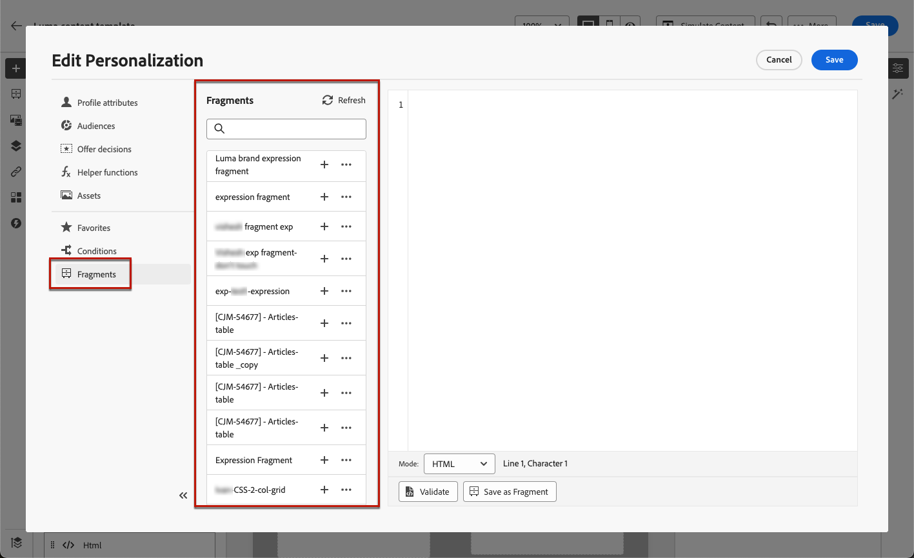
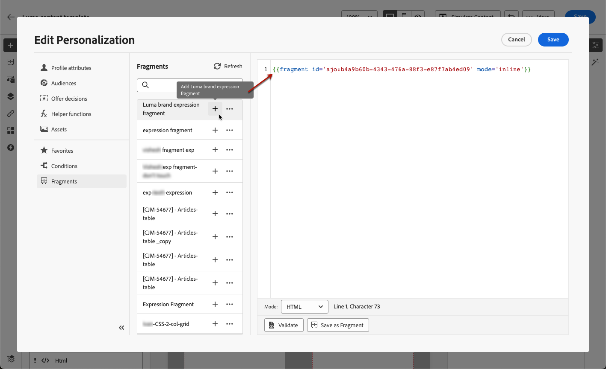
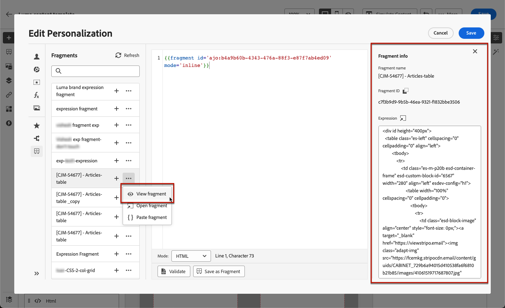
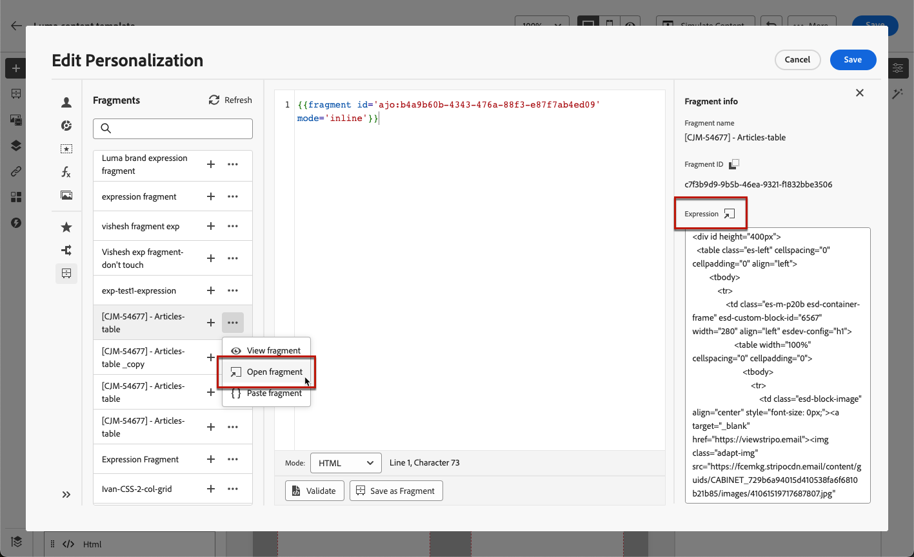
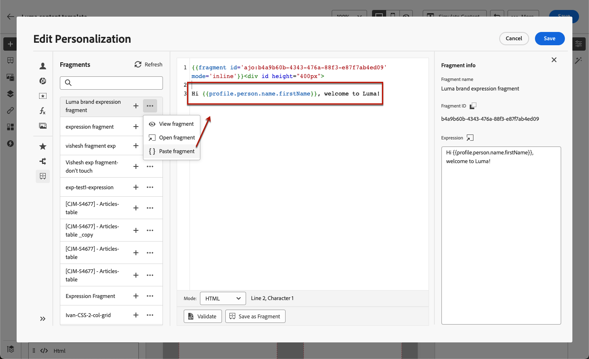

# Leverage expression fragments {#use-expression-fragments}

When using the **personalization editor**, you can leverage all the expression fragments that have been created or saved to the current sandbox.

A fragment is a reusable component that can be referenced across [!DNL Journey Optimizer] campaigns and journeys. This functionality allows to prebuild multiple custom content blocks that can be used by marketing users to quickly assemble contents in an improved design process. [Learn how to create and manage fragments](../content-management/fragments.md).

➡️ [Learn how to manage, author and use fragments in this video](../content-management/fragments.md#video-fragments)

## Use an expression fragment {#use-expression-fragment}

To add expression fragments to your content, follow the steps below.

>[!NOTE]
>
>You can add up to 30 fragments in a given delivery. Fragments can only be nested up to 1 level.

1. Open the [personalization editor](personalization-build-expressions.md) and select the **[!UICONTROL Fragments]** button on the left pane.

    The list displays all the expression fragments that have been created or saved as fragments on the current sandbox. They are sorted by creation date: recently added expression fragments are shown first in the list. [Learn more](../content-management/fragments.md#create-expression-fragment)

    

    You can also refresh this list. 
    
    >[!NOTE]
    >
    >If some fragments were modified or added while you are editing your content, the list will be updated with the latest changes.

1. Click the + icon next to an expression fragment to insert the corresponding fragment ID into the editor.

    

    >[!CAUTION]
    >
    >You can add any **Draft** or **Live** fragment to your content. However, you won't be able to activate your journey or campaign if a fragment with the Draft status is being used in it. At journey or campaign publication, draft fragments will show an error and you'll need to approve them to be able to publish.

1. Once the fragment ID has been added, if you open the corresponding expression fragment and [edit it](../content-management/fragments.md#edit-fragments) from the interface, the changes are synchronized. They are automatically propagated to all draft or live journeys/campaigns containing that fragment ID.

1. Click the **[!UICONTROL More actions]** button next to a fragment. From the contextual menu that opens, select **[!UICONTROL View fragment]** to get more information about that fragment. The **[!UICONTROL Fragment ID]** is also displayed and can be copied from here.

    

1. You can open the expression fragment in another window to edit its content and properties - either using the **[!UICONTROL Open fragment]** option in the contextual menu or from the **[!UICONTROL Fragment info]** pane. [Learn how to edit a fragment](../content-management/fragments.md#edit-fragments)

    

1. You can then customize and validate your content as usual using all the personalization and authoring capabilities of the [personalization editor](personalization-build-expressions.md).

>[!NOTE]
>
>If you create an expression fragment that contains multiple line breaks and use it in [SMS](../sms/create-sms.md#sms-content) or [push](../push/design-push.md) content, the line breaks are preserved. Thus make sure to test your [SMS](../sms/send-sms.md) or [push](../push/send-push.md) messsage before sending it.

## Use implicit variables {#implicit-variables}

The implicit variables enhance the existing fragment functionality to improve efficiency for content reusability and scripting use cases. Fragments can use input variables and create output variables which can be used in campaign and journey content.

This capability can for example be used to initialize tracking parameters of your emails, based on the current campaign or journey, and use these parameters into the personalized links added to the email content.

The following use cases are possible:

1. Use an input variables in a fragment 

    When a fragment is used in a  Campaign/journey action  content, it has the ability to leverage variables that were declared outside of the fragment. Below is an example: 

    

    We can see above the `utm_content` variable is declared in the campaign content. When the fragment **Hero block** is used, it will show a link to which the `utm_content` parameter value will be appended. The final result is: `https://luma.enablementadobe.com?utm_campaign= Product_launch&utm_content= start_shopping`.
    
1. Use an output variables from a fragment 

    Variables calculated or defined inside a fragment are available for use in your contents. In the following example, a fragment **F1** declares a set of variables:

    

    In an email content, we can have the following personalization:

    

    The fragment F1 initializes the following variables: `utm_campaign`and `utm_content`. Then the link in the message content will have these parameters appended. The final result is: `https://luma.enablementadobe.com?utm_campaign= Product_launch&utm_content= start_shopping`.

>[!NOTE]
>
>At runtime, the system expands what is inside fragments and then interprets the personalization code from top to bottom. Keeping this in mind, more complex use cases can be achieved. For example, you can have a fragment F1 passing variables to another fragment F2 sitting below. You can also have a visual fragment F1 passing variables to a nested expression fragment F2. 

## Customize editable fields {#customize-fields}

If certain portions of an expression fragment have been made editable using variables, you can override their default values using a specific syntax. [Learn how to make your fragments customizable](../content-management/customizable-fragments.md)

To customize the fields, follow these steps:

1. Insert the fragment into your code from the **Fragments** menu.

1. Use the `<fieldId>="<value>"` code at the end of the syntax to override the default value of the variable.

    In the example below, we are overriding the value of a variable whose ID is "sports" with the "yoga" value. This will display "yoga" in your fragment content everywhere the "sport" variable is referenced.

    

An example showing how to add editable fields into an expression fragments and override their values when creating an email is available in [this section](../content-management/customizable-fragments.md#example).

## Break inheritance {#break-inheritance}

When adding a fragment ID to the personalization editor, the changes made to the original expression fragment are synchronized.

However, you can also paste the content of an expression fragment into the editor. From the contextual menu, select **[!UICONTROL Paste fragment]** to insert that content.

In that case, the inheritance from the original fragment is broken. The content of the fragment is copied into the editor, and the changes are not synchronized anymore.

It becomes a standalone element that is no longer linked to the original fragment; you can edit it as any other element in your code.

