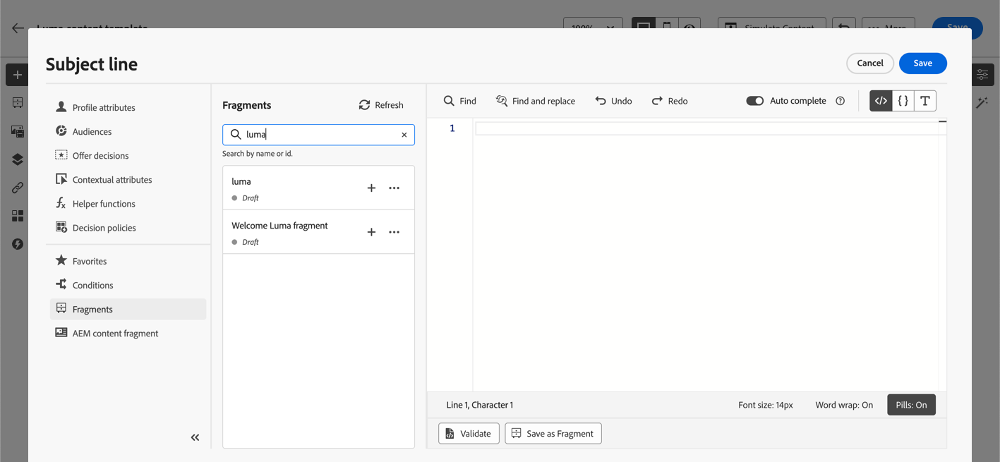
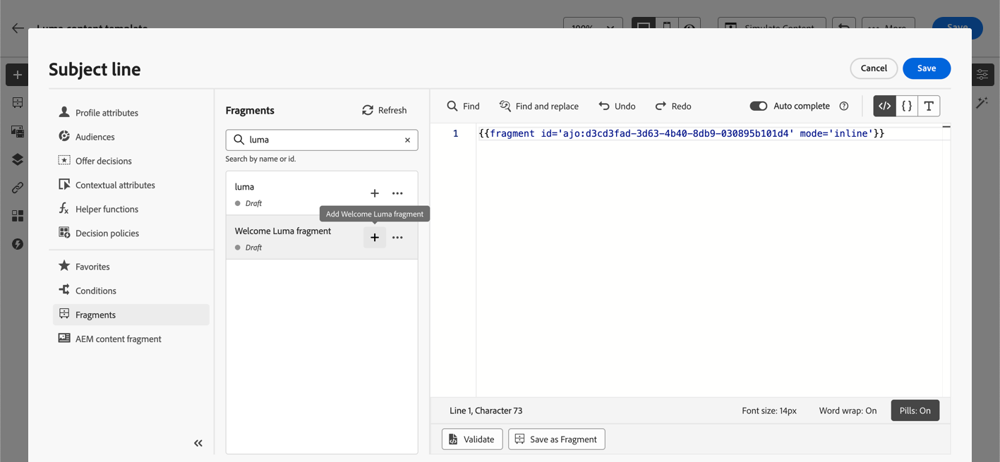
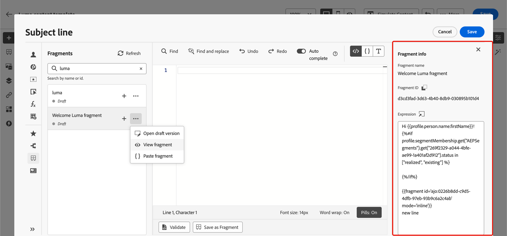
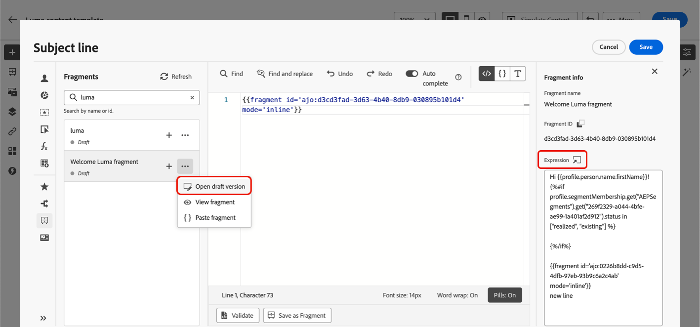
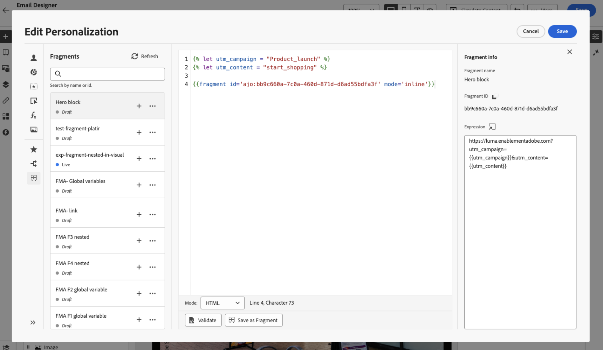
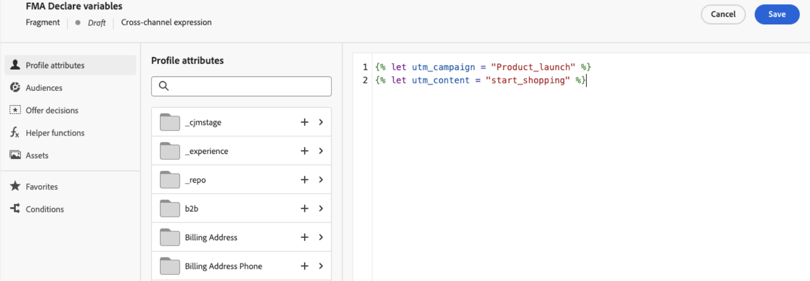
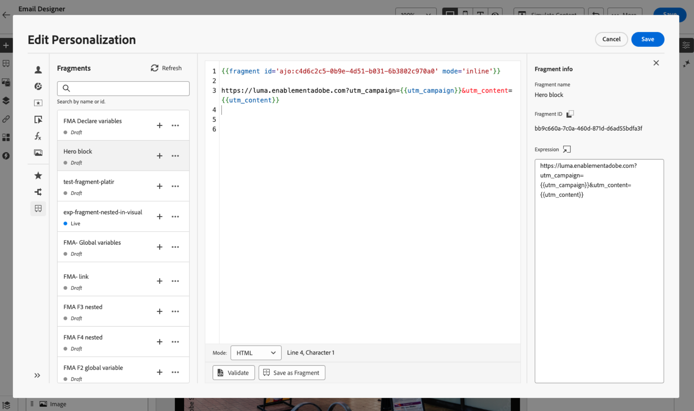
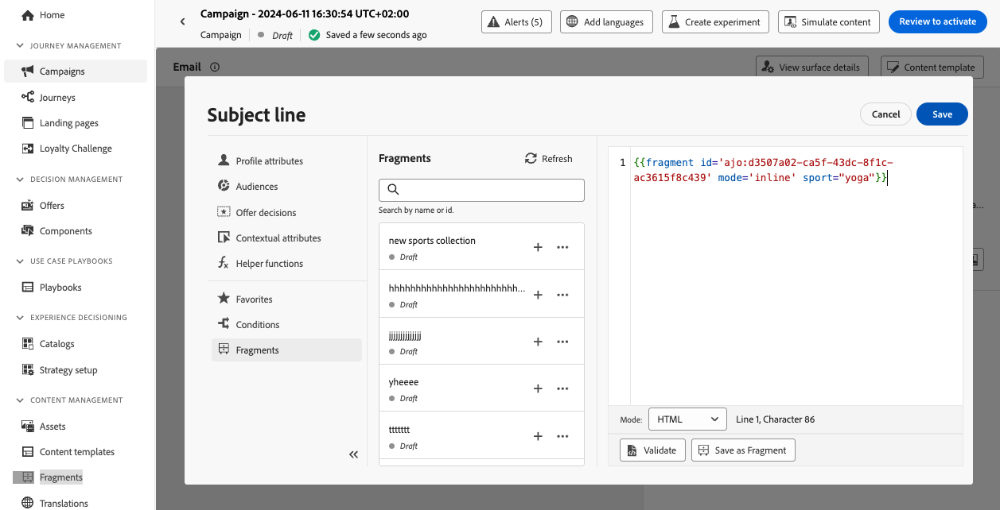
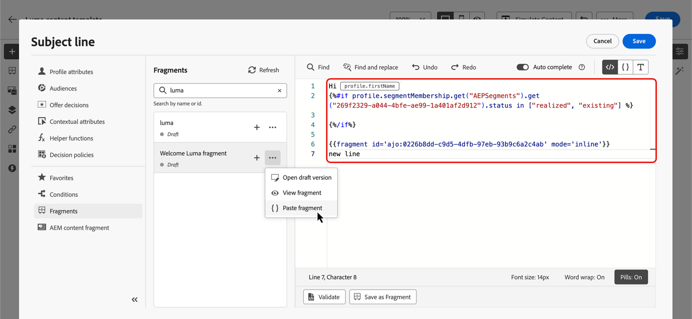

# Leverage expression fragments {#use-expression-fragments}

>[!BEGINSHADEBOX]

**On this page:** Learn how to insert and reuse expression fragments in the personalization editor, work with implicit variables, use fragments inside loops, customize editable fields, and break inheritance in Adobe Journey Optimizer.

>[!ENDSHADEBOX]

When using the **personalization editor**, you can leverage all the expression fragments that have been created or saved to the current sandbox.

A fragment is a reusable component that can be referenced across [!DNL Journey Optimizer] campaigns and journeys. This functionality allows to prebuild multiple custom content blocks that can be used by marketing users to quickly assemble contents in an improved design process. [Learn more on fragments](../content-management/fragments.md)

➡️ [Learn how to manage, author and use fragments in this video](../content-management/fragments.md#video-fragments)

## Use an expression fragment {#use-expression-fragment}

To add expression fragments to your content, follow the steps below.

>[!NOTE]
>
>You can add up to 30 fragments in a given delivery. Fragments can only be nested up to 1 level.

1. Open the [personalization editor](personalization-build-expressions.md) and select the **[!UICONTROL Fragments]** button on the left pane.

    The list displays all the expression fragments that have been created or saved as fragments on the current sandbox. [Learn how to create fragments](../content-management/create-fragments.md)
    They are sorted by creation date: recently added expression fragments are shown first in the list.

    

    You can also refresh this list. 
    
    >[!NOTE]
    >
    >If some fragments were modified or added while you are editing your content, the list will be updated with the latest changes.

1. Click the + icon next to an expression fragment to insert the corresponding fragment ID into the editor.

    

    >[!CAUTION]
    >
    >You can add any **Draft** or **Live** fragment to your content. However, you won't be able to activate your journey or campaign if a fragment with the **Draft** status is being used in it. At journey or campaign publication, draft fragments will show an error and you'll need to approve them to be able to publish.

1. Once the fragment ID has been added, if you open the corresponding expression fragment and [edit it](../content-management/manage-fragments.md#edit-fragments) from the interface, the changes are synchronized. They are automatically propagated to all draft or live journeys/campaigns containing that fragment ID.

1. Click the **[!UICONTROL More actions]** button next to a fragment. From the contextual menu that opens, select **[!UICONTROL View fragment]** to get more information about that fragment. The **[!UICONTROL Fragment ID]** is also displayed and can be copied from here.

    

1. You can open the expression fragment in another window to edit its content and properties - either using the **[!UICONTROL Open fragment]** option in the contextual menu or from the **[!UICONTROL Fragment info]** pane. [Learn how to edit a fragment](../content-management/manage-fragments.md#edit-fragments)

    

1. You can then customize and validate your content as usual using all the personalization and authoring capabilities of the [personalization editor](personalization-build-expressions.md).

1. In some cases, you only need to compute variables, so you may want to hide the content of the expression fragment. To do this, use the `render` attribute and set it to `false`. For example:

    ```
    Hi {{profile.person.name.firstName|fragment id='ajo:fragmentId/variantId' mode ='inline' render=false}}
    ```

>[!NOTE]
>
>If you create an expression fragment that contains multiple line breaks and use it in [SMS](../mobile/create-mobile-message.md#sms-content) or [push](../push/design-push.md) content, the line breaks are preserved. Thus make sure to test your [SMS](../mobile/send-mobile-message.md) or [push](../push/send-push.md) message before sending it.

## Use implicit variables {#implicit-variables}

The implicit variables enhance the existing fragment functionality to improve efficiency for content reusability and scripting use cases. Fragments can use input variables and create output variables which can be used in campaign and journey content.

This capability can for example be used to initialize tracking parameters of your emails, based on the current campaign or journey, and use these parameters into the personalized links added to the email content.

The following use cases are possible:

1. **Use an input variables in a fragment.**

    When a fragment is used in a campaign/journey action  content, it has the ability to leverage variables that were declared outside of the fragment. Below is an example: 

    

    We can see above the `utm_content` variable is declared in the campaign content. When the fragment **Hero block** is used, it will show a link to which the `utm_content` parameter value will be appended. The final result is: `https://luma.enablementadobe.com?utm_campaign= Product_launch&utm_content= start_shopping`.
    
1. **Use an output variables from a fragment.**

    Variables calculated or defined inside a fragment are available for use in your contents. In the following example, a fragment **F1** declares a set of variables:

    

    In an email content, you can have the following personalization:

    

    The fragment F1 initializes the following variables: `utm_campaign`and `utm_content`. Then the link in the message content will have these parameters appended. The final result is: `https://luma.enablementadobe.com?utm_campaign= Product_launch&utm_content= start_shopping`.

>[!NOTE]
>
>At runtime, the system expands what is inside fragments and then interprets the personalization code from top to bottom. Keeping this in mind, more complex use cases can be achieved. For example, you can have a fragment F1 passing variables to another fragment F2 sitting below. You can also have a visual fragment F1 passing variables to a nested expression fragment F2. 

## Use expression fragments inside loops {#fragments-in-loops}

When using expression fragments within `{{#each}}` loops, it's important to understand how variable scoping works. Expression fragments can access global variables defined in your message content, but they cannot receive loop-specific variables as parameters.

### Supported pattern: Use global variables {#global-variables-in-loops}

Expression fragments can reference global variables that are defined outside of the fragment, even when the fragment is called from within a loop. This is the recommended approach when you need to use fragments in iterative contexts.

**Example: Using a fragment with global variables inside a loop**

In your message content, define a global variable and use a fragment that references it:

```handlebars


{{#each context.journey.actions.GetProducts.items as |product|}}
  <div class="product">
    <h3>{{product.name}}</h3>
    <p>Price: ${{product.price}}</p>
    {{fragment id='ajo:fragment123/variant456' mode='inline'}}
  </div>
{{/each}}
```

In the expression fragment (fragment123), you can reference the `globalDiscount` variable:

```handlebars
<p class="discount-info">Save {{globalDiscount}}% on all items!</p>
```

This pattern works because the global variable is accessible throughout the message, including within fragments, regardless of loop context.

### Not supported: Passing loop variables as fragment parameters {#loop-variables-limitations}

You cannot pass the current iteration item (e.g., `product` in the example above) as a parameter to an expression fragment. The fragment cannot directly access loop-scoped variables from the surrounding `{{#each}}` block.

**Example: What does NOT work**

```handlebars
{{#each context.journey.actions.GetProducts.items as |product|}}
  <!-- This will NOT work as expected -->
  {{fragment id='ajo:fragment123/variant456' mode='inline' currentProduct=product}}
{{/each}}
```

The fragment cannot receive `product` as a parameter and use it internally because parameter passing for loop-specific variables is not supported in the current implementation.

### Recommended workarounds {#fragments-in-loops-workarounds}

When you need to use expression fragments with data from a loop, consider these approaches:

1. **Include logic directly in the message**: Instead of using a fragment for loop-specific logic, add the personalization code directly within your `{{#each}}` block.

    ```handlebars
    {{#each context.journey.actions.GetProducts.items as |product|}}
      <div class="product">
        <h3>{{product.name}}</h3>
        <p>Price: ${{product.price}}</p>
        {{#if product.price > 100}}
          <span class="premium-badge">Premium Product</span>
        {{/if}}
      </div>
    {{/each}}
    ```

2. **Use fragments outside of loops**: If the fragment content is not loop-dependent, call the fragment before or after the iteration block.

    ```handlebars
    {{fragment id='ajo:fragment123/variant456' mode='inline'}}
    
    {{#each context.journey.actions.GetProducts.items as |product|}}
      <div class="product">
        <h3>{{product.name}}</h3>
        <p>Price: ${{product.price}}</p>
      </div>
    {{/each}}
    ```

3. **Set multiple global variables**: If you need to pass different values to a fragment across iterations, set global variables before each fragment call (though this limits flexibility).

>[!NOTE]
>
>For iterating over contextual data and working with loops, see the comprehensive guide on [iterating over contextual data](iterate-contextual-data.md), which includes best practices, troubleshooting tips, and advanced patterns.

## Customize editable fields {#customize-fields}

If certain portions of an expression fragment have been made editable using variables, you can override their default values using a specific syntax. [Learn how to make your fragments customizable](../content-management/customizable-fragments.md)

To customize the fields, follow these steps:

1. Insert the fragment into your code from the **[!UICONTROL Fragments]** menu.

1. Use the `<fieldId>="<value>"` code at the end of the syntax to override the default value of the variable.

    In the example below, we are overriding the value of a variable whose ID is "sports" with the "yoga" value. This will display "yoga" in your fragment content everywhere the "sport" variable is referenced.

    

An example showing how to add editable fields into an expression fragments and override their values when creating an email is available in [this section](../content-management/customizable-fragments.md#example).

## Use dynamic fragment resolution {#dynamic-resolution}

Instead of statically embedding a fragment ID at design time, you can resolve the fragment ID dynamically at runtime per recipient. This allows different profiles to receive entirely different content blocks within the same campaign or journey, based on profile attributes, dataset lookups, or context data.

[Learn how to use dynamic fragments](../content-management/dynamic-fragments.md)

## Break inheritance {#break-inheritance}

When adding a fragment ID to the personalization editor, the changes made to the original expression fragment are synchronized.

However, you can also paste the content of an expression fragment into the editor. From the contextual menu, select **[!UICONTROL Paste fragment]** to insert that content.



In that case, the inheritance from the original fragment is broken. The content of the fragment is copied into the editor, and the changes are not synchronized anymore.

It becomes a standalone element that is no longer linked to the original fragment; you can edit it as any other element in your code.

## Quick reference {#quick-reference}

This section contains structured knowledge intended to support interpretation, retrieval, and question answering related to this topic.

For complete understanding, this information should be combined with the documentation on this page. Neither source is intended to stand alone; the page describes the feature, while this section provides additional context that helps disambiguate terminology, intent, applicability, and constraints.

>[!BEGINTABS]

>[!TAB Overview]

**TL;DR**

This page explains how to insert, customize, and manage expression fragments in the personalization editor — including implicit variables, using fragments inside loops, editable fields, dynamic resolution, and breaking inheritance.

**Intents**

* Insert an expression fragment from the Fragments menu and understand automatic change propagation
* Use implicit variables: input variables (declared outside the fragment, used inside) and output variables (declared inside the fragment, used in surrounding message content)
* Use expression fragments inside loops — leverage global variables for fragment access; understand the limitation on passing loop-scoped variables as parameters
* Override editable fields in a customizable fragment using `<fieldId>="<value>"` syntax
* Resolve fragment IDs dynamically at runtime based on profile attributes, dataset lookups, or context data
* Break inheritance by pasting fragment content directly into the editor

>[!TAB Glossary]

* **Expression fragment**: A reusable personalization expression component referenced by ID across campaigns and journeys; changes to the fragment propagate automatically to all content referencing it. *(product-specific)*
* **Implicit variables**: Variables that extend the fragment functionality — input variables (declared in campaign/journey content, consumed inside the fragment) and output variables (declared inside the fragment, available in the surrounding message content). *(product-specific)*
* **Input variable**: A variable declared outside the fragment (in campaign or journey content) that the fragment can reference and use internally.
* **Output variable**: A variable declared or computed inside a fragment that becomes available for use in the surrounding message content after the fragment is called.
* **Editable fields**: Fragment variables exposed to allow the inserting user to override default values using `<fieldId>="<value>"` syntax, without editing the fragment source. *(product-specific)*
* **Dynamic fragment resolution**: The ability to resolve a fragment ID at runtime (based on profile attributes, dataset lookups, or context data) rather than embedding a static fragment ID at design time. *(product-specific)*
* **Break inheritance**: Using "Paste fragment" from the contextual menu copies the fragment's content into the editor as a standalone element that no longer synchronizes with the original fragment. *(product-specific)*

>[!TAB Terminology]

* **Canonical name:** expression fragment — variants: fragment, expression fragment
* **Synonyms:** "fragment ID" = the identifier used to reference the fragment in expressions
* **Do not confuse:** inserting a fragment by ID (referenced; changes propagate automatically to all content) ≠ breaking inheritance / paste fragment (content copied into editor; standalone element, no longer linked to original)
* **Do not confuse:** input variables (declared outside the fragment, consumed inside) ≠ output variables (declared inside the fragment, consumed outside in surrounding message content)
* **Do not confuse:** Draft fragment (can be added to content but blocks journey/campaign publication until approved) ≠ Live fragment (fully published; safe for active journeys and campaigns)

>[!TAB Guardrails & Limitations]

* Maximum 30 fragments can be added in a given delivery.
* Fragments can only be nested up to 1 level.
* A journey or campaign cannot be activated or published if it contains a fragment with Draft status; draft fragments must be approved before publication.
* Expression fragments cannot receive loop-scoped variables (the current `{{#each}}` iteration item) as parameters — this is a known limitation. Use global variables or inline logic as a workaround.
* If a fragment containing multiple line breaks is used in SMS or push content, line breaks are preserved; test the content before sending.

>[!TAB FAQ]

**Q: How many fragments can be added in a single delivery?**

Up to 30 fragments.

**Q: Can fragments be nested inside other fragments?**

Yes, but only up to 1 level of nesting.

**Q: What happens if I use a Draft fragment in a journey or campaign?**

You can add a Draft fragment to content, but you cannot activate or publish the journey or campaign until the fragment is approved and its status changes to Live.

**Q: Can an expression fragment receive the current loop item (e.g., `product` in `{{#each}}`) as a parameter?**

No. Expression fragments cannot receive loop-scoped variables as parameters. Use global variables declared outside the loop (which the fragment can access), or include the personalization logic directly within the loop instead of using a fragment.

**Q: What is breaking inheritance and when should I use it?**

Breaking inheritance means using "Paste fragment" from the contextual menu to copy the fragment's content directly into the editor. The pasted content becomes a standalone element that no longer synchronizes with the original fragment — use this when you need to customize the content beyond what editable fields allow, knowing future changes to the original fragment will not propagate to this copy.

>[!ENDTABS]

<!-- ai-section-version: 1 | source-hash: 64745ff0 -->

