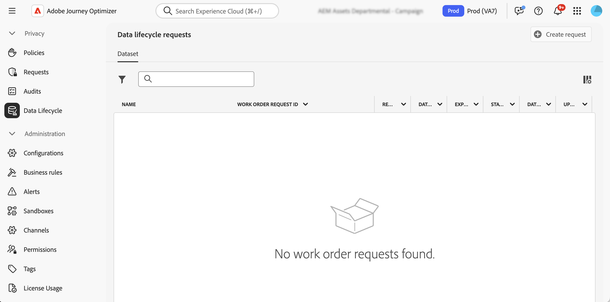

# Perform data lifecycle operations {#data-hygiene}

>[!AVAILABILITY]
>
>Data lifecycle capabilities are currently only available for organizations that have purchased the **Healthcare Shield** and **Privacy and Security Shield** add-on offerings.

As data is continuously ingested into Adobe Experience Platform, it becomes crucial to ensure your data is used as intended, updated when necessary, and deleted per organizational policies.

These tasks can be accomplished using the **[!UICONTROL Data Lifecycle]** menu, which allows you to configure and schedule data lifecycle operations, ensuring that your records are properly maintained.

## Recommendations {#data-hygiene-recommendations}

When performing data hygiene operations (such as deleting identities or datasets), be aware that historical delivery events associated with deleted identities will no longer appear in standard reporting or datalake queries. This can result in discrepancies between the number of emails reported as **Delivered** and the number of emails **Received** in recipient inboxes, especially for older journeys. 

Before executing large-scale deletions, validate and export any required delivery or reporting data. If reconciliation is needed after data hygiene, coordinate with Adobe support to access archived logs or use Message Feedback Event Dataset queries for recent data.  

## Learn more {#data-hygiene-learn-more}

For more information on the Privacy Service and how to perform data lifecycle operations, refer to Adobe Experience Platform documentation:

* [Privacy Service overview](https://experienceleague.adobe.com/docs/experience-platform/privacy/home.html)
* [Data Lifecycle in Adobe Experience Platform](https://experienceleague.adobe.com/docs/experience-platform/hygiene/home.html)
