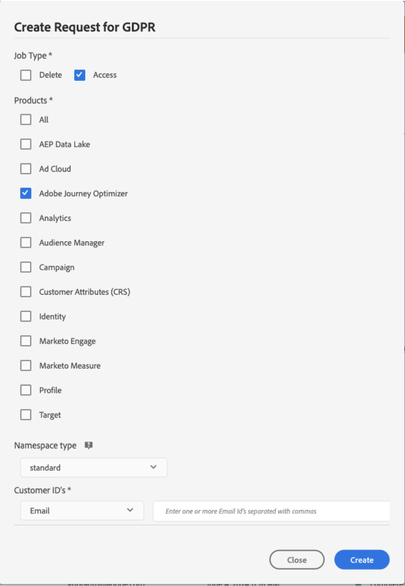
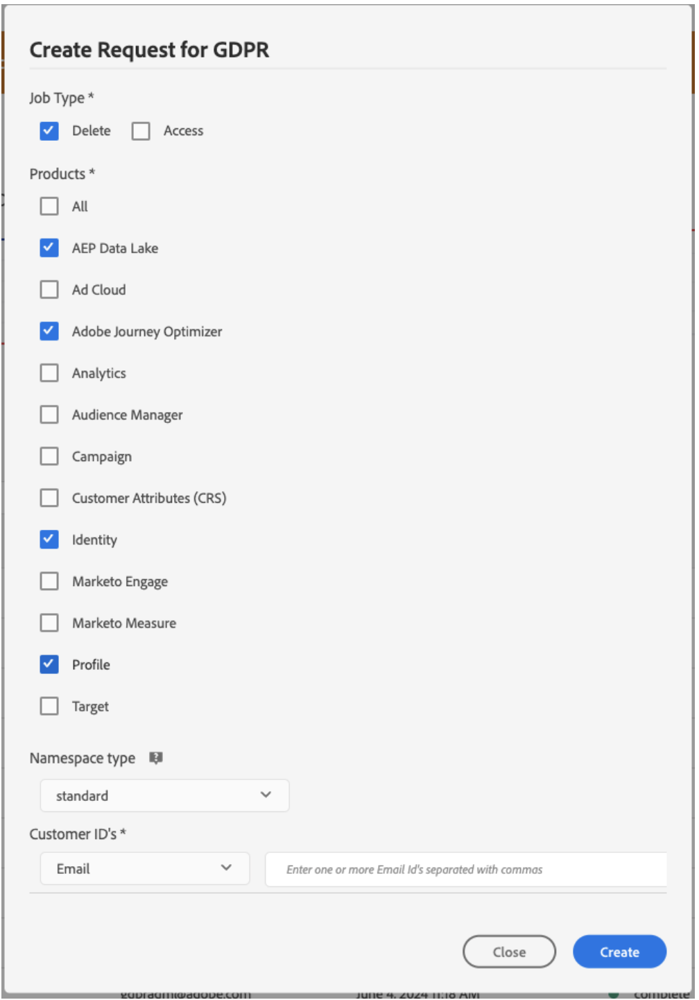

# Privacy requests {#track-changes}

Adobe Experience Platform **Privacy Service** provides a RESTful API and user interface to help you manage customer data requests. With Privacy Service, you can submit requests to access and delete personal customer data from Adobe Experience Cloud applications, facilitating automated compliance with legal and organizational privacy regulations.

Privacy requests can be created and managed from the **[!UICONTROL Requests]** menu.


For more information on Privacy Service and how to create and manage privacy requests, refer to the [Adobe Experience Platform documentation](https://experienceleague.adobe.com/docs/experience-platform/privacy/home.html){target="_blank"}.

<!--* [Privacy Service overview](https://experienceleague.adobe.com/docs/experience-platform/privacy/home.html)
* [Managing privacy jobs in the Privacy Service UI](https://experienceleague.adobe.com/docs/experience-platform/privacy/ui/user-guide.html)-->

## Manage individual data privacy requests that you can send to Adobe Journey Optimizer {#data-privacy-requests}

You can submit individual requests to access and delete consumer data from Adobe Journey Optimizer in two ways:

* Through the **Privacy Service UI**. [Learn more](https://experienceleague.adobe.com/docs/experience-platform/privacy/ui/user-guide.html){target="_blank"}
* Through the **Privacy Service API**. [Learn more](https://experienceleague.adobe.com/en/docs/experience-platform/privacy/api/overview){target="_blank"}
<!--More specific information on Privacy Service API [here](https://developer.adobe.com/experience-platform-apis/references/privacy-service/#_blank).-->

Privacy Service supports two types of requests: **data access** and **data deletion**.

For **access requests**, specify "**Adobe Journey Optimizer**" from the UI (or "**CJM**" as a product code in the API).

For **delete requests**, in addition to the "**Adobe Journey Optimizer**" request, you must also submit delete requests to **three upstream services** to prevent Journey Optimizer from reinjecting the deleted data. If these upstream services are not specified, the "Adobe Journey Optimizer" request will remain in the "processing" state until delete requests for the upstream services are created.

The three upstream services are:

* Profile (product code: "profileService")
* AEP Data Lake (product code: "AdobeCloudPlatform")
* Identity (product code: "identity")

>[!NOTE]
>
>This guide only covers how to make privacy requests for [!UICONTROL Adobe Journey Optimizer].
>
>* If you also plan to make privacy requests for the Platform data lake, refer to this [guide](https://experienceleague.adobe.com/en/docs/experience-platform/catalog/privacy) in addition to this tutorial.
>
>* For Real time customer profile, please refer to this [guide](https://experienceleague.adobe.com/en/docs/experience-platform/profile/privacy).
>* For Identity service, please refer to this [guide](https://experienceleague.adobe.com/en/docs/experience-platform/identity/privacy).
>
>For delete and access requests, you need to call these individual systems to make sure the requests are handled by each of them. Making a privacy request to [!DNL Adobe Journey Optimizer] will not remove data from all these systems.

## Create Access and Delete requests

### Prerequisites

To make requests to Access and Delete data for Adobe Journey Optimizer, you must have:

* an Adobe organization ID
* an Identity identifier of the person you want to act on and the corresponding namespace(s).For more information about identity namespaces in Adobe Journey Optimizer and Experience Platform, see the [identity namespace overview](https://experienceleague.adobe.com/en/docs/experience-platform/identity/features/namespaces).

>[!IMPORTANT]
>
>When submitting privacy requests, make sure that you specify '[!DNL '**Adobe Journey Optimizer**]' as the targeted product name and **all identity namespaces** (such as 'Email' 'ECID', or 'Loyalty ID') associated with the profile data that needs to be accessed or removed. In particular, for Delete requests, if you do not include explicitely the product name and all applicable namespaces, data are not removed from [!DNL Adobe Journey Optimizer].

### Required field values in Journey Optimizer for API requests

```json
"companyContexts":
    "namespace": imsOrgID
    "value": <Your Adobe Organization ID Value>

"users":
    "action": either access or delete

    "userIDs":
        "namespace": e.g. email, aaid, ecid, etc.
        "type": standard
        "value": <Data Subject's Identity Identifier>

"include":
    CJM (which is the Adobe product code for Adobe Journey Optimizer)
    profileService (product code for Profile)
    AdobeCloudPlatform (product code for AEP Data Lake)
    identity (product code for Identity)

"regulation":
    gdpr, ccpa, pdpa, lgpd_bra, or nzpa_nzl (which is the privacy regulation that applies to the request)
```


### GDPR Access request example:

From the UI:

{width="60%" align="center"}

Through the API:

```json
// JSON Request
{
   "companyContexts":[
      {
         "namespace":"imsOrgID",
         "value":"745F37C35E4B776E0A49421B@AdobeOrg"
      }
   ],
   "users":[
      {
         "action":[
            "access"
         ],
         "userIDs":[
            {
               "namespace":"ecid",
               "value":"38400000-8cf0-11bd-b23e-10b96e40000d",
               "type":"standard"
            },
            {
               "namespace":"email",
               "value":"johndoe4@gmail.com",
               "type":"standard"
            }
         ]
      }
   ],
   "include":[
      "CJM"
   ],
   "regulation":"gdpr"
}
```

```json
// JSON Response
{
    "requestId": "17163122360480365RX-705",
    "totalRecords": 1,
    "jobs": [
        {
            "jobId": "e709b1f4-1796-11ef-b422-eddd0aebc40d",
            "customer": {
                "user": {
                    "key": "John Doe",
                    "action": [
                        "access"
                    ],
                    "userIDs": [
                        {
                            "namespace": "ecid",
                            "value": "38400000-8cf0-11bd-b23e-10b96e40000d",
                            "type": "standard",
                            "namespaceId": 4,
                            "isDeletedClientSide": false
                        },
                        {
                            "namespace": "email",
                            "value": "johndoe4@gmail.com",
                            "type": "standard",
                            "namespaceId": 6,
                            "isDeletedClientSide": false
                        }
                    ]
                }
            }
        }
    ]
}
```

### GDPR Delete request example:

From the UI:

{width="60%" align="center"}

Through the API:

```json
// JSON Request
{
  "companyContexts": [
    {
      "namespace": "imsOrgID",
      "value": "745F37C35E4B776E0A49421B@AdobeOrg"
    }
  ],
  "users": [
    {
      "action": [
          "delete"
      ],
      "userIDs": [
        {
          "namespace": "ecid",
          "value": "38400000-8cf0-11bd-b23e-10b96e40000d",
          "type": "standard"
        },
                {
          "namespace": "email",
          "value": "johndoe4@gmail.com",
          "type": "standard"
        }
      ]
    }
  ],
  "include": [
    "CJM", "profileService", "AdobeCloudPlatform", "identity"
  ],
  "regulation": "gdpr"
}
```

```json
// JSON Response
{
    "requestId": "17163122360480365RX-705",
    "totalRecords": 1,
    "jobs": [
        {
            "jobId": "e709b1f4-1796-11ef-b422-eddd0aebc40d",
            "customer": {
                "user": {
                    "key": "John Doe",
                    "action": [
                        "delete"
                    ],
                    "userIDs": [
                        {
                            "namespace": "ecid",
                            "value": "38400000-8cf0-11bd-b23e-10b96e40000d",
                            "type": "standard",
                            "namespaceId": 4,
                            "isDeletedClientSide": false
                        },
                        {
                            "namespace": "email",
                            "value": "johndoe4@gmail.com",
                            "type": "standard",
                            "namespaceId": 6,
                            "isDeletedClientSide": false
                        }
                    ]
                }
            }
        }
    ]
}
```
