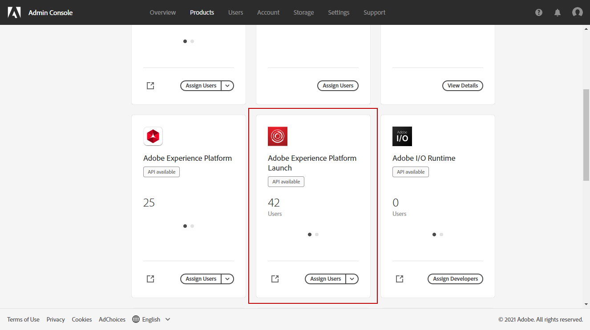
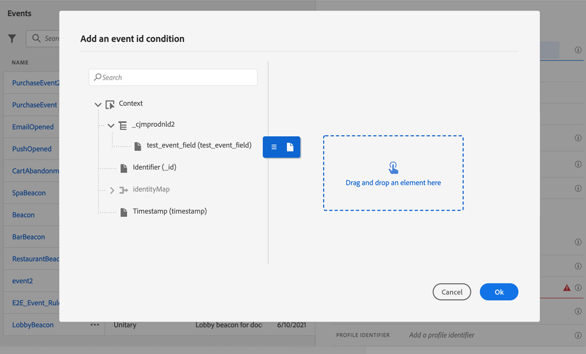
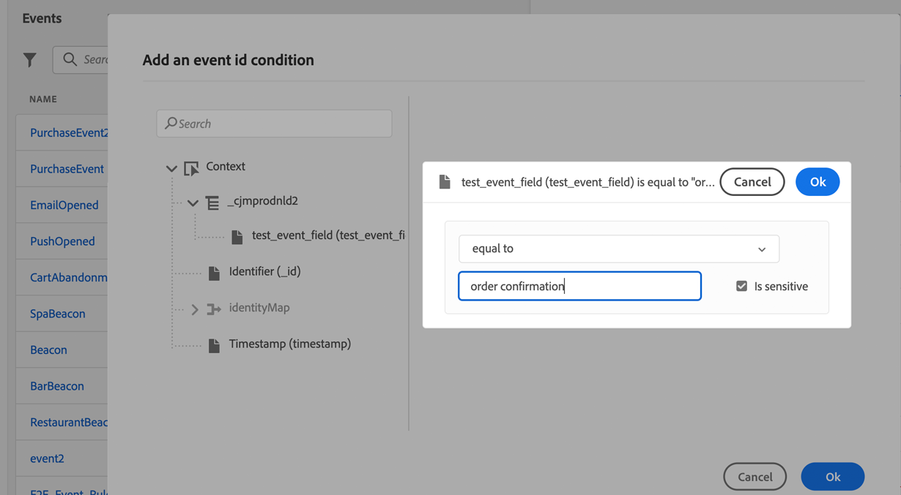
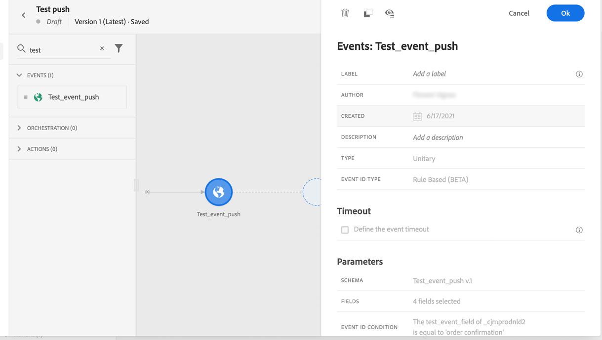
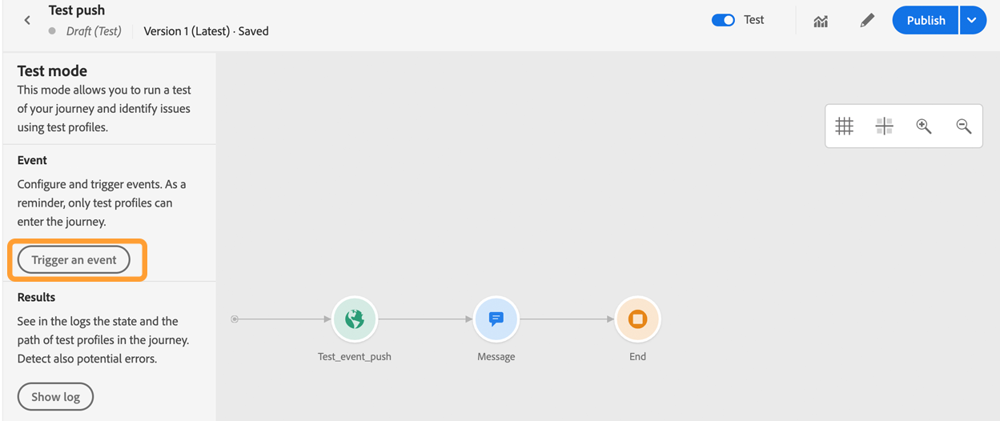

# Configure Push notification channel {#push-notification-configuration}


Before starting sending push notifications with [!DNL Journey Optimizer], you need to define settings in both [!DNL Adobe Experience Platform] and [!DNL Adobe Experience Platform Launch]. 

## Adobe Experience Platform settings {#platform-settings}

To set up your mobile app in [!DNL Adobe Experience Platform Launch], follow these steps:

1. [Assign Property and Company rights](#push-rights)
1. [Add your mobile application's push credentials in Platform Launch](#push-credentials-launch).
1. [Create Edge configuration](#edge-configuration) to be used by **[!UICONTROL Edge]** extension to send custom data from mobile device to [!DNL Adobe Experience Platform].
1. [Set up a Platform Launch property](#launch-property).
1. [Publish the Property](#publish-property).
1. [Configure the ProfileDataSource](#configure-profiledatasource).

### Step 1: Assign Property and Company rights {#push-rights}

Before creating a mobile application, you first need to make sure that you have or assign the correct user permissions.

For more information on user management with [!DNL Adobe Experience Platform Launch], refer to [Platform Launch documentation](https://experienceleague.adobe.com/docs/launch/using/admin/user-permissions.html#experience-cloud-permissions).

To assign Property and Company rights:

1. Access the [!DNL Admin Console].

1. From the **[!UICONTROL Products]** tab, select the **[!UICONTROL Adobe Experience Platform Launch]** card.

    

1. Select an existing **[!UICONTROL Product Profile]** or create a new one with the **[!UICONTROL New profile]** button. For more information on how to create a new **[!UICONTROL New profile]**, refer to the [Admin console documentation](https://experienceleague.adobe.com/docs/experience-platform/access-control/ui/create-profile.html#ui).

1. From the **[!UICONTROL Permissions]** tab, select **[!UICONTROL Property rights]**.

    

1. Click **[!UICONTROL Add all]**. This will add the following rights to your product profile:
    * **[!UICONTROL Approve]**
    * **[!UICONTROL Develop]**
    * **[!UICONTROL Manage Environments]**
    * **[!UICONTROL Manage Extensions]**
    * **[!UICONTROL Publish]**

    

1. Then, select **[!UICONTROL Company rights]** in the left-hand menu.

    

1. Add the following rights:

    * **[!UICONTROL Manage App Configurations]**
    * **[!UICONTROL Manage Properties]**

    

1. Click **[!UICONTROL Save]**.

To assign this **[!UICONTROL Product profile]** to users:

1. In the [!DNL Admin Console], from the **[!UICONTROL Products]** tab, select the **[!UICONTROL Adobe Experience Platform Launch]** card.

1. Select your previously configured **[!UICONTROL Product profile]**.

1. From the **[!UICONTROL Users]** tab, click **[!UICONTROL Add user]**.

    

1. Type in your user's name or email address and select the user. Then, click **[!UICONTROL Save]**.

   >[!NOTE]
   >
   >If the user was not previously created in the Admin console, refer to the [Add users documentation](https://helpx.adobe.com/enterprise/admin-guide.html/enterprise/using/manage-users-individually.ug.html#add-users).

    


You now have the correct user permissions to create and configure a mobile application in [!DNL Adobe Experience Platform Launch].

### Step 2: Add your mobile application push credentials in Platform Launch {#push-credentials-launch}

After granting the correct user permissions, you now need to add your mobile application push credentials in [!DNL Adobe Experience Platform Launch]. 

For further details and procedures on how to add your mobile application push credentials, refer to the steps detailed in [Adobe Experience Platform Mobile SDK documentation](https://aep-sdks.gitbook.io/docs/beta/adobe-journey-optimizer#configure-the-journey-optimizer-extension-in-launch).

<!--
Note that to add push credentials in [!DNL Adobe Experience Platform Launch], the owner of the mobile app should fetch them from APNs/FCM.
1. From [!DNL Adobe Experience Platform Launch], ensure that **[!UICONTROL Client Side]** is selected in the drop-down menu.

1. Select the **[!UICONTROL App Configurations]** tab in the left-hand panel and click **[!UICONTROL App Configuration]** to create a new configuration.

1. Enter a **[!UICONTROL Name]** for the configuration.

1. From the **[!UICONTROL Messaging Service Type]** drop-down menu, select the **[!UICONTROL Messaging service type]** to be used for these credentials. Here, we selected **[!UICONTROL Apple Push Notification Service]** since we are working with iOS.

1. Enter the mobile app **[!UICONTROL Bundle Id]** in the **[!UICONTROL App ID (iOS Bundle ID)]** field if you are using Apple push notification service or in the **[!UICONTROL App ID (Android package name)]** field if you are using Firebase Cloud Messaging.

    

1. Drag and drop the .p8 key file or the .json private key file to the **[!UICONTROL Push Credentials]** field.

1. Enter the **[!UICONTROL Key Id]** and **[!UICONTROL Team Id]** if you are using Apple push notification service.

1. Click **[!UICONTROL Save]** to create your app configuration.
-->

### Step 3: Create Edge configuration {#edge-configuration}

**[!UICONTROL Edge configuration]** is used by **[!UICONTROL Edge]** extension to send custom data from mobile device to [!DNL Adobe Experience Platform]. 
To configure [!DNL Adobe Experience Platform], you must provide the **[!UICONTROL Sandbox]** name and **[!UICONTROL Event Dataset]**.

For further details and procedures on how to create **[!UICONTROL Edge configuration]**, refer to the steps detailed in [Adobe Experience Platform Mobile SDK documentation](https://aep-sdks.gitbook.io/docs/getting-started/configure-datastreams).


<!--
1. From [!DNL Adobe Experience Platform Launch], select the **[!UICONTROL Edge Configurations]** tab and click **[!UICONTROL Edge Configurations]**.
    
1. Select **[!UICONTROL New Edge Configuration]** to add a new **[!UICONTROL Edge Configuration]**.
1. Enter a **[!UICONTROL Name]** and click **[!UICONTROL Save]**

1. Click the **[!UICONTROL Adobe Experience Platform]** toggle to enable it.

1. Fill in the **[!UICONTROL Sandbox]**, **[!UICONTROL Event dataset]** and **[!UICONTROL Profile Dataset]** fields. Then, click **[!UICONTROL Save]**.
    
    
-->

### Step 4: Set up a Platform Launch property {#launch-property}

Setting up a [!DNL Adobe Experience Platform Launch] property allows the mobile app developer or marketer to configure the mobile SDKs attributes such as Session Timeouts, the [!DNL Adobe Experience Platform] sandbox to be targeted and the **[!UICONTROL Adobe Experience Platform Datasets]** to be used for mobile SDK to send data to.

For further details and procedures on how to set up a **[!UICONTROL Platform Launch property]**, refer to the steps detailed in [Adobe Experience Platform Mobile SDK documentation](https://aep-sdks.gitbook.io/docs/getting-started/create-a-mobile-property#create-a-mobile-property).

To get the SDKs needed for push notification to work you will need the following SDK extensions, for both Android and iOS:

* **[!UICONTROL Mobile Core]** (installed automatically)
* **[!UICONTROL Profile]** (installed automatically)
* **[!UICONTROL Adobe Experience Platform Edge]**
* **[!UICONTROL Adobe Experience Platform Assurance]**, optional but recommended to debug the mobile implementation.

To learn more about [!DNL Adobe Experience Platform Launch] extensions, refer to [Platform Launch documentation](https://experienceleague.adobe.com/docs/launch-learn/implementing-in-mobile-android-apps-with-launch/configure-launch/launch-add-extensions.html).

<!--

1. From [!DNL Adobe Experience Platform Launch], ensure that **[!UICONTROL Client Side]** is selected in the drop-down menu.

1. select the **[!UICONTROL Properties]** tab and click **[!UICONTROL New Property]**.

    

1. Enter a **[!UICONTROL Name]** for your new property.

1. Select **[!UICONTROL Mobile]** as **[!UICONTROL Platform]**.

    

1. Click **[!UICONTROL Save]** to create your new property.

To configure **[!UICONTROL Adobe Experience Platform Edge Extension]** to send custom data from mobile devices to [!DNL Adobe Experience Platform].

1. Select your previously created property and select the **[!UICONTROL Extensions]** tab to view the extensions for this property.

    

1. Click **[!UICONTROL Configure]** under the **[!UICONTROL Adobe Experience Platform Edge]** Network' extension.

1. From the **[!UICONTROL Edge Configuration]** drop-down list, select the **[!UICONTROL Edge Configuration]** created in the previous steps. For more information on **[!UICONTROL Edge Configuration]**, refer to this [section](#edge-configuration).

1. Click **[!UICONTROL Save]**.

To configure **[!UICONTROL Adobe Experience Platform Messaging]** extension to send push profile and push interactions to the correct datasets, follow the same steps as above. Use **[!UICONTROL Sandbox]**, **[!UICONTROL Event dataset]** and **[!UICONTROL Profile Dataset]** created in the [Adobe Experience Platform setup](#edge-configuration).
-->

### Step 5: Publish the Property {#publish-property}

You now need to publish the property to integrate your configuration and to use it in the mobile app. 

To publish your property, refer to the steps detailed in [Adobe Experience Platform Mobile SDK documentation](https://aep-sdks.gitbook.io/docs/getting-started/create-a-mobile-property#publish-the-configuration)

### Step 6: Configure the ProfileDataSource {#configure-profiledatasource}

To configure the `ProfileDataSource`, use the `ProfileDCInletURL` from [!DNL Adobe Experience Platform] setup and add the following in the mobile app:

```
    MobileCore.updateConfiguration(
    mutableMapOf("messaging.dccs" to <ProfileDCSInletURL>)
```

<!--
## Test your mobile app with custom action {#mobile-app-test}

After configuring your mobile app in both Adobe Experience Platform and Adobe Launch, you can now test it before sending push notifications to your profiles. In this use case, we will create a journey to target our mobile app and set a custom action which will trigger the push notification.

You can use a test mobile app for this use case. For more on this, refer to this [page](https://wiki.corp.adobe.com/pages/viewpage.action?spaceKey=CJM&title=Details+of+setting+the+mobile+test+app) (internal use only).

For this journey to work, you need to create an XDM schema. For more information, refer to [XDM documentation](https://experienceleague.adobe.com/docs/experience-platform/xdm/schema/composition.html?lang=en#schemas-and-data-ingestion).

1. In the left menu, click **[!UICONTROL Data]** then **[!UICONTROL Schemas]** under **[!UICONTROL Data management]** to create your XDM schema.

    

1. Click **[!UICONTROL Create schema]** then select **[!UICONTROL XDM Experience event]**.

    

1. In the right pane, enter the name of your schema and description. Enable this schema for **[!UICONTROL Profile]**.

1. In the left pane, click **[!UICONTROL Add]** under **[!UICONTROL Mixins]** and select  **[!UICONTROL Create a new Mixin]**. For more information on how to create mixin, refer to [XDM System documentation](https://experienceleague.adobe.com/docs/experience-platform/xdm/api/create-mixin.html?lang=en#api).

    

1. Enter a **[!UICONTROL Display Name]** and a **[!UICONTROL Description]**. Click **[!UICONTROL Add mixin]** when done.

    

1. In the **[!UICONTROL Field properties]** window, add a **[!UICONTROL Field name]**, **[!UICONTROL Display name]** and select **[!UICONTROL String]** as **[!UICONTROL Type]**.

    

1. Check **[!UICONTROL Required]** and click **[!UICONTROL Apply]**.

1. Click **[!UICONTROL Save]**. Your schema is now created and can be used in an **[!UICONTROL Event schema]**.

You then need to set up an **[!UICONTROL Event schema]** where you will set the custom action which you will need to enter in your mobile app to trigger your push notification.

1. From the left menu of the home page, click the **[!UICONTROL Admin]** icon, then click **[!UICONTROL Manage]** from the **[!UICONTROL Events]** card to create your new **[!UICONTROL Event schema]**.

1. Click **[!UICONTROL Add]**, the event configuration pane opens on the right side of the screen.

    

1. Enter the name of your event. You can also add a description.

1. In the **[!UICONTROL Event ID type]** field, select **[!UICONTROL Rule Based]**.

1. In the **[!UICONTROL Parameters]**, select your previously created XDM event.

    

1. Click **[!UICONTROL Edit]** in the **[!UICONTROL Event ID condition]** field.

1. Drag and your previously added mixin to define the condition that will be used by the system to identify the events that will trigger your journey.

    

1. Type in the syntax that you will need to use to trigger your push notification in your test app, in this example **order confirmation**.

    

1. Select **[!UICONTROL ECID]** as your **[!UICONTROL Namespace]**.

1. Click **[!UICONTROL Ok]** then **[!UICONTROL Save]**.

Your **[!UICONTROL Event schema]** is now created and can now be used in a journey.

1. In the left menu from [!DNL Journey Optimizer] homepage, click **[!UICONTROL Journeys]**.

1. Click **[!UICONTROL Create]** to create a new journey.

    

1. Edit the journey's properties in the configuration pane displayed on the right side. Learn more in this [section](building-journeys/journey-gs.md#change-properties).

1. Start by drag and dropping the **[!UICONTROL Event schema]** created in the previous steps from the **[!UICONTROL Events]** drop-down.

    

1. From the **[!UICONTROL Actions]** drop-down, drag and drop a **[!UICONTROL Message]** activity to your journey.

1. Select a previously created message. For more information on how to create push notifications, refer to this [page](create-message.md).

1. Drag and drop an **[!UICONTROL End]** activity to your journey.

1. Activate **[!UICONTROL Test]** to your journey to start testing your push notifications and click **[!UICONTROL Trigger an event]**.

    

1. Enter your ECID in the **[!UICONTROL Key]** field then your event that will trigger the push notification in our case **order confirmation**.

    

1. Click **[!UICONTROL Send]**.

Your event will be triggered and you will receive your push notification to your mobile app.


-->

### Step 7: Create a message preset {#message-preset}

Once your mobile app has been set up in [!DNL Adobe Experience Platform Launch], you need to create a message preset to be able to send push notifications from **[!DNL Journey Optimizer]**.

Learn how to create and configure a message preset in [this section](configuration/message-presets.md).