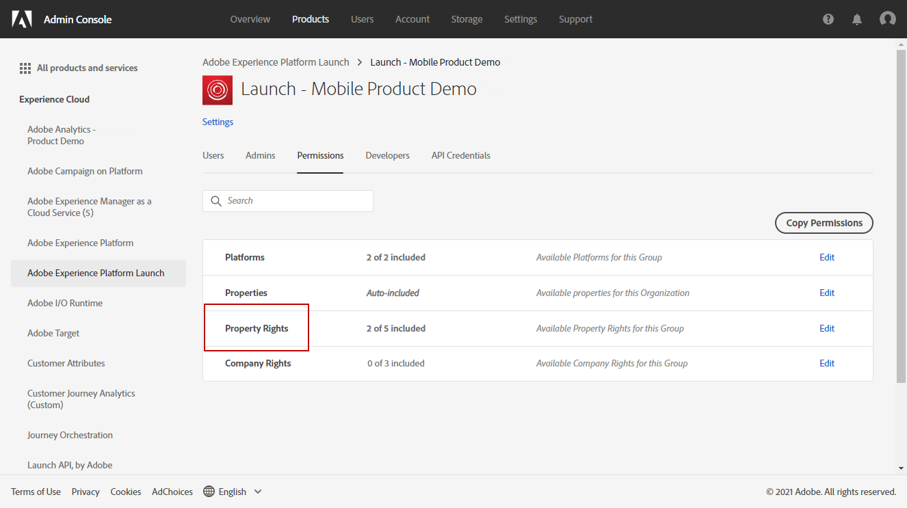
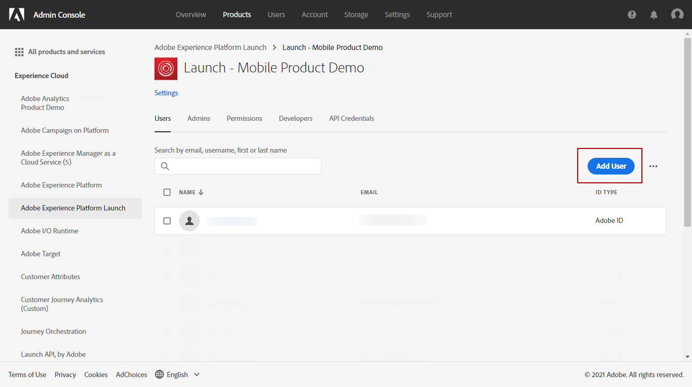
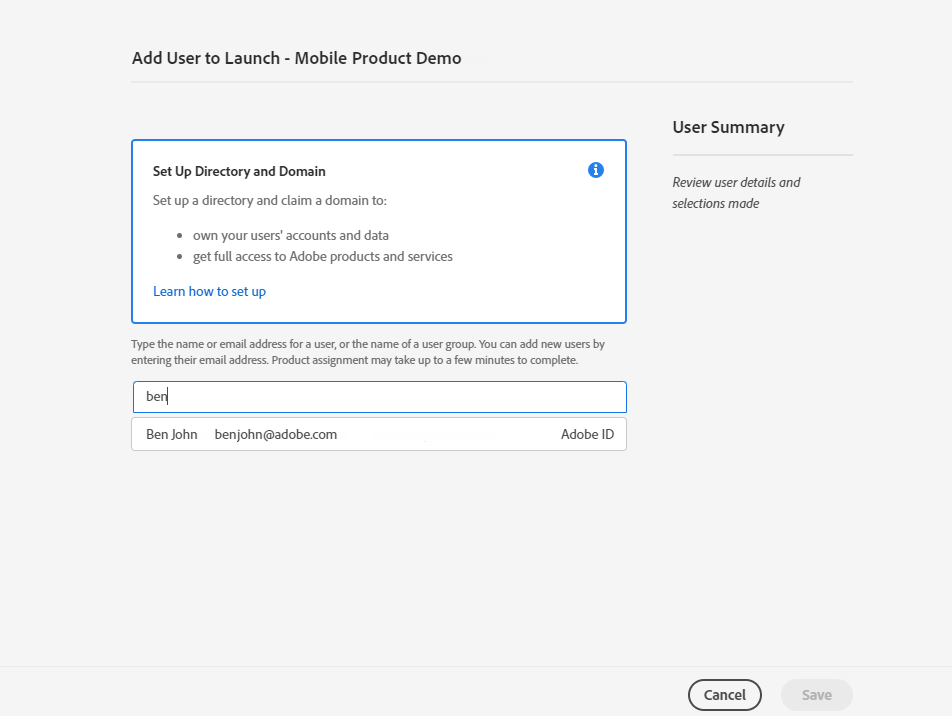
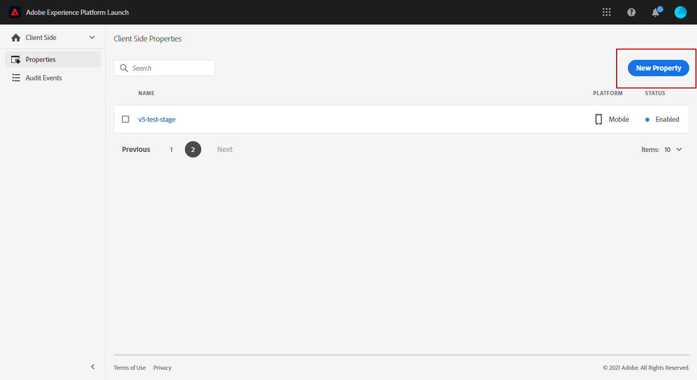
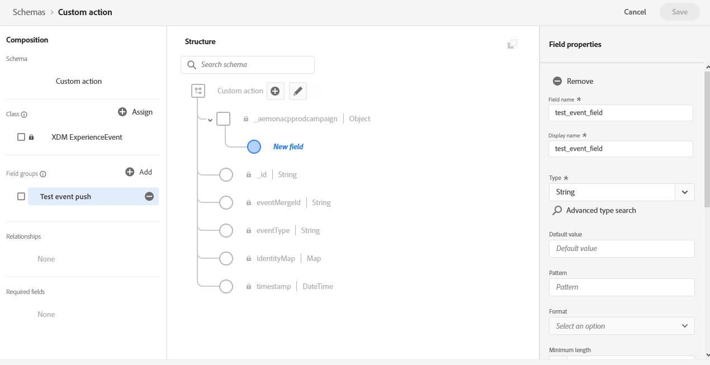

# Configure push notification channel {#push-notification-configuration}

[!DNL Journey Optimizer] allows you to create your journeys and send messages to targeted audience. Before beginning to send push notifications with [!DNL Journey Optimizer], you need to ensure configurations and integrations are in place on the mobile app and for tags in Adobe Experience Platform. To understand the Push Notifications data flow in [!DNL Adobe Journey Optimizer] please refer to [this page](push-gs.md). 

## Before starting {#before-starting}

<!--
### Check provisioning

Your Adobe Experience Platform account must be provisioned to contain following schemas and datasets for push notification data flow to function correctly:

| Schema <br>Dataset                                                                       | Group of fields                                                                                                                                                                         | Operation                                                |
| -------------------------------------------------------------------------------------- | --------------------------------------------------------------------------------------------------------------------------------------------------------------------------------------- | -------------------------------------------------------- |
| CJM Push Profile Schema <br>CJM Push Profile Dataset                                     | Push Notification Details<br>Adobe CJM ExperienceEvent - Message Profile Details<br>Adobe CJM ExperienceEvent - Message Execution Details<br>Application Details<br>Environment Details | Register Push Token                                      |
| CJM Push Tracking Experience Event Schema<br>CJM Push Tracking Experience Event Dataset | Push Notification Tracking                                                                                                                                                              | Track interactions and provide data for the reporting UI |
-->

### Set up permissions {#setup-permissions}

Before creating a mobile application, you first need to make sure that you have or assign the correct user permissions for tags in Adobe Experience Platform. Learn more in [Tags documentation](https://experienceleague.adobe.com/docs/experience-platform/tags/admin/user-permissions.html){target="_blank"}.

>[!CAUTION]
>
>Push configuration must be performed by an expert user. Depending on your implementation model and personas involved in this implementation, you might need to assign the full set of permissions to a single product profile or share permissions between the app developer and the **Adobe Journey Optimizer** administrator. Learn more about **Tags** permissions in [this documentation](https://experienceleague.adobe.com/docs/experience-platform/tags/admin/user-permissions.html#platform-launch-permissions){target="_blank"}.

<!--ou need to your have access to perform following roles :

* Manage Datastreams
* Manage Client-side Properties
* Manage App Configurations
-->

To assign **Property** and **Company** rights, follow the steps below:

1. Access the **[!DNL Admin Console]**.

1. From the **[!UICONTROL Products]** tab, select the **[!UICONTROL Adobe Experience Platform Launch]** card.

    

1. Select an existing **[!UICONTROL Product Profile]** or create a new one with the **[!UICONTROL New profile]** button. Learn how to create a new **[!UICONTROL New profile]** in the [Admin console documentation](https://experienceleague.adobe.com/docs/experience-platform/access-control/ui/create-profile.html#ui){target="_blank"}.

1. From the **[!UICONTROL Permissions]** tab, select **[!UICONTROL Property rights]**.

    

1. Click **[!UICONTROL Add all]**. This will add the following right to your product profile:
    * **[!UICONTROL Approve]**
    * **[!UICONTROL Develop]**
    * **[!UICONTROL Manage Environments]**
    * **[!UICONTROL Manage Extensions]**
    * **[!UICONTROL Publish]**

    These permissions are required to install and publish the Adobe Journey Optimizer extension and publish the app property in Adobe Experience Platform Mobile SDK.

1. Then, select **[!UICONTROL Company rights]** in the left-hand menu.

    

1. Add the following rights:

    * **[!UICONTROL Manage App Configurations]**
    * **[!UICONTROL Manage Properties]**

    These permissions are required for the mobile app developer to set up push credentials in **Adobe Experience Launch** and define Push Notification presets in **Adobe Journey Optimizer**.

    

1. Click **[!UICONTROL Save]**.

To assign this **[!UICONTROL Product profile]** to users, follow the steps below:

1. Access the **[!DNL Admin Console]**.

1. From the **[!UICONTROL Products]** tab, select the **[!UICONTROL Adobe Experience Platform Launch]** card.

1. Select your previously configured **[!UICONTROL Product profile]**.

1. From the **[!UICONTROL Users]** tab, click **[!UICONTROL Add user]**.

    

1. Type in your user's name or email address and select the user. Then, click **[!UICONTROL Save]**.

   >[!NOTE]
   >
   >If the user was not previously created in the Admin console, refer to the [Add users documentation](https://helpx.adobe.com/enterprise/admin-guide.html/enterprise/using/manage-users-individually.ug.html#add-users).

    

### Configure your app {#configure-app}

The technical setup involves close collaboration between the app developer and business administrator. Before starting sending push notifications with [!DNL Journey Optimizer], you need to define settings in [!DNL Adobe Experience Platform Data Collection] and integrate your mobile app with Adobe Experience Platform Mobile SDKs. 

Follow implementation steps detailed in the links below:

* For **Apple iOS**: Learn how to register your app with APNs in [Apple Documentation](https://developer.apple.com/documentation/usernotifications/registering_your_app_with_apns){target="_blank"}
* For **Google Android**: Learn how to setup up a Firebase Cloud Messaging client app on Android in [Google Documentation](https://firebase.google.com/docs/cloud-messaging/android/client){target="_blank"}

### Integrate your mobile app with Adobe Experience Platform SDK {#integrate-mobile-app}

Adobe Experience Platform Mobile SDK provides client-side integration APIs for your mobiles via Android and iOS compatible SDKs. Follow [Adobe Experience Platform Mobile SDK documentation](https://aep-sdks.gitbook.io/docs/getting-started/overview){target="_blank"} to get setup with Adobe Experience Platform Mobile SDKs in your app.

By the end of this, you should have also created and configured a mobile property in [!DNL Adobe Experience Platform Data Collection]. You will typically create a mobile property for each mobile application you want to manage. Learn how to create and configure a mobile property in [Adobe Experience Platform Mobile SDK documentation](https://aep-sdks.gitbook.io/docs/getting-started/create-a-mobile-property){target="_blank"}.


## Step 1: Add your app push credentials in Adobe Experience Platform Data Collection {#push-credentials-launch}

After granting the correct user permissions, you now need to add your mobile application push credentials in [!DNL Adobe Experience Platform Data Collection]. 

The mobile app push credential registration is required to authorize Adobe to send push notifications on your behalf. Refer to the steps detailed below:

1. From [!DNL Adobe Experience Platform Data Collection], select the **[!UICONTROL App Surfaces]** tab in the left-hand panel.

1. Click **[!UICONTROL Create App Surfaces]** to create a new configuration.

    

1. Enter a **[!UICONTROL Name]** for the configuration.

1. From **[!UICONTROL Mobile Application Configuration]**, select the Operational system:

    * **For iOS**

        

        1. Enter the mobile app **Bundle Id** in the **[!UICONTROL App ID (iOS Bundle ID)]** field. The app Bundle ID can be found in the **General** tab of the primary target in **XCode**.
        
        1. Switched on the **[!UICONTROL Push Credentials]** button to add your credentials.
        
        1. Drag and drop your .p8 Apple Push Notification Authentication Key file. This key can be acquired from the **Certificates**, **Identifiers** and **Profiles** page.

        1. Provide the **Key ID**. This is a 10 character string assigned during the creation of p8 auth key. It can be found under **Keys** tab in **Certificates**, **Identifiers** and **Profiles** page.
        
        1. Provide the **Team ID**. This is a string value which can be found under the Membership tab.

    * **For Android**

        

        1. Provide the **[!UICONTROL App ID (Android package name)]**: usually the package name is the app id in your `build.gradle` file.

        1. Switched on the **[!UICONTROL Push Credentials]** button to add your credentials.

        1. Drag and drop the FCM push credentials. For more details on how to get the push credentials refer to [Google Documentation](https://firebase.google.com/docs/admin/setup#initialize-sdk){target="_blank"}.
    

1. Click **[!UICONTROL Save]** to create your app configuration.

<!--
## Step 2: Set up a mobile property in Adobe Experience Platform Launch {#launch-property}

Setting up a mobile property allows the mobile app developer or marketer to configure the mobile SDKs attributes such as Session Timeouts, the [!DNL Adobe Experience Platform] sandbox to be targeted and the **[!UICONTROL Adobe Experience Platform Datasets]** to be used for mobile SDK to send data to.

For further details and procedures on how to set up a **[!UICONTROL Platform Launch property]**, refer to the steps detailed in [Adobe Experience Platform Mobile SDK documentation](https://aep-sdks.gitbook.io/docs/getting-started/create-a-mobile-property#create-a-mobile-property).


To get the SDKs needed for push notification to work you will need the following SDK extensions, for both Android and iOS:

* **[!UICONTROL Mobile Core]** (installed automatically)
* **[!UICONTROL Profile]** (installed automatically)
* **[!UICONTROL Adobe Experience Platform Edge]**
* **[!UICONTROL Adobe Experience Platform Assurance]**, optional but recommended to debug the mobile implementation.

Learn more about [!DNL Adobe Experience Platform Launch] extensions in [Adobe Experience Platform Launch documentation](https://experienceleague.adobe.com/docs/launch-learn/implementing-in-mobile-android-apps-with-launch/configure-launch/launch-add-extensions.html).
-->

## Step 2: Configure Adobe Journey Optimizer Extension in your mobile property {#configure-journey-optimizer-extension}

The **Adobe Journey Optimizer extension** for Adobe Experience Platform Mobile SDKs powers push notifications for your mobile apps and helps you collects user push tokens and manages interaction measurement with Adobe Experience Platform services.

Learn how to setup Journey Optimizer extension in [Adobe Experience Platform Mobile SDK documentation](https://aep-sdks.gitbook.io/docs/using-mobile-extensions/adobe-journey-optimizer){target="_blank"}.


<!-- 
**[!UICONTROL Edge configuration]** is used by **[!UICONTROL Edge]** extension to send custom data from mobile device to [!DNL Adobe Experience Platform]. 
To configure [!DNL Adobe Experience Platform], you must provide the **[!UICONTROL Sandbox]** name and **[!UICONTROL Event Dataset]**.

For further details and procedures on how to create **[!UICONTROL Edge configuration]**, refer to the steps detailed in [Adobe Experience Platform Mobile SDK documentation](https://aep-sdks.gitbook.io/docs/getting-started/configure-datastreams).

1. From [!DNL Adobe Experience Platform Launch], select the **[!UICONTROL Edge Configurations]** tab and click **[!UICONTROL Edge Configurations]**.
    
1. Select **[!UICONTROL New Edge Configuration]** to add a new **[!UICONTROL Edge Configuration]**.
1. Enter a **[!UICONTROL Name]** and click **[!UICONTROL Save]**

1. Click the **[!UICONTROL Adobe Experience Platform]** toggle to enable it.

1. Fill in the **[!UICONTROL Sandbox]**, **[!UICONTROL Event dataset]** and **[!UICONTROL Profile Dataset]** fields. Then, click **[!UICONTROL Save]**.
    
    


1. From [!DNL Adobe Experience Platform Launch], ensure that **[!UICONTROL Client Side]** is selected in the drop-down menu.

1. select the **[!UICONTROL Properties]** tab and click **[!UICONTROL New Property]**.

    

1. Enter a **[!UICONTROL Name]** for your new property.

1. Select **[!UICONTROL Mobile]** as **[!UICONTROL Platform]**.

    

1. Click **[!UICONTROL Save]** to create your new property.

To configure **[!UICONTROL Adobe Experience Platform Edge Extension]** to send custom data from mobile devices to [!DNL Adobe Experience Platform].

1. Select your previously created property and select the **[!UICONTROL Extensions]** tab to view the extensions for this property.

    

1. Click **[!UICONTROL Configure]** under the **[!UICONTROL Adobe Experience Platform Edge]** Network' extension.

1. From the **[!UICONTROL Edge Configuration]** drop-down list, select the **[!UICONTROL Edge Configuration]** created in the previous steps. For more information on **[!UICONTROL Edge Configuration]**, refer to this [section](#edge-configuration).

1. Click **[!UICONTROL Save]**.

To configure **[!UICONTROL Adobe Experience Platform Messaging]** extension to send push profile and push interactions to the correct datasets, follow the same steps as above. Use **[!UICONTROL Sandbox]**, **[!UICONTROL Event dataset]** and **[!UICONTROL Profile Dataset]** created in the [Adobe Experience Platform setup](#edge-configuration).
-->

<!--
## Step 4: Publish the Property {#publish-property}

You now need to publish the property to integrate your configuration and to use it in the mobile app. 

To publish your property, refer to the steps detailed in [Adobe Experience Platform Mobile SDK documentation](https://aep-sdks.gitbook.io/docs/getting-started/create-a-mobile-property#publish-the-configuration)

## Step 5: Configure the ProfileDataSource {#configure-profiledatasource}

To configure the `ProfileDataSource`, use the `ProfileDCInletURL` from [!DNL Adobe Experience Platform] setup and add the following in the mobile app:

```
    MobileCore.updateConfiguration(
    mutableMapOf("messaging.dccs" to <ProfileDCSInletURL>)
```

-->

## Step 3: Test your mobile app with an event {#mobile-app-test}

After configuring your mobile app in both Adobe Experience Platform and in [!DNL Adobe Experience Platform Data Collection], you can now test it before sending push notifications to your profiles. In this use case, we will create a journey to target our mobile app and set an event which will trigger the push notification.

<!--
You can use a test mobile app for this use case. For more on this, refer to this [page](https://wiki.corp.adobe.com/pages/viewpage.action?spaceKey=CJM&title=Details+of+setting+the+mobile+test+app) (internal use only).
-->

For this journey to work, you need to create an XDM schema. For more information, refer to [XDM documentation](https://experienceleague.adobe.com/docs/experience-platform/xdm/schema/composition.html#schemas-and-data-ingestion){target="_blank"}.

1. In the left menu, browse to **[!UICONTROL Schemas]**.

1. Click **[!UICONTROL Create schema]** then select **[!UICONTROL XDM ExperienceEvent]**.

    

1. Select **[!UICONTROL Create a new field group]**. 

1. Enter a **[!UICONTROL Display Name]** and a **[!UICONTROL Description]**. Click **[!UICONTROL Add field groups]** when done. For more information on how to create field groups, refer to [XDM System documentation](https://experienceleague.adobe.com/docs/experience-platform/xdm/tutorials/create-schema-ui.html){target="_blank"}.


    

1. On the left side, select the schema. In the right pane, enter the name of your schema and description. Enable this schema for **[!UICONTROL Profile]**.

    


1. On the left side, select the field group, then click the + icon to create a new field. In the **[!UICONTROL Field groups properties]**, on the right side, type in a **[!UICONTROL Field name]**, **[!UICONTROL Display name]** and select **[!UICONTROL String]** as **[!UICONTROL Type]**.

    

1. Check **[!UICONTROL Required]** and click **[!UICONTROL Apply]**.

1. Click **[!UICONTROL Save]**. Your schema is now created and can be used in an event.

You then need to set up an event.

1. From the left menu of the home page, under ADMINISTRATION, select **[!UICONTROL Configurations]**. The click **[!UICONTROL Manage]** in the **[!UICONTROL Events]** section to create your new event.

1. Click **[!UICONTROL Create Event]**, the event configuration pane opens on the right side of the screen.

    

1. Enter the name of your event. You can also add a description.

1. In the **[!UICONTROL Event ID type]** field, select **[!UICONTROL Rule Based]**.

1. In the **[!UICONTROL Parameters]**, select your previously created schema.

    

1. In the list of fields, check that the field created in the schema field group is selected.

    

1. Click **[!UICONTROL Edit]** in the **[!UICONTROL Event ID condition]** field. Drag and drop your previously added field to define the condition that will be used by the system to identify the events that will trigger your journey.

    

1. Type in the syntax that you will need to use to trigger your push notification in your test app, in this example **order confirmation**.

    

1. Select **[!UICONTROL ECID]** as your **[!UICONTROL Namespace]**.

1. Click **[!UICONTROL Ok]** then **[!UICONTROL Save]**.

Your event is now created and can now be used in a journey.

1. In the left menu, click **[!UICONTROL Journeys]**.

1. Click **[!UICONTROL Create Journey]** to create a new journey.

1. Edit the journey's properties in the configuration pane displayed on the right side. Learn more in this [section](building-journeys/journey-gs.md#change-properties).

1. Start by drag and dropping the event created in the previous steps from the **[!UICONTROL Events]** drop-down.

    

1. From the **[!UICONTROL Actions]** drop-down, drag and drop a **[!UICONTROL Message]** activity to your journey.

1. Select a previously created message. For more information on how to create push notifications, refer to this [page](create-message.md).

1. Drag and drop an **[!UICONTROL End]** activity to your journey.

1. Click the **[!UICONTROL Test]** toggle to start testing your push notifications and click **[!UICONTROL Trigger an event]**.

    

1. Enter your ECID in the **[!UICONTROL Key]** field then type in **order confirmation** in the second field.

    

1. Click **[!UICONTROL Send]**.

Your event will be triggered and you will receive your push notification to your mobile app.

## Step 4: Create a message preset for push{#message-preset}

Once your mobile app has been set up in in [!DNL Adobe Experience Platform Data Collection], you need to create a message preset to be able to send push notifications from **[!DNL Journey Optimizer]**.

Learn how to create and configure a message preset in [this section](configuration/message-presets.md).

You are now ready to send push notifications with Journey Optimizer.

* Learn how to create a push message in [this page](create-push.md).
* Learn how to send add a message in a journey in [this section](building-journeys/journeys-message.md).
