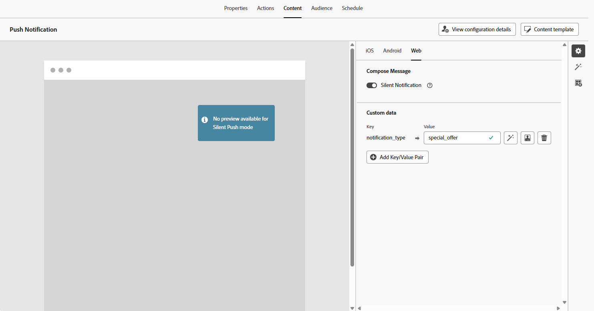
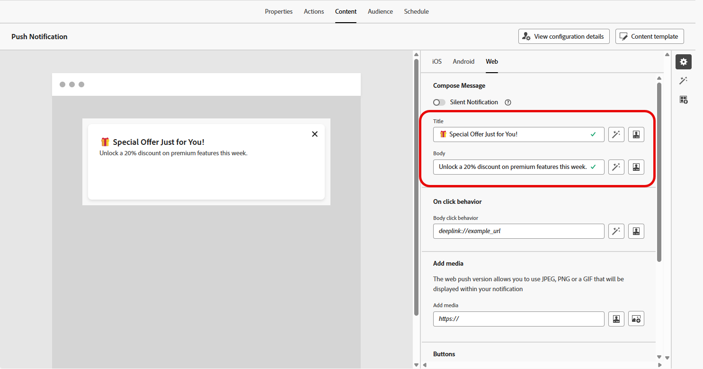
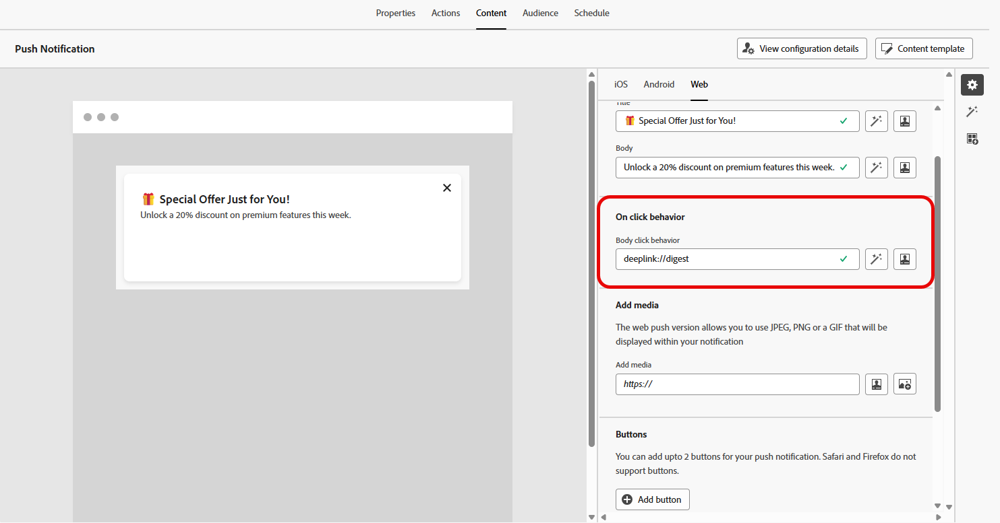
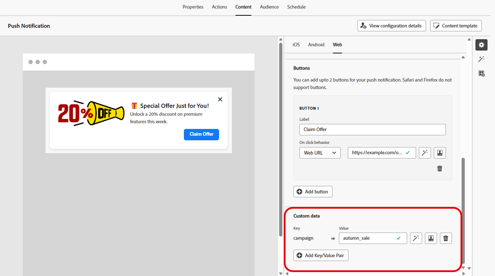

# Design a web push notification {#design-push-notification}

>[!AVAILABILITY]
>
>Currently, Web push notifications in Journey Optimizer do not support the **Silent Notification** feature, but will be available at a later time.

After creating your Web push notification campaign or journey, you can proceed to design its content and structure according to your requirements. Note that before sending any Web push notification, it is necessary to first configure this channel within your [Channel configuration](push-configuration-web.md).

<!--
## Send a silent notification {#silent-notification}

A silent push notification (also called a background notification) is a hidden message sent to your web application without alerting the user.

To enable a silent notification, enable the **[!UICONTROL Silent Notification]** option. When this option is used, the notification is delivered directly to the application, and no alert, banner, or sound is shown to the user.

Use the **Custom Data** section to include additional information in the form of key-value pairs. 

-->

## Title and Body {#push-title-body}

To compose your message, click the **[!UICONTROL Title]** and **[!UICONTROL Body]** fields. Use the personalization editor to define content, [personalize data](../personalization/personalize.md) and add [dynamic content](../personalization/get-started-dynamic-content.md).
    
Click **[!UICONTROL Edit text with the AI assistant]** to easily generate your content using Journey Optimizer AI assistant.

## On click behavior {#on-click-behavior}

Use the **[!UICONTROL Body click behavior]** field to define a deep link that determines what happens when a user clicks on the notification body. This allows you to send users directly to a specific page or section of your web application.

## Add media {#add-media-push}

Enter the media URL in the **[!UICONTROL Add media]** field. You can also include personalization tokens in the URL to customize the content for each user.

Click  to quickly generate media using the Journey Optimizer AI Assistant.

## Add buttons {#add-buttons-push}

Make your web push notifications interactive by adding buttons to your content.

Note that buttons are only visible when the device is unlocked. If the screen is locked, only the **[!UICONTROL Title]** and **[!UICONTROL Message]** will be shown.

Use the **[!UICONTROL Add Button]** option to define each button's label and associated action, as detailed below:

* **[!UICONTROL Deeplink]**: Redirect users to a specific view, section, or tab within your app. Enter the deeplink URL in the associated field.

* **[!UICONTROL Web URL]**: Redirect users to an external webpage. Enter the URL in the associated field.

## Custom data {#custom-data}

In the **[!UICONTROL Custom Data]** section, you can add custom key-value pairs to the notification payload. These values can be used by your web application to trigger specific actions or customize the user experience. For more on how to set up push notifications in Adobe Experience Platform, refer to [this section](push-gs.md)

