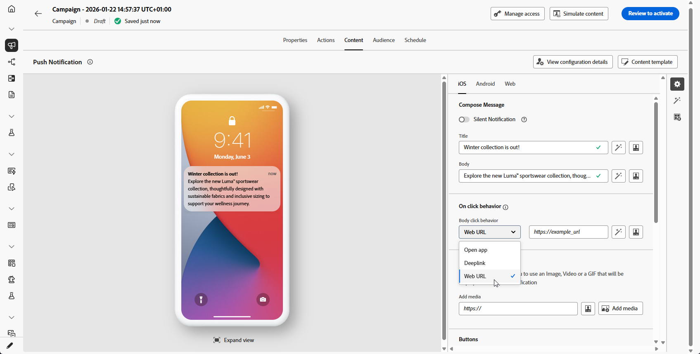
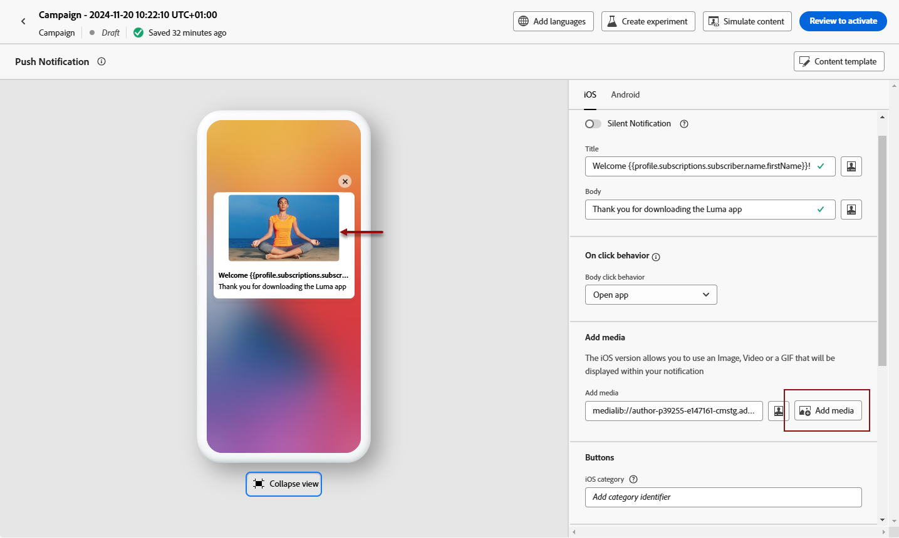
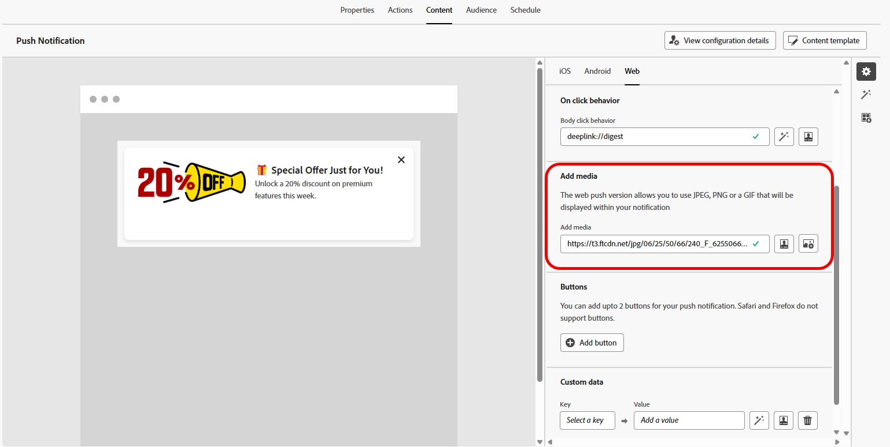
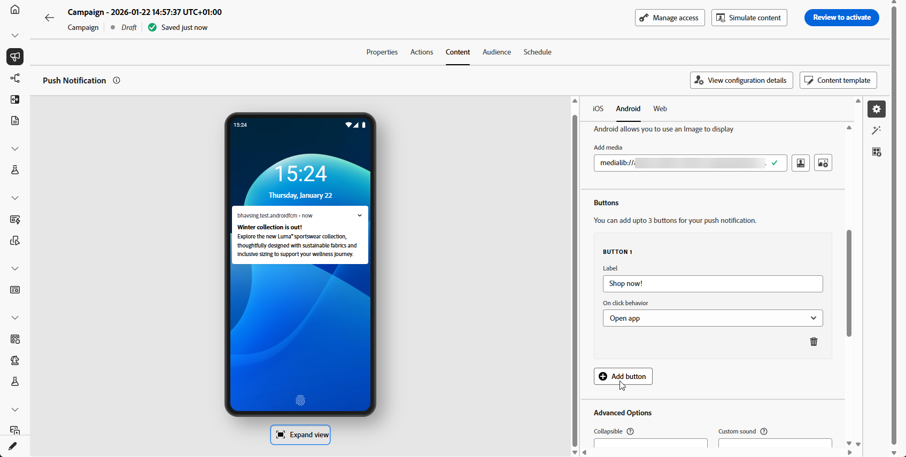

# Design a push notification {#design-push-notification}

Once you have created a push notification, you can design its content for iOS, Android, and Web platforms. This page guides you through composing your message, configuring on-click behavior, adding media and buttons, and setting advanced options to create engaging push notifications that resonate with your audience.

## Title and Body {#push-title-body}

>[!CONTEXTUALHELP]
>id="ajo-message-push-compose"
>title="Personalize your push notification."
>abstract="To compose your message, enter the content in the **Title** and **Body** fields. To include personalization tokens, open the personalization dialog."

To compose your message, click the **[!UICONTROL Title]** and **[!UICONTROL Body]** fields. Use the personalization editor to define content, personalize data and add dynamic content. Learn more about [personalization](../personalization/personalize.md) and [dynamic content](../personalization/get-started-dynamic-content.md) in the personalization editor.
    
Use the device preview section to visualize how the push notification displays on iOS, Android, and Web.

Accelerate your content creation with AI Assistant and generate compelling push notification text with [AI Assistant for text generation](../content-management/generative-text.md) or create complete push notifications with [AI Assistant for full content generation](../content-management/generative-full-content.md).

## On click behavior {#on-click-behavior}

>[!CONTEXTUALHELP]
>id="ajo-message-push-onclick"
>title="About on click behavior"
>abstract="Select the behavior when a recipient clicks on the body of the push notification."

Configure the action that occurs when recipients tap the body of your push notification. Choose from the following options:

* **[!UICONTROL Open app]**: Launches the application associated with the notification. The app is specified in your [channel configuration](../configuration/channel-surfaces.md) (i.e. message preset).
* **[!UICONTROL Deeplink]**: Directs users to specific content within your app, such as a particular view, page section, or tab. Enter the deeplink URL in the provided field.
* **[!UICONTROL Web URL]**: Directs users to an external webpage. Enter the destination URL in the provided field.

    >[!NOTE]
    >
    >If your push notification contains a URL that is configured as a universal link in iOS, the push will open the associated app if installed, regardless of your chosen **[!UICONTROL Web URL]** action. To force a browser open, use a domain not configured for universal links, or remove universal link registration for the domain.
    >For more information on how the Adobe SDK handles deep links and universal links, refer to the [Adobe Experience Platform Mobile SDK documentation](https://developer.adobe.com/client-sdks/documentation/adobe-journey-optimizer/push-notifications/){target="_blank"}.

## Add media {#add-media-push}

>[!CONTEXTUALHELP]
>id="ajo-message-push-media"
>title="Add media to your push notification"
>abstract="You can add an image, a video or a GIF that are displayed within your notification."

Enhance your push notification by adding visual media. The available media types and implementation methods vary by operating system, as detailed in the tabs below.

>[!BEGINTABS]

>[!TAB Android]

For Android, you can only add an image icon, and an image for expanded notifications. 

You can add media using either of the following methods:

* **[!UICONTROL Add media]** button: Select an asset from [Adobe Experience Manager Assets](../integrations/assets.md) or access the AI Assistant to generate [engaging images](../content-management/generative-image.md) for push notifications. 
    
* **[!UICONTROL Add media]** field: Enter the media URL directly. You can include personalization tokens in the URL.

Once added, the media displays on the right of the notification body.

>[!NOTE]
>
>When including media attachments in the push notification payload (such as images in custom data fields like `adb_media`), your mobile application must implement specific client-side handling for the images to render on devices. Your app must implement the [automatic display and tracking workflow](https://developer.adobe.com/client-sdks/edge/adobe-journey-optimizer/push-notification/android/automatic-display-and-tracking/){target="_blank"} to handle image attachments from the payload. 

>[!TAB iOS]

For iOS, you can add an image, video, or GIF to display within your notification.

You can add media using either of the following methods:

* **[!UICONTROL Add media]** button: Select an asset from **[!DNL Adobe Experience Manager Assets]**. Learn more about using **[!DNL Adobe Experience Manager Assets]** in [this page](../integrations/assets.md).
    
* **[!UICONTROL Add media]** field: Enter the media URL directly. You can include personalization tokens in the URL.

Once added, the media displays on the right of the notification body.

>[!NOTE]
>
>When including media attachments in the push notification payload (such as images in custom data fields like `adb_media`), your mobile application must implement specific client-side handling for the images to render on devices. Your app must implement a [Notification Service Extension](https://developer.apple.com/documentation/usernotifications/modifying_content_in_newly_delivered_notifications){target="_blank"} to download and process media content from the payload. Additionally, the **[!UICONTROL Add mutable-content flag]** option must be enabled in the [Advanced options](#advanced-options-push) section. 

>[!TAB Web]

Enter the media URL in the **[!UICONTROL Add media]** field. You can also include personalization tokens in the URL to customize the content for each user.

Click  to quickly generate media using the Journey Optimizer AI Assistant.

>[!ENDTABS]

## Add buttons {#add-buttons-push}

>[!CONTEXTUALHELP]
>id="ajo-message-push-buttons"
>title="Add buttons for users to interact with your push notification."
>abstract="From this section, add call-to-action buttons to your message. For Apple iOS, specify a notification category identifier. For Google Android, you can include custom text and targets for each button."

Create an actionable notification by adding buttons to your push content. Browse the tabs below based on your operating system.

If the device screen is locked, these buttons are not displayed: only then the **Title** and the **Message** of the notification are visible. If their device is unlocked, recipients will see the buttons.

>[!BEGINTABS]

>[!TAB Android]

For Android, you can add up to three buttons.

1. Use the **[!UICONTROL Add button]** to define settings: the label and associated action. Possible actions are the same as for [on-click behavior](#on-click-behavior). 

    

1. Use the **[!UICONTROL Expand view]** icon under the central preview image to preview your personalized buttons.

>[!TAB iOS]

For iOS, a notification category identifier is specified. Notification categories need to be preconfigured in the iOS app which will define the buttons to be displayed and actions taken. See the [Apple documentation](https://developer.apple.com/documentation/usernotifications/declaring_your_actionable_notification_types) for more details.

>[!TAB Web]

Use the **[!UICONTROL Add Button]** option to define each button's label and associated action, as detailed below:

* **[!UICONTROL Deeplink]**: Redirect users to a specific view, section, or tab within your app. Enter the deeplink URL in the associated field.

* **[!UICONTROL Web URL]**: Redirect users to an external webpage. Enter the URL in the associated field.

>[!ENDTABS]

## Send a silent notification {#silent-notification}

>[!CONTEXTUALHELP]
>id="ajo_message_push_silent_notification"
>title="About silent notification"
>abstract="Send notifications without disturbing the user, notifications are not shown in the notification center or notification bar."

>[!AVAILABILITY]
>
>Web push notifications in Journey Optimizer do not support the **Silent Notification** feature.

A silent push notification (or background notification) is a hidden instruction that is delivered to the application. It is used for example to notify your application about the availability of new content or initiate a download in the background.

Select the **[!UICONTROL Silent Notification]** option to silently notify the application: in this case, the notification is transferred directly to the application. No alert is displayed on the device screen.

Use the **[!UICONTROL Custom data]** section to add key-value pairs.

## Custom data {#custom-data}

>[!CONTEXTUALHELP]
>id="ajo-message-push-custom"
>title="Configure custom data for your push notification."
>abstract="Add custom variables to the payload, depending on your mobile application configuration."

In the **[!UICONTROL Custom data]** section, you can add custom variables to the payload, depending on your mobile application configuration. For more on how to set up push notifications in Adobe Experience Platform, refer to [this section](push-gs.md)

## Personalize with Decisioning {#decisioning-push}

You can personalize and optimize the content of your push notifications with **Decisioning**. This capability allows you to use Priority Scores, Formulas, or AI Models to dynamically select and display the best content to your customers.

For more information on how to create and use decision policies in push notifications, refer to [this section](../experience-decisioning/create-decision.md).

## Advanced options {#advanced-options-push}

>[!CONTEXTUALHELP]
>id="ajo-message-push-advanced"
>title="Configure Advanced options for your push notification."
>abstract="This section empowers you to enhance the personalization of your push notification."

You can configure **[!UICONTROL Advanced options]** for your push notification. Available parameters are listed below:

|Parameter | Description |
|---------|---------|
|**[!UICONTROL Collapsible]** (iOS / Android) | A collapsible message is a message that may be replaced by a new message if it has become outdated. A common use cases of collapsible messages are messages used to tell a mobile app to sync data from the server. An example would be a sports app that updates users with the latest score. Only the most recent message is relevant. On the other hand, with non-collapsible message, every message is important to the client app and needs to be delivered. |
|**[!UICONTROL Custom sound]** (iOS / Android) | The sound to be played by the mobile terminal when the notification is received. The sound needs to be bundled in the app.|
|**[!UICONTROL Badges]** (iOS / Android) | A badge is used to display directly on the application icon the number of new unread information.  The badge value will disappear as soon as the user opens or reads the new content from the application. When a notification is received on a device, it can refresh or add a badge value for the related app. For example, if you are storing the number of unread articles of your customers, you can leverage personalization to send the unique unread articles badge value for each customer. For more personalization, refer to [this section](../personalization/personalize.md).|
|**[!UICONTROL Notification group]**  (iOS only) | Associate a notification group to the push notification. Starting with iOS 12, notification groups allow you to consolidate message threads and notification topics into thread IDs. For example, a brand might send marketing notifications under one group ID, while keeping more operational type notifications under one or more different IDs. To illustrate this, you can have groupID: 123 "check out the new spring collection of sweaters" and groupID: 456 "your package was delivered" notification groups. In this example, all delivery notifications would be bundled under group ID: 456.|
|**[!UICONTROL Notification channel]** (Android only) | Associate a notification channel to the push notification. Starting in Android 8.0 (API level 26), all notifications must be assigned to a channel in order to display. For more on this, refer to the [Android developer documentation](https://developer.android.com/guide/topics/ui/notifiers/notifications#ManageChannels).|
|**[!UICONTROL Add content-availability flag]** (iOS only) | Sends the content available flag in the push payload to ensure that the app is woken up as soon as it receives the push notification, meaning that the app will be able to access the payload data.  This works even if the app is running in the background and without needing any user interaction (e.g. tapping on Push notification). However, this does not apply if the app is not running. For more on this, refer to the [Apple developer documentation](https://developer.apple.com/library/content/documentation/NetworkingInternet/Conceptual/RemoteNotificationsPG/CreatingtheNotificationPayload.html). |
|**[!UICONTROL Add mutable-content flag]** (iOS only) | Sends the mutable-content flag in the push payload and will allow the push notification content to be modified by a notification service application extension provided in iOS SDK. For more on this, refer to [Apple developer documentation](https://developer.apple.com/library/content/documentation/NetworkingInternet/Conceptual/RemoteNotificationsPG/ModifyingNotifications.html). You can then leverage your mobile app extensions to further modify the content or presentation of arriving push notifications sent from [!DNL Journey Optimizer]. For example, users can leverage this option to decrypt data, change the body or title text of a notification, add a thread identifier to a notification etc. **Important**: This flag must be enabled when including media attachments (images, videos) via payload fields (such as `adb_media`) for them to render on iOS devices. Your app must also implement a Notification Service Extension to download and process the media content from the payload.|
|**[!UICONTROL Add Push expiration]** (iOS only) | Choose the **Date and Time** of your Push expiration. On iOS, notification expiration is enforced as a hard stop, meaning any message that reaches Apple Push Notification Service (APNS) after its expiration time is not delivered, ensuring customers never receive outdated or irrelevant notifications. For more on this, refer to the [Apple developer documentation](https://developer.apple.com/documentation/usernotifications/sending-notification-requests-to-apns).|
|**[!UICONTROL Notification visibility]** (Android only) | Defines the push notification's visibility.  <b>Private</b> will show the notification on all lockscreens, but conceal sensitive or private information on secure lockscreens.  <b>Public</b> will show the notification in its entirety on all lockscreens.  <b>Secret</b> will not reveal any part of the notification on a secure lockscreen.  For more on this, refer the [Android developer documentation](https://developer.android.com/reference/android/app/Notification).|
|**[!UICONTROL Notification priority]** (Android only) | Defines the push notification's importance from Low to Max. This determines how "intrusive" the push notification will be when it is delivered. For more on this, refer to the [Android developer documentation](https://developer.android.com/guide/topics/ui/notifiers/notifications#importance)|
|**[!UICONTROL Delivery priority]** (Android only) | Sets up a high or normal priority for your push notifications. For more information on message priority, refer to the [Google developer documentation](https://firebase.google.com/docs/cloud-messaging/concept-options#setting-the-priority-of-a-message).|
|**[!UICONTROL Time to live]** (Android only) | Set the number of seconds after which your message will expire. On Android, expiration is treated as a delivery window: Firebase Cloud Messaging (FCM) converts the expiration time into a time-to-live (TTL) value starting when the message is received, which means undelivered campaigns may be sent later than expected or even outside the desired timeframe. For more on this, refer the [Android developer documentation](https://firebase.google.com/docs/cloud-messaging/concept-options#ttl).|
