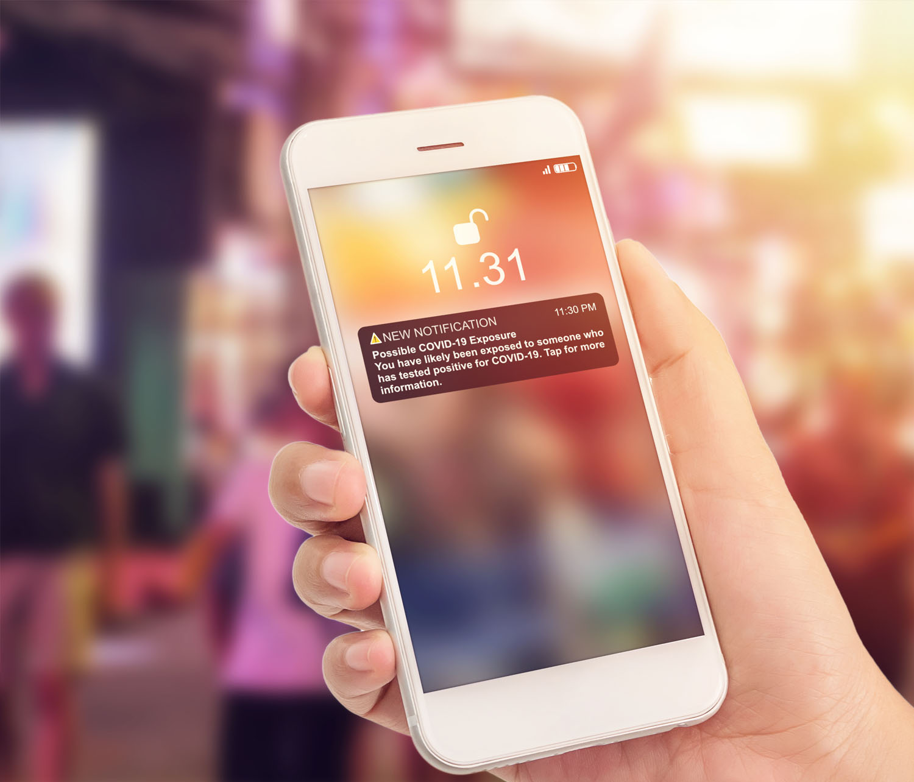

# Get started with push notification {#gs-push-notification}

>[!BEGINSHADEBOX]

**On this page:** Get started with push notifications in Adobe Journey Optimizer to reach your mobile app users and web visitors through journeys and campaigns.

>[!ENDSHADEBOX]

>[!IMPORTANT]
>
>If this is your first time creating an Push Notification, make sure the Push channel has been configured. [Learn more](push-gs.md).

Push notifications help you reach your mobile app users and web visitors at any time, especially when they are not actively using your app or browsing your website. Push notifications may help you achieve a variety of use cases such as providing updates about your service, ask a user to take action, alert the user to a new deal, etc. Device platforms require opt-in before end-users may receive or view your notifications. User opt-in may be received as early as after the app is launched for the first time post-install, or in a subsequent session or workflow as appropriate. 

[!DNL Journey Optimizer] supports push notifications and helps you send highly relevant notifications at industry-leading throughput rates. Push notifications may include personalization and Journey-based context in order to leverage data insights your brand has with [!DNL Adobe CX Enterprise].

Push notifications can be created:

* In a **Journey**: Once you added a Push activity in your journey, and defined basic settings, use the **[!UICONTROL Actions: Push]** right pane to create the content for the Push notifications. [Learn how to create a journey](../building-journeys/journey-gs.md)

* In a **Campaign**: Once you created a campaign, select Push notification as your action and define basic settings. Learn how to create [an action campaign](../campaigns/campaign-action.md#action-campaign-action) | [an API-triggered campaign](../campaigns/api-triggered-campaigns.md) | [an orchestrated campaign](../orchestrated/create-orchestrated-campaign.md#create)

Use the dedicated tabs to define the push notification settings for **iOS**, **Android**, and **Web** platforms.

>[!NOTE]
>
>While **[!DNL Journey Optimizer]** provides ways of managing opt-out in emails and SMS messages, push notifications do not require any action on your side, as recipients can unsubscribe through their devices themselves. For example, upon downloading or when using your app, they can select to stop notifications. Similarly, they can change the notification settings through the mobile operating system or web browser settings. To verify a profile's push consent status in the AEP profile viewer, see [Check push opt-out status](../privacy/opt-out.md#push-opt-out-status).

 

<table style="table-layout:fixed"><tr style="border: 0;">
<td>

<a href="create-push.md"><strong>Create a push notification</strong>

</td>
<td>

<a href="design-push.md"><strong>Design your push notification</strong></a>

</td>
<td>

<a href="send-push.md"><strong>Send your push notification</strong></a>

</td>
<td>

<a href="push-gs.md"><strong>Configure push notifications</strong></a>

</td>
</tr></table>

## Use cases

Push notifications work best when you need to reach users quickly and directly on their device, without relying on them to be inside your app or checking their inbox.

| Benefit | Why | Example use cases |
| --- | --- | --- |
| Time-sensitive updates | Delivered instantly, even when users are not actively using your app | Flight delay alerts, order status changes, breaking news |
| Re-engagement | Prompts users to return to your app after a period of inactivity | Cart abandonment reminders, win-back campaigns |
| Cost reduction vs. SMS | No per-message carrier fees, unlike SMS | High-volume promotional or transactional notifications |
| Rich, interactive content | Supports images, action buttons, and deep links | Product promotions with tap-to-buy buttons, rich media previews |
| Device-native capabilities | Leverages OS-level features not available to other channels | Vibration alerts, app icon badges, geofenced location triggers |
| High opt-in likelihood | Users are prompted to opt in as early as app install or first launch | Onboarding flows, day-one engagement campaigns |

## When not to use

Push notifications are not the right fit for every message. Consider another channel in the following situations:

* Your audience has low push opt-in rates or has shown resistance to notifications, since the message may never reach them
* The message requires long-form content, which email handles better and allows for more detailed formatting
* The content is sensitive or private and should not be visible on a lock screen, where anyone near the device could see it
* Most of your users access your service from desktop rather than a mobile app, where push notifications have limited or no reach

