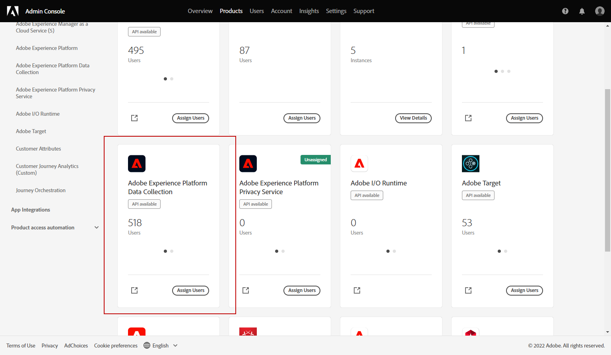
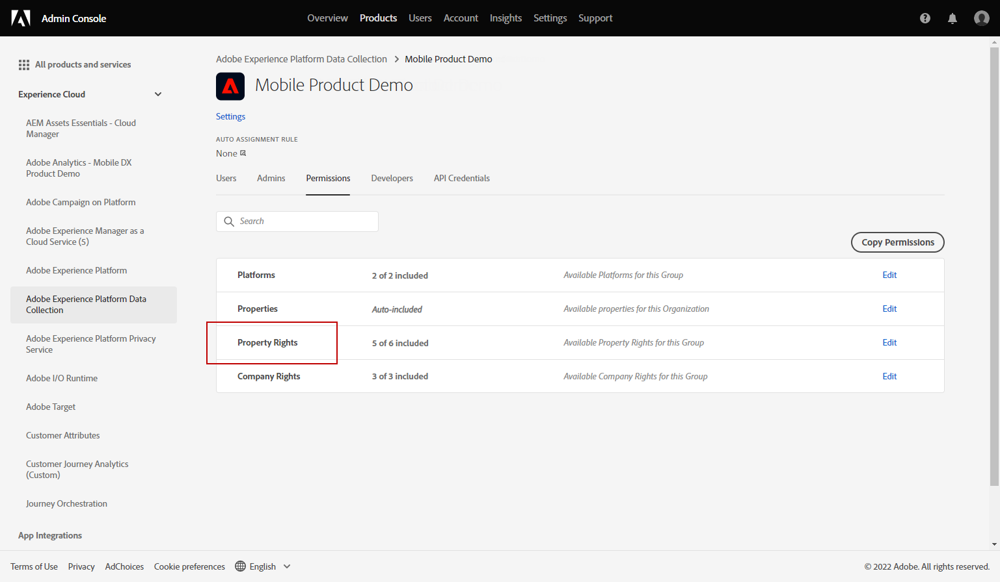
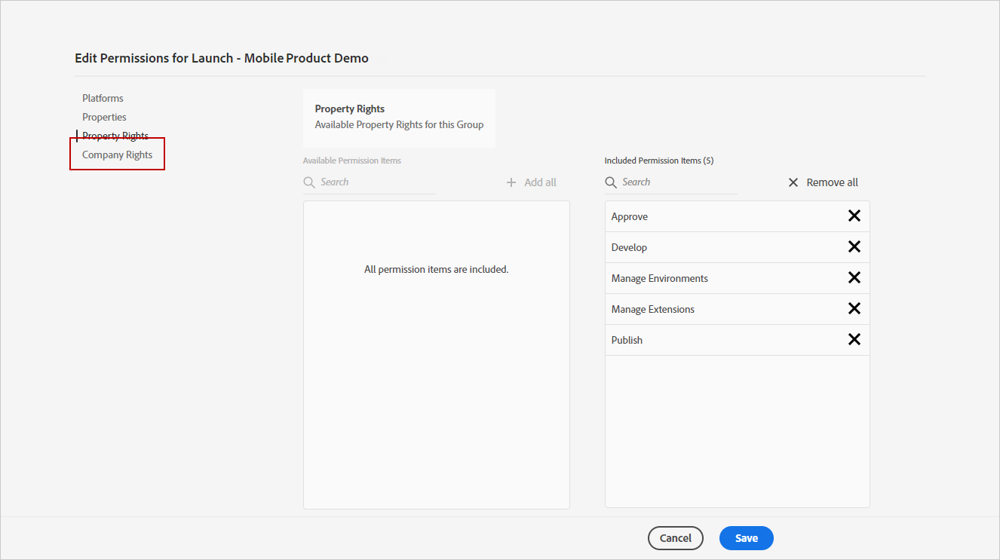
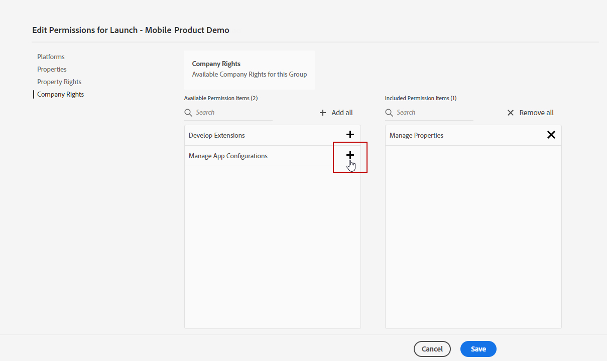
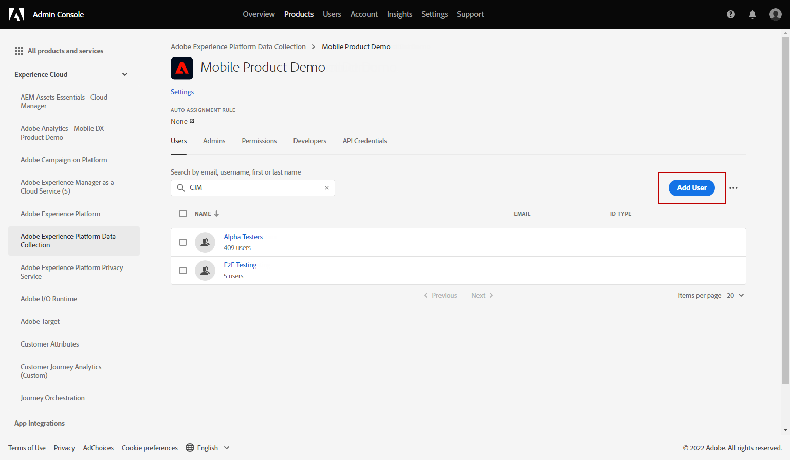
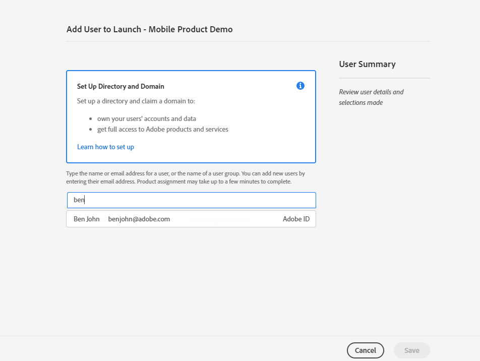
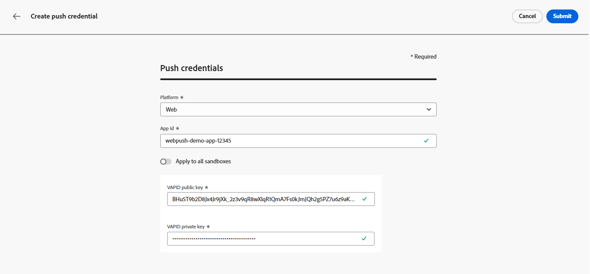
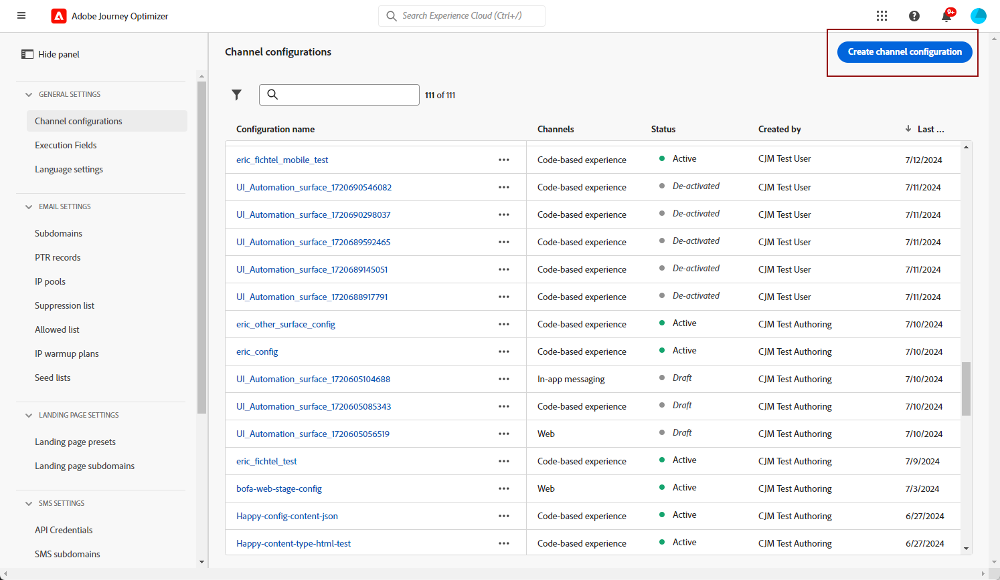
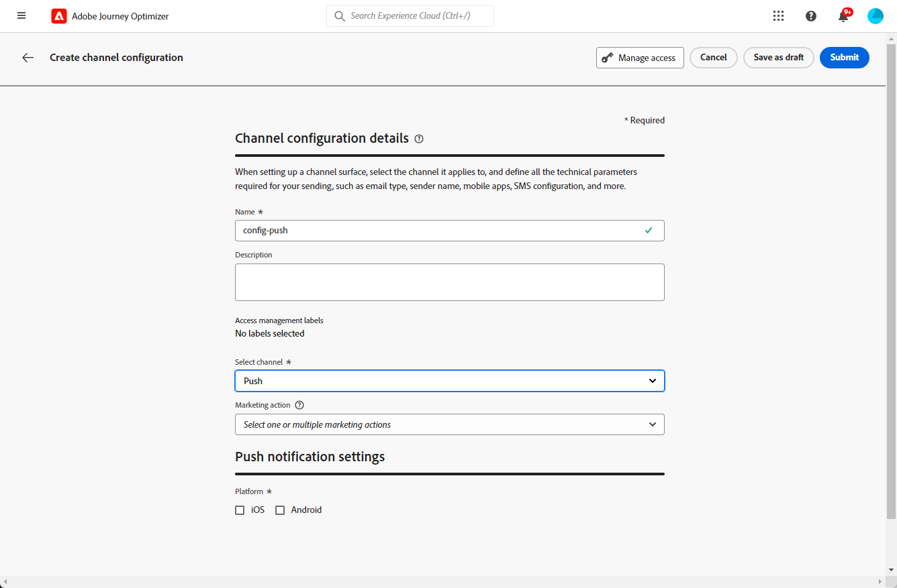

# Configure web push notification channel {#push-notification-configuration}

[!DNL Journey Optimizer] allows you to create your journeys and send messages to targeted audience. Before beginning to send Web push notifications with [!DNL Journey Optimizer], you need to ensure configurations and integrations are in place in Adobe Experience Platform. To understand the Push Notifications data flow in [!DNL Adobe Journey Optimizer] please refer to [this page](push-gs.md). 

>[!AVAILABILITY]
>
>The new **Mobile onboarding quick start workflow** is now available. Use this new product feature to rapidly configure the Mobile SDK to start collecting and validating mobile event data, and to send mobile push notifications. This capability is accessible via the Data Collection home page as a public beta. [Learn more](mobile-onboarding-wf.md)
>

## Before starting {#start-push}

### Set up permissions {#setup-permissions}

Before creating a mobile application, you first need to make sure that you have or assign the correct user permissions for tags in Adobe Experience Platform. Learn more in [Tags documentation](https://experienceleague.adobe.com/docs/experience-platform/tags/admin/user-permissions.html){target="_blank"}.

>[!CAUTION]
>
>Push configuration must be performed by an expert user. Depending on your implementation model and personas involved in this implementation, you might need to assign the full set of permissions to a single product profile or share permissions between the app developer and the **Adobe Journey Optimizer** administrator. Learn more about **Tags** permissions in [this documentation](https://experienceleague.adobe.com/docs/experience-platform/tags/admin/user-permissions.html){target="_blank"}.

<!--ou need to your have access to perform following roles :

* Manage Datastreams
* Manage Client-side Properties
* Manage App Configurations
-->

To assign **Property** and **Company** rights, follow the steps below:

1. Access the **[!DNL Admin Console]**.

1. From the **[!UICONTROL Products]** tab, select the **[!UICONTROL Adobe Experience Platform Data Collection]** card.

    

1. Select an existing **[!UICONTROL Product Profile]** or create a new one with the **[!UICONTROL New profile]** button. Learn how to create a new **[!UICONTROL New profile]** in the [Admin console documentation](https://experienceleague.adobe.com/docs/experience-platform/access-control/ui/create-profile.html#ui){target="_blank"}.

1. From the **[!UICONTROL Permissions]** tab, select **[!UICONTROL Property rights]**.

    

1. Click **[!UICONTROL Add all]**. This will add the following right to your product profile:
    * **[!UICONTROL Approve]**
    * **[!UICONTROL Develop]**
    * **[!UICONTROL Manage Environments]**
    * **[!UICONTROL Manage Extensions]**
    * **[!UICONTROL Publish]**

    These permissions are required to install and publish the Adobe Journey Optimizer extension and publish the app property in Adobe Experience Platform Mobile SDK.

1. Then, select **[!UICONTROL Company rights]** in the left-hand menu.

    

1. Add the following rights:

    * **[!UICONTROL Manage App Configurations]**
    * **[!UICONTROL Manage Properties]**

    These permissions are required for the mobile app developer to set up push credentials in **Adobe Experience Platform Data Collection** and define Push Notification channel configurations (i.e. message presets) in **Adobe Journey Optimizer**.

    

1. Click **[!UICONTROL Save]**.

To assign this **[!UICONTROL Product profile]** to users, follow the steps below:

1. Access the **[!DNL Admin Console]**.

1. From the **[!UICONTROL Products]** tab, select the **[!UICONTROL Adobe Experience Platform Data Collection]** card.

1. Select your previously configured **[!UICONTROL Product profile]**.

1. From the **[!UICONTROL Users]** tab, click **[!UICONTROL Add user]**.

    

1. Type in your user's name or email address and select the user. Then, click **[!UICONTROL Save]**.

   >[!NOTE]
   >
   >If the user was not previously created in the Admin console, refer to the [Add users documentation](https://helpx.adobe.com/enterprise/admin-guide.html/enterprise/using/manage-users-individually.ug.html#add-users).

    

### Check your datasets {#push-datasets}

The following schemas and datasets are available with the push notification channel:

| Schema  Dataset                                                                       | Group of fields                                                                                                                                                                         | Operation                                                |
| -------------------------------------------------------------------------------------- | --------------------------------------------------------------------------------------------------------------------------------------------------------------------------------------- | -------------------------------------------------------- |
| CJM Push Profile Schema  CJM Push Profile Dataset                                     | Push Notification Details Adobe CJM ExperienceEvent - Message Profile Details Adobe CJM ExperienceEvent - Message Execution Details Application Details Environment Details | Register Push Token                                      |
| CJM Push Tracking Experience Event Schema CJM Push Tracking Experience Event Dataset | Push Notification Tracking                                                                                                                                                              | Track interactions and provide data for the reporting UI |

>[!NOTE]
>
>When push tracking events are ingested into the CJM Push Tracking Experience Event dataset, some failures can happen, even though data is partly ingested successfully. This can occur if some fields in your mapping do not exist in incoming events: the system logs warnings but does not prevent ingestion of valid portions of the data. These warnings appear in batch status as 'failed' but reflect partial ingestion success.
>
>To view the complete list of fields and attributes for each schema, consult the [Journey Optimizer schema dictionary](https://experienceleague.adobe.com/tools/ajo-schemas/schema-dictionary.html){target="_blank"}.

### Configure the pushNotification property {#push-property}

To enable **Web push notifications**, you must first ensure that the [pushNotifications property](https://experienceleague.adobe.com/en/docs/experience-platform/collection/js/commands/configure/pushnotifications) is properly configured within the Web SDK. This property controls how push notifications are handled by your web application.

Additionally, you need to generate VAPID keys, required to configure [your app push credentials](#push-credentials-launch) in Journey Optimizer.

## Step 1: Add your app push credentials in Journey Optimizer {#push-credentials-launch}

After granting the correct user permissions, you now need to add your mobile application push credentials in Journey Optimizer. 

The mobile app push credential registration is required to authorize Adobe to send push notifications on your behalf. Refer to the steps detailed below:

1. Access the **[!UICONTROL Channels]** > **[!UICONTROL Push settings]** > **[!UICONTROL Push credentials]** menu.

1. Click **[!UICONTROL Create push credential]**.

1. From the **[!UICONTROL Platform]** drop-don, select **[!UICONTROL Web]**.

    

1. Provide the **[!UICONTROL App ID]**.

1. Enter your **[!UICONTROL VAPID public key]** and **[!UICONTROL private key]**.
        
1. Click **[!UICONTROL Submit]** to create your app configuration.

## Step 2: Create a channel configuration for push{#message-preset}

Once creating your push credentials, you need to create a configuration to be able to send push notifications from **[!DNL Journey Optimizer]**.

1. Access the **[!UICONTROL Channels]** > **[!UICONTROL General settings]** > **[!UICONTROL Channel configurations]** menu, then click **[!UICONTROL Create channel configuration]**.

    

1. Enter a name and a description (optional) for the configuration.

    >[!NOTE]
    >
    > Names must begin with a letter (A-Z). It can only contain alpha-numeric characters. You can also use underscore `_`, dot`.` and hyphen `-` characters.

1. To assign custom or core data usage labels to the configuration, you can select **[!UICONTROL Manage access]**. [Learn more about Object Level Access Control (OLAC)](../administration/object-based-access.md).

1. Select **Push** channel.

    

1. Select **[!UICONTROL Marketing action]**(s) to associate consent policies to the messages using this configuration. All consent policies associated with the marketing action are leveraged in order to respect the preferences of your customers. [Learn more](../action/consent.md#surface-marketing-actions)

1. Choose your **[!UICONTROL Platform]**: Android, iOS and/or Web.

1. Select the same **[!UICONTROL App id]** as for your [push credential](#push-credentials-launch) configured above.

1. Save your changes.

You can now select your configuration when creating your push notifications.

## Step 3: Configure the sendPushSubscription property {#sendPushSubscription-property}

Once your push credentials and channel configuration are set up, you need to implement [the sendPushSubscription command](https://experienceleague.adobe.com/en/docs/experience-platform/collection/js/commands/sendpushsubscription) in your web application. This command registers user push subscriptions with Adobe Experience Platform, enabling the system to track which users have opted in to receive push notifications and maintain their subscription status. This registration is essential for Journey Optimizer to send targeted push notifications to your users.

## Step 4: Test your mobile app with an event {#mobile-app-test}

After completing the web push configuration in both Adobe Experience Platform and [!DNL Adobe Experience Platform Data Collection], you can test your implementation before sending web push notifications to your profiles. Testing ensures that subscriptions are properly registered and that notifications are delivered correctly to your users' browsers.

For detailed instructions on creating a test journey with events to validate your web push setup, refer to the [mobile app push notification configuration documentation](push-configuration.md), which provides a comprehensive testing workflow applicable to both mobile and web push channels.
