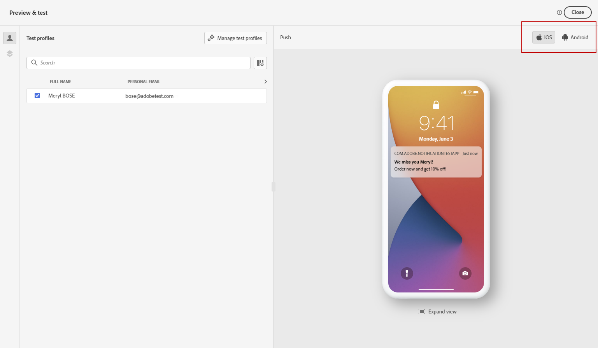
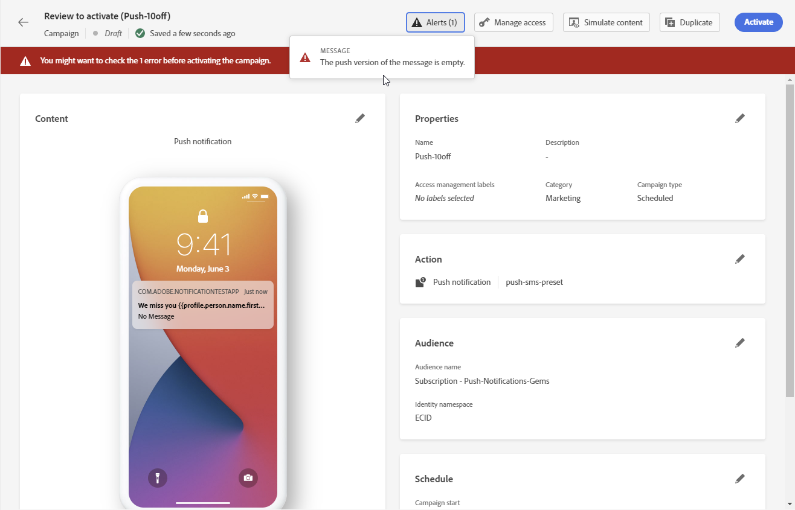

# Check & send your push notification {#send-push}

## Preview your push notification {#preview-push}

Once your message content has been defined, you can preview its content using either simulation method:

* Click **[!UICONTROL Simulate content]** to test content variations with sample input data or AI auto-generation. [Learn how to simulate content variations](../test-approve/simulate-sample-input.md)
* Click **[!UICONTROL Simulate content]**, then select **[!UICONTROL Simulate content (AEP profiles)]** from the dropdown to preview with test profiles. You can then select the type of device to preview content: **[!UICONTROL iOS]**, **[!UICONTROL Android]**, or **[!UICONTROL Web]**.

Detailed information on how to preview & test content is available in the [Content Management](../content-management/preview-test.md) section.

## Validate your push notification {#push-validate}

You must check alerts in the upper section of the editor. Some of them are simple warnings, but others can prevent you from sending the message. Two types of alerts can happen: warnings and errors.

* **Warnings** refer to recommendations and best practices.

* **Errors** prevent you from testing or activating the journey as long as they are not resolved, such as:

    * **[!UICONTROL The push version of the message is empty]**: this error is displayed when the push notification body or title is missing. Learn how to define push notification content in [this section](create-push.md).

    * **[!UICONTROL configuration doesn't exist]**: you cannot use your message if the configuration you have selected is deleted after the message creation. If this error occurs, select another configuration in the message **[!UICONTROL Properties]**. Learn more about channel configurations in [this section](../configuration/channel-surfaces.md).

    * **[!UICONTROL Push iOS/Android payload has exceeded limit of 4KB]**: the push notification size cannot exceed 4KB. To respect this limit, try to reduce the use of images or emojis. Learn how to manage your push notification content in [this section](../push/create-push.md).

    

>[!NOTE]
>
> For better deliverability, you should always use the phone numbers in the formats supported by the provider. For example, Twilio and Sinch only support phone numbers in E.164 format.

## Send your push notification{#push-send}

>[!IMPORTANT]
>
> If your campaign is subject to an approval policy, you will need to request approval in order to be able to send your Push notification. [Learn more](../test-approve/gs-approval.md)

When your push message is ready, complete the configuration of your [journey](../building-journeys/journey-gs.md) or [campaign](../campaigns/create-campaign.md) to send it.

**Related topics**

* [Configure push channel for mobile](push-configuration.md)
* [Configure push channel for web](push-configuration-web.md)
* [Push notification report](../reports/journey-global-report-cja-push.md)
* [Create a push notification](create-push.md)
* [Add a message in a journey](../building-journeys/journey-action.md)
* [Add a message in a campaign](../campaigns/create-campaign.md)

