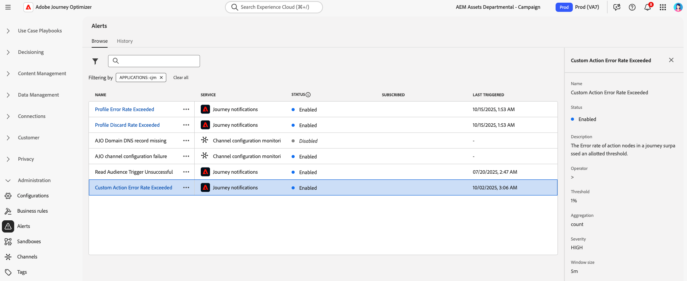

# Access and subscribe to system alerts {#alerts}

## Overview

Alerts are automated notifications that help you monitor and troubleshoot issues in Adobe Journey Optimizer. They provide real-time awareness of potential problems in your journeys, campaigns, and channel configurations, enabling you to take corrective action before customer experiences are impacted.

Adobe Journey Optimizer provides two types of alerts:

* **In-canvas validation alerts**: When building journeys and campaigns, use the **Alerts** button in the canvas to identify and resolve configuration errors before publishing. Learn how to [troubleshoot your journeys](../building-journeys/troubleshooting.md) and review your campaigns: [Action campaigns](../campaigns/review-activate-campaign.md) | [API-triggered campaigns](../campaigns/review-activate-api-triggered-campaign.md) | [Orchestrated campaigns](../orchestrated/start-monitor-campaigns.md).

* **System monitoring alerts** (detailed on this page): Receive proactive notifications when operational thresholds are exceeded or issues are detected in live journeys and channel configurations. System alerts monitor metrics such as error rates, profile discards, and email deliverability issues.

**Key benefits of system alerts:**

* Proactive issue detection before customer impact
* Automated monitoring of journey performance and health
* Early warning for email deliverability problems
* Reduced time to identify and resolve operational issues

System alerts are available from the **[!UICONTROL Alerts]** menu under **[!UICONTROL Administration]**. Adobe Experience Platform provides several predefined alert rules that you can enable, including [!DNL Adobe Journey Optimizer]-specific alerts for journeys and channel configurations.

## Prerequisites

Before working with alerts:

* **Permissions**: You need specific permissions to view and manage alerts. See [required permissions in Adobe Experience Platform](https://experienceleague.adobe.com/docs/experience-platform/observability/alerts/overview.html#permissions){target="_blank"}.

* **Sandbox awareness**: Alert subscriptions are sandbox-specific. When you subscribe to alerts, they apply only to the current sandbox. When a sandbox is reset, all alert subscriptions are also reset.

* **Notification preferences**: Configure how you receive alerts (email and/or in-app) in your [Adobe Experience Cloud Preferences](../start/user-interface.md#in-product-uc).

>[!NOTE]
>
>Journey Optimizer-specific alerts apply only to **live** journeys. Alerts are not triggered for journeys in test mode. For more information about the alert framework, see the [Adobe Experience Platform alerts documentation](https://experienceleague.adobe.com/docs/experience-platform/observability/alerts/overview.html){target="_blank"}. 

## Available alerts in Journey Optimizer {#available-alerts}

Journey Optimizer provides pre-configured alert rules that monitor specific aspects of your journeys and channel configurations. You do not need to create these alerts - they are available out-of-the-box and can be enabled through subscription.

**To access the alerts list:**

Navigate to **[!UICONTROL Administration]** > **[!UICONTROL Alerts]** in the left menu. The **Browse** tab displays all pre-configured alerts available for Journey Optimizer.

{width=50%}

### Alert categories

Journey Optimizer provides two categories of system alerts:

>[!BEGINTABS]

>[!TAB Journey alerts]

Monitor journey execution and performance:

* [Read Audience Trigger Unsuccessful](#alert-read-audiences) – Warns when a Read Audience activity fails to process profiles
* [Custom Action Error Rate Exceeded](#alert-custom-action-error-rate) – Detects high error rates in custom action API calls (replaces the previous Journey Custom Action Failure alert)
* [Profile Discard Rate Exceeded](#alert-discard-rate) – Identifies when profiles are being discarded at an abnormal rate
* [Profile Error Rate Exceeded](#alert-profile-error-rate) – Flags when profiles encounter errors during journey execution
* [Journey Published](#alert-journey-published) – Informational notification when a journey is published
* [Journey Finished](#alert-journey-finished) – Informational notification when a journey completes
* [Custom Action Capping Triggered](#alert-custom-action-capping) – Notifies when API call limits are reached

>[!TAB Channel configuration alerts]

Detect issues with email deliverability setup:

* [AJO Domain DNS record missing](#alert-dns-record-missing) – Identifies missing or misconfigured DNS records
* [AJO channel configuration failure](#alert-channel-config-failure) – Detects email configuration issues (SPF, DKIM, MX records)
<!--* the [AJO domain certificates renewal unsuccessful](#alert-certificates-renewal) alert-->

>[!ENDTABS]

>[!NOTE]
>
>For alerts from other Adobe Experience Platform services (data ingestion, identity resolution, segmentation, and more), see the [standard alert rules documentation](https://experienceleague.adobe.com/docs/experience-platform/observability/alerts/rules.html){target="_blank"}.

## Subscribe to alerts {#subscribe-alerts}

Alert subscriptions determine which users receive notifications when specific conditions are met (such as error rate thresholds being exceeded or configuration issues detected). Only subscribed users receive alert notifications for the selected alerts.

### Subscription methods

You can subscribe to alerts in two ways:

* **[Global subscription](#global-subscription)**: Apply to all journeys and campaigns in the current sandbox. Use this method when you want to monitor all journey activity across your organization.
* **[Journey-specific subscription](#unitary-subscription)**: Apply to individual journeys only. Use this method when you want to monitor specific high-priority journeys without receiving alerts for all journeys.

### How alert notifications work

**Alert lifecycle:**

1. **Triggering**: The alert triggers when its specific condition is met (e.g., error rate exceeds 20%)
2. **Notification**: All subscribed users receive notifications via their configured channels
3. **Monitoring**: The alert continues to monitor the condition at regular intervals
4. **Resolution**: When the condition is resolved, subscribers receive a "Resolved" notification

**Notification delivery:**

* **Delivery channels**: Alerts are sent via email and/or in-app notifications in the Journey Optimizer notification center (bell icon in the top-right corner). Configure your preferred delivery channels in your [Adobe Experience Cloud Preferences](../start/user-interface.md#in-product-uc).

* **Alert types**: Journey Optimizer provides both one-time alerts (informational events like "journey published") and repeating alerts (monitoring thresholds). Repeating alerts continue evaluating and notifying until the condition is resolved.

* **Auto-resolution**: To prevent notification fatigue from fluctuating values, alerts automatically resolve after 1 hour even if the condition persists. This prevents continuous notifications when metrics hover around threshold values.

**Alternative subscription method:**

For advanced integrations, you can subscribe via I/O Events to send alerts to external systems. See the [Adobe Experience Platform documentation](https://experienceleague.adobe.com/docs/experience-platform/observability/alerts/subscribe.html){target="_blank"}.

### Global subscription {#global-subscription}

Global subscriptions allow you to receive alerts for all journeys and campaigns in the current sandbox.

**To subscribe to an alert:**

1. Navigate to **[!UICONTROL Administration]** > **[!UICONTROL Alerts]** in the left menu.

1. In the **[!UICONTROL Browse]** tab, locate the alert you want to monitor.

1. Click **[!UICONTROL Subscribe]** for the desired alert.

   {width=80%}

**To unsubscribe:**

Click **[!UICONTROL Unsubscribe]** next to the alert.

>[!IMPORTANT]
>
>Alert subscriptions are sandbox-specific. You must subscribe to alerts separately in each sandbox where you want to receive notifications.

**Alternative subscription method:**

You can also subscribe via [I/O Event notifications](https://experienceleague.adobe.com/docs/experience-platform/observability/alerts/subscribe.html){target="_blank"}, which allows integration with external systems. Event subscription names for Journey Optimizer alerts are listed in each [alert description below](#journey-alerts).

### Journey-specific subscription {#unitary-subscription}

Journey-specific subscriptions allow you to monitor individual high-priority journeys without receiving alerts for all journeys in your organization.

**To subscribe to alerts for a specific journey:**

1. Go to the journey inventory.

1. Click the **⋯** (more actions) menu for the journey you want to monitor.

1. Select **[!UICONTROL Subscribe to alerts]**.

      {width=75%}

1. Select the alert(s) you want to enable from the available options:
   * [Profile Discard Rate Exceeded](#alert-discard-rate)
   * [Custom Action Error Rate Exceeded](#alert-custom-action-error-rate)
   * [Profile Error Rate Exceeded](#alert-profile-error-rate)
   * [Journey Published](#alert-journey-published)
   * [Journey Finished](#alert-journey-finished)
   * [Custom Action Capping Triggered](#alert-custom-action-capping)

1. Click **[!UICONTROL Save]** to confirm your subscriptions.

**To unsubscribe:**

Open the same dialog, deselect the alert(s), and click **[!UICONTROL Save]**.

>[!NOTE]
>
>The [Read Audience Trigger Unsuccessful](#alert-read-audiences) alert is only available through global subscription, not per-journey subscription.

<!--To enable email alerting, refer to [Adobe Experience Platform documentation](https://experienceleague.adobe.com/docs/experience-platform/observability/alerts/ui.html#enable-email-alerts){target="_blank"}.-->

## Journey alerts {#journey-alerts}

All journey notifications available in the user interface are listed below.

>[!CAUTION]
>
>Adobe Journey Optimizer specific alerts apply only to **live** journeys. Alerts are not triggered for journeys in test mode.

### Read Audience Trigger Unsuccessful {#alert-read-audiences}

This alert warns you if a **Read Audience** activity has not processed any profile 10 mins after scheduled time of execution. This failure can be caused by technical issues, or because the audience is empty. If this failure is caused by technical issues, be aware that retries can still happen, depending of the type of issue (eg: if the export job creation has failed, we will retry every 10mn for 1h max).

Alerts on **Read Audience** activities only apply to recurring journeys. **Read Audience** activities in live journeys that have a schedule to run **Once** or **As soon as possible** are ignored.

Alerts on **Read Audience** are resolved when a profile enters the **Read Audience** node, or after 1 hour.

The I/O event subscription name corresponding to the **Read Audience Trigger Unsuccessful** alert is **Journey read audience Delays, Failures and Errors**.

To troubleshoot **Read Audience** alerts, check your audience count in the Experience Platform interface.

### Profile Discard Rate Exceeded {#alert-discard-rate}

This alert warns you if the ratio of profile discards to entered profiles over the last 5 minutes exceeded threshold. The default threshold is set to 20% but you can [define a custom threshold](#custom-threshold).

Click the name of the alert to check the alert details and configuration.

There are several reasons a profile could be discarded, which will inform the method of troubleshooting. Some common reasons are listed below:

* Profile discarded at entry because it is already live in that unitary journey. To solve this, ensure that the profile has enough time to exit the journey before the next event arrives for that profile.
* Identity is not set for the profile or the namespace used by the read audience journey is not utilized in that profile. To solve this, ensure that the namespace in the journey matches the identity namespace used by the profiles.
* Event throughput rate is exceeded. To solve this, ensure that events coming into the system are not exceeding these limits.

### Custom Action Error Rate Exceeded {#alert-custom-action-error-rate}

This alert warns you if the ratio of custom action errors to successful HTTP calls over the last 5 minutes exceeded threshold. The default threshold is set to 20% but you can [define a custom threshold](#custom-threshold).

>[!NOTE]
>
>This alert replaces the previous **Journey Custom Action Failure** alert.

Click the name of the alert to check the alert details and configuration.

Custom actions errors can happen for a variety of reasons. To troubleshoot these errors, you can:

* Check your custom action using [test mode](../building-journeys/testing-the-journey.md) on another journey.
* Check your [journey report](../reports/journey-live-report.md) to see error reasons on action.
* Check your journey stepEvents to look for more information around the "failureReason".
* Check that the custom action is configured correctly and validate that the authentication is still valid. Perform a manual check with Postman, for instance.
* Check that the endpoint is reachable and the custom action can reach it via the custom action connectivity checker.
* Verify the authentication credentials, check internet connectivity, etc.

### Profile Error Rate Exceeded {#alert-profile-error-rate}

This alert warns you if the ratio of profiles-in-error to entered profiles over the last 5 minutes exceeded threshold. The default threshold is set to 20% but you can [define a custom threshold](#custom-threshold).

Click the name of the alert to check the alert details and configuration.

To troubleshoot profile error, you can query the data in step events to understand where and why the profile failed in the journey.

### Journey Published {#alert-journey-published}

This alert notifies you when a journey has been published by a practitioner in the journey canvas.

This is an informational alert that helps you keep track of journey lifecycle events in your organization. There is no resolution criteria as this is a one-time notification.

### Journey Finished {#alert-journey-finished}

This alert notifies you when a journey has finished. The definition of "finished" varies depending on the journey type. [Learn more about when journeys are considered finished](../building-journeys/end-journey.md#journey-finished-definition).

This is an informational alert that helps you keep track of journey completion. There is no resolution criteria as this is a one-time notification.

### Custom Action Capping Triggered {#alert-custom-action-capping}

This alert warns you when capping has been triggered on a custom action. Capping is used to limit the number of calls sent to an external endpoint to prevent overwhelming the endpoint.

Click the name of the alert to check the alert details and configuration.

When capping is triggered, it means that the maximum number of API calls has been reached within the defined time period, and further calls are being throttled or queued. Learn more about capping on custom actions on [this page](../action/about-custom-action-configuration.md#custom-action-enhancements-best-practices).

This alert is resolved when the capping is no longer active, or when no profiles reach the custom action during the evaluation period.

To troubleshoot capping issues:

* Review the capping configuration on your custom action to ensure the limits are appropriate for your use case.
* Check if the volume of API calls is higher than expected and consider adjusting your journey design or capping settings.
* Monitor the external endpoint to ensure it can handle the expected load.

## Configuration alerts {#configuration-alerts}

Channel configuration monitoring alerts available in the user interface are listed below.

### AJO Domain DNS record missing {#alert-dns-record-missing}

This alert notifies you when critical DNS records (NS or CNAME) required for proper deliverability configuration are missing or misconfigured. Without these records, email deliverability may be compromised.

>[!NOTE]
>
>* NS records are essential for full subdomain delegation to Adobe. [Learn more](../configuration/about-subdomain-delegation.md#full-subdomain-delegation)
>
>* CNAME records support CNAME subdomain setup. [Learn more](../configuration/about-subdomain-delegation.md#cname-subdomain-setup)

The **AJO Domain DNS record missing** alert is triggered when the system detects that the required NS or CNAME records are absent or do not match the configuration standards.

1. Click the alert to be directed to the impacted [subdomain](../configuration/delegate-subdomain.md) in the [!DNL Journey Optimizer] interface.

   <!--For guidance on editing delegated subdomains, see [this section](../configuration/delegate-subdomain.md).-->

1. Remediate the DNS configuration by setting the records correctly and [submit the subdomain](../configuration/delegate-subdomain.md#submit-subdomain) delegation again.

   >[!NOTE]
   >
   >Make sure that all the records are properly created on your domain hosting solution before proceeding.

1. If you are unsure of the correct values, you can create a new subdomain in [!DNL Journey Optimizer] with the same name as the impacted subdomain. [Learn how to set up a new a subdomain](../configuration/delegate-subdomain.md#set-up-subdomain)

If the changes do not resolve the issue, the same alert will be triggered again the next day.

<!--The I/O event subscription name corresponding to this alert is xx. > Do we need to mention this?-->

### AJO channel configuration failure {#alert-channel-config-failure}

>[!IMPORTANT]
>
>This alert applies only to **email** channel configurations using the [custom subdomain](../configuration/delegate-custom-subdomain.md) delegation type. <!--Other channel types (such as SMS, push, or in-app) are not covered by this alert.-->

This alert is triggered in case the system audit detects email channel configuration issues. These issues may include misconfigured channel settings, invalid DNS configuration, suppression list issue, IP inconsistency, or any other errors that can impact email delivery.

If you receive such an alert, the resolution steps are listed below:

1. Click the alert to be directed to the impacted [email channel configuration](../email/get-started-email-config.md) in the [!DNL Journey Optimizer] interface.

   For guidance on editing channel configurations, see [this section](../configuration/channel-surfaces.md#edit-channel-surface).

1. Review the configuration details and error messages provided. Common failure reasons include:

   * SPF validation failed
   * DKIM validation failed
   * MX record validation failed
   * Invalid DNS records

   >[!NOTE]
   >
   >The possible configuration failure reasons are listed in [this section](../configuration/channel-surfaces.md).

1. Resolve the issue:

   * Update the channel configuration as needed.
   * You may need to fix specific DNS issues mentioned in the alert.

   >[!NOTE]
   >
   >As a single domain can be associated with multiple channel configurations, resolving DNS issues for one channel configuration may automatically fix related issues across several configurations.

If the change does not resolve the issue, the same alert will be triggered again the next day.

When resolving email configuration issues, keep in mind the best practices listed below:

* Act promptly - Address configuration failures as soon as they are detected to avoid disruptions in email delivery.
* Check all configurations - If the alert indicates multiple impacted email configurations, review and fix each of them.

<!--### AJO domain certificates renewal unsuccessful {#alert-certificates-renewal}

This alert warns you if a domain certificate (CDN, tracking URL) renewal failed for a specific Journey Optimizer subdomain.-->

## Manage alerts {#manage-alerts}

### Edit an alert

You can check the details of an alert by clicking on its line. The name, status and notification channels are displayed in the left panel.
For Journey alerts, use the **[!UICONTROL More actions]** button to edit them. You can then define a [custom threshold](#custom-threshold) for these alerts.

{width=60%}

### Define a custom threshold {#custom-threshold}

You can set thresholds for the [Journey alerts](#journey-alerts). The threshold alerts above default to 20%. 

To change the threshold:

1. Browse to the **Alerts** screen
1. Click the **[!UICONTROL More actions]** button of the alert to update
1. Enter the new threshold and confirm. The new threshold applies to **all** journeys

{width=60%}

>[!CAUTION]
>
>The threshold levels are global across all journeys and cannot be individually modified per journey.

### Disable an alert

By default, all alerts are enabled. To disable an alert, select the the **[!UICONTROL Disable alert]** option: all subscribers to this alert will no longer receive the related notifications.

### Alert statuses

The possible alert statuses are listed below:

* **[!UICONTROL Enabled]** - The alert is enabled and is currently monitoring trigger condition.
* **[!UICONTROL Disabled]** - The alert is disabled and is currently not monitoring trigger condition. You will receive no notifications for this alert.
* **[!UICONTROL Triggered]** - The alert's trigger condition is currently being met.

### View and update subscribers {#manage-subscribers}

Select **[!UICONTROL Manage alert subscribers]** to view the list of users who subscribed to the alert. 

{width=80%}

To add more subscribers, enter their email separated by a comma, and select **[!UICONTROL Update]**.

To remove subscribers, delete their email address from the current subscribers, and select **[!UICONTROL Update]**.

## Related topics {#additional-resources-alerts}

**Journey and campaign management:**

* [Troubleshoot journeys](../building-journeys/troubleshooting.md) - Identify and resolve common journey issues and errors
* [Test and publish journeys](../building-journeys/publishing-the-journey.md) - Validate journey configuration before publishing
* [Review and activate action campaigns](../campaigns/review-activate-campaign.md) - Pre-publication validation for scheduled and one-time campaigns
* [Review and activate API-triggered campaigns](../campaigns/review-activate-api-triggered-campaign.md) - Validation for API-triggered campaigns
* [Monitor orchestrated campaigns](../orchestrated/start-monitor-campaigns.md) - Track and manage orchestrated campaign execution

**Alert framework:**

* [Adobe Experience Platform Alerts Overview](https://experienceleague.adobe.com/docs/experience-platform/observability/alerts/overview.html){target="_blank"} - Understanding the alert framework
* [Manage alerts in the UI](https://experienceleague.adobe.com/docs/experience-platform/observability/alerts/ui.html){target="_blank"} - View, subscribe, and manage alerts
* [Subscribe to alerts via I/O Events](https://experienceleague.adobe.com/docs/experience-platform/observability/alerts/subscribe.html){target="_blank"} - Advanced integration options
* [Standard alert rules](https://experienceleague.adobe.com/docs/experience-platform/observability/alerts/rules.html){target="_blank"} - Complete list of available Platform alerts
