# Access and subscribe to system alerts {#alerts}

When building your journeys and campaigns, use the **Alerts** button to check and resolve errors before executing or publishing them.

From the dedicated **[!UICONTROL Alerts]** menu, you can also subscribe to [!DNL Adobe Journey Optimizer] system alerts as detailed on this page.

## Access alerts {#access-alerts} 

When a failure happens, you can get system alerts in Journey Optimizer notification center (in-app alerts), and/or receive an email. To access these alerts, follow the steps below.

<!--These messages can repeat over a pre-defined time interval until the alert has been resolved.-->

>[!NOTE]
>
>Learn more about alerts in Adobe Experience Platform in [Adobe Experience Platform documentation](https://experienceleague.adobe.com/docs/experience-platform/observability/alerts/overview.html){target="_blank"}. 

In the left menu, under **[!UICONTROL Administration]**, click **[!UICONTROL Alerts]**. Several pre-configured alerts for Journey Optimizer are available.

They are listed as follows and each alert is detailed below.

* Alerts specific to journeys:

   * the [Journey Custom Action Failure](#alert-custom-actions) alert
   * the [Read Audience Trigger Unsuccessful](#alert-read-audiences) alert
<!--DOCAC-13465   * the [Profile Discard Rate Exceeded](#alert-discard-rate) alert
   * the [Custom Action Error Rate Exceeded](#alert-custom-action-error-rate) alert
   * the [Profile Error Rate Exceeded](#alert-profile-error-rate) alert-->

* Alerts specific to channel configuration:

   * the [AJO Domain DNS record missing](#alert-dns-record-missing) alert
   * the [AJO channel configuration failure](#alert-channel-config-failure) alert
   <!--* the [AJO domain certificates renewal unsuccessful](#alert-certificates-renewal) alert-->

## Subscribe to alerts {#subscribe-alerts}

If an unexpected behavior occurs, and/or a certain set of conditions in your operations is reached (such as a potential problem when the system breaches a threshold), alert notifications are delivered to any users in your organization who subscribed to them.

You can subscribe to each alert individually from the user interface, either globally from the **[!UICONTROL Alerts]** menu (see [Global subscription](#global-subscription))<!--DOCAC-13465, or unitary for a specific journey (see [Unitary subscription](#unitary-subscription))-->.

Based on the subscriber's preferences, alerts are sent by email, and/or directly within Journey Optimizer notification center, in the top right corner of the user interface (in-app notifications). Select how you want to receive these alerts in the [!DNL Adobe Experience Cloud] **[!UICONTROL Preferences]**. [Learn more](../start/user-interface.md#in-product-alerts)

When an alert is resolved, subscribers receive a "Resolved" notification.

### Global subscription {#global-subscription}

To subscribe/unsubscribe to an alert for all journeys and campaigns, follow these steps:

1. Browse to the **[!UICONTROL Alerts]** dashboard from the left menu, select the **[!UICONTROL Subscribe]** option for the alert you want to subscribe to.

   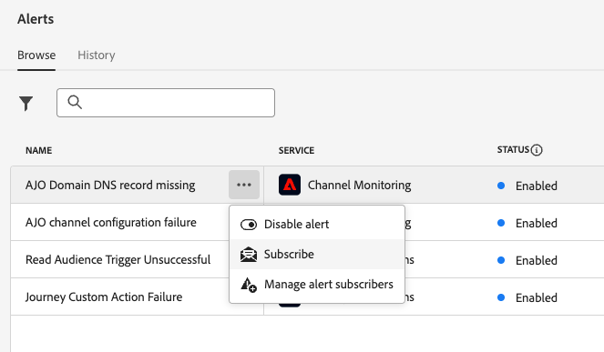{width=80%}

   >[!NOTE]
   >
   >Subscription only applies to a specific sandbox. You must subscribe to alerts for each sandbox individually.

1. Use the same method to **[!UICONTROL Unsubscribe]**.

You can also subscribe trough [I/O Event notifications](https://experienceleague.adobe.com/docs/experience-platform/observability/alerts/subscribe.html){target="_blank"}. Alert rules are organized into different subscription packages. Event subscriptions corresponding to the specific Journey Optimizer alerts are detailed [below](#journey-alerts).

<!--DOCAC-13465
### Unitary subscription {#unitary-subscription}

To subscribe/unsubscribe to an alert for a specific journey, follow these steps:

1. Browse to the journey inventory and select the **[!UICONTROL Subscribe to alerts]** option for a specific journey.

      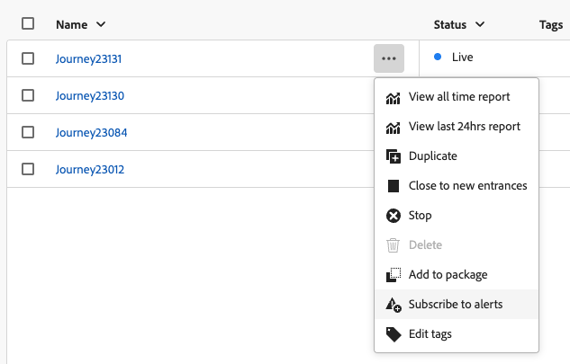{width=80%}

1. Choose the alert(s). The following alerts are available: [Profile Discard Rate Exceeded](#alert-discard-rate), [Custom Action Error Rate Exceeded](#alert-custom-action-error-rate), and [Profile Error Rate Exceeded](#alert-profile-error-rate).
   
1. To unsubscribe to an alert, unselect it from the same screen.

1. Click **[!UICONTROL Save]** to confirm.
-->

<!--To enable email alerting, refer to [Adobe Experience Platform documentation](https://experienceleague.adobe.com/docs/experience-platform/observability/alerts/ui.html#enable-email-alerts){target="_blank"}.-->

## Journey alerts {#journey-alerts}

>[!CAUTION]
>
>Adobe Journey Optimizer specific alerts apply only to **live** journeys. Alerts are not triggered for journeys in test mode.

### Journey Custom Action Failure {#alert-custom-actions}

This alert warns you if a custom action fails. We consider there is a failure where there has been more than 1% of errors on a specific custom action over the last 5 minutes. This is evaluated every 30 seconds.

Click the name of the alert to check the alert details and configuration.

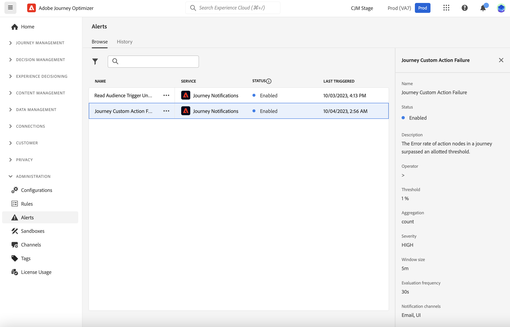

Alerts on custom actions are resolved when, over the last 5 minutes:

* there has not been any error on that custom action (or errors below the 1% threshold),

* or, no profile has reached that custom action.

The I/O event subscription name corresponding to the custom action alert is **Journey Custom Action Failure**.

To troubleshoot **Custom Action** alerts:

* Check your custom action using test mode on another journey:

   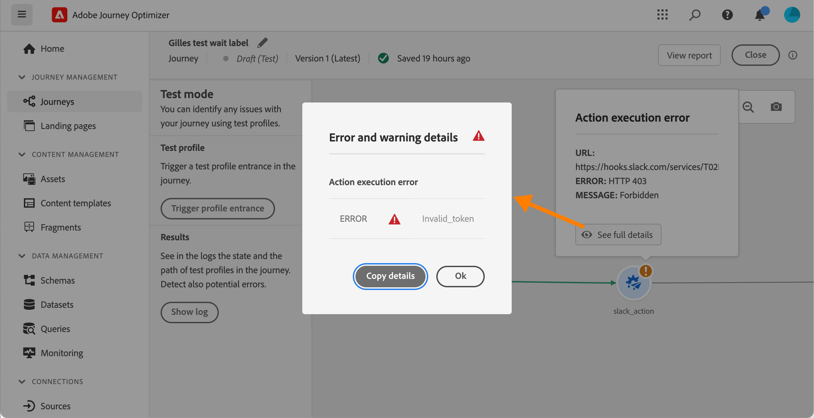

* Check your journey report to see error reasons on action.

   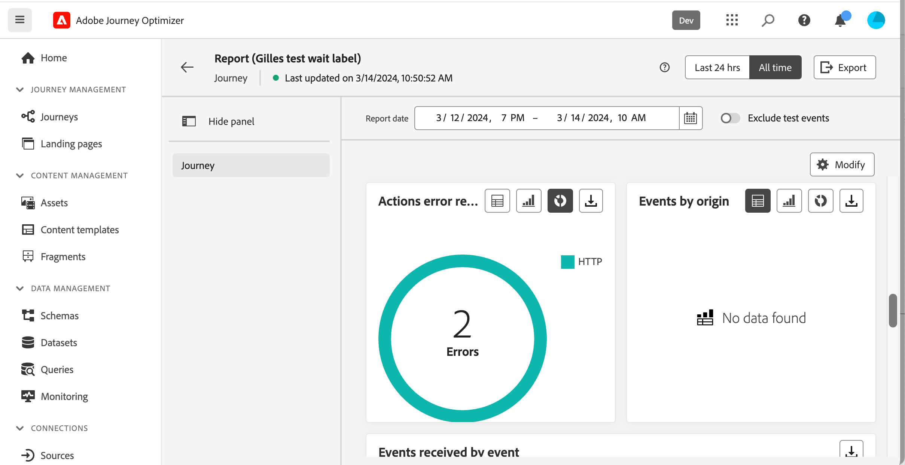
   
* Check your journey stepEvents to look for more information around the "failureReason".

* Check your custom action configuration and validate that the authentication is still OK. Perform a manual check with Postman, for instance.

### Read Audience Trigger Unsuccessful {#alert-read-audiences}

This alert warns you if a **Read Audience** activity has not processed any profile 10 mins after scheduled time of execution. This failure can be caused by technical issues, or because the audience is empty. If this failure is caused by technical issues, be aware that retries can still happen, depending of the type of issue (eg: if the export job creation has failed, we will retry every 10mn for 1h max).

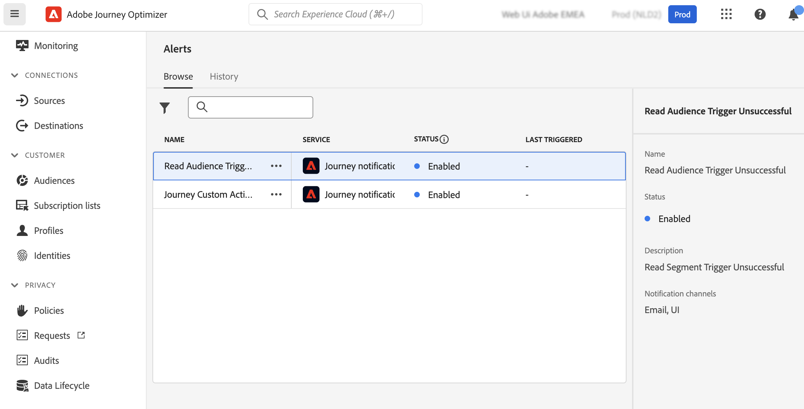

Alerts on **Read Audience** activities only apply to recurring journeys. **Read Audience** activities in live journeys that have a schedule to run **Once** or **As soon as possible** are ignored.

Alerts on **Read Audience** are resolved when a profile enters the **Read Audience** node.

The I/O event subscription name corresponding to the **Read Audience Trigger Unsuccessful** alert is **Journey read audience Delays, Failures and Errors**.

To troubleshoot **Read Audience** alerts, check your audience count in the Experience Platform interface.

   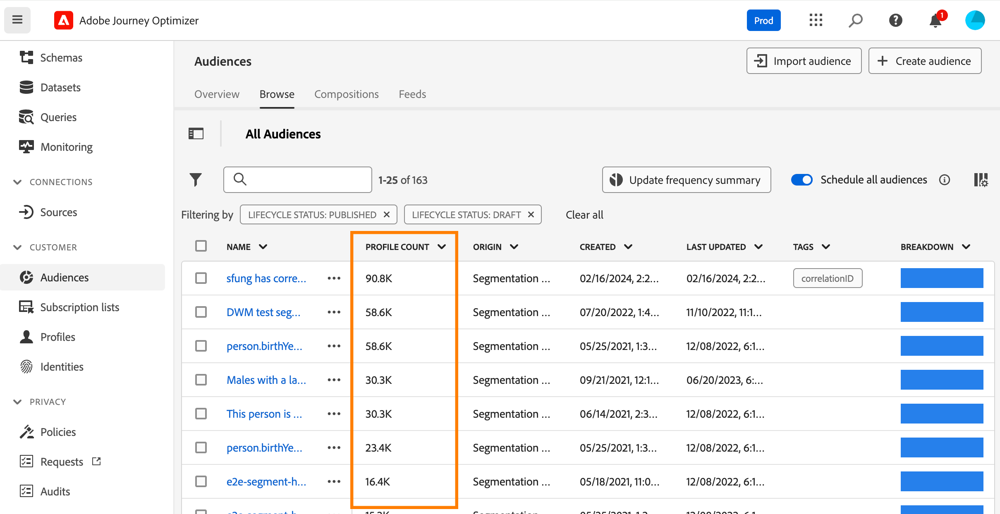

   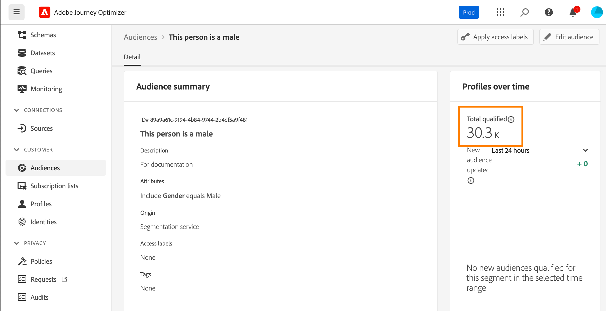

<!--DOCAC-13465

### Profile Discard Rate Exceeded {#alert-discard-rate}

This alert warns you if the ratio of profile discards to entered profiles over the last 5 minutes exceeded threshold. The defaut threshold is set to 20% but you can [define a custom theshold](#custom-threshold).

Click the name of the alert to check the alert details and configuration.

### Custom Action Error Rate Exceeded {#alert-custom-action-error-rate}

This alert warns you if the ratio of custom action errors to successful HTTP calls over the last 5 minutes exceeded threshold. The defaut threshold is set to 20% but you can [define a custom theshold](#custom-threshold).

### Profile Error Rate Exceeded {#alert-profile-error-rate}

This alert warns you if the ratio of custom action errors to successful HTTP calls over the last 5 minutes exceeded threshold. The defaut threshold is set to 20% but you can [define a custom theshold](#custom-threshold).

Click the name of the alert to check the alert details and configuration.
-->

## Configuration alerts {#configuration-alerts}

### AJO Domain DNS record missing {#alert-dns-record-missing}

This alert notifies you when critical DNS records (NS or CNAME) required for proper deliverability configuration are missing or misconfigured. Without these records, email deliverability may be compromised.

>[!NOTE]
>
>* NS records are essential for full subdomain delegation to Adobe. [Learn more](../configuration/about-subdomain-delegation.md#full-subdomain-delegation)
>
>* CNAME records support CNAME subdomain setup. [Learn more](../configuration/about-subdomain-delegation.md#cname-subdomain-setup)

The **AJO Domain DNS record missing** alert is triggered when the system detects that the required NS or CNAME records are absent or do not match the configuration standards.

1. Click the alert to be directed to the impacted [subdomain](../configuration/delegate-subdomain.md) in the [!DNL Journey Optimizer] interface.

   <!--For guidance on editing delegated subdomains, see [this section](../configuration/delegate-subdomain.md).-->

1. Remediate the DNS configuration by setting the records correctly and [submit the subdomain](../configuration/delegate-subdomain.md#submit-subdomain) delegation again.

   >[!NOTE]
   >
   >Make sure that all the records are properly created on your domain hosting solution before proceeding.

1. If you are unsure of the correct values, you can create a new subdomain in [!DNL Journey Optimizer] with the same name as the impacted subdomain. [Learn how to set up a new a subdomain](../configuration/delegate-subdomain.md#set-up-subdomain)

If the changes do not resolve the issue, the same alert will be triggered again the next day.

<!--The I/O event subscription name corresponding to this alert is xx. > Do we need to mention this?-->

### AJO channel configuration failure {#alert-channel-config-failure}

>[!IMPORTANT]
>
>This alert applies only to **email** channel configurations using the [custom subdomain](../configuration/delegate-custom-subdomain.md) delegation type. <!--Other channel types (such as SMS, push, or in-app) are not covered by this alert.-->

This alert is triggered in case the system audit detects email channel configuration issues. These issues may include misconfigured channel settings, invalid DNS configuration, suppression list issue, IP inconsistency, or any other errors that can impact email delivery.

If you receive such an alert, the resolution steps are listed below:

1. Click the alert to be directed to the impacted [email channel configuration](../email/get-started-email-config.md) in the [!DNL Journey Optimizer] interface.

   For guidance on editing channel configurations, see [this section](../configuration/channel-surfaces.md#edit-channel-surface).

1. Review the configuration details and error messages provided. Common failure reasons include:

   * SPF validation failed
   * DKIM validation failed
   * MX record validation failed
   * Invalid DNS records

   >[!NOTE]
   >
   >The possible configuration failure reasons are listed in [this section](../configuration/channel-surfaces.md).

1. Resolve the issue:

   * Update the channel configuration as needed.
   * You may need to fix specific DNS issues mentioned in the alert.

   >[!NOTE]
   >
   >As a single domain can be associated with multiple channel configurations, resolving DNS issues for one channel configuration may automatically fix related issues across several configurations.

If the change does not resolve the issue, the same alert will be triggered again the next day.

When resolving email configuration issues, keep in mind the best practices listed below:

* Act promptly - Address configuration failures as soon as they are detected to avoid disruptions in email delivery.
* Check all configurations - If the alert indicates multiple impacted email configurations, review and fix each of them.

<!--### AJO domain certificates renewal unsuccessful {#alert-certificates-renewal}

This alert warns you if a domain certificate (CDN, tracking URL) renewal failed for a specific Journey Optimizer subdomain.-->

## Manage alerts {#manage-alerts}

### Edit an alert

You can check the details of an alert by clicking on its line. The name, status and notification channels are displayed in the left panel.
<!--DOCAC-13465
For Journey alerts, use the **[!UICONTROL More actions]** button to edit them. You can then define a [custom theshold](#custom-threshold) for these alerts.-->

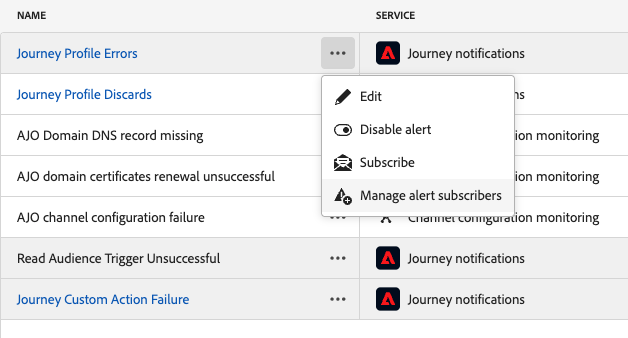{width=60%}

<!--DOCAC-13465
#### Define a custom threshold {#custom-threshold}

You can set thresholds for the [Journey alerts](#journey-alerts). The threshold alerts above default to 20%. 

To change the threshold:

1. Browse to the **Alerts** screen
1. Click the **[!UICONTROL More actions]** button of the alert to update
1. Enter the new threshold and confirm. The new threshold applies to **all** journeys

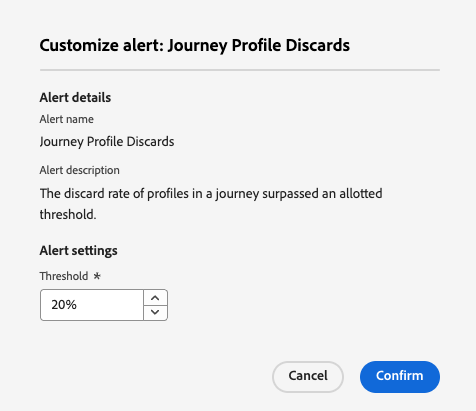{width=60%}

>[!CAUTION]
>
>The threshold levels are global across all journeys and cannot be individually modified per journey.
-->

### Disable an alert

By default, all alerts are enabled. To disable an alert, select the the **[!UICONTROL Disable alert]** option: all subscribers to this alert will no longer receive the related notifications.

### Alert statuses

The possible alert statuses are listed below:

* **[!UICONTROL Enabled]** - The alert is enabled and is currently monitoring trigger condition.
* **[!UICONTROL Disabled]** - The alert is disabled and is currently not monitoring trigger condition. You will receive no notifications for this alert.
* **[!UICONTROL Triggered]** - The alert's trigger condition is currently being met.

### View and update subscribers {#manage-subscribers}

Select **[!UICONTROL Manage alert subscribers]** to view the list of users who subscribed to the alert. 

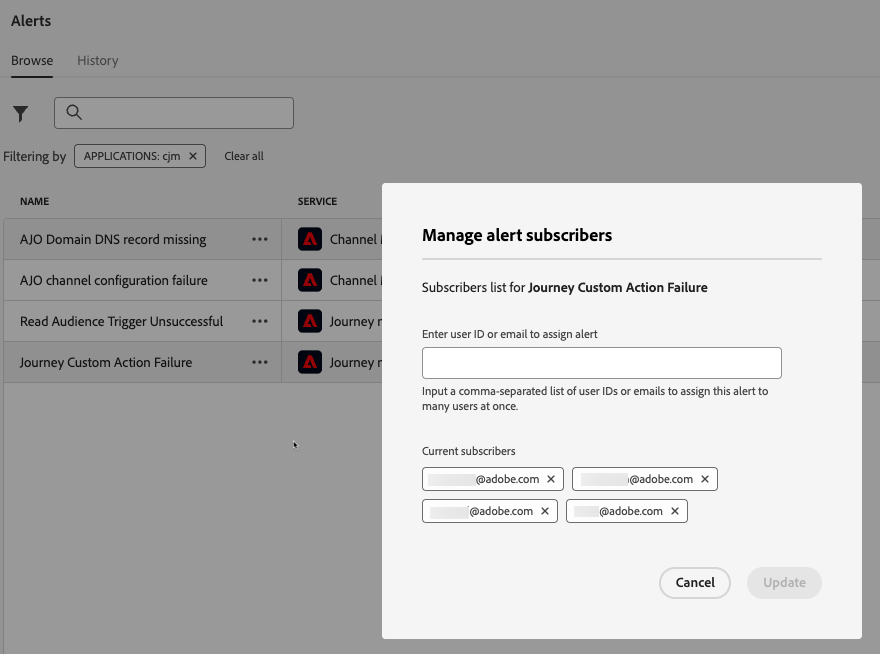{width=80%}

To add more subscribers, enter their email separated by a comma, and select **[!UICONTROL Update]**.

To remove subscribers, delete their email address from the current subscribers, and select **[!UICONTROL Update]**.

## Additional resources {#additional-resources-alerts}

* Learn how to troubleshoot your journeys on [this page](../building-journeys/troubleshooting.md).
* Learn how to review your campaigns on [this page](../campaigns/review-activate-campaign.md). 