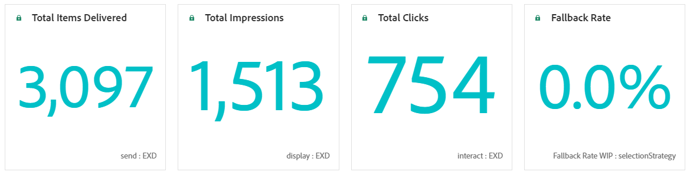
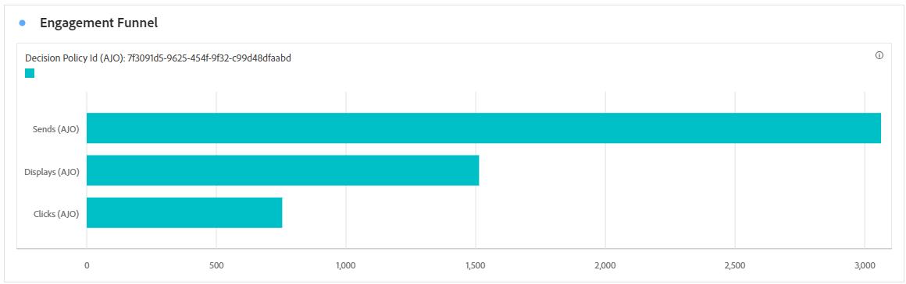
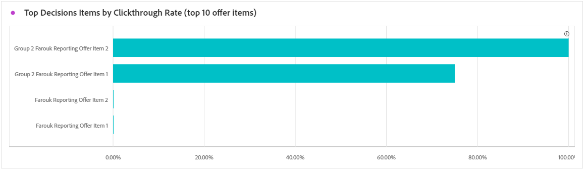
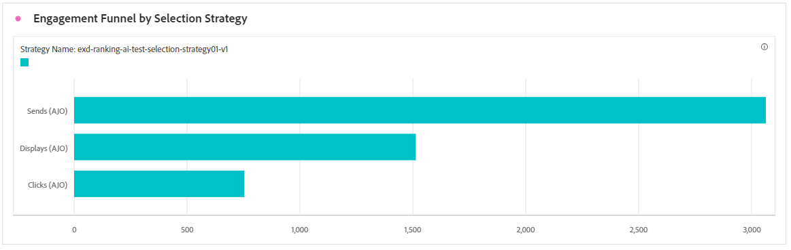
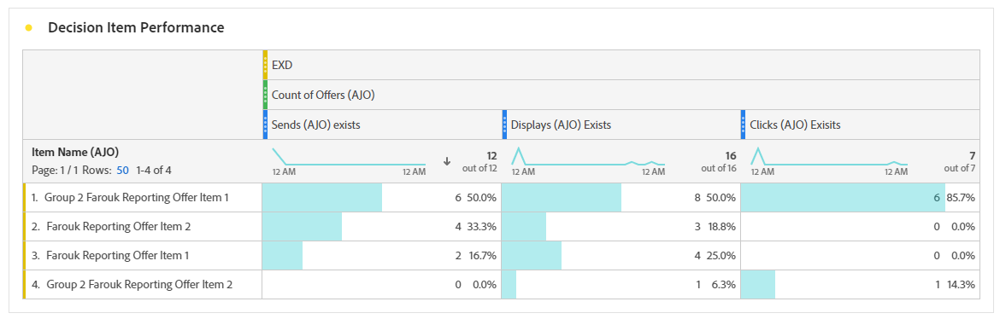

# Experience decisioning {#decisioning}

## Decisioning KPIs {#decisioning-kpis}

The **Decisioning KPIs** provide key insights into your visitors' engagement with your experiences, including metrics such as:

* **[!UICONTROL Total items]**: total number of individual items that were part of a personalized experience or decisioning process within a specified period.

* **[!UICONTROL Total impressions]**: total number of items for which there was at least one click event.

* **[!UICONTROL Total clicks]**: total number of times users clicked on items, links, products, or other interactive elements during a specified period of time.

* **[!UICONTROL Fallback rate]**: percentage of instances where no selection strategies qualified, resulting in the display of a generic or less-specific option.

## Engagement funnel {#engagement-funnel}

The **[!UICONTROL Engagement Funnel]** table monitors the performance of personalized experiences by assessing how effectively each stage of the funnel drives user interactions.

* **[!UICONTROL Sends]**: total number of personalized experiences delivered to users.

* **[!UICONTROL Total impressions]**: total number of items for which there was at least one click event.

* **[!UICONTROL Displays]**: total number of times personalized experiences were shown or presented to users across various touchpoints.

* **[!UICONTROL Total Unique Clicks]**: total number of profiles who clicked on a content in your personalized experiences.

* **[!UICONTROL Clicks]**: total number of times users clicked on personalized experiences that were displayed to them.

## Top decision items by Clickthrough rate {#top-decision}

The **[!UICONTROL Top decision items by CTR]** table highlights the performance of individual items based on their Click-through Rate. This metric helps assess which items are most effective at engaging users and driving interactions.

* **[!UICONTROL Click-through Rate (CTR)]**: percentage of users who click on a link, ad, or recommendation compared to the number of times it was displayed.

## Engagement funnel by selection strategy {#engagement-funnel-selection}

The **[!UICONTROL Engagement Funnel by Selection Strategy]** table evaluates how different selection strategies impact user engagement throughout the funnel.

* **[!UICONTROL Count of Offers]**: total number of personalized experiences made available to users.

* **[!UICONTROL Sends]**: total number of personalized experiences delivered to users.

* **[!UICONTROL Displays]**: total number of times personalized experiences were shown or presented to users across various touchpoints.

* **[!UICONTROL Clicks]**: total number of times users clicked on personalized experiences that were displayed to them.

## Decision items performance by customer responses {#decision-items-performance}

The **[!UICONTROL Decision Items Performance by Customer Responses]** table evaluates how well each item performs in engaging users and driving desired actions, such as purchases, clicks, or other responses.

* **[!UICONTROL Sends]**: total number of personalized experiences delivered to users.

* **[!UICONTROL Displays]**: total number of times personalized experiences were shown or presented to users across various touchpoints.

* **[!UICONTROL Clicks]**: total number of times users clicked on personalized experiences that were displayed to them.
