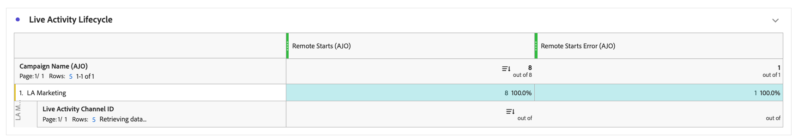

# Live activity campaign report {#campaign-global-report-cja-activity}

>[!BEGINSHADEBOX]

You can access your Live activity campaign report by clicking the **[!UICONTROL Reports]** button from your campaign, then selecting **[!UICONTROL View all time report]**. [Learn more](report-gs-cja.md)


>[!ENDSHADEBOX]

## Sending Statistics {#sending-statistics-mobile}


The **[!UICONTROL Sending Statistics]** table provides a detailed overview of key metrics related to your Live activity campaign. It displays essential information such as the size of the targeted audience and the number of live activity successfully delivered, helping you assess the overall reach and performance of your live activity.

+++ Learn more about Sending Statistics metrics

* **[!UICONTROL Targeted]**: Number of profiles that qualified for the audience before exclusions, suppressions, or consent removals were applied.

* **[!UICONTROL Sends]**: Total number of live activity events attempted to be sent to targeted profiles.

* **[!UICONTROL Delivered]**: Number of live activity events successfully delivered to devices, relative to the total number of attempted sends.

* **[!UICONTROL Send errors]**: Total number of live activity events that could not be sent due to errors (for example, invalid tokens or connectivity issues).

* **[!UICONTROL Send exclusions]**: Number of profiles excluded from sending by Adobe Journey Optimizer (for example, due to opt-out status or eligibility rules).

+++

## Live activity lifecycle {#lifecycle}

The **[!UICONTROL Live activity lifecycle]** table offers a comprehensive view of how your Live activity progresses over time. It provides visibility into key events such as when activity is started, updated, or ended, helping you better understand user engagement and the overall lifecycle of your Live activity campaign.

The reporting differs depending on whether you are using Transactional or Marketing campaigns.

### Transactional Live activity


For Transactional campaign, the Live activity campaign report shows all lifecycle events including remote starts, local starts, updates, and ends.

+++ Learn more about Live activity lifecycle metrics with Transactional campaigns

* **[!UICONTROL Remote starts]**: Total number of Live activity start events initiated remotely, typically triggered by the server or backend systems.

* **[!UICONTROL Local starts]**: Total number of Live activity start events initiated locally on a user's device, often resulting from user interaction or client-side triggers.

* **[!UICONTROL Updates]**: Total number of Live activity updates sent to devices. Updates can include status changes, new content, or progress notifications.

* **[!UICONTROL Ends]**: Total number of Live activity end events sent to devices.

* **[!UICONTROL Totals count]**: Overall total of all Live activity lifecycle events, including starts, updates, and ends, providing a complete measure of Live activity volume.

+++

### Marketing Live activity



Marketing campaigns use Live activity for broadcast use cases, sending updates to multiple devices simultaneously.

For iOS Live activity in Marketing campaigns, the report shows only **[!UICONTROL Remote Starts]** events and **[!UICONTROL Remote starts errors]** at start. **[!UICONTROL Updates]** and **[!UICONTROL Ends]** events are not tracked because APNs distributes updates to all devices without providing feedback. To view **[!UICONTROL Updates]** and **[!UICONTROL Ends]** events, use [Apple's Push Notification console](https://developer.apple.com/notifications/push-notifications-console/).

+++ Learn more about Live activity lifecycle metrics with Marketing campaigns

* **[!UICONTROL Remote starts]**: Total number of Live activity start events initiated remotely, typically triggered by the server or backend systems.

* **[!UICONTROL Remote starts errors]**: Total number of errors that occurred when attempting to start Live activity remotely (for example, invalid tokens or connectivity issues).

+++

#### Retrieving updates and end counts via API {#retrieving-updates-end-api}

As an alternative to using Apple's Push Notification console, Updates and End counts can be obtained through headless API calls.

When executing update or end API calls for broadcast use cases, the response includes a `controlBreakdown` section that provides counters indicating how many update and end calls were executed for the live activity execution. This block is absent for legacy executions without lifecycle data. Execution status can also be retrieved explicitly using the GET endpoint when needed.

**UPDATE / END Response (200 OK)**

```json
{
  "executionId": "HA-exec-abc",
  "campaignId": "campaign-abc-123",
  "campaignVersionId": "v1",
  "audienceId": "audience-segment-id",
  "status": "processing",
  "targetedProfileCount": 150000,
  "createdAt": "2026-02-27T10:00:00Z",
  "executionLifecycle": {
    "lastControlAt": "2026-02-27T10:45:00Z",
    "controlBreakdown": {
      "update": 5,
      "end": 1
    }
  }
}
```

**Execution Status (GET)**

```
GET /im/executions/audience/{executionId}
```

## Error reasons {#error-reasons}


The **[!UICONTROL Error Reasons]** table allows you to identify the specific errors that occurred during the sending process of your Live activity, facilitating a thorough analysis of any issues encountered.

## Excluded reasons {#excluded-reasons}


The **[!UICONTROL Excluded Reasons]** table visually depicts the diverse factors that led to the exclusion of user profiles from the targeted audience, preventing them from receiving your Live activity.
