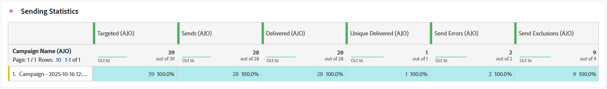
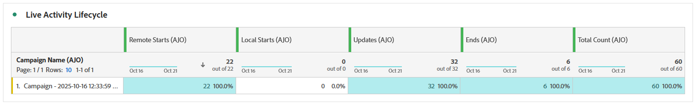
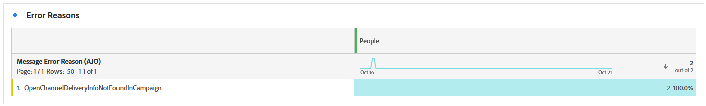
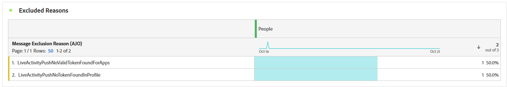

# Live activity campaign report {#campaign-global-report-cja-activity}

>[!BEGINSHADEBOX]

You can access your Live activity campaign report by clicking the **[!UICONTROL Reports]** button from your campaign, then selecting **[!UICONTROL View all time report]**. [Learn more](report-gs-cja.md)

>[!ENDSHADEBOX]

## Sending Statistics {#sending-statistics-mobile}

The **[!UICONTROL Sending Statistics]** table provides a detailed overview of key metrics related to your Live activity campaigns. It displays essential information such as the size of the targeted audience and the number of push notifications successfully delivered, helping you assess the overall reach and performance of your live push notifications.

+++ Learn more about Sending Statistics metrics

* **[!UICONTROL Targeted]**: Number of profiles that qualified for the audience before exclusions, suppressions, or consent removals were applied.

* **[!UICONTROL Sends]**: Total number of push notifications attempted to be sent to targeted profiles.

* **[!UICONTROL Delivered]**: Number of push notifications successfully delivered to devices, relative to the total number of attempted sends.

* **[!UICONTROL Send errors]**: Total number of push notifications that could not be sent due to errors (for example, invalid tokens or connectivity issues).

* **[!UICONTROL Send exclusions]**: Number of profiles excluded from sending by Adobe Journey Optimizer (for example, due to opt-out status or eligibility rules).

+++

## Live activity lifecycle {#lifecycle}

The **[!UICONTROL Live activity lifecycle]** table offers a comprehensive view of how your Live activities progress over time. It provides visibility into key events such as when activities are started, updated, or ended, helping you better understand user engagement and the overall lifecycle of your Live activity campaigns.

+++ Learn more about Live activity lifecycle metrics

* **[!UICONTROL Remote starts]**: Number of Live activities initiated remotely, typically triggered by the server or backend system.

* **[!UICONTROL Local starts]**: Number of Live activities started locally on a user's device, often resulting from user interaction or client-side triggers.

**[!UICONTROL Updates]**: Total number of Live activity updates sent to devices. Updates can include status changes, new content, or progress notifications.

**[!UICONTROL Ends]**: Number of Live activities that have been ended, either automatically upon completion or manually through a defined trigger or timeout.

**[!UICONTROL Totals count]**: Overall total of all Live activity lifecycle events, including starts, updates, and ends, providing a complete measure of Live activity volume.

+++

## Error reasons {#error-reasons}

The **[!UICONTROL Error Reasons]** table allows you to identify the specific errors that occurred during the sending process of your Live activities, facilitating a thorough analysis of any issues encountered.

## Excluded reasons {#excluded-reasons}

The **[!UICONTROL Excluded Reasons]** table visually depicts the diverse factors that led to the exclusion of user profiles from the targeted audience, preventing them from receiving your Live activity.
