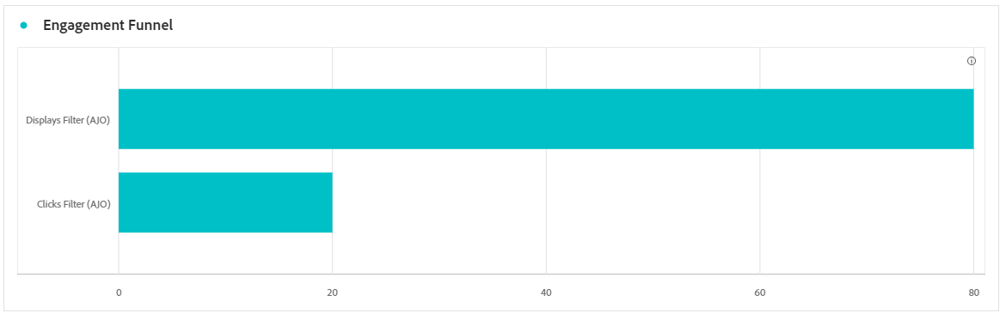
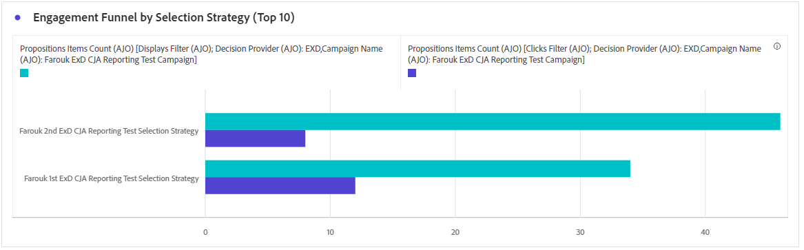

# Code-based campaign report {#campaign-global-report-cja-code}

## Display & click {#impressions-code}

The **[!UICONTROL Display & Click]** graphs present a detailed analysis of your profiles' engagement with your code-based experiences, offering valuable insights into how profiles interact with your content.

+++ Learn more on Impression & Click metrics

* **[!UICONTROL Unique Clicks]**: Number of profiles who clicked on a content in your experiences.

* **[!UICONTROL Clicks]**: Number of times a content was clicked on in your experiences.

* **[!UICONTROL Displays]**: Number of times the experience was opened.

* **[!UICONTROL Unique displays]**: Number of times the experience was opened, multiple interactions of one profile are not taken into account.

+++

## Tracking data {#track-data-code}

The **[!UICONTROL Tracking data]** table offers a detailed snapshot of profile activity tied to your Code-based experiences, providing essential insights into engagement and experiences effectiveness.

+++ Learn more on Tracking data metrics

* **[!UICONTROL People]**: Number of user profiles who qualify as target profiles for your experiences.

* **[!UICONTROL Click through rate (CTR)]**: Percentage of users who interacted with your experiences.

* **[!UICONTROL Clicks]**: Number of times a content was clicked on in your experiences.

* **[!UICONTROL Unique Clicks]**: Number of profiles who clicked on a content in your experiences.

* **[!UICONTROL Displays]**: Number of times your experience was opened.

* **[!UICONTROL Unique displays]**: Number of times your experience was opened, multiple interactions of one profile are not taken into account.

+++

## Tracked link labels {#track-link-code}

The **[!UICONTROL Tracked link labels]** table offers a comprehensive overview of the link labels within your Code-based experiences, highlighting those that generate the highest visitor traffic. This feature empowers you to identify and prioritize the most popular links.

+++ Learn more on Tracked link labels metrics

* **[!UICONTROL Unique Clicks]**: Number of profiles who clicked on a content in your Code-based experiences.

* **[!UICONTROL Clicks]**: Number of times a content was clicked on in your Code-based experiences.

* **[!UICONTROL Displays]**: Number of times the experience was opened.

* **[!UICONTROL Unique displays]**: Number of times the experience was opened, multiple interactions of one profile are not taken into account.

+++

## Decisioning KPIs {#decisioning-kpis}

The **Decisioning KPIs** provide key insights into your visitors' engagement with your experiences, including metrics such as:

* **[!UICONTROL Total items]**: total number of individual items that were part of a personalized experience or decisioning process within a specified period.

* **[!UICONTROL Total displays]**: 

* **[!UICONTROL Total clicks]**: total number of times users clicked on items, links, products, or other interactive elements during a specified period of time.

* **[!UICONTROL Fallback rate]**: percentage of instances where no selection strategies qualified, resulting in the display of a generic or less-specific option.

## Engagement funnel {#engagement-funnel}

The **[!UICONTROL Engagement Funnel]** table monitors the performance of personalized experiences by assessing how effectively each stage of the funnel drives user interactions.

* **[!UICONTROL Displays]**: total number of times personalized experiences were shown or presented to users across various touchpoints.

* **[!UICONTROL Clicks]**: total number of times users clicked on personalized experiences that were displayed to them.

## Top decision items by Clickthrough rate {#top-decision}

The **[!UICONTROL Top decision items by CTR]** table highlights the performance of individual items based on their Click-through Rate. This metric helps assess which items are most effective at engaging users and driving interactions.

* **[!UICONTROL Click-through Rate (CTR)]**: percentage of users who click on a link, ad, or recommendation compared to the number of times it was displayed.

## Engagement funnel by selection strategy {#engagement-funnel-selection}

The **[!UICONTROL Engagement Funnel by Selection Strategy]** table helps you monitor and analyze how effectively different selection strategies are engaging users with personalized experiences.

* **[!UICONTROL Displays]**: total number of times personalized experiences were shown or presented to users across various touchpoints.

* **[!UICONTROL Clicks]**: total number of times users clicked on personalized experiences that were displayed to them.

## Decision items performance {#decision-items-performance}

The **[!UICONTROL Decision Items Performance]** table evaluates how well each item performs in engaging users and driving desired actions, such as purchases, clicks, or other responses.

* **[!UICONTROL Displays]**: total number of times personalized experiences were shown or presented to users across various touchpoints.

* **[!UICONTROL Clicks]**: total number of times users clicked on personalized experiences that were displayed to them.

## Ranking strategy {#ranking-strategy}

>[!NOTE]
>
>The **[!UICONTROL Ranking Strategy]** table becomes available only when an AI model is incorporated into the campaign. [Learn more](../experience-decisioning/ranking.md)

The **[!UICONTROL Ranking Strategy]** table provides insights into the performance of AI-driven ranking models within personalized experiences comparing two traffic types: 
    
* **Model Driven**: users receive content ranked by the AI model, optimized for relevance and engagement.

* **Holdout**: users see a generic version of the content, serving as a control group to measure the AI model's effectiveness.

Key metrics displayed include:

* **[!UICONTROL Displays]**: total number of times personalized experiences were shown or presented to users across various touchpoints.

* **[!UICONTROL Clicks]**: total number of times users clicked on personalized experiences that were displayed to them.

* **[!UICONTROL Conversion rate]**: percentage of displays that resulted in user actions (e.g., clicks), indicating the model's success in engaging users.

## Conversion rate for Holdout and Model Driven traffic {#conversion-rate}

>[!NOTE]
>
>The **[!UICONTROL Conversion rate for Holdout and Model Driven traffic]** graph becomes available only when an AI model is incorporated into the campaign. [Learn more](../experience-decisioning/ranking.md)

The **[!UICONTROL Conversion rate for Holdout and Model Driven traffic]** graph shows the conversion rate over time for two types of traffic: 

* **Model Driven**: users receive content ranked by the AI model, optimized for relevance and engagement.

* **Holdout**: users see a generic version of the content, serving as a control group to measure the AI model's effectiveness.
