# Email campaign report {#campaign-global-report-cja-email}

>[!INFO]
>
>Since Apple introduced new privacy protection features for its native Mail app, including Mail Privacy Protection, senders are no longer able to use tracking pixels to collect data on profiles who have enabled Apple's Mail Privacy Protection. Consequently, Adobe Journey Optimizer ability to track email opens using tracking pixels may be impacted. 
> [Learn more](https://experienceleaguecommunities.adobe.com/t5/adobe-campaign-classic-blogs/the-impact-of-apple-ios-privacy-changes-on-email-marketing-and/ba-p/699780) on the impact of Apple iOS privacy changes on Email marketing.
> 
> We recommend focusing on clicks and conversion metrics instead of open rates for more accurate insights.

>[!BEGINSHADEBOX]

You can access your Email campaign report by clicking the **[!UICONTROL Reports]** button from your campaign, then selecting **[!UICONTROL View all time report]**. [Learn more](report-gs-cja.md)

>[!ENDSHADEBOX]

## Email KPIs

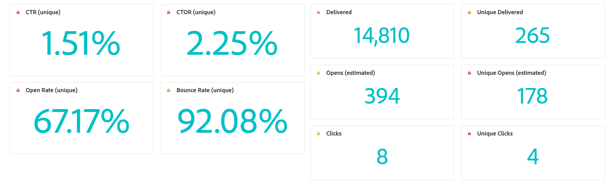

The **[!UICONTROL Email]** Key Performance Indicators (KPIs) provide a focused dashboard of unique and aggregated metrics that reflect the performance and engagement levels of your email campaigns.

+++ Learn more about Email KPIs metrics

* **[!UICONTROL Unique Click-through rate]**: Percentage of unique profiles who clicked on at least one link in the email, relative to the number of unique delivered emails.

* **[!UICONTROL Click through open rate (CTOR)]**: Percentage of profiles who interacted with the message.

* **[!UICONTROL Unique Open rate]**: Percentage of unique profiles who opened the email at least once, relative to the number of unique delivered emails.

* **[!UICONTROL Unique Bounce rate]**: Percentage of unique profiles whose email bounced at least once, based on the total number of unique sends.

* **[!UICONTROL Delivered]**: Number of emails successfully sent, in relation to the total number of sent messages.

* **[!UICONTROL Unique delivered]**: Number of unique profiles that successfully received at least one message.

* **[!UICONTROL Estimated Opens]**: Estimate of total email opens that accounts for both direct opens by profiles and automated opens triggered by mail servers. This metric adjusts for opens triggered by mail servers for privacy or security scanning by applying an open rate calculated from recipients who manually opened the email to those whose emails were only opened by mail servers.

* **[!UICONTROL Unique Estimated Opens]**: Estimate of the number of unique email recipients who likely opened the email. This metric aims to provide a more accurate count of individual engagement triggered by mail servers for privacy or security scanning by applying a unique open rate calculated from unique profiles who manually opened the email to those whose emails were only opened by mail servers.

* **[!UICONTROL Clicks]**: Total number of times any link in the message was clicked, including multiple clicks by the same profile.

* **[!UICONTROL Unique clicks]**: Number of unique profiles who clicked on a content in your message.

+++

## Unique Click funnel 

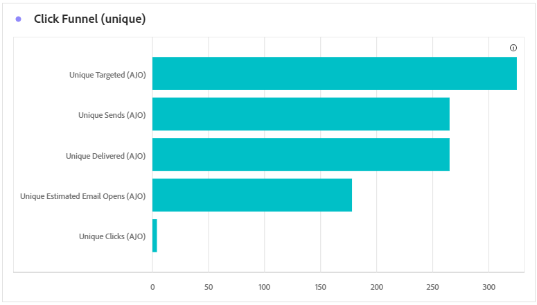

The **[!UICONTROL Click funnel]** graph presents a detailed analysis of how profiles engaged with your email content, offering valuable insights into each stage of interaction, from delivery to clicks, helping you understand how effectively your messages drive user engagement.

+++ Learn more about Click funnel metrics

* **[!UICONTROL Unique Targeted]**: Number of unique profiles targeted during the sending process.

* **[!UICONTROL Unique Sends]**: Number of unique profiles for whom at least one email was attempted to be sent.

* **[!UICONTROL Unique delivered]**: Number of unique profiles that successfully received at least one message.

* **[!UICONTROL Unique estimated opens]**: Estimate of the number of unique email recipients who likely opened the email. This metric aims to provide a more accurate count of individual engagement triggered by mail servers for privacy or security scanning by applying a unique open rate calculated from unique profiles who manually opened the email to those whose emails were only opened by mail servers.

* **[!UICONTROL Unique clicks]**: Number of unique profiles who clicked on a content in your message.

+++

## Unique Delivery status 

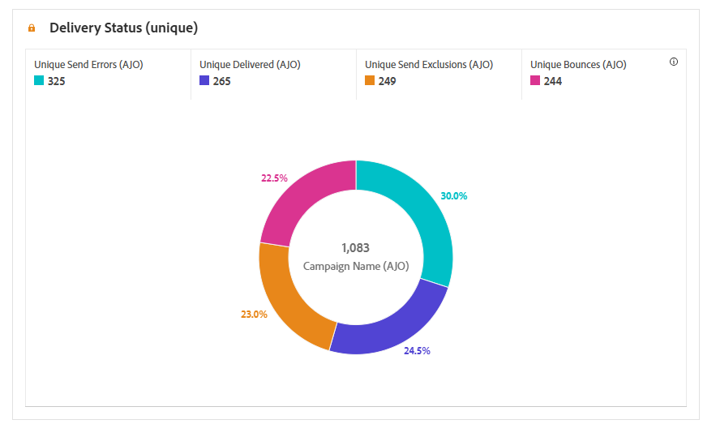

The **[!UICONTROL Delivery status]** graph provides a comprehensive view of data related to sent emails in your campaign, offering insights into key metrics such as delivered and bounces. This enables a detailed analysis of the email sending process, providing valuable information on the efficiency and performance of your campaigns.

+++ Learn more about Delivery status metrics

* **[!UICONTROL Unique send errors]**: Number of unique profiles that experienced at least one sending error during the outbound process.

* **[!UICONTROL Unique delivered]**: Number of unique profiles that successfully received at least one message.

* **[!UICONTROL Unique send exclusions]**: Number of unique profiles excluded from receiving messages due to predefined rules or audience criteria.

* **[!UICONTROL Unique bounces]**: Number of unique profiles for which at least one message bounced during the sending process.

+++

## Delivered vs Click trend {#delivered-click}

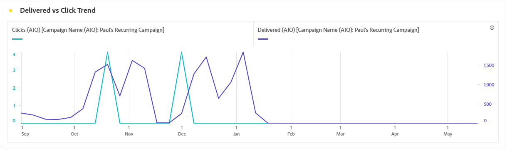

The **[!UICONTROL Delivered vs Click trend]** graph presents a detailed analysis of your profiles' engagement with your emails, offering valuable insights into how profiles interact with your content. The graph uses two axes to show delivered emails and clicks side by side, making it easier to spot unusual patterns or changes in engagement compared to how many emails were sent.

+++ Learn more about Delivered vs Click trend metrics

* **[!UICONTROL Delivered]**: Number of emails successfully sent, in relation to the total number of sent emails.

* **[!UICONTROL Clicks]**: Number of times a content was clicked on in your emails.

+++

## Unique Sending Statistics {#unique-sending-statistics-email}

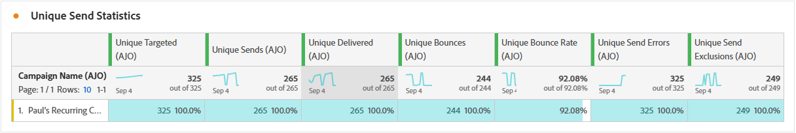

The **[!UICONTROL Unique Sending Statistics]** table presents a detailed overview of unique email performance metrics in your campaigns. It focuses on individual profiles, such as those uniquely targeted, delivered to, bounced, or excluded—providing deeper insights into how your emails are reaching and engaging your audience.

+++ Learn more about Unique Sending Statistics metrics

* **[!UICONTROL Unique Targeted]**: Number of unique profiles targeted during the sending process.

* **[!UICONTROL Unique Sends]**: Number of unique profiles for whom at least one email was attempted to be sent.

* **[!UICONTROL Unique Delivered]**: Number of unique profiles who successfully received at least one email.

* **[!UICONTROL Unique Bounces]**: Number of unique profiles for whom at least one email resulted in a bounce.

* **[!UICONTROL Unique Bounce Rate]**: Percentage of unique profiles whose email bounced at least once, based on the total number of unique sends.

* **[!UICONTROL Unique Send Errors]**: Number of unique profiles that encountered at least one sending error during the outbound process.

* **[!UICONTROL Unique Send Exclusions]**: Number of unique profiles excluded from receiving messages due to eligibility rules, audience segmentation, or profile status.

+++

## Unique Tracking statistics {#unique-tracking-statistics-email}

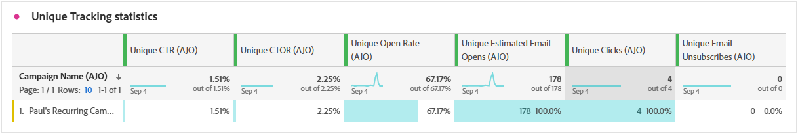

The **[!UICONTROL Unique Tracking statistics]** table provides a focused view of profile-level engagement with the emails in your campaign. It highlights unique metrics offering valuable insights into how individual profiles interact with your email content across key stages of engagement.

+++ Learn more about Tracking statistics metrics

* **[!UICONTROL Unique Click through rate (CTR)]**: Percentage of unique profiles who clicked on at least one link in the email, relative to the number of unique delivered emails.

* **[!UICONTROL Unique Click through open rate (CTOR)]**: Percentage of unique profiles who clicked on a link after opening the email, based on unique opens.

* **[!UICONTROL Unique Open Rate]**: Percentage of unique profiles who opened the email at least once, relative to the number of unique delivered emails.

* **[!UICONTROL Unique Clicks]**: Number of unique profiles who clicked on at least one piece of content in the email.

* **[!UICONTROL Unique Estimated Email Opens]**: Estimate of the number of unique email recipients who likely opened the email. This metric aims to provide a more accurate count of individual engagement triggered by mail servers for privacy or security scanning by applying a unique open rate calculated from unique profiles who manually opened the email to those whose emails were only opened by mail servers.

* **[!UICONTROL Unique Email Unsubscribes]**: Number of unique profiles who clicked the unsubscribe link in your emails or on the associated landing page.

+++

## Sending Statistics {#sending-statistics-email}

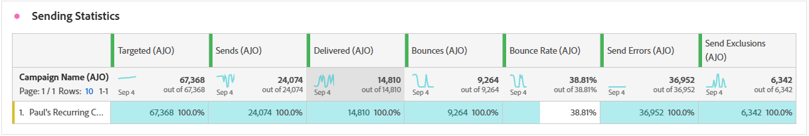

The **[!UICONTROL Sending Statistics]** table provides a comprehensive summary of essential data regarding emails in your campaigns. It details key metrics such as the interactions with your emails and number of emails successfully delivered, offering valuable insights into the effectiveness and reach of your emails and campaigns.

+++ Learn more about Sending Statistics metrics

* **[!UICONTROL Targeted]**: Total number of emails processed during the sending process.

* **[!UICONTROL Sends]**: Total number of sends for your email.

* **[!UICONTROL Delivered]**: Total number of emails successfully sent, in relation to the total number of sent messages.

* **[!UICONTROL Bounces]**: Total of errors cumulated during the sending process and automatic return processing in relation to the total number of sent messages.

* **[!UICONTROL Bounce rate]**: Percentage of emails that resulted in a bounce, relative to the total number of sent emails.

* **[!UICONTROL Send Errors]**: Total number of errors that occurred during the sending process preventing it from being sent to profiles.

* **[!UICONTROL Send Exclusions]**: Total number of profiles which have been excluded by Adobe Journey Optimizer.

+++

## Tracking statistics {#tracking-statistics-email}

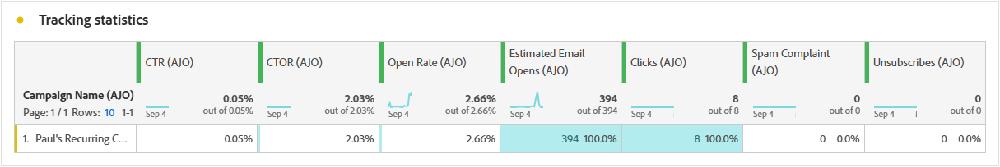

The **[!UICONTROL Email - Tracking statistics]** table offers a detailed account of profile activity related to emails included in your campaign. This includes metrics on opens, clicks, and other relevant engagement indicators, offering a comprehensive view of how profiles interact with your email content.

+++ Learn more about Tracking statistics metrics

* **[!UICONTROL Click through rate (CTR)]**: Percentage of users who interacted with the email.

* **[!UICONTROL Click through open rate (CTOR)]**: Number of times the email was opened.

* **[!UICONTROL Estimated Email Opens]**: Estimate of total email opens that accounts for both direct opens by profiles and automated opens triggered by mail servers. This metric adjusts for opens triggered by mail servers for privacy or security scanning by applying an open rate calculated from recipients who manually opened the email to those whose emails were only opened by mail servers.

* **[!UICONTROL Clicks]**: Number of times a content was clicked on in your emails.

* **[!UICONTROL Spam complaints]**: Number of times a message was declared as spam or junk.

* **[!UICONTROL Unsubscribes]**: Number of clicks on the unsubscription link or on the associated landing page.

+++

## Email domains {#email-domains}

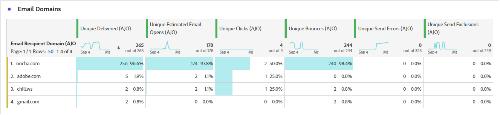

The **[!UICONTROL Email Domains]** table offers an in-depth breakdown of emails categorized by domain, providing extensive insights into the performance metrics of your email campaigns. This comprehensive analysis enables you to understand the behavior of different domains in response to your email content.

+++ Learn more about Email domains metrics

* **[!UICONTROL Unique Delivered]**: Number of unique profiles who successfully received at least one email.

* **[!UICONTROL Estimated Email Opens]**: Estimate of total email opens that accounts for both direct opens by profiles and automated opens triggered by mail servers. This metric adjusts for opens triggered by mail servers for privacy or security scanning by applying an open rate calculated from recipients who manually opened the email to those whose emails were only opened by mail servers.

* **[!UICONTROL Unique Clicks]**: Number of unique profiles who clicked on at least one piece of content in the email.

* **[!UICONTROL Unique Bounces]**: Number of unique profiles for whom at least one email resulted in a bounce.

* **[!UICONTROL Unique Send Errors]**: Number of unique profiles that encountered at least one sending error during the outbound process.

* **[!UICONTROL Unique Send Exclusions]**: Number of unique profiles excluded from receiving messages due to eligibility rules, audience segmentation, or profile status.

+++

## Tracked link labels {#track-link-label}

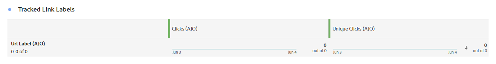

The **[!UICONTROL Tracked link labels]** table offers a comprehensive overview of the link labels within your emails, highlighting those that generate the highest visitor traffic. This feature empowers you to identify and prioritize the most popular links.

+++ Learn more about Tracked link labels metrics

* **[!UICONTROL Unique Clicks]**: Number of profiles who clicked on a content in an email.

* **[!UICONTROL Clicks]**: Number of times a content was clicked on in your emails.

+++

## Tracked link URLs {#track-link-url}

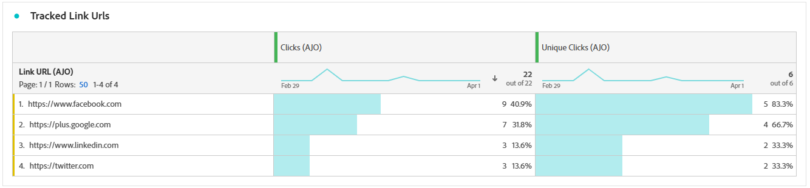

The **[!UICONTROL Tracked link URLs]** table provide a comprehensive overview of the URLs within your email that attract the highest visitor traffic. This enables you to identify and prioritize the most popular links, enhancing your understanding of profile engagement with specific content in your emails.

+++ Learn more about Tracked link URLs metrics

* **[!UICONTROL Unique Clicks]**: Number of profiles who clicked on a content in an email.

* **[!UICONTROL Clicks]**: Number of times a content was clicked on in your emails.

+++

## Email subjects {#email-subjects}

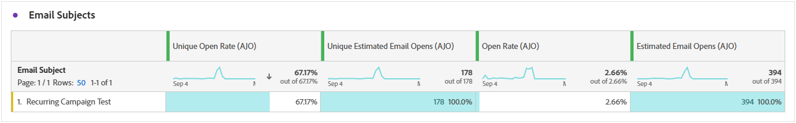

The **[!UICONTROL Email subjects]** table presents a thorough overview of email subjects that have attracted the highest visitor traffic. This resource offers valuable insights into audience engagement dynamics.

+++ Learn more about Email subjects metrics

* **[!UICONTROL Unique Open Rate]**: Percentage of unique profiles who opened the email at least once, relative to the number of unique delivered emails.

* **[!UICONTROL Unique Estimated Email Opens]**: Estimate of the number of unique email recipients who likely opened the email. This metric aims to provide a more accurate count of individual engagement triggered by mail servers for privacy or security scanning by applying a unique open rate calculated from unique profiles who manually opened the email to those whose emails were only opened by mail servers.

* **[!UICONTROL Open Rate]**: Percentage of email opens relative to the total number of emails delivered, including multiple opens by the same profile.

* **[!UICONTROL Estimated Email Opens]**: Estimate of total email opens that accounts for both direct opens by profiles and automated opens triggered by mail servers. This metric adjusts for opens triggered by mail servers for privacy or security scanning by applying an open rate calculated from recipients who manually opened the email to those whose emails were only opened by mail servers.

+++

## Excluded reasons {#excluded-reasons}

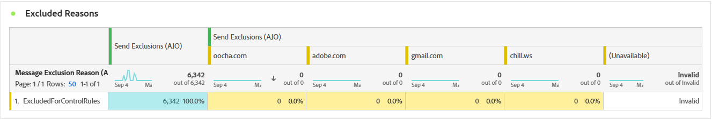

The **[!UICONTROL Excluded reasons]** table presents a comprehensive view of the different factors that resulted in the exclusion of user profiles from the targeted audience, resulting in the message not being received.

Refer to [this page](exclusion-list.md) for the comprehensive list of exclusion reasons.

## Bounce reasons {#bounce-reasons-email}

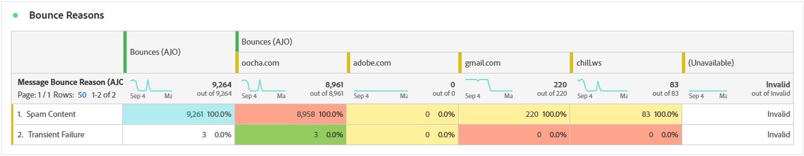

The **[!UICONTROL Bounce Reasons]** table compiles the available data related to bounced messages, providing detailed insights into the specific reasons behind email bounces.

For more information on bounces, refer to the [Suppression list](../reports/suppression-list.md) page.

## Error reasons {#error-reasons-email}

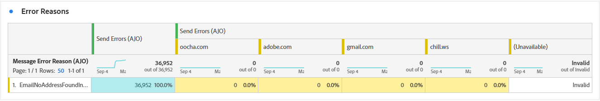

The **[!UICONTROL Error Reasons]** table offers visibility into the specific errors that occurred during the sending process, providing valuable information on the nature and occurrence of errors.
