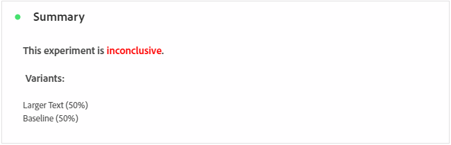
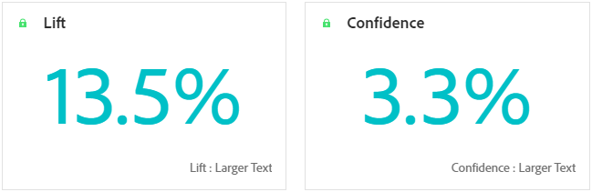

# Experimentation campaign report {#campaign-global-report-cja-experimentation}

>[!BEGINSHADEBOX]

**On this page:** Learn how to read the Experimentation campaign report in Adobe Journey Optimizer to compare variant performance using metrics such as lift, confidence, and conversion rate for your chosen success metric.

>[!ENDSHADEBOX]

>[!CONTEXTUALHELP]
>id="ajo_campaigns_content_experiment_click"
>title="Success metric"
>abstract="The total value of the Success metric, previously selected when creating your Experiments, divided by the number of profiles."

## Experimentation {#experimentation}

The **[!UICONTROL Experimentation]** tab provides key insights into the performance of each variant, and identifies the most successful one.

Note that defining the best performer might take some time. If your experiment is not successful, it will be set to **Inconclusive**.

### Experimentation KPIs {#experimentation-kpis}

The **[!UICONTROL Experimentation]** Key Performance Indicators (KPIs) function as an all-encompassing dashboard, delivering an analysis of essential metrics associated with your experimentation. 

+++ Learn more about Experimentation KPIs metrics

* **[!UICONTROL Lift]**: Measure of the percentage improvement in conversion rate of a given treatment over the baseline.

* **[!UICONTROL Confidence]**: Evidence that a given treatment is the same as the baseline treatment. [Learn more](../content-management/experiment-calculations.md#adobes-statistical-methodology-any-time-valid-confidence-sequences)

+++

### Variant by Success metric {#variant-inbound}

The **Variant by success metrics** table shows how each variant performs based on the success metric selected when setting up the experiment.
For a deep-dive in these results and how to interpret them, refer to [this page](../content-management/get-started-experiment.md#interpret-results).

+++ Learn more about Variant by Success metric

* **[!UICONTROL People]**: Number of user profiles who qualify as target profiles for your messages.

* **[!UICONTROL Inbound Clicks]**: Total value of the Success metric, previously selected when creating your Experiments.

* **[!UICONTROL Conversion rate]**: Total value of the Success metric, previously selected when creating your Experiments, divided by the number of profiles.

* **[!UICONTROL Lift]**: Measure of the percentage improvement in conversion rate of a given treatment over the baseline.

* **[!UICONTROL Confidence Lower bound]**: Lowest estimated value of the conversion rate difference between the treatment and the baseline, within the chosen confidence interval.

* **[!UICONTROL Confidence]**: Evidence that a given treatment is the same as the baseline treatment. [Learn more](../content-management/experiment-calculations.md#adobes-statistical-methodology-any-time-valid-confidence-sequences)

* **[!UICONTROL Confidence Upper bound]**: Highest estimated value of the conversion rate difference between the treatment and the baseline, within the chosen confidence interval.

+++

### Conversion rate for Success metric {#conversion-rate}

The **[!UICONTROL Confidence interval]** graph shows the range of possible improvement, comparing the baseline with the best-performing treatment for the chosen success metric. [Learn more](../content-management/experiment-calculations.md#adobes-statistical-methodology-any-time-valid-confidence-sequences).