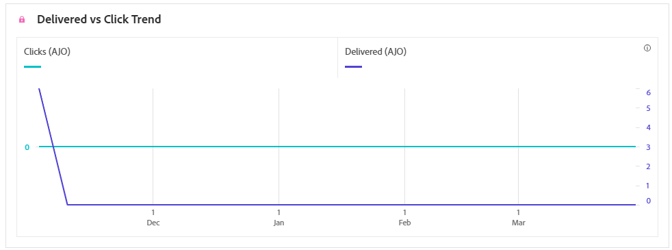
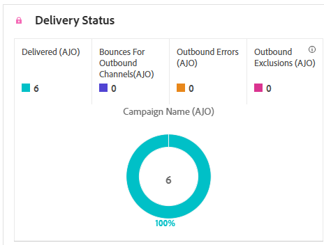

# SMS campaign report {#campaign-global-report-cja-sms}

>[!BEGINSHADEBOX]

**On this page:** Learn how to read the SMS campaign report in Adobe Journey Optimizer to analyze delivery and click trends, delivery status, tracked links, inbound messages, and bounce, error, and exclusion reasons for your SMS messages.

>[!ENDSHADEBOX]

>[!BEGINSHADEBOX]

You can access your SMS campaign report by clicking the **[!UICONTROL Reports]** button from your campaign, then selecting **[!UICONTROL View all time report]**. [Learn more](report-gs-cja.md)

>[!ENDSHADEBOX]

## Delivered vs Click trend {#delivered-click-sms}

The **[!UICONTROL Delivered vs Click trend]** graph presents a detailed analysis of your profiles' engagement with your emails, offering valuable insights into how profiles interact with your content.

+++ Learn more about Delivered vs Click trend metrics

* **[!UICONTROL Delivered]**: Number of SMS messages successfully sent, in relation to the total number of SMS messages.

* **[!UICONTROL Clicks]**: Number of times a content was clicked on in your SMS messages.

+++

## Delivery status {#delivery-status-sms}

The **[!UICONTROL Delivery status]** table offers a detailed account of profile activity related to your SMS campaigns. This includes metrics on delivered, clicks, and other relevant engagement indicators, offering a comprehensive view of how profiles interact with your SMS content.

+++ Learn more about Delivery status metrics

* **[!UICONTROL Delivered]**: Number of SMS messages successfully sent, in relation to the total number of SMS messages.

* **[!UICONTROL Bounces for outbound channels]**: Total of errors cumulated during the sending process and automatic return processing in relation to the total number of sent SMS messages.

* **[!UICONTROL Outbound errors]**: Total number of errors that occurred preventing it from being sent to profiles.

* **[!UICONTROL Outbound exclusions]**: Number of profiles which have been excluded by Adobe Journey Optimizer.

+++

## Tracked link labels {#track-link-label-sms}

The **[!UICONTROL Tracked link labels]** table offers a comprehensive overview of the link labels within your SMS messages, highlighting those that generate the highest visitor traffic. This feature empowers you to identify and prioritize the most popular links.

+++ Learn more about Tracked link labels metrics

* **[!UICONTROL Unique Clicks]**: Number of profiles who clicked on a content in your SMS message.

* **[!UICONTROL Clicks]**: Number of times a content was clicked on in your SMS messages.

+++

## Tracked link URLs {#track-link-url-sms}

The **[!UICONTROL Tracked link URLs]** table provide a comprehensive overview of the URLs within your SMS messages that attract the highest visitor traffic. This enables you to identify and prioritize the most popular links, enhancing your understanding of profile engagement with specific content in your SMS messages.

+++ Learn more about Tracked link URLs metrics

* **[!UICONTROL Unique Clicks]**: Number of profiles who clicked on a content in your SMS message.

* **[!UICONTROL Clicks]**: Number of times a content was clicked on in your SMS messages.

* **[!UICONTROL Displays]**: Number of times the message was opened.

* **[!UICONTROL Unique displays]**: Number of times the message was opened, multiple interactions of one profile are not taken into account.

+++

## SMS inbound message {#sms-inbound}

The **[!UICONTROL SMS inbound message]** table presents a thorough overview of which SMS messages have attracted the highest visitor traffic. This resource offers valuable insights into audience engagement dynamics.

+++ Learn more about SMS inbound message metrics

* **[!UICONTROL People]**: Number of user profiles who qualify as target profiles for your SMS messages.

+++

## SMS Message type {#sms-message-type}

The **[!UICONTROL SMS Message type]** table presents a thorough overview of which SMS Message type have attracted the highest visitor traffic. This resource offers valuable insights into audience engagement dynamics.

+++ Learn more about SMS Message type metrics

* **[!UICONTROL People]**: Number of user profiles who qualify as target profiles for your SMS messages.

+++

## SMS providers {#sms-providers}

The **[!UICONTROL SMS providers]** table presents a thorough overview of which SMS providers have attracted the highest visitor traffic. This resource offers valuable insights into audience engagement dynamics.

+++ Learn more about SMS providers metrics

* **[!UICONTROL People]**: Number of user profiles who qualify as target profiles for your SMS messages.

+++

## Bounce reasons {#bounce-reasons-sms}

The **[!UICONTROL Bounces Reasons]** table provides a comprehensive overview of data related to bounced SMS messages, delivering valuable insights into the specific reasons behind instances of SMS message bounces.

## Error reasons {#error-reasons-sms}

The **[!UICONTROL Error Reasons]** table allows you to identify the specific errors that occurred during the sending process of your SMS messages, facilitating a thorough analysis of any issues encountered.

## Exclude reasons {#excluded-reasons-sms}

The **[!UICONTROL Exclude Reasons]** table visually depicts the diverse factors that led to the exclusion of user profiles from the targeted audience, preventing them from receiving your SMS messages.

Refer to [this page](exclusion-list.md) for the comprehensive list of exclusion reasons.
