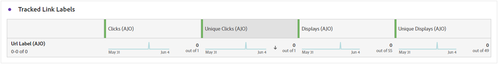

# Web campaign report {#campaign-global-report-cja-web}

## Impression & click trend {#impressions-web}

The **[!UICONTROL Impression & Click trend]** graph presents a detailed analysis of your profiles' engagement with your Web pages, offering valuable insights into how profiles interact with your content.

+++ Learn more on Impression & Click trend metrics

* **[!UICONTROL Clicks]**: Number of times a content was clicked on in your Web pages.

* **[!UICONTROL Displays]**: Number of times the message was opened.

+++

## Clicks {#clicks-web}

The **[!UICONTROL Clicks]** graph displays Web page click metrics, illustrating both the total number of content clicks and the number of unique profiles who clicked on the content.

+++ Learn more on Clicks metrics

* **[!UICONTROL Unique Clicks]**: Number of profiles who clicked on a content in your Web pages.

* **[!UICONTROL Clicks]**: Number of times a content was clicked on in your Web pages.

+++

## Displays {#displays-web}

The **[!UICONTROL Displays]** graph helps you understand both the overall reach of the message and the number of unique profiles engaging with it.

+++ Learn more on Display metrics

* **[!UICONTROL Displays]**: Number of times the message was opened.

* **[!UICONTROL Unique displays]**: Number of times the message was opened, multiple interactions of one profile are not taken into account.

+++

## Tracking data {#track-data-web}

The **[!UICONTROL Tracking data]** table offers a detailed snapshot of profile activity tied to your Web pages, providing essential insights into engagement and Web pages effectiveness.

+++ Learn more on Tracking data metrics

* **[!UICONTROL People]**: Number of user profiles who qualify as target profiles for your Web pages.

* **[!UICONTROL Click through rate (CTR)]**: Percentage of users who interacted with the Web pages.

* **[!UICONTROL Clicks]**: Number of times a content was clicked on in your Web pages.

* **[!UICONTROL Unique Clicks]**: Number of profiles who clicked on a content in your Web pages.

* **[!UICONTROL Displays]**: Number of times the Web page was opened.

* **[!UICONTROL Unique displays]**: Number of times the Web page was opened, multiple interactions of one profile are not taken into account.

+++

## Tracked link labels {#track-link-web}

The **[!UICONTROL Tracked link labels]** table offers a comprehensive overview of the link labels within your Web pages, highlighting those that generate the highest visitor traffic. This feature empowers you to identify and prioritize the most popular links.

+++ Learn more on Tracked link labels metrics

* **[!UICONTROL Unique Clicks]**: Number of profiles who clicked on a content in your Web pages.

* **[!UICONTROL Clicks]**: Number of times a content was clicked on in your Web pages.

* **[!UICONTROL Displays]**: Number of times the message was opened.

* **[!UICONTROL Unique displays]**: Number of times the message was opened, multiple interactions of one profile are not taken into account.

+++

## Tracked link URLs {#track-url-web}

The **[!UICONTROL Tracked link URLs]** table provide a comprehensive overview of the URLs within your Web pages that attract the highest visitor traffic. This enables you to identify and prioritize the most popular links, enhancing your understanding of profile engagement with specific content in your Web pages.

+++ Learn more on Tracked link URLs metrics

* **[!UICONTROL Unique Clicks]**: Number of profiles who clicked on a content in your Web pages.

* **[!UICONTROL Clicks]**: Number of times a content was clicked on in your Web pages.

* **[!UICONTROL Displays]**: Number of times the message was opened.

* **[!UICONTROL Unique displays]**: Number of times the message was opened, multiple interactions of one profile are not taken into account.

+++
