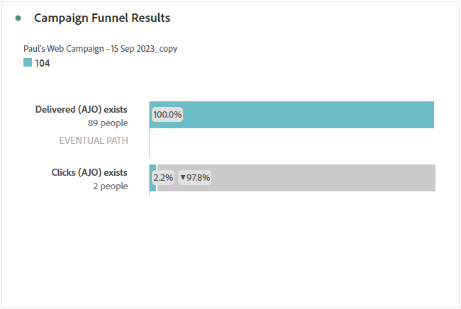

# Campaign report {#campaign-global-report-cja}

## Campaign KPIs {#campaign-kpis}

The **[!UICONTROL Campaign]** Key Performance Indicators (KPIs) function as an all-encompassing dashboard, delivering an analysis of essential metrics associated with your campaign. This encompasses details such as the count of clicks and number of delivered messages, offering a comprehensive insight into your campaign's effectiveness and level of engagement.

The KPIs will vary based on the channels used in your campaign.

+++ Learn more on Campaign KPIs metrics

* **[!UICONTROL Click through rate]**: Percentage of users who interacted with the message.

* **[!UICONTROL Clicks]**: Number of times a content was clicked on in your message.

* **[!UICONTROL Delivered]**: Number of emails successfully sent, in relation to the total number of sent messages.

* **[!UICONTROL Displays]**: Number of times the message was opened.

+++

### Campaign overview {#delivery-global}

The **[!UICONTROL Campaign overview]** table serve as a comprehensive dashboard, offering a detailed breakdown of key metrics related to your campaign. This includes essential information such as the number of profiles and the actions delivered, providing a thorough understanding of your campaign's performance and engagement.

Note that metrics will vary based on the channels used in your campaign.

+++ Learn more on Campaign overview metrics

* **[!UICONTROL People]**: Number of user profiles who qualify as target profiles for your messages.

* **[!UICONTROL Click through rate]**: Percentage of users who interacted with the message.

* **[!UICONTROL Clicks]**: Number of times a content was clicked on in your message.

* **[!UICONTROL Unique Clicks]**: Number of profiles who clicked on a content in your message.

* **[!UICONTROL Delivered]**: Number of emails successfully sent, in relation to the total number of sent messages.

* **[!UICONTROL Bounces for outbound channels]**: Total number of errors cumulated during the sending process and automatic return processing in relation to the total number of sent messages.

* **[!UICONTROL Outbound Errors]**: Total number of errors that occurred during the sending process preventing it from being sent to profiles.

* **[!UICONTROL Outbound Exclusions]**: Number of profiles which have been excluded by Adobe Journey Optimizer.

* **[!UICONTROL Displays]**: Number of times the message was opened.

* **[!UICONTROL Unique displays]**: Number of times the message was opened, multiple interactions of one profile are not taken into account.

+++

### Campaign funnel results {#campaign-funnel}

The **[!UICONTROL Campaign funnel results]** graph presents a detailed analysis of your profiles' engagement with your messages, offering valuable insights into how various profiles interacted with your content.

+++ Learn more on Campaign funnel results metrics

* **[!UICONTROL Delivered]**: Number of emails successfully sent, in relation to the total number of sent messages.

* **[!UICONTROL Clicks]**: Number of times a content was clicked on in your message.
+++

### Tracked link label {#campaign-track}

The **[!UICONTROL Tracked link label]** table offers essential insights into your visitors' engagement with the URLs included in your messages, providing valuable information about which links attract the most interaction.

+++ Learn more on Tracked link label metrics

* **[!UICONTROL Unique Clicks]**: Number of profiles who clicked on a content in your message.

* **[!UICONTROL Clicks]**: Number of times a content was clicked on in your message.

+++
