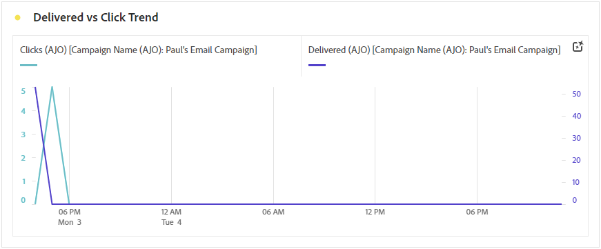
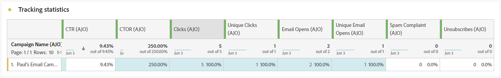
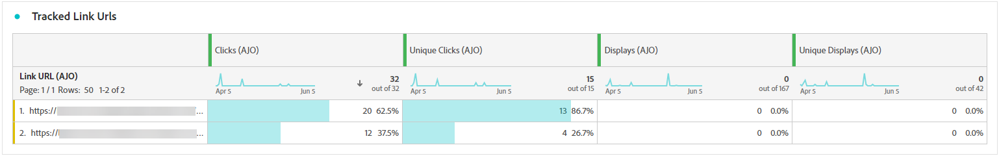
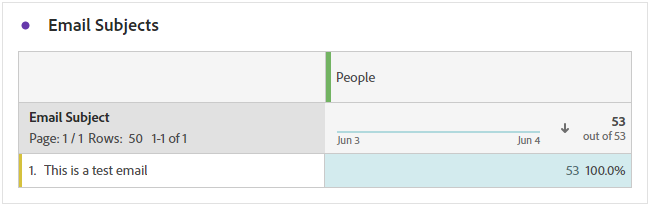

# Campaign report {#campaign-global-report-cja}

The **Campaign report** acts as a comprehensive dashboard, providing a detailed analysis of key metrics associated with your campaign. It includes data such as click counts, delivered messages, profile numbers, and actions taken. By offering a complete overview of your campaign's effectiveness and engagement levels, the report ensures a thorough understanding of your campaign's overall performance.

Campaign reports can be accessed directly from your Campaign with the **[!UICONTROL Reports]** button.

The **Campaign report** page will be displayed with the following tabs depending on the chosen channel:

* [Campaign](#campaign-global)
* [Experimentation](#experimentation)
* [Email](#email-global)
* [SMS](#sms)
* [Push notification](#push-notification)
* [Direct mail](#direct-mail)
* [Web](#web)
* [Experience Desicioning](#decisioning)

To learn more on Customer Journey Analytics Workspace and how to filter and analyze data, refer to [this page](https://experienceleague.adobe.com/en/docs/analytics-platform/using/cja-workspace/home).

## Campaign {#campaign-global}

### Campaign KPIs {#campaign-kpis}

The **[!UICONTROL Campaign]** Key Performance Indicators (KPIs) function as an all-encompassing dashboard, delivering an analysis of essential metrics associated with your campaign. This encompasses details such as the count of clicks and number of delivered messages, offering a comprehensive insight into your campaign's effectiveness and level of engagement.

The KPIs will vary based on the channels used in your campaign.

+++ Learn more on Campaign KPIs metrics

* **[!UICONTROL Click through rate]**: Percentage of users who interacted with the message.

* **[!UICONTROL Clicks]**: Number of times a content was clicked on in your message.

* **[!UICONTROL Delivered]**: Number of emails successfully sent, in relation to the total number of sent messages.

* **[!UICONTROL Displays]**: Number of times the message was opened.

+++

### Campaign overview {#delivery-global}

The **[!UICONTROL Campaign overview]** table serve as a comprehensive dashboard, offering a detailed breakdown of key metrics related to your campaign. This includes essential information such as the number of profiles and the actions delivered, providing a thorough understanding of your campaign's performance and engagement.

Note that metrics will vary based on the channels used in your campaign.

+++ Learn more on Campaign overview metrics

* **[!UICONTROL People]**: Number of user profiles who qualify as target profiles for your messages.

* **[!UICONTROL Click through rate]**: Percentage of users who interacted with the message.

* **[!UICONTROL Clicks]**: Number of times a content was clicked on in your message.

* **[!UICONTROL Unique Clicks]**: Number of profiles who clicked on a content in your message.

* **[!UICONTROL Delivered]**: Number of emails successfully sent, in relation to the total number of sent messages.

* **[!UICONTROL Bounces for outbound channels]**: Total number of errors cumulated during the sending process and automatic return processing in relation to the total number of sent messages.

* **[!UICONTROL Outbound Errors]**: Total number of errors that occurred during the sending process preventing it from being sent to profiles.

* **[!UICONTROL Outbound Exclusions]**: Number of profiles which have been excluded by Adobe Journey Optimizer.

* **[!UICONTROL Displays]**: Number of times the message was opened.

* **[!UICONTROL Unique displays]**: Number of times the message was opened, multiple interactions of one profile are not taken into account.

+++

### Campaign funnel results {#campaign-funnel}

The **[!UICONTROL Campaign funnel results]** graph presents a detailed analysis of your profiles' engagement with your messages, offering valuable insights into how various profiles interacted with your content.

+++ Learn more on Campaign funnel results metrics

* **[!UICONTROL Delivered]**: Number of emails successfully sent, in relation to the total number of sent messages.

* **[!UICONTROL Clicks]**: Number of times a content was clicked on in your message.
+++

### Tracked link label {#campaign-track}

The **[!UICONTROL Tracked link label]** table offers essential insights into your visitors' engagement with the URLs included in your messages, providing valuable information about which links attract the most interaction.

+++ Learn more on Tracked link label metrics

* **[!UICONTROL Unique Clicks]**: Number of profiles who clicked on a content in your message.

* **[!UICONTROL Clicks]**: Number of times a content was clicked on in your message.

+++

## Experimentation {#experimentation}

The **[!UICONTROL Experimentation]** tab provides key insights into the performance of each variant, and identifies the most successful one.

Note that defining the best performer might take some time. If your experiment is not successful, it will be set to **Inconclusive**.

### Experimentation KPIs {#experimentation-kpis}

The **[!UICONTROL Experimentation]** Key Performance Indicators (KPIs) function as an all-encompassing dashboard, delivering an analysis of essential metrics associated with your experimentation. 

+++ Learn more on Experimentation KPIs metrics

* **[!UICONTROL Lift]**: Measure of the percentage improvement in conversion rate of a given treatment over the baseline.

* **[!UICONTROL Confidence]**: Evidence that a given treatment is the same as the baseline treatment. [Learn more](../content-management/experiment-calculations.md#understand-confidence)

+++

### Variant by Inbound clicks {#variant-inbound}

The **[!UICONTROL Variant by Inbound clicks]** widget details the performance of each variant.
For a deep-dive in these results and how to interpret them, refer to [this page](../content-management/get-started-experiment.md#interpret-results).

+++ Learn more on Variant by Inbound clicks metrics

* **[!UICONTROL People]**: Number of user profiles who qualify as target profiles for your messages.

* **[!UICONTROL Inbound Clicks]**: Total count of clicks across outbound channels.

* **[!UICONTROL Conversion rate]**: Total value of the Success metric, previously selected when creating your Experiments, divided by the number of profiles.

* **[!UICONTROL Lift]**: Measure of the percentage improvement in conversion rate of a given treatment over the baseline.

* **[!UICONTROL Confidence]**: Evidence that a given treatment is the same as the baseline treatment. [Learn more](../content-management/experiment-calculations.md#understand-confidence)

<!--
* **[!UICONTROL Confidence Upper bound]**:

* **[!UICONTROL Confidence Lower bound]**:
-->
+++

### Conversion rate for Inbound clicks {#conversion-rate}

The **[!UICONTROL Confidence interval]** graph measures uncertainty around improvement. It details the percentage difference in performance between the baseline and the best performing treatment. [Learn more](../content-management/experiment-calculations.md#confidence-intervals). 

## Email {#email-global}

### Delivered vs Click trend {#delivered-click}

The **[!UICONTROL Delivered vs Click trend]** graph presents a detailed analysis of your profiles' engagement with your emails, offering valuable insights into how profiles interact with your content.

+++ Learn more on Delivered vs Click trend metrics

* **[!UICONTROL Delivered]**: Number of emails successfully sent, in relation to the total number of sent emails.

* **[!UICONTROL Clicks]**: Number of times a content was clicked on in your emails.

+++

### Delivery status {#delivery-status}

The **[!UICONTROL Delivery status]** graph provides a comprehensive view of data related to sent emails in your campaign, offering insights into key metrics such as delivered and bounces. This enables a detailed analysis of the email sending process, providing valuable information on the efficiency and performance of your campaigns.

+++ Learn more on Delivery status metrics

* **[!UICONTROL Delivered]**: Number of emails successfully sent, in relation to the total number of sent emails.

* **[!UICONTROL Bounces for outbound channels]**:Total of errors cumulated during the sending process and automatic return processing in relation to the total number of sent messages.

* **[!UICONTROL Outbound errors]**: Total number of errors that occurred during a the sending process preventing it from being sent to profiles.

* **[!UICONTROL Outbound exclusions]**: Number of profiles which have been excluded by Adobe Journey Optimizer.

+++

### Sending Statistics {#sending-statistics-email}

The **[!UICONTROL Sending Statistics]** table provides a comprehensive summary of essential data regarding emails in your campaigns. It details key metrics such as the interactions with your emails and number of emails successfully delivered, offering valuable insights into the effectiveness and reach of your emails and campaigns.

+++ Learn more on Sending Statistics metrics

* **[!UICONTROL People]**: Number of user profiles who qualify as target profiles for your messages.

* **[!UICONTROL Targeted]**: Total number of emails processed during the sending process.

* **[!UICONTROL Sends]**: Total number of sends for your email.

* **[!UICONTROL Delivered]**: Number of emails successfully sent, in relation to the total number of sent messages.

* **[!UICONTROL Bounces for outbound channels]**: Total of errors cumulated during the sending process and automatic return processing in relation to the total number of sent messages.

* **[!UICONTROL Outbound Errors]**: Total number of errors that occurred during the sending process preventing it from being sent to profiles.

* **[!UICONTROL Outbound Exclusions]**: Number of profiles which have been excluded by Adobe Journey Optimizer.

+++

### Tracking statistics {#tracking-statistics-email}

The **[!UICONTROL Email - Tracking statistics]** table offers a detailed account of profile activity related to emails included in your campaign. This includes metrics on opens, clicks, and other relevant engagement indicators, offering a comprehensive view of how profiles interact with your email content.

+++ Learn more on Tracking statistics metrics

* **[!UICONTROL Click through rate (CTR)]**: Percentage of users who interacted with the email.

* **[!UICONTROL Click through open rate (CTOR)]**: Number of times the email was opened.

* **[!UICONTROL Clicks]**: Number of times a content was clicked on in your emails.

* **[!UICONTROL Unique Clicks]**: Number of profiles who clicked on a content in an email.

* **[!UICONTROL Email Opens]**: Number of times your emails were opened in a campaign.

* **[!UICONTROL Unique Email Opens]**: Percentage of opened emails.

* **[!UICONTROL Spam complaints]**: Number of times a message was declared as spam or junk.

* **[!UICONTROL Unsubscribes]**: Number of clicks on the unsubscription link.

+++

### Email domains {#email-domains}

The **[!UICONTROL Email Domains]** table offers an in-depth breakdown of emails categorized by domain, providing extensive insights into the performance metrics of your email campaigns. This comprehensive analysis enables you to understand the behavior of different domains in response to your email content.

+++ Learn more on Email domains metrics

* **[!UICONTROL Sends]**: Total number of sends for your email.

* **[!UICONTROL Delivered]**: Number of emails successfully sent, in relation to the total number of sent emails.

* **[!UICONTROL Email Opens]**: Number of times your emails were opened in a campaign.

* **[!UICONTROL Clicks]**: Number of times a content was clicked on in your emails.

* **[!UICONTROL Bounces for outbound channels]**: Total number of errors cumulated during the sending process and automatic return processing in relation to the total number of sent emails.

* **[!UICONTROL Outbound Errors]**: Total number of errors that occurred during the sending process preventing it from being sent to profiles.
+++

### Tracked link labels {#track-link-label}

The **[!UICONTROL Tracked link labels]** table offers a comprehensive overview of the link labels within your emails, highlighting those that generate the highest visitor traffic. This feature empowers you to identify and prioritize the most popular links.

+++ Learn more on Tracked link labels metrics

* **[!UICONTROL Unique Clicks]**: Number of profiles who clicked on a content in an email.

* **[!UICONTROL Clicks]**: Number of times a content was clicked on in your emails.

+++

### Tracked link URLs {#track-link-url}

The **[!UICONTROL Tracked link URLs]** table provide a comprehensive overview of the URLs within your email that attract the highest visitor traffic. This enables you to identify and prioritize the most popular links, enhancing your understanding of profile engagement with specific content in your emails.

+++ Learn more on Tracked link URLs metrics

* **[!UICONTROL Unique Clicks]**: Number of profiles who clicked on a content in an email.

* **[!UICONTROL Clicks]**: Number of times a content was clicked on in your emails.

* **[!UICONTROL Displays]**: Number of times the email was opened.

* **[!UICONTROL Unique displays]**: Number of times the email was opened, multiple interactions of one profile are not taken into account.

+++

### Email subjects {#email-subjects}

The **[!UICONTROL Email subjects]** table presents a thorough overview of email subjects that have attracted the highest visitor traffic. This resource offers valuable insights into audience engagement dynamics.

+++ Learn more on Email subjects metrics

* **[!UICONTROL People]**: Number of user profiles who qualify as target profiles for your emails.

+++

### Excluded reasons {#excluded-reasons}

The **[!UICONTROL Excluded reasons]** table presents a comprehensive view of the different factors that resulted in the exclusion of user profiles from the targeted audience, resulting in the message not being received.

Refer to [this page](exclusion-list.md) for the comprehensive list of exclusion reasons.

### Bounce reasons {#bounce-reasons-email}

The **[!UICONTROL Bounce Reasons]** table compiles the available data related to bounced messages, providing detailed insights into the specific reasons behind email bounces.

For more information on bounces, refer to the [Suppression list](../reports/suppression-list.md) page.

### Error reasons {#error-reasons-email}

The **[!UICONTROL Error Reasons]** table offers visibility into the specific errors that occurred during the sending process, providing valuable information on the nature and occurrence of errors.

## SMS {#sms}

### Delivered vs Click trend {#delivered-click-sms}

The **[!UICONTROL Delivered vs Click trend]** graph presents a detailed analysis of your profiles' engagement with your emails, offering valuable insights into how profiles interact with your content.

+++ Learn more on Delivered vs Click trend metrics

* **[!UICONTROL Delivered]**: Number of SMS messages successfully sent, in relation to the total number of SMS messages.

* **[!UICONTROL Clicks]**: Number of times a content was clicked on in your SMS messages.

+++

### Delivery status {#delivery-status-sms}

The **[!UICONTROL Delivery status]** table offers a detailed account of profile activity related to your SMS campaigns. This includes metrics on delivered, clicks, and other relevant engagement indicators, offering a comprehensive view of how profiles interact with your SMS content.

+++ Learn more on Delivery status metrics

* **[!UICONTROL Delivered]**: Number of SMS messages successfully sent, in relation to the total number of SMS messages.

* **[!UICONTROL Bounces for outbound channels]**: Total of errors cumulated during the sending process and automatic return processing in relation to the total number of sent SMS messages.

* **[!UICONTROL Outbound errors]**: Total number of errors that occurred preventing it from being sent to profiles.

* **[!UICONTROL Outbound exclusions]**: Number of profiles which have been excluded by Adobe Journey Optimizer.

+++

### Tracked link labels {#track-link-label-sms}

The **[!UICONTROL Tracked link labels]** table offers a comprehensive overview of the link labels within your SMS messages, highlighting those that generate the highest visitor traffic. This feature empowers you to identify and prioritize the most popular links.

+++ Learn more on Tracked link labels metrics

* **[!UICONTROL Unique Clicks]**: Number of profiles who clicked on a content in your SMS message.

* **[!UICONTROL Clicks]**: Number of times a content was clicked on in your SMS messages.

+++

### Tracked link URLs {#track-link-url-sms}

The **[!UICONTROL Tracked link URLs]** table provide a comprehensive overview of the URLs within your SMS messages that attract the highest visitor traffic. This enables you to identify and prioritize the most popular links, enhancing your understanding of profile engagement with specific content in your SMS messages.

+++ Learn more on Tracked link URLs metrics

* **[!UICONTROL Unique Clicks]**: Number of profiles who clicked on a content in your SMS message.

* **[!UICONTROL Clicks]**: Number of times a content was clicked on in your SMS messages.

* **[!UICONTROL Displays]**: Number of times the message was opened.

* **[!UICONTROL Unique displays]**: Number of times the message was opened, multiple interactions of one profile are not taken into account.

+++

### SMS inbound message {#sms-inbound}

The **[!UICONTROL SMS inbound message]** table presents a thorough overview of which SMS messages have attracted the highest visitor traffic. This resource offers valuable insights into audience engagement dynamics.

+++ Learn more on SMS inbound message metrics

* **[!UICONTROL People]**: Number of user profiles who qualify as target profiles for your SMS messages.

+++

### SMS Message type {#sms-message-type}

The **[!UICONTROL SMS Message type]** table presents a thorough overview of which SMS Message type have attracted the highest visitor traffic. This resource offers valuable insights into audience engagement dynamics.

+++ Learn more on SMS Message type metrics

* **[!UICONTROL People]**: Number of user profiles who qualify as target profiles for your SMS messages.

+++

### SMS providers {#sms-providers}

The **[!UICONTROL SMS providers]** table presents a thorough overview of which SMS providers have attracted the highest visitor traffic. This resource offers valuable insights into audience engagement dynamics.

+++ Learn more on SMS providers metrics

* **[!UICONTROL People]**: Number of user profiles who qualify as target profiles for your SMS messages.

+++

### Bounce reasons {#bounce-reasons-sms}

The **[!UICONTROL Bounces Reasons]** table provides a comprehensive overview of data related to bounced SMS messages, delivering valuable insights into the specific reasons behind instances of SMS message bounces.

### Error reasons {#error-reasons-sms}

The **[!UICONTROL Error Reasons]** table allows you to identify the specific errors that occurred during the sending process of your SMS messages, facilitating a thorough analysis of any issues encountered.

### Exclude reasons {#excluded-reasons-sms}

The **[!UICONTROL Exclude Reasons]** table visually depicts the diverse factors that led to the exclusion of user profiles from the targeted audience, preventing them from receiving your SMS messages.

Refer to [this page](exclusion-list.md) for the comprehensive list of exclusion reasons.

## Push notification {#push-notification}

### Sending Statistics {#sending-statistics-push}

The **[!UICONTROL Sending Statistics]** table provides a comprehensive summary of essential data regarding your push notification campaigns. It details key metrics such as the size of the targeted audience and number of push notification successfully delivered, offering valuable insights into the effectiveness and reach of your push notification.

+++ Learn more on Sending Statistics metrics

* **[!UICONTROL People]**: Number of user profiles who qualify as target profiles for your push notifications.

* **[!UICONTROL Targeted]**: Total number of push notifications processed during the analysis.

* **[!UICONTROL Sends]**: Total number of sends for the push notification.

* **[!UICONTROL Delivered]**: Number of push notifications successfully sent, in relation to the total number of sent push notifications.

* **[!UICONTROL Bounces for outbound channels]**: Total of errors cumulated during the sending process and automatic return processing in relation to the total number of push notifications.

* **[!UICONTROL Outbound errors]**: Total number of errors that occurred preventing it from being sent to profiles.

* **[!UICONTROL Outbound exclusions]**: Number of profiles which have been excluded by Adobe Journey Optimizer.

+++

### Tracking statistics {#tracking-statistics-push}

The **[!UICONTROL Tracking statistics]** table offers a detailed snapshot of profile activity tied to your push notifications, providing essential insights into engagement and push notifications effectiveness.

+++ Learn more on Tracking statistics metrics

* **[!UICONTROL Click through rate (CTR)]**: Percentage of users who interacted with the push notifications.

* **[!UICONTROL Click through open rate (CTOR)]**: Number of times the push notifications was opened.

* **[!UICONTROL Clicks]**: Number of times a content was clicked on in your push notifications.

* **[!UICONTROL Unique Clicks]**: Number of profiles who clicked on a content in your push notifications.

<!--
* **[!UICONTROL Push custom actions]**: 
-->
+++

### Tracked link labels {#track-link-label-push}

The **[!UICONTROL Tracked link labels]** table offers a comprehensive overview of the link labels within your push notifications, highlighting those that generate the highest visitor traffic. This feature empowers you to identify and prioritize the most popular links.

+++ Learn more on Tracked link labels metrics

* **[!UICONTROL Unique Clicks]**: Number of profiles who clicked on a content in your push notifications.

* **[!UICONTROL Clicks]**: Number of times a content was clicked on in your push notifications.

+++

### Tracked link URLs {#track-link-url-push}

The **[!UICONTROL Tracked link URLs]** table provide a comprehensive overview of the URLs within your push notifications that attract the highest visitor traffic. This enables you to identify and prioritize the most popular links, enhancing your understanding of profile engagement with specific content in your push notifications.

+++ Learn more on Tracked link URLs metrics

* **[!UICONTROL Unique Clicks]**: Number of profiles who clicked on a content in your push notifications.

* **[!UICONTROL Clicks]**: Number of times a content was clicked on in your push notifications.

+++

### Bounce reasons {#bounce-reasons-push}

The **[!UICONTROL Bounces Reasons]** table provides a comprehensive overview of data related to bounced push notifications, delivering valuable insights into the specific reasons behind instances of push notifications bounces.

### Error reasons {#error-reasons-push}

The **[!UICONTROL Error Reasons]** table allows you to identify the specific errors that occurred during the sending process of your push notifications, facilitating a thorough analysis of any issues encountered.

### Excluded reasons {#exclude-reasons-push}

The **[!UICONTROL Exclude Reasons]** table visually depicts the diverse factors that led to the exclusion of user profiles from the targeted audience, preventing them from receiving your push notifications.

Refer to [this page](exclusion-list.md) for the comprehensive list of exclusion reasons.

## In-app {#in-app}

### Impression & click trend {#impression-click-trend}

The **[!UICONTROL Impression & Click trend]** graph presents a detailed analysis of your profiles' engagement with your In-app messages, offering valuable insights into how profiles interact with your content.

+++ Learn more on Impression & Click trend metrics

* **[!UICONTROL Clicks]**: Number of times a content was clicked on in your In-app messages.

* **[!UICONTROL Displays]**: Number of times the message was opened.

+++

### Clicks {#clicks-inapp}

The **[!UICONTROL Clicks]** graph displays In-app click metrics, illustrating both the total number of content clicks and the number of unique profiles who clicked on the content. 

+++ Learn more on Clicks metrics

* **[!UICONTROL Unique Clicks]**: Number of profiles who clicked on a content in your In-app messages

* **[!UICONTROL Clicks]**: Number of times a content was clicked on in your In-app messages.

+++

### Display {#display-inapp}

The **[!UICONTROL Displays]** graph helps you understand both the overall reach of the message and the number of unique profiles engaging with it.

+++ Learn more on Display metrics

* **[!UICONTROL Displays]**: Number of times the message was opened.

* **[!UICONTROL Unique displays]**: Number of times the message was opened, multiple interactions of one profile are not taken into account.

+++

### Tracking data {#tracking-data-inapp}

The **[!UICONTROL Tracking data]** table offers a detailed snapshot of profile activity tied to your In-app messages, providing essential insights into engagement and In-app messages effectiveness.

+++ Learn more on Tracking data metrics

* **[!UICONTROL People]**: Number of user profiles who qualify as target profiles for your In-app messages.

* **[!UICONTROL Click through rate (CTR)]**: Percentage of users who interacted with the In-app messages.

* **[!UICONTROL Click through open rate (CTOR)]**: Number of times the In-app messages was opened.

* **[!UICONTROL Clicks]**: Number of times a content was clicked on in your In-app messages.

* **[!UICONTROL Unique Clicks]**: Number of profiles who clicked on a content in your In-app messages.

* **[!UICONTROL Displays]**: Number of times the message was opened.

* **[!UICONTROL Unique displays]**: Number of times the message was opened, multiple interactions of one profile are not taken into account.

* **[!UICONTROL Sends]**: Total number of sends for your In-app messages.

<!--
* **[!UICONTROL Inbound triggered]**: 

* **[!UICONTROL Inbound dismisses]**: 
-->
+++

### Tracked link labels {#track-link-label-inapp}

The **[!UICONTROL Tracked link labels]** table offers a comprehensive overview of the link labels within your In-app messages, highlighting those that generate the highest visitor traffic. This feature empowers you to identify and prioritize the most popular links.

+++ Learn more on Tracked link labels metrics

* **[!UICONTROL Unique Clicks]**: Number of profiles who clicked on a content in your In-app messages.

* **[!UICONTROL Clicks]**: Number of times a content was clicked on in your In-app messages.

* **[!UICONTROL Displays]**: Number of times the message was opened.

* **[!UICONTROL Unique displays]**: Number of times the message was opened, multiple interactions of one profile are not taken into account.

+++

### Tracked link URLs {#track-link-url-inapp}

The **[!UICONTROL Tracked link URLs]** table provide a comprehensive overview of the URLs within your In-app messages that attract the highest visitor traffic. This enables you to identify and prioritize the most popular links, enhancing your understanding of profile engagement with specific content in your In-app messages.

+++ Learn more on Tracked link URLs metrics

* **[!UICONTROL Unique Clicks]**: Number of profiles who clicked on a content in your In-app messages.

* **[!UICONTROL Clicks]**: Number of times a content was clicked on in your In-app messages.

+++

## Direct mail {#direct-mail}

### Sending Statistics {#sending-statistics-directmail}

The **[!UICONTROL Sending Statistics]** table provides a comprehensive summary of essential data regarding your direct mail campaigns. It details key metrics such as the size of the targeted audience and number of direct mail successfully delivered, offering valuable insights into the effectiveness and reach of your direct mail messages.

+++ Learn more on Sending Statistics metrics

* **[!UICONTROL People]**: Number of user profiles who qualify as target profiles for your messages.

* **[!UICONTROL Targeted]**: Total number of direct mail messages processed during the sending process.

* **[!UICONTROL Sends]**: Total number of sends for your direct mail messages.

* **[!UICONTROL Delivered]**: Number of direct mail messages successfully sent, in relation to the total number of sent messages.

* **[!UICONTROL Outbound Errors]**: Total number of errors that occurred during the sending process preventing it from being sent to profiles.

* **[!UICONTROL Outbound Exclusions]**: Number of profiles which have been excluded by Adobe Journey Optimizer.

+++

### Delivery status {#delivery-status-directmail}

The **[!UICONTROL Delivery status]** graph provides a comprehensive view of data related to sent direct mail messages in your campaign, offering insights into key metrics such as delivered and errors. This enables a detailed analysis of the direct mail messages sending process, providing valuable information on the efficiency and performance of your campaigns.

+++ Learn more on Delivery status metrics

* **[!UICONTROL Delivered]**: Number of direct mail messages successfully sent, in relation to the total number of sent direct mail messages.

* **[!UICONTROL Outbound errors]**: Total number of errors that occurred during a the sending process preventing your direct mail messages from being sent to profiles.

* **[!UICONTROL Ountbound exclusions]**: Number of profiles which have been excluded by Adobe Journey Optimizer.

+++

### Error reasons {#error-reasons-directmail}

The **[!UICONTROL Error Reasons]** table allows you to identify the specific errors that occurred during the sending process of your direct mail messages, facilitating a thorough analysis of any issues encountered.

### Excluded reasons {#exclude-reasons-directmail}

The **[!UICONTROL Exclude Reasons]** table visually depicts the diverse factors that led to the exclusion of user profiles from the targeted audience, preventing them from receiving your direct mail messages.

Refer to [this page](exclusion-list.md) for the comprehensive list of exclusion reasons.

## Web {#web}

### Impression & click trend {#impressions-web}

The **[!UICONTROL Impression & Click trend]** graph presents a detailed analysis of your profiles' engagement with your Web pages, offering valuable insights into how profiles interact with your content.

+++ Learn more on Impression & Click trend metrics

* **[!UICONTROL Clicks]**: Number of times a content was clicked on in your Web pages.

* **[!UICONTROL Displays]**: Number of times the message was opened.

+++

### Clicks {#clicks-web}

The **[!UICONTROL Clicks]** graph displays Web page click metrics, illustrating both the total number of content clicks and the number of unique profiles who clicked on the content.

+++ Learn more on Clicks metrics

* **[!UICONTROL Unique Clicks]**: Number of profiles who clicked on a content in your Web pages.

* **[!UICONTROL Clicks]**: Number of times a content was clicked on in your Web pages.

+++

### Displays {#displays-web}

The **[!UICONTROL Displays]** graph helps you understand both the overall reach of the message and the number of unique profiles engaging with it.

+++ Learn more on Display metrics

* **[!UICONTROL Displays]**: Number of times the message was opened.

* **[!UICONTROL Unique displays]**: Number of times the message was opened, multiple interactions of one profile are not taken into account.

+++

### Tracking data {#track-data-web}

The **[!UICONTROL Tracking data]** table offers a detailed snapshot of profile activity tied to your Web pages, providing essential insights into engagement and Web pages effectiveness.

+++ Learn more on Tracking data metrics

* **[!UICONTROL People]**: Number of user profiles who qualify as target profiles for your Web pages.

* **[!UICONTROL Click through rate (CTR)]**: Percentage of users who interacted with the Web pages.

* **[!UICONTROL Clicks]**: Number of times a content was clicked on in your Web pages.

* **[!UICONTROL Unique Clicks]**: Number of profiles who clicked on a content in your Web pages.

* **[!UICONTROL Displays]**: Number of times the Web page was opened.

* **[!UICONTROL Unique displays]**: Number of times the Web page was opened, multiple interactions of one profile are not taken into account.

+++

### Tracked link labels {#track-link-web}

The **[!UICONTROL Tracked link labels]** table offers a comprehensive overview of the link labels within your Web pages, highlighting those that generate the highest visitor traffic. This feature empowers you to identify and prioritize the most popular links.

+++ Learn more on Tracked link labels metrics

* **[!UICONTROL Unique Clicks]**: Number of profiles who clicked on a content in your Web pages.

* **[!UICONTROL Clicks]**: Number of times a content was clicked on in your Web pages.

* **[!UICONTROL Displays]**: Number of times the message was opened.

* **[!UICONTROL Unique displays]**: Number of times the message was opened, multiple interactions of one profile are not taken into account.

+++

### Tracked link URLs {#track-url-web}

The **[!UICONTROL Tracked link URLs]** table provide a comprehensive overview of the URLs within your Web pages that attract the highest visitor traffic. This enables you to identify and prioritize the most popular links, enhancing your understanding of profile engagement with specific content in your Web pages.

+++ Learn more on Tracked link URLs metrics

* **[!UICONTROL Unique Clicks]**: Number of profiles who clicked on a content in your Web pages.

* **[!UICONTROL Clicks]**: Number of times a content was clicked on in your Web pages.

* **[!UICONTROL Displays]**: Number of times the message was opened.

* **[!UICONTROL Unique displays]**: Number of times the message was opened, multiple interactions of one profile are not taken into account.

+++

## Experience decisioning {#decisioning}

### Decisioning KPIs {#decisioning-kpis}

The **Decisioning KPIs** provide key insights into your visitors' engagement with your experiences, including metrics such as:

* Total items: total number of individual items that were part of a personalized experience or decisioning process within a specified period.

* Total impressions: total number of experiences delivered to all users.

* Total clicks: total number of times users clicked on items, links, products, or other interactive elements during a specified period of time.

* Fallback rate: percentage of instances where no selection strategies qualified, resulting in the display of a generic or less-specific option.

### Engagement funnel {#engagement-funnel}

The **[!UICONTROL Engagement Funnel]** table monitors the performance of personalized experiences by assessing how effectively each stage of the funnel drives user interactions.

* Sends: total number of personalized experiences delivered to users.

* Displays: total number of times personalized experiences were shown or presented to users across various touchpoints.

* Clicks: total number of times users clicked on personalized experiences that were displayed to them.

### Top decision items by CTR {#top-decision}

The **[!UICONTROL Top decision items by CTR]** table highlights the performance of individual items based on their Click-through Rate. This metric helps assess which items are most effective at engaging users and driving interactions.

* Click-through Rate (CTR): percentage of users who click on a link, ad, or recommendation compared to the number of times it was displayed.

### Engagement funnel by selection strategy {#engagement-funnel-selection}

The **[!UICONTROL Engagement Funnel by Selection Strategy]** table evaluates how different selection strategies impact user engagement throughout the funnel.

* Sends: total number of personalized experiences delivered to users.

* Displays: total number of times personalized experiences were shown or presented to users across various touchpoints.

* Clicks: total number of times users clicked on personalized experiences that were displayed to them.

## Decision items performance by customer responses {#decision-items-performance}

The **[!UICONTROL Decision Items Performance by Customer Responses]** table evaluates how well each item performs in engaging users and driving desired actions, such as purchases, clicks, or other responses.

* Sends: total number of personalized experiences delivered to users.

* Displays: total number of times personalized experiences were shown or presented to users across various touchpoints.

* Clicks: total number of times users clicked on personalized experiences that were displayed to them.
