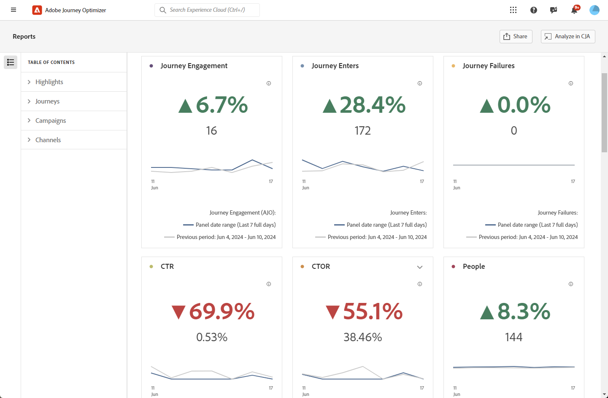
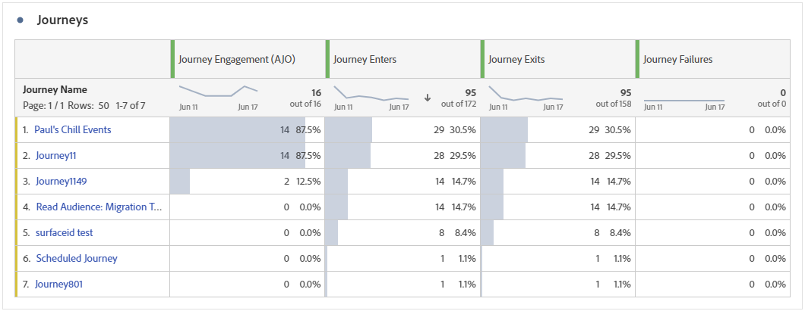
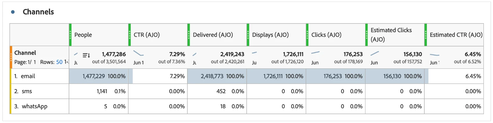
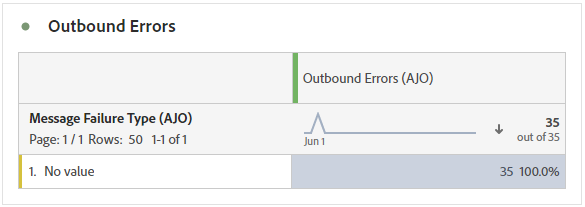
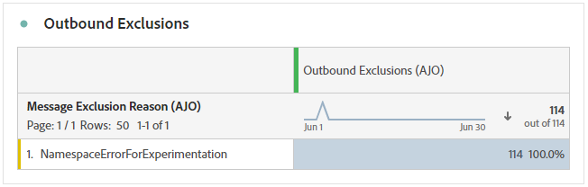

# Overview report {#channel-report-cja}

The Overview report offers users a thorough summary of traffic and engagement metrics for all campaigns and journeys within your environment. These metrics are combined to present unified values for actions coming from different channels, encompassing various campaigns and journeys.

You can access the Overview report by navigating to the **Reports** menu within the **Journey Management** section.

The report page is displayed with the following tabs:

* [Journeys](#journey)
* [Campaigns](#campaign)
* [Channels](#channel)
* [Rule sets](#rule-sets)
* [Optimization models](#optimization-models)

To learn more about Customer Journey Analytics Workspace and how to filter and analyze data, refer to [this page](https://experienceleague.adobe.com/en/docs/analytics-platform/using/cja-workspace/home).

## Highlights {#highlights}

The **[!UICONTROL Highlights]** KPIs serve as a comprehensive dashboard, offering a detailed breakdown of key metrics for all campaigns and journeys within your environment, enabling you to quickly assess performance and identify areas for improvement.

+++ Learn more about Highlights metrics

* **[!UICONTROL Journey engagement]**: Total number of unique individuals who received messages sent through the journey, representing distinct profiles that reached a designated action point in the journey.

* **[!UICONTROL Journey Enters]**: Total number of individuals who reached the entry event of the journey.

* **[!UICONTROL Journey Failures]**: Total number of individual journeys that were not successfully executed.

* **[!UICONTROL Click through rate]**: Percentage of clicks in your messages.

* **[!UICONTROL Click-through open rate (CTOR)]**: Number of times the message was opened.

* **[!UICONTROL People]**: Number of user profiles who qualify as target profiles for your messages. 

* **[!UICONTROL Clicks]**: Number of times a content was clicked on in your messages.

* **[!UICONTROL Spam complaints]**: Number of times a message was declared as spam or junk.

* **[!UICONTROL Unsubscribes]**: Number of clicks on the unsubscription link.

+++

## Journey {#journey}

The **[!UICONTROL Journey]** table serves as a comprehensive dashboard, providing an analysis of key metrics related to your journey. It includes details such as the number of profiles entered and instances of failed individual journeys, offering a thorough understanding of your journey's effectiveness and engagement levels.

By clicking on the name of any journey listed in this table, you can easily explore each journey individually, gaining immediate access to its comprehensive report in a new tab.

+++ Learn more about Journey metrics

* **[!UICONTROL Journey Enters]**: Total number of individuals who reached the entry event of the journey.

* **[!UICONTROL Journey Exits]**: Total number of individuals who exited the journey.

* **[!UICONTROL Journey Failures]**: Total number of individual journeys that were not successfully executed.

+++

## Campaigns {#campaign}

The **[!UICONTROL Campaign]** table functions as an all-encompassing dashboard, presenting a detailed overview of critical metrics for your campaign. It features essential data such as the number of profiles and sends, giving you a comprehensive insight into your campaign's performance and engagement levels.

By clicking on the name of any campaign listed in this table, you can easily explore each campaign individually, gaining immediate access to its comprehensive report in a new tab.

+++ Learn more about Campaign metrics

* **[!UICONTROL People]**: Number of user profiles who qualify as target profiles for your messages.

* **[!UICONTROL Click through rate (CTR)]**: Percentage of clicks in your messages.

* **[!UICONTROL Sends]**: Total number of sends for each campaign.

* **[!UICONTROL Delivered]**: Number of messages successfully sent.

* **[!UICONTROL Displays]**: Number of times the message was opened.

* **[!UICONTROL Clicks]**: Number of times a content was clicked on in your messages.

+++

## Channels {#channel}

### Channels

The **[!UICONTROL Channels]** table provides a detailed breakdown of your profiles' engagement with your messages at the channel level. This allows you to gain deeper insights into how different channels are performing.

+++ Learn more about Channels metrics

* **[!UICONTROL People]**: Number of user profiles who qualify as target profiles for your messages.

* **[!UICONTROL Click through rate (CTR)]**: Percentage of clicks in your messages.

* **[!UICONTROL Delivered]**: Number of messages successfully sent.

* **[!UICONTROL Displays]**: Number of times the message was opened.

* **[!UICONTROL Clicks]**: Number of times a content was clicked on in your messages.

+++

### Outbound errors

The **[!UICONTROL Outbound errors]** table empowers you to pinpoint the precise errors that occurred throughout the sending process, facilitating a clear understanding of any issues encountered.

### Outbound exclusions

The **[!UICONTROL Outbound exclusions]** table present a comprehensive view of the different factors that resulted in the exclusion of user profiles from the targeted audience, resulting in the message not being received.

## Journey capping and conflicts {#rule-sets}

The **[!UICONTROL Journey Capping and Conflicts]** table provides insights into how journey arbitration rule sets are performing, showing journey entrances and exclusions based on the capping rules and priority scores applied to your journeys.

+++ Learn more about Rule sets metrics

The **[!UICONTROL Journey Entries by Rule Set]** column shows the number of profiles that entered the journey. There are three types of entrances:

* ****[!UICONTROL No conflict]****: The profile entered the journey without any rule set conflicts. No active rule sets prevented this entry, and the journey entry occurred regardless of arbitration rules.

* **Higher priority**: The profile entered the journey due to its higher priority than other competing journeys. Even though there was a conflict (the profile qualified for multiple journeys), this journey was selected due to its higher priority score.

* **Not enforced**: The profile entered the journey, but the rule set was not active or not applied to this journey entry at the time of entry. 

The **[!UICONTROL Exclusions]** column shows the number of profiles that were excluded from entering the journey. Profiles can be excluded for two reasons:

* **Cap reached**: The profile has reached the maximum number of journey entries or concurrent journeys allowed by the capping rule.

* **Lower priority**: The cap has not been reached, but other higher priority journeys meet the constraints. The profile was excluded from this journey and entered a higher priority journey instead.

+++

➡️ [Learn more about journey capping & arbitration](../conflict-prioritization/journey-capping.md)

## Optimization models {#optimization-models}

The **[!UICONTROL Send-Time Optimization]** tables give you insights into how your Optimized and Control Email or Push messages are performing. Use it to compare key metrics, such as sends, opens, clicks, and bounces—so you can see how each variant is doing and inform your optimization decisions.

Note that metrics in this report, including **[!UICONTROL Lift]** and **[!UICONTROL Confidence]**, are calculated from **60 days** of sends and engagement.

+++ Learn more about Send-time optimization metrics

* **[!UICONTROL Sends]**: Total number of times each message variant was sent.

* **[!UICONTROL Open]**: Total number of open events recorded for the message.

* **[!UICONTROL Open rate]**: The percentage of sent messages for which the profile opened the message at least once. 

* **[!UICONTROL Lift]**: Percentage improvement in conversion rate for a given treatment relative to the baseline variant. Lift quantifies the magnitude of a difference; interpret it together with **[!UICONTROL Confidence]**.

* **[!UICONTROL Confidence]**: Statistical strength of evidence that the Send-Time Optimized variant's open or click rate differs from the Control variant (send time assigned at random). It is computed with a two-proportion Z-test.

+++
