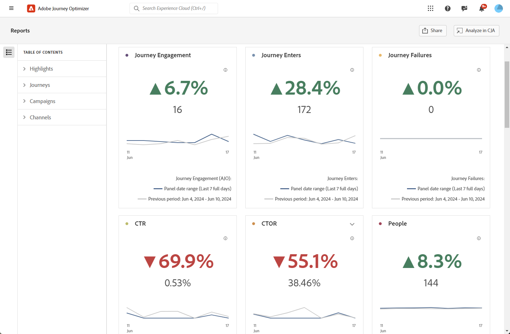

# Overview report {#channel-report-cja}

The Overview report offers users a thorough summary of traffic and engagement metrics for all campaigns and journeys within your environment. These metrics are combined to present unified values for actions coming from different channels, encompassing various campaigns and journeys.

You can access the Overview report by navigating to the **Reports** menu within the **Journey Management** section.

The report page is displayed with the following tabs:

* [Journeys](#journey)
* [Campaigns](#campaign)
* [Channels](#channel)

To learn more on Customer Journey Analytics Workspace and how to filter and analyze data, refer to [this page](https://experienceleague.adobe.com/en/docs/analytics-platform/using/cja-workspace/home).

## Highlights {#highlights}

The **[!UICONTROL Highlights]** KPIs serve as a comprehensive dashboard, offering a detailed breakdown of key metrics for all campaigns and journeys within your environment, enabling you to quickly assess performance and identify areas for improvement.

+++ Learn more on Highlights metrics

* **[!UICONTROL Journey engagement]**: Total number of individuals who interacted with the messages that were sent from the journey.

* **[!UICONTROL Journey Enters]**: Total number of individuals who reached the entry event of the journey.

* **[!UICONTROL Journey Failures]**: Total number of individual journeys that were not successfully executed.

* **[!UICONTROL Click through rate]**: Percentage of clicks in your messages.

* **[!UICONTROL Click-through open rate (CTOR)]**: Number of times the message was opened.

* **[!UICONTROL People]**: Number of user profiles who qualify as target profiles for your messages. 

* **[!UICONTROL Clicks]**: Number of times a content was clicked on in your messages.

* **[!UICONTROL Spam complaints]**: Number of times a message was declared as spam or junk.

* **[!UICONTROL Unsubscribes]**: Number of clicks on the unsubscription link.

+++

## Journey {#journey}

The **[!UICONTROL Journey]** table serves as a comprehensive dashboard, providing an analysis of key metrics related to your journey. It includes details such as the number of profiles entered and instances of failed individual journeys, offering a thorough understanding of your journey's effectiveness and engagement levels.

By clicking on the name of any journey listed in this table, you can easily explore each journey individually, gaining immediate access to its comprehensive report in a new tab.

+++ Learn more on Journey metrics

* **[!UICONTROL Journey Enters]**: Total number of individuals who reached the entry event of the journey.

* **[!UICONTROL Journey Exits]**: Total number of individuals who exited the journey.

* **[!UICONTROL Journey Failures]**: Total number of individual journeys that were not successfully executed.

+++

## Campaigns {#campaign}

The **[!UICONTROL Campaign]** table functions as an all-encompassing dashboard, presenting a detailed overview of critical metrics for your campaign. It features essential data such as the number of profiles and sends, giving you a comprehensive insight into your campaign's performance and engagement levels.

By clicking on the name of any campaign listed in this table, you can easily explore each campaign individually, gaining immediate access to its comprehensive report in a new tab.

+++ Learn more on Campaign metrics

* **[!UICONTROL People]**: Number of user profiles who qualify as target profiles for your messages.

* **[!UICONTROL Sends]**: Total number of sends for each campaign.

* **[!UICONTROL Displays]**: Number of times the message was opened.

* **[!UICONTROL Clicks]**: Number of times a content was clicked on in your messages.

+++

## Channels {#channel}

### Channels

The **[!UICONTROL Channels]** table provides a detailed breakdown of your profiles' engagement with your messages at the channel level. This allows you to gain deeper insights into how different channels are performing.

+++ Learn more on Channels metrics

* **[!UICONTROL People]**: Number of user profiles who qualify as target profiles for your messages.

* **[!UICONTROL Click through rate]**: Percentage of clicks in your messages.

* **[!UICONTROL Sends]**: Total number of sends for each campaign.

* **[!UICONTROL Displays]**: Number of times the message was opened.

* **[!UICONTROL Clicks]**: Number of times a content was clicked on in your messages.

+++

### Outbound errors

The **[!UICONTROL Outbound errors]** table empowers you to pinpoint the precise errors that occurred throughout the sending process, facilitating a clear understanding of any issues encountered.

### Outbound exclusions

The **[!UICONTROL Outbound exclusions]** table present a comprehensive view of the different factors that resulted in the exclusion of user profiles from the targeted audience, resulting in the message not being received.
