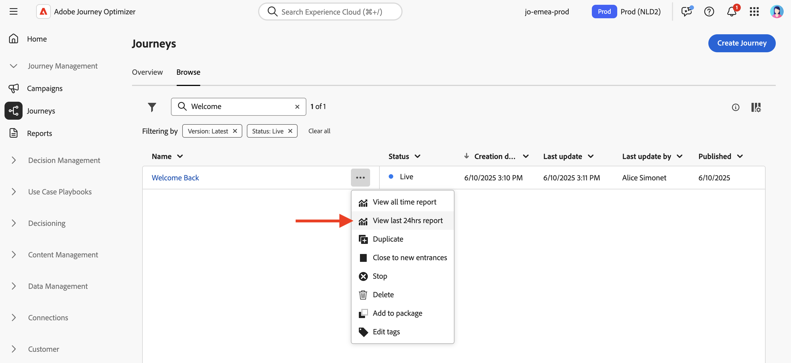
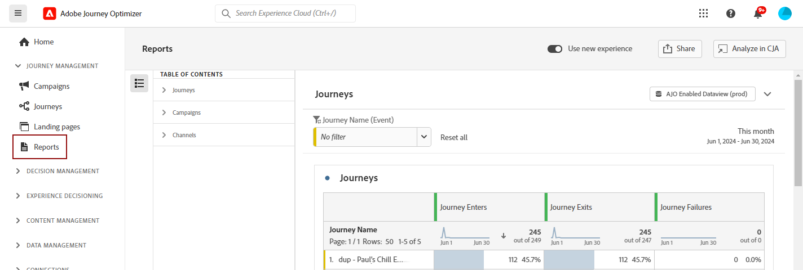

# Get started with reporting capabilities {#get-started-report}

Adobe Journey Optimizer offers you actionable insights through its robust reporting capabilities. Reports are available for campaigns, journeys, landing pages, subscription lists, and more. Available reports are listed below.

In addition, to optimize the deliverability of your [!DNL Journey Optimizer] experiences, we recommend using the best practices listed [in this section](deliverability.md).

## Types of reports {#reporting-types}

* **Last 24-hours live reports** - Use the **[!UICONTROL Live report]** to measure and visualize in real-time the impact and performances of your journeys and your messages in a built-in dashboard. Data are available in the **[!UICONTROL Live report]** as soon as your delivery is sent or your journey is executed from the **[!UICONTROL Last 24hrs]** tab. Learn more about live reports [in this section](live-report.md).

    

* **All-time reports with Customer Journey Analytics** - Journey Optimizer reporting is fully integrated with Customer Journey Analytics capabilities, standardizing reporting across both platforms and improving data consistency and reliability. This seamless integration between Journey Optimizer and Customer Journey Analytics provides a clearer view of performance metrics, enabling users to make more informed decisions. Learn more about all-time reports [in this section](report-gs-cja.md).

    

    If you own an Adobe Customer Journey Analytics license, you can analyse your Journey Optimizer reports into Customer Journey Analytics. This powerful option seamlessly redirects you to your Customer Journey Analytics environment, empowering you to personalize your reports extensively. You can enrich your widgets with specialized Customer Journey Analytics metrics, taking your insights to a whole new level. [Learn more](report-cja-manage.md)

## Let's dive deeper

Now that you have an understanding of the types of reports in **[!DNL Journey Optimizer]**, it's time to dive deeper into these documentation sections to learn how to access and understand reporting capabilities.

<table style="table-layout:fixed"><tr style="border: 0;">
<td>

<strong>JOURNEY REPORTS</strong>

<a href="journey-live-report.md"><strong>Live report</strong></a>

<a href="journey-global-report-cja.md"><strong>All-time report</strong></a>

<a href="sharing-overview.md"><strong>Create journey reports</strong></a>

</td>
<td>

<strong>CAMPAIGN REPORTS</strong>

<a href="campaign-live-report.md"><strong>Live report</strong></a>

<a href="campaign-global-report-cja.md"><strong>All-time report</strong></a>

</td>
<td>

<strong>LANDING PAGE REPORTS</strong>

<a href="lp-report-live.md"><strong>Live report</strong></a>

<a href="lp-report-global-cja.md"><strong>All-time report</strong></a>

</td>
<td>

<strong>SUBSCRIPTION LIST REPORTS</strong>

<a href="subscription-report-live.md"><strong>Live report</strong></a>

<a href="subscription-report-global-cja.md"><strong>All-time report</strong></a>

</td>
</tr></table>

All time global reports are available for all your channels. Select the report for the channel you need to get more details.

### Reports for outbound channels

Select an outbound channel to discover associated **global all-time reports**.

<table style="table-layout:fixed"><tr style="border: 0;">
<td>

<strong>Email channel</strong>

<a href="campaign-global-report-cja-email.md"><strong>Campaign report</strong></a>

<a href="journey-global-report-cja-email.md"><strong>Journey report</strong></a>

</td>
<td>

<strong>SMS channel</strong>

<a href="campaign-global-report-cja-sms.md"><strong>Campaign report</strong></a>

<a href="journey-global-report-cja-sms.md"><strong>Journey report</strong></a>

</td>
<td>

<strong>Push channel</strong>

<a href="campaign-global-report-cja-push.md"><strong>Campaign report</strong></a>

<a href="journey-global-report-cja-push.md"><strong>Journey report</strong></a>

</td>
<td>

<strong>Direct mail channel</strong>

<a href="campaign-global-report-cja-direct.md"><strong>Campaign report</strong></a>

<a href="journey-global-report-cja-direct.md"><strong>Journey report</strong></a>

</td>
</tr></table>

### Reports for inbound experiences

Select an inbound experience to discover associated **global all-time reports**.

<table style="table-layout:fixed"><tr style="border: 0;">
<td>

<strong>In-app channel</strong>

<a href="campaign-global-report-cja-inapp.md"><strong>Campaign report</strong></a>

<a href="journey-global-report-cja-inapp.md"><strong>Journey report</strong></a>

</td>
<td>

<strong>Web channel</strong>

<a href="campaign-global-report-cja-web.md"><strong>Campaign report</strong></a>

<a href="journey-global-report-cja-web.md"><strong>Journey report</strong></a>

</td>
<td>

<strong>Code-based experiences</strong>

<a href="campaign-global-report-cja-code.md"><strong>Campaign report</strong></a>

<a href="campaign-global-report-cja-code.md"><strong>Journey report</strong></a>

</td>
<td>

<strong>Content cards</strong>

<a href="campaign-global-report-cja-content.md"><strong>Campaign report</strong></a>

<a href="journey-global-report-cja-content.md"><strong>Journey report</strong></a>

</td>
</tr></table>

### How-to video {#video}

Learn how to effectively use the All-Time Report in Adobe Journey Optimizer.

+++See video

>[!VIDEO](https://video.tv.adobe.com/v/3420509?learn=on)

+++

Explore more video tutorials on reporting and analytics in [Reporting tutorials](https://experienceleague.adobe.com/en/docs/journey-optimizer-learn/tutorials/report-and-monitor/report-and-monitor){target="_blank"}
