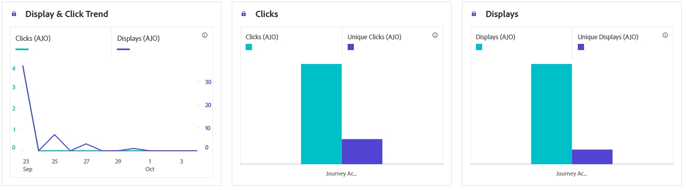
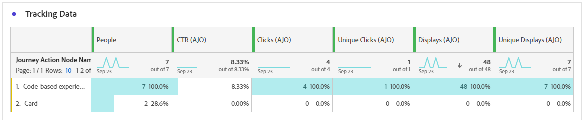

# Code-based journey report {#journey-global-report}

>[!BEGINSHADEBOX]

**On this page:** Learn how to read the code-based experience metrics in the journey report, including display and click data, tracking data, and tracked link labels for your code-based experiences.

>[!ENDSHADEBOX]

>[!INFO]
>
> Your journey report may show information from multiple journeys simultaneously, as users can be involved in more than one journey at a time. As a result, inbound communications (In-App, Web and Code-based) may show up in multiple journeys if they were triggered for a user participating in simultaneous active journeys, which can result in overlapping data.

>[!BEGINSHADEBOX]

You can access your Code-based journey report by clicking the **[!UICONTROL View report]** button within your journey. [Learn more](report-gs-cja.md)

>[!ENDSHADEBOX]

>[!NOTE]
>
>Code-based experiences function as inbound interactions in which users opt in by accessing your site or app. Consequently, **Targeted** or **Audience** metrics, which track profiles chosen for outbound message delivery, are not incremented for code-based campaigns.

## Display & click {#impressions-code}

The **[!UICONTROL Display & Click]** graphs present a detailed analysis of your profiles' engagement with your code-based experiences, offering valuable insights into how profiles interact with your content.

+++ Learn more about Impression & Click metrics

* **[!UICONTROL Unique Clicks]**: Number of profiles who clicked on a content in your experiences.

* **[!UICONTROL Clicks]**: Number of times a content was clicked on in your experiences.

* **[!UICONTROL Displays]**: Number of times the experience was opened.

* **[!UICONTROL Unique displays]**: Number of times the experience was opened, multiple interactions of one profile are not taken into account.

+++

## Tracking data {#track-data-code}

The **[!UICONTROL Tracking data]** table offers a detailed snapshot of profile activity tied to your Code-based experiences, providing essential insights into engagement and experiences effectiveness.

+++ Learn more about Tracking data metrics

* **[!UICONTROL People]**: Number of user profiles who qualify as target profiles for your experiences.

* **[!UICONTROL Click through rate (CTR)]**: Percentage of users who interacted with your experiences.

* **[!UICONTROL Clicks]**: Number of times a content was clicked on in your experiences.

* **[!UICONTROL Unique Clicks]**: Number of profiles who clicked on a content in your experiences.

* **[!UICONTROL Displays]**: Number of times your experience was opened.

* **[!UICONTROL Unique displays]**: Number of times your experience was opened, multiple interactions of one profile are not taken into account.

+++

## Tracked link labels {#track-link-code}

The **[!UICONTROL Tracked link labels]** table offers a comprehensive overview of the link labels within your Code-based experiences, highlighting those that generate the highest visitor traffic. This feature empowers you to identify and prioritize the most popular links.

+++ Learn more about Tracked link labels metrics

* **[!UICONTROL Unique Clicks]**: Number of profiles who clicked on a content in your Code-based experiences.

* **[!UICONTROL Clicks]**: Number of times a content was clicked on in your Code-based experiences.

* **[!UICONTROL Displays]**: Number of times the experience was opened.

* **[!UICONTROL Unique displays]**: Number of times the experience was opened, multiple interactions of one profile are not taken into account.

+++
