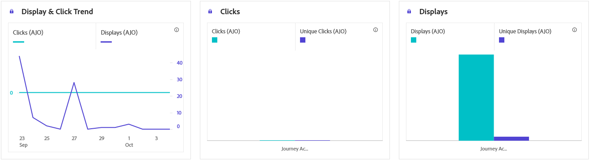

# Content card journey report {#journey-global-report}

>[!BEGINSHADEBOX]

You can access your Content card journey report by clicking the **[!UICONTROL View report]** button within your journey. [Learn more](report-gs-cja.md)

>[!ENDSHADEBOX]

## Display & click {#displays-content-card}

The **[!UICONTROL Display & Click]** graphs present a detailed analysis of your profiles' engagement with your Content cards, offering valuable insights into how profiles interact with your content.

+++ Learn more about Displays and Clicks metrics

* **[!UICONTROL Unique Clicks]**: Number of profiles who clicked on a content in your Content cards.

* **[!UICONTROL Clicks]**: Number of times a content was clicked on in your Content cards.

* **[!UICONTROL Displays]**: Number of times your Content card was opened.

* **[!UICONTROL Unique displays]**: Number of times the Content card was opened, multiple interactions of one profile are not taken into account.

+++

## Tracking data {#track-data-content}

The **[!UICONTROL Tracking data]** table offers a detailed snapshot of profile activity tied to your Content cards, providing essential insights into engagement and experiences effectiveness.

+++ Learn more about Tracking data metrics

* **[!UICONTROL People]**: Number of user profiles who qualify as target profiles for your Content cards.

* **[!UICONTROL Click through rate (CTR)]**: Percentage of users who interacted with your Content cards.

* **[!UICONTROL Clicks]**: Number of times a content was clicked on in your Content cards.

* **[!UICONTROL Unique Clicks]**: Number of profiles who clicked on a content in your Content cards.

* **[!UICONTROL Displays]**: Number of times your Content card was opened.

* **[!UICONTROL Unique displays]**: Number of times your Content card was opened, multiple interactions of one profile are not taken into account.

+++

## Tracked link labels {#track-link-content}

The **[!UICONTROL Tracked link labels]** table offers a comprehensive overview of the link labels within your Content cards, highlighting those that generate the highest visitor traffic. This feature empowers you to identify and prioritize the most popular links.

+++ Learn more about Tracked link labels metrics

* **[!UICONTROL Unique Clicks]**: Number of profiles who clicked on a content in your Content cards.

* **[!UICONTROL Clicks]**: Number of times a content was clicked on in your Content cards.

* **[!UICONTROL Displays]**: Number of times the Content card was opened.

* **[!UICONTROL Unique displays]**: Number of times the Content card was opened, multiple interactions of one profile are not taken into account.

+++
