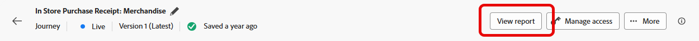
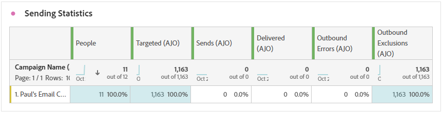
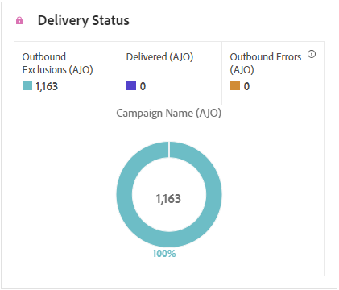

# Direct mail journey report {#journey-global-report}

>[!BEGINSHADEBOX]

You can access your Direct mail journey report by clicking the **[!UICONTROL View report]** button within your journey. [Learn more](report-gs-cja.md)

>[!ENDSHADEBOX]

## Sending Statistics {#sending-statistics-directmail}

The **[!UICONTROL Sending Statistics]** table gives you an insight of your direct mail journeys' performance. See key metrics like the number of targeted recipients and successfully delivered pieces, helping you gauge the reach and effectiveness of your mailings.

+++ Learn more about Sending Statistics metrics

* **[!UICONTROL People]**: Number of user profiles who qualify as target profiles for your messages.

* **[!UICONTROL Targeted]**: Number of profiles that qualified for the audience before exclusions, suppressions, or consent removals were applied. In journeys with re-entrance enabled, a profile may be targeted multiple times.

* **[!UICONTROL Sends]**: Total number of sends for your direct mail messages.

* **[!UICONTROL Delivered]**: Number of direct mail messages successfully sent, in relation to the total number of sent messages.

* **[!UICONTROL Outbound Errors]**: Total number of errors that occurred during the sending process preventing it from being sent to profiles.

* **[!UICONTROL Outbound Exclusions]**: Number of profiles which have been excluded by Adobe Journey Optimizer.

+++

## Delivery status {#delivery-status-directmail}

The **[!UICONTROL Delivery status]** graph provides a comprehensive view of data related to sent direct mail messages in your journey, offering insights into key metrics such as delivered and errors. This enables a detailed analysis of the direct mail messages sending process, providing valuable information on the efficiency and performance of your journeys.

+++ Learn more about Delivery status metrics

* **[!UICONTROL Delivered]**: Number of direct mail messages successfully sent, in relation to the total number of sent direct mail messages.

* **[!UICONTROL Outbound errors]**: Total number of errors that occurred during a the sending process preventing your direct mail messages from being sent to profiles.

* **[!UICONTROL Outbound exclusions]**: Number of profiles which have been excluded by Adobe Journey Optimizer.

+++

## Error reasons {#error-reasons-directmail}

The **[!UICONTROL Error Reasons]** table allows you to identify the specific errors that occurred during the sending process of your direct mail messages, facilitating a thorough analysis of any issues encountered.

## Excluded reasons {#exclude-reasons-directmail}

The **[!UICONTROL Exclude Reasons]** table visually depicts the diverse factors that led to the exclusion of user profiles from the targeted audience, preventing them from receiving your direct mail messages.

Refer to [this page](exclusion-list.md) for the comprehensive list of exclusion reasons.
