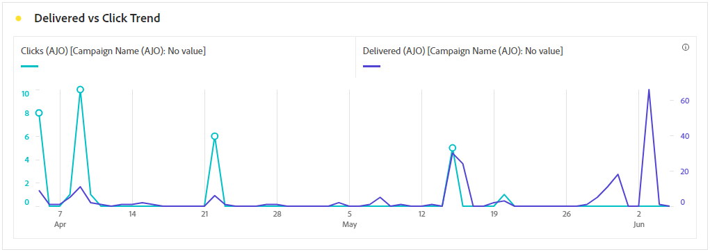
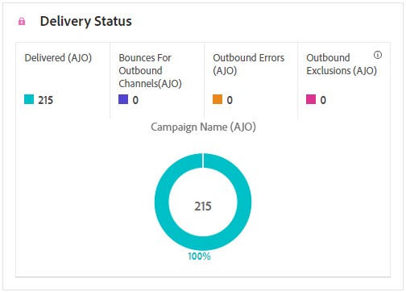
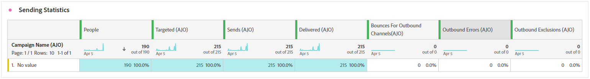
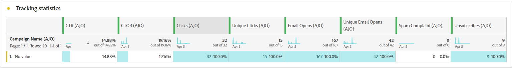

# Email journey report {#journey-global-report}

## Delivered vs Click trend {#delivered-click}

The **[!UICONTROL Delivered vs Click trend]** graph presents a detailed analysis of your profiles' engagement with your emails, offering valuable insights into how various domains interact with your content.

+++ Learn more on Delivered vs Click trend metrics

* **[!UICONTROL Delivered]**: Number of emails successfully sent, in relation to the total number of sent emails.

* **[!UICONTROL Clicks]**: Number of times a content was clicked on in your emails.

+++

## Delivery status {#delivery-status}

The **[!UICONTROL Delivery status]** graph lets you see how your emails are performing at a glance. Track key metrics like deliveries and bounces, giving you a quick understanding of your email journey's efficiency.

+++ Learn more on Delivery status metrics

* **[!UICONTROL Delivered]**: Number of emails successfully sent, in relation to the total number of sent emails.

* **[!UICONTROL Bounces for outbound channels]**: Total of errors cumulated during the sending process and automatic return processing in relation to the total number of sent messages.

* **[!UICONTROL Outbound errors]**: Total number of errors that occurred during a the sending process preventing it from being sent to profiles.

* **[!UICONTROL Excluded]**: Number of profiles which have been excluded by Adobe Journey Optimizer.

+++

## Sending Statistics {#email-sending-statistics}

The **[!UICONTROL Sending Statistics]** table provides a clear view of how your emails are performing within your journeys. It tracks key metrics like delivery rates and interactions, giving you valuable insights to optimize your email strategy for better reach and engagement.

+++ Learn more on Sending Statistics metrics

* **[!UICONTROL People]**: Number of user profiles who qualify as target profiles for your messages.

* **[!UICONTROL Targeted]**: Total number of emails processed during the sending process.

* **[!UICONTROL Sends]**: Total number of sends for your email.

* **[!UICONTROL Delivered]**: Number of emails successfully sent, in relation to the total number of sent messages.

* **[!UICONTROL Bounces]**: Total of errors cumulated during the sending process and automatic return processing in relation to the total number of sent messages.

* **[!UICONTROL Outbound Errors]**: Total number of errors that occurred during the sending process preventing it from being sent to profiles.

* **[!UICONTROL Outbound Exclusions]**: Number of profiles which have been excluded by Adobe Journey Optimizer.

+++

## Email - Tracking statistics {#email-tracking}

The **[!UICONTROL Email - Tracking statistics]** table offers a detailed account of profile activity related to emails included in your journey. This includes metrics on opens, clicks, and other relevant engagement indicators, offering a comprehensive view of how profiles interact with your email content.

+++ Learn more on Tracking statistics metrics

* **[!UICONTROL Click through rate (CTR)]**: Percentage of users who interacted with the email.

* **[!UICONTROL Click-through open rate (CTOR)]**: Number of times the email was opened.

* **[!UICONTROL Clicks]**: Number of times a content was clicked on in your emails.

* **[!UICONTROL Unique Clicks]**: Number of profiles who clicked on a content in an email.

* **[!UICONTROL Email Opens]**: Number of times your emails were opened in a journey.

* **[!UICONTROL Unique Email Opens]**: Percentage of opened emails.

* **[!UICONTROL Spam complaints]**: Number of times a message was declared as spam or junk.

* **[!UICONTROL Unsubscribes]**: Number of clicks on the unsubscription link.

+++

## Email domains {#email-domains}

The **[!UICONTROL Email Domains]** table offers an in-depth breakdown of emails categorized by domain, providing extensive insights into the performance metrics of your email journeys. This comprehensive analysis enables you to understand the behavior of different domains in response to your email content.

+++ Learn more on Email domains metrics

* **[!UICONTROL Sends]**: Total number of sends for your email.

* **[!UICONTROL Delivered]**: Number of emails successfully sent, in relation to the total number of sent emails.

* **[!UICONTROL Email Opens]**: Number of times your emails were opened in a journey.

* **[!UICONTROL Clicks]**: Number of times a content was clicked on in your emails.

* **[!UICONTROL Bounces for outbound channels]**: Total number of errors cumulated during the sending process and automatic return processing in relation to the total number of sent emails.

* **[!UICONTROL Outbound Errors]**: Total number of errors that occurred during the sending process preventing it from being sent to profiles.
+++

## Tracked link labels {#track-link-label}

The **[!UICONTROL Tracked link labels]** table offers a comprehensive overview of the link labels within your emails, highlighting those that generate the highest visitor traffic. This feature empowers you to identify and prioritize the most popular links.

+++ Learn more on Tracked link labels metrics

* **[!UICONTROL Unique Clicks]**: Number of profiles who clicked on a content in an email.

* **[!UICONTROL Clicks]**: Number of times a content was clicked on in your emails.

+++

## Tracked link URLs {#track-link-url}

The **[!UICONTROL Tracked link URLs]** table provide a comprehensive overview of the URLs within your email that attract the highest visitor traffic. This enables you to identify and prioritize the most popular links, enhancing your understanding of profile engagement with specific content in your emails.

+++ Learn more on Tracked link URLs metrics

* **[!UICONTROL Unique Clicks]**: Number of profiles who clicked on a content in an email.

* **[!UICONTROL Clicks]**: Number of times a content was clicked on in your emails.

* **[!UICONTROL Displays]**: Number of times the message was opened.

* **[!UICONTROL Unique displays]**: Number of times the message was opened, multiple interactions of one profile are not taken into account.

+++

## Email subjects {#email-subject}

The **[!UICONTROL Email subjects]**  table presents a thorough overview of email subjects that have attracted the highest visitor traffic. This resource offers valuable insights into audience engagement dynamics.

+++ Learn more on Email subjects metrics

* **[!UICONTROL People]**: Number of user profiles who qualify as target profiles for your emails.

+++

## Bounce reasons {#email-bounce-reasons}

The **[!UICONTROL Bounce Reasons]** table compiles the available data related to bounced messages, providing detailed insights into the specific reasons behind email bounces.

For more information on bounces, refer to the [Suppression list](../reports/suppression-list.md) page.

## Excluded reasons {#email-excluded}

The **[!UICONTROL Excluded reasons]** table presents a comprehensive view of the different factors that resulted in the exclusion of user profiles from the targeted audience, resulting in the message not being received.

Refer to [this page](exclusion-list.md) for the comprehensive list of exclusion reasons.

## Error reasons {#email-errors}

The **[!UICONTROL Error Reasons]** table offers visibility into the specific errors that occurred during the sending process, providing valuable information on the nature and occurrence of errors.
