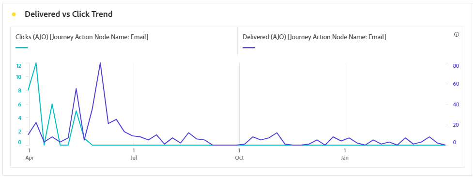
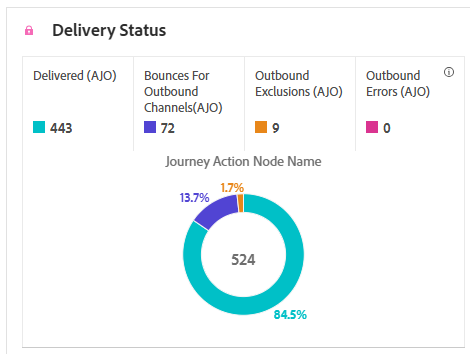
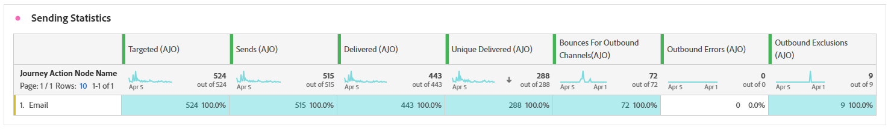
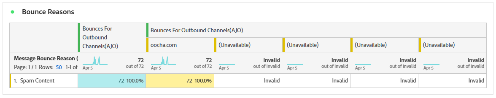
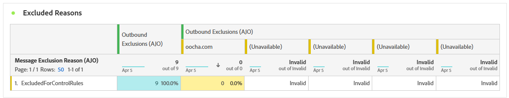

# Email journey report {#journey-global-report}

>[!BEGINSHADEBOX]

**On this page:** Learn how to read the email metrics in the journey report, including delivered versus click trends, delivery status, sending and tracking statistics, email domains, tracked links, subjects, and bounce and exclusion reasons.

>[!ENDSHADEBOX]

>[!INFO]
>
>Since Apple introduced new privacy protection features for its native Mail app, including Mail Privacy Protection, senders are no longer able to use tracking pixels to collect data on profiles who have enabled Apple's Mail Privacy Protection. Consequently, Adobe Journey Optimizer ability to track email opens using tracking pixels may be impacted. 
> [Learn more](https://experienceleaguecommunities.adobe.com/t5/adobe-campaign-classic-blogs/the-impact-of-apple-ios-privacy-changes-on-email-marketing-and/ba-p/699780) on the impact of Apple iOS privacy changes on Email marketing.
> 
> We recommend focusing on clicks and conversion metrics instead of open rates for more accurate insights.

>[!BEGINSHADEBOX]

You can access your email journey report by clicking the **[!UICONTROL View report]** button within your journey. [Learn more](report-gs-cja.md)

>[!ENDSHADEBOX]

## Delivered vs Click trend {#delivered-click}

The **[!UICONTROL Delivered vs Click trend]** graph presents a detailed analysis of your profiles' engagement with your emails, offering valuable insights into how various domains interact with your content.

+++ Learn more about Delivered vs Click trend metrics

* **[!UICONTROL Delivered]**: Number of emails successfully sent, in relation to the total number of sent emails.

* **[!UICONTROL Clicks]**: Number of times a content was clicked on in your emails.

+++

## Delivery status {#delivery-status}

The **[!UICONTROL Delivery status]** graph lets you see how your emails are performing at a glance. Track key metrics like deliveries and bounces, giving you a quick understanding of your email journey's efficiency.

+++ Learn more about Delivery status metrics

* **[!UICONTROL Delivered]**: Number of emails successfully sent, in relation to the total number of sent emails.

* **[!UICONTROL Bounces for outbound channels]**: Total of errors cumulated during the sending process and automatic return processing in relation to the total number of sent messages.

* **[!UICONTROL Outbound errors]**: Total number of errors that occurred during a the sending process preventing it from being sent to profiles.

* **[!UICONTROL Excluded]**: Number of profiles which have been excluded by Adobe Journey Optimizer.

+++

## Sending Statistics {#email-sending-statistics}

The **[!UICONTROL Sending Statistics]** table provides a clear view of how your emails are performing within your journeys. It tracks key metrics like delivery rates and interactions, giving you valuable insights to optimize your email strategy for better reach and engagement.

+++ Learn more about Sending Statistics metrics

* **[!UICONTROL Targeted]**: Number of profiles that qualified for the audience before exclusions, suppressions, or consent removals were applied. In journeys with re-entrance enabled, a profile may be targeted multiple times.

* **[!UICONTROL Sends]**: Total number of sends for your email.

* **[!UICONTROL Delivered]**: Number of emails successfully sent, in relation to the total number of sent messages.

* **[!UICONTROL Unique Delivered]**: Number of profiles who successfully received at least one email.

* **[!UICONTROL Bounces for outbound channels]**: Total of errors cumulated during the sending process and automatic return processing in relation to the total number of sent messages.

* **[!UICONTROL Outbound Errors]**: Total number of errors that occurred during the sending process preventing it from being sent to profiles.

* **[!UICONTROL Outbound Exclusions]**: Number of profiles which have been excluded by Adobe Journey Optimizer.

+++

## Tracking statistics {#email-tracking}

The **[!UICONTROL Email - Tracking statistics]** table offers a detailed account of profile activity related to emails included in your journey. This includes metrics on opens, clicks, and other relevant engagement indicators, offering a comprehensive view of how profiles interact with your email content.

+++ Learn more about Tracking statistics metrics

* **[!UICONTROL Click through rate (CTR)]**: Percentage of users who interacted with the email.

* **[!UICONTROL Click through open rate (CTOR)]**: Number of times the email was opened.

* **[!UICONTROL Open rate]**: Percentage of profiles who opened the email at least once, relative to the number of delivered emails.

* **[!UICONTROL Estimated Email Opens]**: Estimate of total email opens that accounts for both direct opens by profiles and automated opens triggered by mail servers. This metric adjusts for opens triggered by mail servers for privacy or security scanning by applying an open rate calculated from recipients who manually opened the email to those whose emails were only opened by mail servers.

* **[!UICONTROL Clicks]**: Number of times a content was clicked on in your emails.

* **[!UICONTROL Estimated Clicks]**: Number of times a content was clicked on in your message, excluding identified bot and non-human interaction (NHI) traffic.

* **[!UICONTROL Spam complaints]**: Number of times a message was declared as spam or junk.

* **[!UICONTROL Unsubscribes]**: Number of clicks on the unsubscription link or on the associated landing page.

+++

## Email domains {#email-domains}

The **[!UICONTROL Email Domains]** table offers an in-depth breakdown of emails categorized by domain, providing extensive insights into the performance metrics of your email journeys. This comprehensive analysis enables you to understand the behavior of different domains in response to your email content.

+++ Learn more about Email domains metrics

* **[!UICONTROL Sends]**: Total number of sends for your email.

* **[!UICONTROL Delivered]**: Number of emails successfully sent, in relation to the total number of sent emails.

* **[!UICONTROL Email Opens]**: Number of times your emails were opened in a journey.

* **[!UICONTROL Clicks]**: Number of times a content was clicked on in your emails.

* **[!UICONTROL Bounces for outbound channels]**: Total number of errors cumulated during the sending process and automatic return processing in relation to the total number of sent emails.

* **[!UICONTROL Outbound Errors]**: Total number of errors that occurred during the sending process preventing it from being sent to profiles.

* **[!UICONTROL Outbound Exclusions]**: Number of profiles which have been excluded by Adobe Journey Optimizer.

+++

## Tracked labels {#track-link-label}

The **[!UICONTROL Tracked labels]** table offers a comprehensive overview of the link labels within your emails, highlighting those that generate the highest visitor traffic. This feature empowers you to identify and prioritize the most popular links.

+++ Learn more about Tracked link labels metrics

* **[!UICONTROL Unique Clicks]**: Number of profiles who clicked on a content in an email.

* **[!UICONTROL Clicks]**: Number of times a content was clicked on in your emails.

* **[!UICONTROL Estimated Clicks]**: Number of times a content was clicked on in your message, excluding identified bot and non-human interaction (NHI) traffic.
+++

## Tracked link URLs {#track-link-url}

The **[!UICONTROL Tracked link URLs]** table provide a comprehensive overview of the URLs within your email that attract the highest visitor traffic. This enables you to identify and prioritize the most popular links, enhancing your understanding of profile engagement with specific content in your emails.

+++ Learn more about Tracked link URLs metrics

* **[!UICONTROL Unique Clicks]**: Number of profiles who clicked on a content in an email.

* **[!UICONTROL Clicks]**: Number of times a content was clicked on in your emails.

* **[!UICONTROL Estimated Clicks]**: Number of times a content was clicked on in your message, excluding identified bot and non-human interaction (NHI) traffic.
+++

## Email subjects {#email-subject}

The **[!UICONTROL Email subjects]**  table presents a thorough overview of email subjects that have attracted the highest visitor traffic. This resource offers valuable insights into audience engagement dynamics.

+++ Learn more about Email subjects metrics

* **[!UICONTROL Delivered]**: Number of emails successfully sent, in relation to the total number of sent emails.

* **[!UICONTROL Unique Delivered]**: Number of distinct profiles who successfully received at least one email, ensuring duplicates are not counted.
+++

## Bounce reasons {#email-bounce-reasons}

The **[!UICONTROL Bounce Reasons]** table compiles the available data related to bounced messages, providing detailed insights into the specific reasons behind email bounces.

For more information on bounces, refer to the [Suppression list](../reports/suppression-list.md) page.

## Excluded reasons {#email-excluded}

The **[!UICONTROL Excluded reasons]** table presents a comprehensive view of the different factors that resulted in the exclusion of user profiles from the targeted audience, resulting in the message not being received.

Refer to [this page](exclusion-list.md) for the comprehensive list of exclusion reasons.

## Error reasons {#email-errors}

The **[!UICONTROL Error Reasons]** table offers visibility into the specific errors that occurred during the sending process, providing valuable information on the nature and occurrence of errors.
