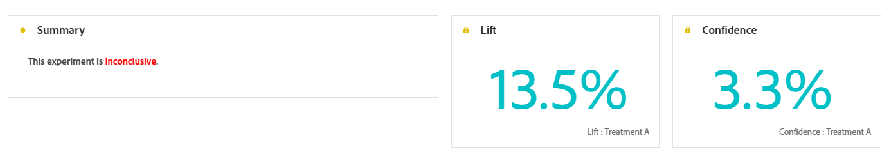
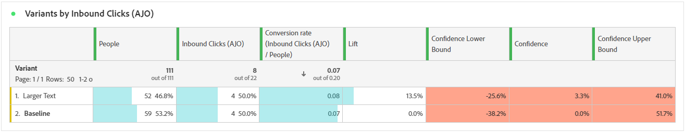
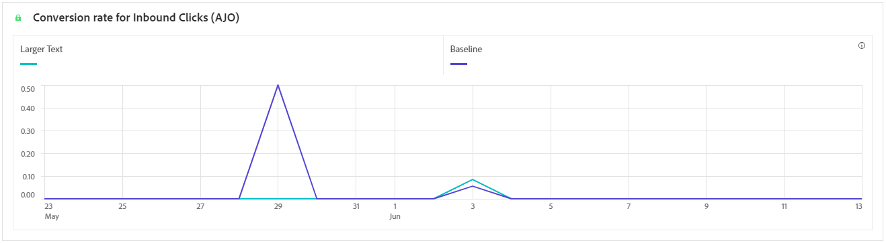

# Experimentation journey report {#campaign-global-report-cja-experimentation}

Your Journey report gives you a complete view of how your experiment is performing, along with the key metrics you need to understand its impact.

In Journey Optimizer, journey experimentation is divided into two types:

* [Content experiments](../content-management/content-experiment.md)
* [Path experiments](../building-journeys/optimize.md)

## Path experiment {#experimentation}

>[!NOTE]
>
> The tables and KPIs detailed for your Content experiment are the same as those for a Path experiment. Refer to the documentation below if you have set up a Content experiment.

### Experimentation KPIs {#experimentation-kpis}

The **Experimentation summary** provides key insights into the performance of your experiment, and identifies the most successful one. Note that defining the best performer might take some time. If your experiment is not successful, it will be set to **Inconclusive**.

The **Experimentation Key Performance Indicators (KPIs)** function as an all-encompassing dashboard, delivering an analysis of essential metrics associated with your experimentation. 

+++ Learn more about Experimentation KPIs metrics

* **[!UICONTROL Lift]**: Measure of the percentage improvement in conversion rate of a given treatment over the baseline.

* **[!UICONTROL Confidence]**: Evidence that a given treatment is the same as the baseline treatment. [Learn more](../content-management/experiment-calculations.md#understand-confidence)

+++

### Variant by Success metrics {#variant-inbound}

The **Variant by success metrics** table shows how each variant performs based on the success metric selected when setting up the experiment.
For a deep-dive in these results and how to interpret them, refer to [this page](../content-management/get-started-experiment.md#interpret-results).

+++ Learn more about Variant by Success metric

* **[!UICONTROL People]**: Number of user profiles who qualify as target profiles for your messages.

* **[!UICONTROL Inbound Clicks]**: Total value of the Success metric, previously selected when creating your Experiments.

* **[!UICONTROL Conversion rate]**: Total value of the Success metric, previously selected when creating your Experiments, divided by the number of profiles.

* **[!UICONTROL Lift]**: Measure of the percentage improvement in conversion rate of a given treatment over the baseline.

* **[!UICONTROL Confidence Lower bound]**: Lowest estimated value of the conversion rate difference between the treatment and the baseline, within the chosen confidence interval.

* **[!UICONTROL Confidence]**: Evidence that a given treatment is the same as the baseline treatment. [Learn more](../content-management/experiment-calculations.md#understand-confidence)

* **[!UICONTROL Confidence Upper bound]**: Highest estimated value of the conversion rate difference between the treatment and the baseline, within the chosen confidence interval.

+++

### Conversion rate for Success metric {#conversion-rate}

The **[!UICONTROL Confidence interval]** graph shows the range of possible improvement, comparing the baseline with the best-performing treatment for the chosen success metric. [Learn more](../content-management/experiment-calculations.md#confidence-intervals).
