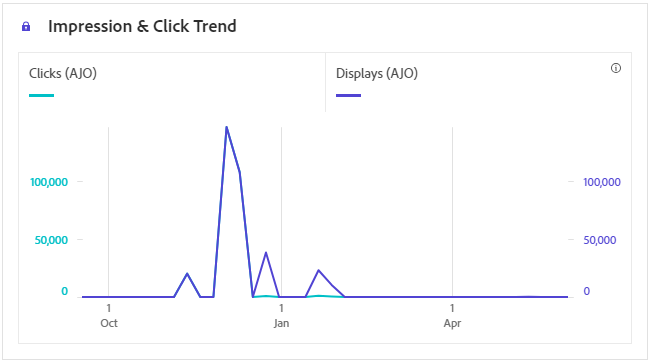

# In-app journey report {#journey-global-report}

>[!BEGINSHADEBOX]

Your journey report may show information from multiple journeys simultaneously, as users can be involved in more than one journey at a time. As a result, inbound communications (In-App, Web and Code-based) may show up in multiple journeys if they were triggered for a user participating in simultaneous active journeys, which can result in overlapping data.

>[!ENDSHADEBOX]

## Impression & click trend {#impression-click-trend}

The **[!UICONTROL Impression & Click trend]** graph presents a detailed analysis of your profiles' engagement with your In-app messages, offering valuable insights into how profiles interact with your content.

+++ Learn more on Impression & Click trend metrics

* **[!UICONTROL Clicks]**: Number of times a content was clicked on in your In-app messages.

* **[!UICONTROL Displays]**: Number of times the message was opened.

+++

## Clicks {#clicks-inapp}

The **[!UICONTROL Clicks]** graph displays In-app click metrics, illustrating both the total number of content clicks and the number of unique profiles who clicked on the content. 

+++ Learn more on Clicks metrics

* **[!UICONTROL Unique Clicks]**: Number of profiles who clicked on a content in your In-app messages

* **[!UICONTROL Clicks]**: Number of times a content was clicked on in your In-app messages.

+++

## Display {#display-inapp}

The **[!UICONTROL Displays]** graph helps you understand both the overall reach of the message and the number of unique profiles engaging with it.

+++ Learn more on Display metrics

* **[!UICONTROL Displays]**: Number of times the message was opened.

* **[!UICONTROL Unique displays]**: Number of times the message was opened, multiple interactions of one profile are not taken into account.

+++

## Tracking data {#tracking-data-inapp}

The **[!UICONTROL Tracking data]** table offers a detailed snapshot of profile activity tied to your In-app messages, providing essential insights into engagement and In-app messages effectiveness.

+++ Learn more on Tracking data metrics

* **[!UICONTROL People]**: Number of user profiles who qualify as target profiles for your In-app messages.

* **[!UICONTROL Click through rate (CTR)]**: Percentage of users who interacted with the In-app messages.

* **[!UICONTROL Click through open rate (CTOR)]**: Number of times the In-app messages was opened.

* **[!UICONTROL Clicks]**: Number of times a content was clicked on in your In-app messages.

* **[!UICONTROL Unique Clicks]**: Number of profiles who clicked on a content in your In-app messages.

* **[!UICONTROL Displays]**: Number of times the message was opened.

* **[!UICONTROL Unique displays]**: Number of times the message was opened, multiple interactions of one profile are not taken into account.

* **[!UICONTROL Sends]**: Total number of sends for your In-app messages.

<!--
* **[!UICONTROL Inbound triggered]**: 

* **[!UICONTROL Inbound dismisses]**: 
-->
+++

## Tracked link labels {#track-link-label-inapp}

The **[!UICONTROL Tracked link labels]** table offers a comprehensive overview of the link labels within your In-app messages, highlighting those that generate the highest visitor traffic. This feature empowers you to identify and prioritize the most popular links.

+++ Learn more on Tracked link labels metrics

* **[!UICONTROL Unique Clicks]**: Number of profiles who clicked on a content in your In-app messages.

* **[!UICONTROL Clicks]**: Number of times a content was clicked on in your In-app messages.

* **[!UICONTROL Displays]**: Number of times the message was opened.

* **[!UICONTROL Unique displays]**: Number of times the message was opened, multiple interactions of one profile are not taken into account.

+++

## Tracked link URLs {#track-link-url-inapp}

The **[!UICONTROL Tracked link URLs]** table provide a comprehensive overview of the URLs within your In-app messages that attract the highest visitor traffic. This enables you to identify and prioritize the most popular links, enhancing your understanding of profile engagement with specific content in your In-app messages.

+++ Learn more on Tracked link URLs metrics

* **[!UICONTROL Unique Clicks]**: Number of profiles who clicked on a content in your In-app messages

* **[!UICONTROL Clicks]**: Number of times a content was clicked on in your In-app messages.

+++
