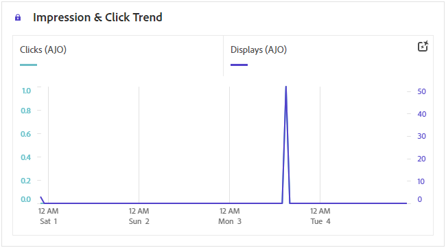
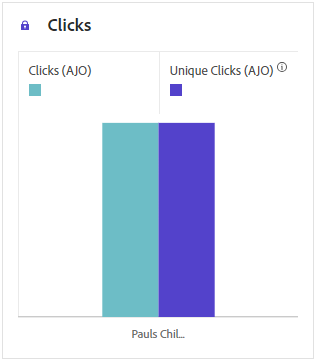
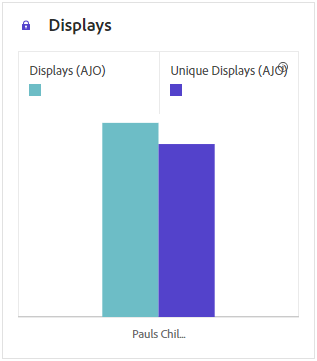
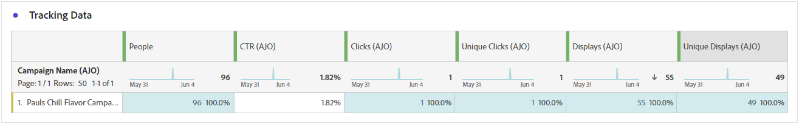
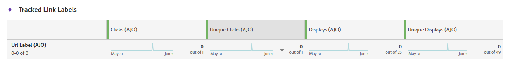
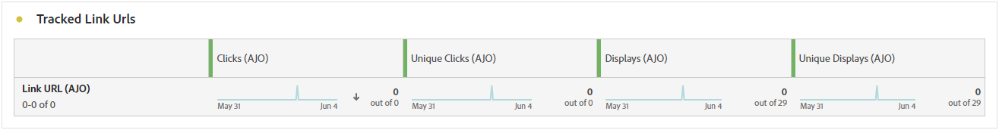

# Web journey report {#journey-global-report}

>[!BEGINSHADEBOX]

**On this page:** Understand the web channel metrics in the Adobe Journey Optimizer journey report, including impression and click trends, displays, tracking data, and tracked link labels and URLs.

>[!ENDSHADEBOX]

>[!INFO]
>
>Your journey report may show information from multiple journeys simultaneously, as users can be involved in more than one journey at a time. As a result, inbound communications (In-App, Web and Code-based) may show up in multiple journeys if they were triggered for a user participating in simultaneous active journeys, which can result in overlapping data.

>[!BEGINSHADEBOX]

You can access your Web journey report by clicking the **[!UICONTROL View report]** button within your journey. [Learn more](report-gs-cja.md)

>[!ENDSHADEBOX]

## Impression & click trend {#impressions-web}

The **[!UICONTROL Impression & Click trend]** graph presents a detailed analysis of your profiles' engagement with your Web pages, offering valuable insights into how profiles interact with your content.

+++ Learn more about Impression & Click trend metrics

* **[!UICONTROL Clicks]**: Number of times a content was clicked on in your Web pages.

* **[!UICONTROL Displays]**: Number of times the message was opened.

+++

## Clicks {#clicks-web}

The **[!UICONTROL Clicks]** graph displays Web page click metrics, illustrating both the total number of content clicks and the number of unique profiles who clicked on the content. 

+++ Learn more about Clicks metrics

* **[!UICONTROL Unique Clicks]**: Number of profiles who clicked on a content in your Web pages.

* **[!UICONTROL Clicks]**: Number of times a content was clicked on in your Web pages.

+++

## Displays {#displays-web}

The **[!UICONTROL Displays]** graph helps you understand both the overall reach of the code-based experience was opened and the number of unique profiles engaging with it.

+++ Learn more about Display metrics

* **[!UICONTROL Displays]**: Number of times the code-based experience was opened.

* **[!UICONTROL Unique displays]**: Number of times the code-based experience was opened, multiple interactions of one profile are not taken into account.

+++

## Tracking data {#track-data-web}

The **[!UICONTROL Tracking data]** table offers a detailed snapshot of profile activity tied to your Web pages, providing essential insights into engagement and Web pages effectiveness.

+++ Learn more about Tracking data metrics

* **[!UICONTROL People]**: Number of user profiles who qualify as target profiles for your Web pages.

* **[!UICONTROL Click through rate (CTR)]**: Percentage of users who interacted with the Web pages.

* **[!UICONTROL Clicks]**: Number of times a content was clicked on in your Web pages.

* **[!UICONTROL Unique Clicks]**: Number of profiles who clicked on a content in your Web pages.

* **[!UICONTROL Displays]**: Number of times the Web page was opened.

* **[!UICONTROL Unique displays]**: Number of times the Web page was opened, multiple interactions of one profile are not taken into account.

+++

## Tracked link labels {#track-link-web}

The **[!UICONTROL Tracked link labels]** table offers a comprehensive overview of the link labels within your Web pages, highlighting those that generate the highest visitor traffic. This feature empowers you to identify and prioritize the most popular links.

+++ Learn more about Tracked link labels metrics

* **[!UICONTROL Unique Clicks]**: Number of profiles who clicked on a content in your Web pages.

* **[!UICONTROL Clicks]**: Number of times a content was clicked on in your Web pages.

* **[!UICONTROL Displays]**: Number of times the message was opened.

* **[!UICONTROL Unique displays]**: Number of times the message was opened, multiple interactions of one profile are not taken into account.

+++

## Tracked link URLs {#track-url-web}

The **[!UICONTROL Tracked link URLs]** table provide a comprehensive overview of the URLs within your Web pages that attract the highest visitor traffic. This enables you to identify and prioritize the most popular links, enhancing your understanding of profile engagement with specific content in your Web pages.

+++ Learn more about Tracked link URLs metrics

* **[!UICONTROL Unique Clicks]**: Number of profiles who clicked on a content in your Web pages.

* **[!UICONTROL Clicks]**: Number of times a content was clicked on in your Web pages.

* **[!UICONTROL Displays]**: Number of times the message was opened.

* **[!UICONTROL Unique displays]**: Number of times the message was opened, multiple interactions of one profile are not taken into account.

+++
