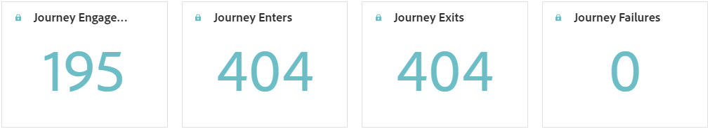
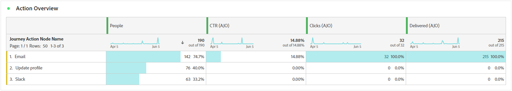

# Journey report {#journey-global-report}

The **Journey report** functions as an all-encompassing dashboard, delivering an analysis of essential metrics associated with your journey. This encompasses details such as the count of entered profiles and instances of failed individual journeys, offering a comprehensive insight into your journey's effectiveness and level of engagement.

**Journey report** can be accessed directly from your journey with the **[!UICONTROL View report]** button. 

To learn more on Customer Journey Analytics Workspace and how to filter and analyze data, refer to [this page](https://experienceleague.adobe.com/en/docs/analytics-platform/using/cja-workspace/home).

## Journey overview {#journey-global}

The **[!UICONTROL Journey]** report gives you a clear view of the most important tracking data about your journey.

### Journey KPIs {#journey-perfomance}

The **[!UICONTROL Journey]** Key Performance Indicators (KPIs) function as an all-encompassing dashboard, delivering an analysis of essential metrics associated with your journey. This encompasses details such as the count of entered profile and instances of failed individual journeys, offering a comprehensive insight into your journey's effectiveness and level of engagement.

+++ Learn more on Journey KPIs metrics

* **[!UICONTROL Journey engagement]**: Total number of individuals who interacted with the messages that were sent from the journey

* **[!UICONTROL Journey enters]**: Total number of individuals who reached the entry event of the journey.

* **[!UICONTROL Journey exits]**: Total number of individuals who exited the journey.

* **[!UICONTROL Journey failures]**: Total number of individual journeys that were not successfully executed.

+++

### Journey stats {#journey-stats}

The **[!UICONTROL Journey Statistics]** table offers a detailed summary of crucial data about your journeys. It includes key metrics like the number of failures and successful entries, providing valuable insights into the performance and reach of your emails and journeys.

+++ Learn more on Journey Statistics metrics

* **[!UICONTROL Journey engagement]**: Total number of individuals who interacted with the messages that were sent from the journey.

* **[!UICONTROL Journey enters]**: Total number of individuals who reached the entry event of the journey.

* **[!UICONTROL Journey exits]**: Total number of individuals who exited the journey.

* **[!UICONTROL Journey failures]**: Total number of individual journeys that were not successfully executed.

* **[!UICONTROL Unique Journey enters]**: Total number of individuals who reached the entry event of the journey, multiple interactions of one profile are not taken into account.

* **[!UICONTROL Unique Journey exits]**: Total number of individuals who exited the journey, multiple interactions of one profile are not taken into account.

* **[!UICONTROL Unique Journey failures]**: Total number of individual journeys that were not successfully executed, multiple interactions of one profile are not taken into account.

+++

## Journey canvas {#journey-canvas}

The **[!UICONTROL Journey Canvas]** widget allows you to visually trace the trajectory of your targeted profiles as they navigate through your journey. [Learn more in Customer Journey Analytics documentation](https://experienceleague.adobe.com/en/docs/analytics-platform/using/cja-workspace/visualizations/journey-canvas/journey-canvas)

Enhance your canvas customization with the following options:

* Add or remove the desired activity type, such as messages or conditions, from the **[!UICONTROL Node type]** drop-down menu.
* Adjust the **[!UICONTROL Percentage value]** to determine the flow distribution among different journey paths.
* Customize your **[!UICONTROL Arrow settings]** to include labels, conditions, or opt for a clean display.
* Enable the **[!UICONTROL Show fallout]** option to visualize profiles that exited your journey directly on the canvas.

The following rules apply when using **[!UICONTROL Node Type]** Filtering:

* When creating a segment on a node, it will still encompass nodes from earlier stages of the journey, even if those nodes have been excluded through the **[!UICONTROL Node type]** filter.

* You cannot create segments formed from an arrow if nodes in earlier stages of the journey have been excluded via the **[!UICONTROL Node type]** filter. In this case, the right-click functionality will be disabled on those arrows.

## Action performance {#action-performance}

### Performance over time {#action-overtime}

The **[!UICONTROL Performance Over time]** graph allows you to identify and analyze the number of profiles that meet the criteria to be considered target profiles for your actions. This visualization provides valuable insights into the effectiveness of your strategies and helps you make data-driven decisions to optimize your performance.

### Action overview {#action-overview}

The **[!UICONTROL Action overview]** table serves as a comprehensive dashboard, offering an analysis of key metrics related to the actions in your journey. This includes crucial details such as the number of interactions and the click-through rate

+++ Learn more on Action overview metrics

* **[!UICONTROL People]**: Number of user profiles who qualify as target profiles for your actions.

* **[!UICONTROL Click trough rate]**: Percentage of users who interacted with the action.

* **[!UICONTROL Clicks]**: Number of times a content was clicked on in your actions.

* **[!UICONTROL Delivered]**:  Number of actions successfully sent, in relation to the total number of sent actions.

+++

## Events performance {#events-performance}

### Performance over time {#event-overtime}

The **[!UICONTROL Performance over time]** graph enables you to identify and analyze the number of profiles that qualify as target profiles for your events. This powerful tool helps you track trends and patterns over time, providing valuable insights for optimizing your event strategies.

### Event overview {#event-overview}

The **[!UICONTROL Event overview]** table shows how many profiles meet your event criteria over time. This tool helps you identify patterns in qualification rates to refine your event strategy.

+++ Learn more on Journey Statistics metrics

* **[!UICONTROL People]**: Number of user profiles who qualify as target profiles for your events.

+++
