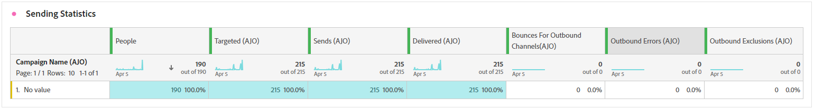

# Journey report {#journey-global-report}

The **Journey report** functions as an all-encompassing dashboard, delivering an analysis of essential metrics associated with your journey. This encompasses details such as the count of entered profiles and instances of failed individual journeys, offering a comprehensive insight into your journey's effectiveness and level of engagement.

**Journey report** can be accessed directly from your journey with the **[!UICONTROL View report]** button. 

The **[!UICONTROL Journey report]** page will be displayed with the following tabs depending on the messages activities in your journey:

* [Journey](#journey-global)
* [Email](#email-global)
* [Push](#push-global)
* [SMS](#sms-global)
* [In-app](#in-app-global)
* [Web](#web-cja)
* [Direct mail](#direct-mail-cja)
* [Code based](#code-based)
* [Content card](#content-card)

To learn more on Customer Journey Analytics Workspace and how to filter and analyze data, refer to [this page](https://experienceleague.adobe.com/en/docs/analytics-platform/using/cja-workspace/home).

## Journey overview {#journey-global}

The **[!UICONTROL Journey]** report gives you a clear view of the most important tracking data about your journey.

### Journey KPIs {#journey-perfomance}

The **[!UICONTROL Journey]** Key Performance Indicators (KPIs) function as an all-encompassing dashboard, delivering an analysis of essential metrics associated with your journey. This encompasses details such as the count of entered profile and instances of failed individual journeys, offering a comprehensive insight into your journey's effectiveness and level of engagement.

+++ Learn more on Journey KPIs metrics

* **[!UICONTROL Journey engagement]**: Total number of individuals who interacted with the messages that were sent from the journey

* **[!UICONTROL Journey enters]**: Total number of individuals who reached the entry event of the journey.

* **[!UICONTROL Journey exits]**: Total number of individuals who exited the journey.

* **[!UICONTROL Journey failures]**: Total number of individual journeys that were not successfully executed.

+++

### Journey stats {#journey-stats}

The **[!UICONTROL Journey Statistics]** table offers a detailed summary of crucial data about your journeys. It includes key metrics like the number of failures and successful entries, providing valuable insights into the performance and reach of your emails and journeys.

+++ Learn more on Journey Statistics metrics

* **[!UICONTROL Journey engagement]**: Total number of individuals who interacted with the messages that were sent from the journey.

* **[!UICONTROL Journey enters]**: Total number of individuals who reached the entry event of the journey.

* **[!UICONTROL Journey exits]**: Total number of individuals who exited the journey.

* **[!UICONTROL Journey failures]**: Total number of individual journeys that were not successfully executed.

* **[!UICONTROL Unique Journey enters]**: Total number of individuals who reached the entry event of the journey, multiple interactions of one profile are not taken into account.

* **[!UICONTROL Unique Journey exits]**: Total number of individuals who exited the journey, multiple interactions of one profile are not taken into account.

* **[!UICONTROL Unique Journey failures]**: Total number of individual journeys that were not successfully executed, multiple interactions of one profile are not taken into account.

+++

## Journey canvas {#journey-canvas}

The **[!UICONTROL Journey Canvas]** widget allows you to visually trace the trajectory of your targeted profiles as they navigate through your journey. [Learn more in Customer Journey Analytics documentation](https://experienceleague.adobe.com/en/docs/analytics-platform/using/cja-workspace/visualizations/journey-canvas/journey-canvas)

Enhance your canvas customization with the following options:

* Add or remove the desired activity type, such as messages or conditions, from the **[!UICONTROL Node type]** drop-down menu.
* Adjust the **[!UICONTROL Percentage value]** to determine the flow distribution among different journey paths.
* Customize your **[!UICONTROL Arrow settings]** to include labels, conditions, or opt for a clean display.
* Enable the **[!UICONTROL Show fallout]** option to visualize profiles that exited your journey directly on the canvas.

## Action performance {#action-performance}

### Performance over time {#action-overtime}

The **[!UICONTROL Performance Over time]** graph allows you to identify and analyze the number of profiles that meet the criteria to be considered target profiles for your actions. This visualization provides valuable insights into the effectiveness of your strategies and helps you make data-driven decisions to optimize your performance.

### Action overview {#action-overview}

The **[!UICONTROL Action overview]** table serves as a comprehensive dashboard, offering an analysis of key metrics related to the actions in your journey. This includes crucial details such as the number of interactions and the click-through rate

+++ Learn more on Action overview metrics

* **[!UICONTROL People]**: Number of user profiles who qualify as target profiles for your actions.

* **[!UICONTROL Click trough rate]**: Percentage of users who interacted with the action.

* **[!UICONTROL Clicks]**: Number of times a content was clicked on in your actions.

* **[!UICONTROL Delivered]**:  Number of actions successfully sent, in relation to the total number of sent actions.

+++

## Events performance {#events-performance}

### Performance over time {#event-overtime}

The **[!UICONTROL Performance over time]** graph enables you to identify and analyze the number of profiles that qualify as target profiles for your events. This powerful tool helps you track trends and patterns over time, providing valuable insights for optimizing your event strategies.

### Event overview {#event-overview}

The **[!UICONTROL Event overview]** table shows how many profiles meet your event criteria over time. This tool helps you identify patterns in qualification rates to refine your event strategy.

+++ Learn more on Journey Statistics metrics

* **[!UICONTROL People]**: Number of user profiles who qualify as target profiles for your events.

+++

## Email details {#email-global}

From your journey report, the **[!UICONTROL Email]** tab details the main information relative to the emails sent in your journey.

### Delivered vs Click trend {#delivered-click}

The **[!UICONTROL Delivered vs Click trend]** graph presents a detailed analysis of your profiles' engagement with your emails, offering valuable insights into how various domains interact with your content.

+++ Learn more on Delivered vs Click trend metrics

* **[!UICONTROL Delivered]**: Number of emails successfully sent, in relation to the total number of sent emails.

* **[!UICONTROL Clicks]**: Number of times a content was clicked on in your emails.

+++

### Delivery status {#delivery-status}

The **[!UICONTROL Delivery status]** graph lets you see how your emails are performing at a glance. Track key metrics like deliveries and bounces, giving you a quick understanding of your email journey's efficiency.

+++ Learn more on Delivery status metrics

* **[!UICONTROL Delivered]**: Number of emails successfully sent, in relation to the total number of sent emails.

* **[!UICONTROL Bounces for outbound channels]**: Total of errors cumulated during the sending process and automatic return processing in relation to the total number of sent messages.

* **[!UICONTROL Outbound errors]**: Total number of errors that occurred during a the sending process preventing it from being sent to profiles.

* **[!UICONTROL Excluded]**: Number of profiles which have been excluded by Adobe Journey Optimizer.

+++

### Sending Statistics {#email-sending-statistics}

The **[!UICONTROL Sending Statistics]** table provides a clear view of how your emails are performing within your journeys. It tracks key metrics like delivery rates and interactions, giving you valuable insights to optimize your email strategy for better reach and engagement.

+++ Learn more on Sending Statistics metrics

* **[!UICONTROL People]**: Number of user profiles who qualify as target profiles for your messages.

* **[!UICONTROL Targeted]**: Total number of emails processed during the sending process.

* **[!UICONTROL Sends]**: Total number of sends for your email.

* **[!UICONTROL Delivered]**: Number of emails successfully sent, in relation to the total number of sent messages.

* **[!UICONTROL Bounces]**: Total of errors cumulated during the sending process and automatic return processing in relation to the total number of sent messages.

* **[!UICONTROL Outbound Errors]**: Total number of errors that occurred during the sending process preventing it from being sent to profiles.

* **[!UICONTROL Outbound Exclusions]**: Number of profiles which have been excluded by Adobe Journey Optimizer.

+++

### Email - Tracking statistics {#email-tracking}

The **[!UICONTROL Email - Tracking statistics]** table offers a detailed account of profile activity related to emails included in your journey. This includes metrics on opens, clicks, and other relevant engagement indicators, offering a comprehensive view of how profiles interact with your email content.

+++ Learn more on Tracking statistics metrics

* **[!UICONTROL Click through rate (CTR)]**: Percentage of users who interacted with the email.

* **[!UICONTROL Click-through open rate (CTOR)]**: Number of times the email was opened.

* **[!UICONTROL Clicks]**: Number of times a content was clicked on in your emails.

* **[!UICONTROL Unique Clicks]**: Number of profiles who clicked on a content in an email.

* **[!UICONTROL Email Opens]**: Number of times your emails were opened in a journey.

* **[!UICONTROL Unique Email Opens]**: Percentage of opened emails.

* **[!UICONTROL Spam complaints]**: Number of times a message was declared as spam or junk.

* **[!UICONTROL Unsubscribes]**: Number of clicks on the unsubscription link.

+++

### Email domains {#email-domains}

The **[!UICONTROL Email Domains]** table offers an in-depth breakdown of emails categorized by domain, providing extensive insights into the performance metrics of your email journeys. This comprehensive analysis enables you to understand the behavior of different domains in response to your email content.

+++ Learn more on Email domains metrics

* **[!UICONTROL Sends]**: Total number of sends for your email.

* **[!UICONTROL Delivered]**: Number of emails successfully sent, in relation to the total number of sent emails.

* **[!UICONTROL Email Opens]**: Number of times your emails were opened in a journey.

* **[!UICONTROL Clicks]**: Number of times a content was clicked on in your emails.

* **[!UICONTROL Bounces for outbound channels]**: Total number of errors cumulated during the sending process and automatic return processing in relation to the total number of sent emails.

* **[!UICONTROL Outbound Errors]**: Total number of errors that occurred during the sending process preventing it from being sent to profiles.
+++

### Tracked link labels {#track-link-label}

The **[!UICONTROL Tracked link labels]** table offers a comprehensive overview of the link labels within your emails, highlighting those that generate the highest visitor traffic. This feature empowers you to identify and prioritize the most popular links.

+++ Learn more on Tracked link labels metrics

* **[!UICONTROL Unique Clicks]**: Number of profiles who clicked on a content in an email.

* **[!UICONTROL Clicks]**: Number of times a content was clicked on in your emails.

+++

### Tracked link URLs {#track-link-url}

The **[!UICONTROL Tracked link URLs]** table provide a comprehensive overview of the URLs within your email that attract the highest visitor traffic. This enables you to identify and prioritize the most popular links, enhancing your understanding of profile engagement with specific content in your emails.

+++ Learn more on Tracked link URLs metrics

* **[!UICONTROL Unique Clicks]**: Number of profiles who clicked on a content in an email.

* **[!UICONTROL Clicks]**: Number of times a content was clicked on in your emails.

* **[!UICONTROL Displays]**: Number of times the message was opened.

* **[!UICONTROL Unique displays]**: Number of times the message was opened, multiple interactions of one profile are not taken into account.

+++

### Email subjects {#email-subject}

The **[!UICONTROL Email subjects]**  table presents a thorough overview of email subjects that have attracted the highest visitor traffic. This resource offers valuable insights into audience engagement dynamics.

+++ Learn more on Email subjects metrics

* **[!UICONTROL People]**: Number of user profiles who qualify as target profiles for your emails.

+++

### Bounce reasons {#email-bounce-reasons}

The **[!UICONTROL Bounce Reasons]** table compiles the available data related to bounced messages, providing detailed insights into the specific reasons behind email bounces.

For more information on bounces, refer to the [Suppression list](../reports/suppression-list.md) page.

### Excluded reasons {#email-excluded}

The **[!UICONTROL Excluded reasons]** table presents a comprehensive view of the different factors that resulted in the exclusion of user profiles from the targeted audience, resulting in the message not being received.

Refer to [this page](exclusion-list.md) for the comprehensive list of exclusion reasons.

### Error reasons {#email-errors}

The **[!UICONTROL Error Reasons]** table offers visibility into the specific errors that occurred during the sending process, providing valuable information on the nature and occurrence of errors.

## Push notification tab {#push-global}

From your journey report, the **[!UICONTROL Push notification]** tab details the main information relative to the push notifications sent in your journey.

## Push notification {#push-notification}

### Sending Statistics {#sending-statistics-push}

The **[!UICONTROL Sending Statistics]** table helps you understand how your push notifications are performing. It includes key metrics like delivery rate and audience size, giving you valuable insights into the effectiveness and reach of your journeys.

+++ Learn more on Sending Statistics metrics

* **[!UICONTROL People]**: Number of user profiles who qualify as target profiles for your SMS messages.

* **[!UICONTROL Targeted]**: Total number of push notifications processed during the analysis.

* **[!UICONTROL Sends]**: Total number of sends for the push notification.

* **[!UICONTROL Delivered]**: Number of push notifications successfully sent, in relation to the total number of sent push notifications.

* **[!UICONTROL Bounces for outbound channels]**: Total of errors cumulated during the sending process and automatic return processing in relation to the total number of push notifications.

* **[!UICONTROL Outbound errors]**: Total number of errors that occurred preventing it from being sent to profiles.

* **[!UICONTROL Outbound exclusions]**: Number of profiles which have been excluded by Adobe Journey Optimizer.

+++

### Tracking statistics {#tracking-statistics-push}

The **[!UICONTROL Tracking statistics]** table offers a detailed snapshot of profile activity tied to your push notifications, providing essential insights into engagement and push notifications effectiveness.

+++ Learn more on Tracking statistics metrics

* **[!UICONTROL Click through rate (CTR)]**: Percentage of users who interacted with the push notification.

* **[!UICONTROL Clickthrough open rate (CTOR)]**: Number of times the push notification was opened.

* **[!UICONTROL Clicks]**: Number of times a content was clicked on in your push notification.

* **[!UICONTROL Unique Clicks]**: Number of profiles who clicked on a content in your push notification.

<!--
* **[!UICONTROL Push custom actions]**: 
-->
+++

### Tracked link labels {#track-link-label-push}

The **[!UICONTROL Tracked link labels]** table offers a comprehensive overview of the link labels within your push notifications, highlighting those that generate the highest visitor traffic. This feature empowers you to identify and prioritize the most popular links.

+++ Learn more on Tracked link labels metrics

* **[!UICONTROL Unique Clicks]**: Number of profiles who clicked on a content in your push notifications.

* **[!UICONTROL Clicks]**: Number of times a content was clicked on in your push notifications.

+++

### Tracked link URLs {#track-link-url-push}

The **[!UICONTROL Tracked link URLs]** table provide a comprehensive overview of the URLs within your push notifications that attract the highest visitor traffic. This enables you to identify and prioritize the most popular links, enhancing your understanding of profile engagement with specific content in your push notifications.

+++ Learn more on Tracked link URLs metrics

* **[!UICONTROL Unique Clicks]**: Number of profiles who clicked on a content in your push notifications.

* **[!UICONTROL Clicks]**: Number of times a content was clicked on in your push notifications.

+++

### Bounce reasons {#bounce-reasons-push}

The **[!UICONTROL Bounces Reasons]** table provides a comprehensive overview of data related to bounced push notifications, delivering valuable insights into the specific reasons behind instances of push notifications bounces.

### Error reasons {#error-reasons-push}

The **[!UICONTROL Error Reasons]** table allows you to identify the specific errors that occurred during the sending process of your push notifications, facilitating a thorough analysis of any issues encountered.

### Excluded reasons {#exclude-reasons-push}

The **[!UICONTROL Exclude Reasons]** table visually depicts the diverse factors that led to the exclusion of user profiles from the targeted audience, preventing them from receiving your push notifications.

Refer to [this page](exclusion-list.md) for the comprehensive list of exclusion reasons.

## SMS {#sms}

### Delivered vs Click trend {#delivered-click-sms}

The **[!UICONTROL Delivered vs Click trend]** graph presents a detailed analysis of your profiles' engagement with your SMS messages, offering valuable insights into how various domains interact with your content.

+++ Learn more on Delivered vs Click trend metrics

* **[!UICONTROL Delivered]**: Number of SMS messages successfully sent, in relation to the total number of SMS messages.

* **[!UICONTROL Clicks]**: Number of times a content was clicked on in your SMS messages.

+++

### Delivery status {#delivery-status-sms}

The **[!UICONTROL Delivery status]** table offers a detailed account of profile activity related to your SMS messages. This includes metrics on delivered, clicks, and other relevant engagement indicators, offering a comprehensive view of how profiles interact with your SMS content.

+++ Learn more on Delivery status metrics

* **[!UICONTROL Delivered]**: Number of SMS messages successfully sent, in relation to the total number of SMS messages.

* **[!UICONTROL Bounces for outbound channels]**: Total of errors cumulated during the sending process and automatic return processing in relation to the total number of sent SMS messages.

* **[!UICONTROL Outbound errors]**: Total number of errors that occurred preventing it from being sent to profiles.

* **[!UICONTROL Outbound exclusions]**: Number of profiles which have been excluded by Adobe Journey Optimizer.

+++

### Tracked link labels {#track-link-label-sms}

The **[!UICONTROL Tracked link labels]** table offers a comprehensive overview of the link labels within your SMS messages, highlighting those that generate the highest visitor traffic. This feature empowers you to identify and prioritize the most popular links.

+++ Learn more on Tracked link labels metrics

* **[!UICONTROL Unique Clicks]**: Number of profiles who clicked on a content in your SMS message.

* **[!UICONTROL Clicks]**: Number of times a content was clicked on in your SMS messages.

+++

### Tracked link URLs {#track-link-url-sms}

The **[!UICONTROL Tracked link URLs]** table provide a comprehensive overview of the URLs within your SMS messages that attract the highest visitor traffic. This enables you to identify and prioritize the most popular links, enhancing your understanding of profile engagement with specific content in your SMS messages.

+++ Learn more on Tracked link URLs metrics

* **[!UICONTROL Unique Clicks]**: Number of profiles who clicked on a content in your SMS message.

* **[!UICONTROL Clicks]**: Number of times a content was clicked on in your SMS messages.

* **[!UICONTROL Displays]**: Number of times the message was opened.

* **[!UICONTROL Unique displays]**: Number of times the message was opened, multiple interactions of one profile are not taken into account.

+++

### SMS inbound message {#sms-inbound}

The **[!UICONTROL SMS inbound message]** table presents a thorough overview of which SMS messages have attracted the highest visitor traffic. This resource offers valuable insights into audience engagement dynamics.

+++ Learn more on SMS inbound message metrics

* **[!UICONTROL People]**: Number of user profiles who qualify as target profiles for your SMS messages.

+++

### SMS Message type {#sms-message-type}

The **[!UICONTROL SMS Message type]** table presents a thorough overview of which SMS message type have attracted the highest visitor traffic. This resource offers valuable insights into audience engagement dynamics.

+++ Learn more on SMS Message type metrics

* **[!UICONTROL People]**: Number of user profiles who qualify as target profiles for your SMS messages.

+++

### SMS providers {#sms-providers}

The **[!UICONTROL SMS providers]** table presents a thorough overview of which SMS providers have attracted the highest visitor traffic. This resource offers valuable insights into audience engagement dynamics.

+++ Learn more on SMS providers metrics

* **[!UICONTROL People]**: Number of user profiles who qualify as target profiles for your SMS messages.

+++

### Bounce reasons {#bounce-reasons-sms}

The **[!UICONTROL Bounces Reasons]** table provides a comprehensive overview of data related to bounced SMS messages, delivering valuable insights into the specific reasons behind instances of SMS message bounces.

### Error reasons {#error-reasons-sms}

The **[!UICONTROL Error Reasons]** table allows you to identify the specific errors that occurred during the sending process of your SMS messages, facilitating a thorough analysis of any issues encountered.

### Exclude reasons {#excluded-reasons-sms}

The **[!UICONTROL Exclude Reasons]** table visually depicts the diverse factors that led to the exclusion of user profiles from the targeted audience, preventing them from receiving your SMS messages.

Refer to [this page](exclusion-list.md) for the comprehensive list of exclusion reasons.

## In-app

### Impression & click trend {#impression-click-trend}

The **[!UICONTROL Impression & Click trend]** graph presents a detailed analysis of your profiles' engagement with your In-app messages, offering valuable insights into how profiles interact with your content.

+++ Learn more on Impression & Click trend metrics

* **[!UICONTROL Clicks]**: Number of times a content was clicked on in your In-app messages.

* **[!UICONTROL Displays]**: Number of times the message was opened.

+++

### Clicks {#clicks-inapp}

The **[!UICONTROL Clicks]** graph displays In-app click metrics, illustrating both the total number of content clicks and the number of unique profiles who clicked on the content. 

+++ Learn more on Clicks metrics

* **[!UICONTROL Unique Clicks]**: Number of profiles who clicked on a content in your In-app messages

* **[!UICONTROL Clicks]**: Number of times a content was clicked on in your In-app messages.

+++

### Display {#display-inapp}

The **[!UICONTROL Displays]** graph helps you understand both the overall reach of the message and the number of unique profiles engaging with it.

+++ Learn more on Display metrics

* **[!UICONTROL Displays]**: Number of times the message was opened.

* **[!UICONTROL Unique displays]**: Number of times the message was opened, multiple interactions of one profile are not taken into account.

+++

### Tracking data {#tracking-data-inapp}

The **[!UICONTROL Tracking data]** table offers a detailed snapshot of profile activity tied to your In-app messages, providing essential insights into engagement and In-app messages effectiveness.

+++ Learn more on Tracking data metrics

* **[!UICONTROL People]**: Number of user profiles who qualify as target profiles for your In-app messages.

* **[!UICONTROL Click through rate (CTR)]**: Percentage of users who interacted with the In-app messages.

* **[!UICONTROL Click through open rate (CTOR)]**: Number of times the In-app messages was opened.

* **[!UICONTROL Clicks]**: Number of times a content was clicked on in your In-app messages.

* **[!UICONTROL Unique Clicks]**: Number of profiles who clicked on a content in your In-app messages.

* **[!UICONTROL Displays]**: Number of times the message was opened.

* **[!UICONTROL Unique displays]**: Number of times the message was opened, multiple interactions of one profile are not taken into account.

* **[!UICONTROL Sends]**: Total number of sends for your In-app messages.

<!--
* **[!UICONTROL Inbound triggered]**: 

* **[!UICONTROL Inbound dismisses]**: 
-->
+++

### Tracked link labels {#track-link-label-inapp}

The **[!UICONTROL Tracked link labels]** table offers a comprehensive overview of the link labels within your In-app messages, highlighting those that generate the highest visitor traffic. This feature empowers you to identify and prioritize the most popular links.

+++ Learn more on Tracked link labels metrics

* **[!UICONTROL Unique Clicks]**: Number of profiles who clicked on a content in your In-app messages.

* **[!UICONTROL Clicks]**: Number of times a content was clicked on in your In-app messages.

* **[!UICONTROL Displays]**: Number of times the message was opened.

* **[!UICONTROL Unique displays]**: Number of times the message was opened, multiple interactions of one profile are not taken into account.

+++

### Tracked link URLs {#track-link-url-inapp}

The **[!UICONTROL Tracked link URLs]** table provide a comprehensive overview of the URLs within your In-app messages that attract the highest visitor traffic. This enables you to identify and prioritize the most popular links, enhancing your understanding of profile engagement with specific content in your In-app messages.

+++ Learn more on Tracked link URLs metrics

* **[!UICONTROL Unique Clicks]**: Number of profiles who clicked on a content in your In-app messages

* **[!UICONTROL Clicks]**: Number of times a content was clicked on in your In-app messages.

+++

## Web {#web-cja}

### Impression & click trend {#impressions-web}

The **[!UICONTROL Impression & Click trend]** graph presents a detailed analysis of your profiles' engagement with your Web pages, offering valuable insights into how profiles interact with your content.

+++ Learn more on Impression & Click trend metrics

* **[!UICONTROL Clicks]**: Number of times a content was clicked on in your Web pages.

* **[!UICONTROL Displays]**: Number of times the message was opened.

+++

### Clicks {#clicks-web}

The **[!UICONTROL Clicks]** graph displays Web page click metrics, illustrating both the total number of content clicks and the number of unique profiles who clicked on the content. 

+++ Learn more on Clicks metrics

* **[!UICONTROL Unique Clicks]**: Number of profiles who clicked on a content in your Web pages.

* **[!UICONTROL Clicks]**: Number of times a content was clicked on in your Web pages.

+++

### Displays {#displays-web}

The **[!UICONTROL Displays]** graph helps you understand both the overall reach of the code-based experience was opened and the number of unique profiles engaging with it.

+++ Learn more on Display metrics

* **[!UICONTROL Displays]**: Number of times the code-based experience was opened.

* **[!UICONTROL Unique displays]**: Number of times the code-based experience was opened, multiple interactions of one profile are not taken into account.

+++

### Tracking data {#track-data-web}

The **[!UICONTROL Tracking data]** table offers a detailed snapshot of profile activity tied to your Web pages, providing essential insights into engagement and Web pages effectiveness.

+++ Learn more on Tracking data metrics

* **[!UICONTROL People]**: Number of user profiles who qualify as target profiles for your Web pages.

* **[!UICONTROL Click through rate (CTR)]**: Percentage of users who interacted with the Web pages.

* **[!UICONTROL Clicks]**: Number of times a content was clicked on in your Web pages.

* **[!UICONTROL Unique Clicks]**: Number of profiles who clicked on a content in your Web pages.

* **[!UICONTROL Displays]**: Number of times the Web page was opened.

* **[!UICONTROL Unique displays]**: Number of times the Web page was opened, multiple interactions of one profile are not taken into account.

+++

### Tracked link labels {#track-link-web}

The **[!UICONTROL Tracked link labels]** table offers a comprehensive overview of the link labels within your Web pages, highlighting those that generate the highest visitor traffic. This feature empowers you to identify and prioritize the most popular links.

+++ Learn more on Tracked link labels metrics

* **[!UICONTROL Unique Clicks]**: Number of profiles who clicked on a content in your Web pages.

* **[!UICONTROL Clicks]**: Number of times a content was clicked on in your Web pages.

* **[!UICONTROL Displays]**: Number of times the message was opened.

* **[!UICONTROL Unique displays]**: Number of times the message was opened, multiple interactions of one profile are not taken into account.

+++

### Tracked link URLs {#track-url-web}

The **[!UICONTROL Tracked link URLs]** table provide a comprehensive overview of the URLs within your Web pages that attract the highest visitor traffic. This enables you to identify and prioritize the most popular links, enhancing your understanding of profile engagement with specific content in your Web pages.

+++ Learn more on Tracked link URLs metrics

* **[!UICONTROL Unique Clicks]**: Number of profiles who clicked on a content in your Web pages.

* **[!UICONTROL Clicks]**: Number of times a content was clicked on in your Web pages.

* **[!UICONTROL Displays]**: Number of times the message was opened.

* **[!UICONTROL Unique displays]**: Number of times the message was opened, multiple interactions of one profile are not taken into account.

+++

## Direct mail {#direct-mail-cja}

### Sending Statistics {#sending-statistics-directmail}

The **[!UICONTROL Sending Statistics]** table gives you an insight of your direct mail journeys' performance. See key metrics like the number of targeted recipients and successfully delivered pieces, helping you gauge the reach and effectiveness of your mailings.

+++ Learn more on Sending Statistics metrics

* **[!UICONTROL People]**: Number of user profiles who qualify as target profiles for your messages.

* **[!UICONTROL Targeted]**: Total number of direct mail messages processed during the sending process.

* **[!UICONTROL Sends]**: Total number of sends for your direct mail messages.

* **[!UICONTROL Delivered]**: Number of direct mail messages successfully sent, in relation to the total number of sent messages.

* **[!UICONTROL Outbound Errors]**: Total number of errors that occurred during the sending process preventing it from being sent to profiles.

* **[!UICONTROL Outbound Exclusions]**: Number of profiles which have been excluded by Adobe Journey Optimizer.

+++

### Delivery status {#delivery-status-directmail}

The **[!UICONTROL Delivery status]** graph provides a comprehensive view of data related to sent direct mail messages in your journey, offering insights into key metrics such as delivered and errors. This enables a detailed analysis of the direct mail messages sending process, providing valuable information on the efficiency and performance of your journeys.

+++ Learn more on Delivery status metrics

* **[!UICONTROL Delivered]**: Number of direct mail messages successfully sent, in relation to the total number of sent direct mail messages.

* **[!UICONTROL Outbound errors]**: Total number of errors that occurred during a the sending process preventing your direct mail messages from being sent to profiles.

* **[!UICONTROL Outbound exclusions]**: Number of profiles which have been excluded by Adobe Journey Optimizer.

+++

### Error reasons {#error-reasons-directmail}

The **[!UICONTROL Error Reasons]** table allows you to identify the specific errors that occurred during the sending process of your direct mail messages, facilitating a thorough analysis of any issues encountered.

### Excluded reasons {#exclude-reasons-directmail}

The **[!UICONTROL Exclude Reasons]** table visually depicts the diverse factors that led to the exclusion of user profiles from the targeted audience, preventing them from receiving your direct mail messages.

Refer to [this page](exclusion-list.md) for the comprehensive list of exclusion reasons.

## Code-based experience

### Display & click {#impressions-code}

The **[!UICONTROL Display & Click]** graphs present a detailed analysis of your profiles' engagement with your code-based experiences, offering valuable insights into how profiles interact with your content.

+++ Learn more on Impression & Click metrics

* **[!UICONTROL Unique Clicks]**: Number of profiles who clicked on a content in your experiences.

* **[!UICONTROL Clicks]**: Number of times a content was clicked on in your experiences.

* **[!UICONTROL Displays]**: Number of times the experience was opened.

* **[!UICONTROL Unique displays]**: Number of times the experience was opened, multiple interactions of one profile are not taken into account.

+++

### Tracking data {#track-data-code}

The **[!UICONTROL Tracking data]** table offers a detailed snapshot of profile activity tied to your Code-based experiences, providing essential insights into engagement and experiences effectiveness.

+++ Learn more on Tracking data metrics

* **[!UICONTROL People]**: Number of user profiles who qualify as target profiles for your experiences.

* **[!UICONTROL Click through rate (CTR)]**: Percentage of users who interacted with your experiences.

* **[!UICONTROL Clicks]**: Number of times a content was clicked on in your experiences.

* **[!UICONTROL Unique Clicks]**: Number of profiles who clicked on a content in your experiences.

* **[!UICONTROL Displays]**: Number of times your experience was opened.

* **[!UICONTROL Unique displays]**: Number of times your experience was opened, multiple interactions of one profile are not taken into account.

+++

### Tracked link labels {#track-link-code}

The **[!UICONTROL Tracked link labels]** table offers a comprehensive overview of the link labels within your Code-based experiences, highlighting those that generate the highest visitor traffic. This feature empowers you to identify and prioritize the most popular links.

+++ Learn more on Tracked link labels metrics

* **[!UICONTROL Unique Clicks]**: Number of profiles who clicked on a content in your Code-based experiences.

* **[!UICONTROL Clicks]**: Number of times a content was clicked on in your Code-based experiences.

* **[!UICONTROL Displays]**: Number of times the experience was opened.

* **[!UICONTROL Unique displays]**: Number of times the experience was opened, multiple interactions of one profile are not taken into account.

+++

## Content card {#content-card}

### Display & click {#displays-content-card}

The **[!UICONTROL Display & Click]** graphs present a detailed analysis of your profiles' engagement with your Content cards, offering valuable insights into how profiles interact with your content.

+++ Learn more on Displays and Clicks metrics

* **[!UICONTROL Unique Clicks]**: Number of profiles who clicked on a content in your Content cards.

* **[!UICONTROL Clicks]**: Number of times a content was clicked on in your Content cards.

* **[!UICONTROL Displays]**: Number of times your Content card was opened.

* **[!UICONTROL Unique displays]**: Number of times the Content card was opened, multiple interactions of one profile are not taken into account.

+++

### Tracking data {#track-data-content}

The **[!UICONTROL Tracking data]** table offers a detailed snapshot of profile activity tied to your Content cards, providing essential insights into engagement and experiences effectiveness.

+++ Learn more on Tracking data metrics

* **[!UICONTROL People]**: Number of user profiles who qualify as target profiles for your Content cards.

* **[!UICONTROL Click through rate (CTR)]**: Percentage of users who interacted with your Content cards.

* **[!UICONTROL Clicks]**: Number of times a content was clicked on in your Content cards.

* **[!UICONTROL Unique Clicks]**: Number of profiles who clicked on a content in your Content cards.

* **[!UICONTROL Displays]**: Number of times your Content card was opened.

* **[!UICONTROL Unique displays]**: Number of times your Content card was opened, multiple interactions of one profile are not taken into account.

+++

### Tracked link labels {#track-link-content}

The **[!UICONTROL Tracked link labels]** table offers a comprehensive overview of the link labels within your Content cards, highlighting those that generate the highest visitor traffic. This feature empowers you to identify and prioritize the most popular links.

+++ Learn more on Tracked link labels metrics

* **[!UICONTROL Unique Clicks]**: Number of profiles who clicked on a content in your Content cards.

* **[!UICONTROL Clicks]**: Number of times a content was clicked on in your Content cards.

* **[!UICONTROL Displays]**: Number of times the Content card was opened.

* **[!UICONTROL Unique displays]**: Number of times the Content card was opened, multiple interactions of one profile are not taken into account.

+++