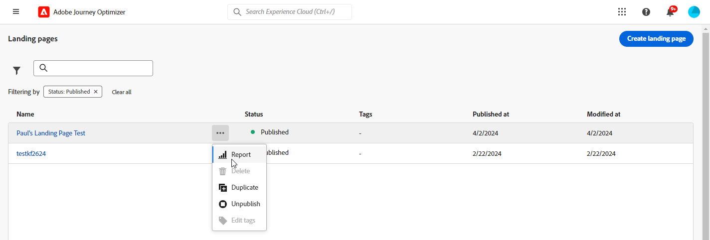

# Landing page report {#lp-report-global-cja}

The **Landing Page** report offers valuable insights into user behavior, engagement patterns, conversion rates, and other key metrics, empowering you to make informed decisions and optimize your landing page performance effectively.

To access your reports, select **[!UICONTROL Report]** from the advanced menu of your selected landing page.

To learn more on Customer Journey Analytics workspace and how to filter and analyze data, refer to [this page](https://experienceleague.adobe.com/en/docs/analytics-platform/using/cja-workspace/home).

## Landing page Conversion rate {#lp-conversion}

The **[!UICONTROL Landing page Conversion rate]** KPI enables you to assess the effectiveness of your landing page based on the number of visits and interactions.

* **[!UICONTROL Landing page Conversion rate]**: Number of persons who interacted with the landing page, e.g. subscribed to a form, in relation to the total number of visits.

## Landing page Bounce rate {#lp-bounce-rate}

The **[!UICONTROL Landing page Bounce rate]** KPI provides information on profiles that viewed your landing page without interacting or clicking on any elements.

* **[!UICONTROL Landing page Bounce rate]**: Number of persons who did not interact with the landing page and did not complete the action of subscribing, in relation to the total number of visits.

## Landing page Views {#lp-views}

The **[!UICONTROL Landing page Views]** KPI allows you to see the impact of your landing page.

* **[!UICONTROL Landing page Views]**: Total number of visits to your landing page coming from journeys and external sources, including multiple visits of one profile.

## Unique Landing page Views {#lp-unique-views}

The **[!UICONTROL Unique Landing page Views]** KPI allows you to measure the impact of your landing page by excluding multiple views from the same profile.

* **[!UICONTROL Unique Landing page Views]**: Number of persons who visited your landing page, multiple visits of one profile are not taken into account.

## Landing page performance over time {#lp-performance-overtime}

The **[!UICONTROL Landing page performance over time]** graph measures your landing pages success and impact on your targeted audience.

* **[!UICONTROL Landing page Views]**: Total number of visits to your landing page coming from journeys and external sources, including multiple visits of one profile.

* **[!UICONTROL Landing page Conversion rate]**: Number of persons who interacted with the landing page, e.g. subscribed to a form, in relation to the total number of visits.

## Landing page performance {#lp-performance}

The **[!UICONTROL Landing page performance]** table serve as a comprehensive dashboard, offering a detailed breakdown of key metrics related to your landing page.

* **[!UICONTROL Landing page Conversion rate]**: Number of persons who interacted with the landing page, e.g. subscribed to a form, in relation to the total number of visits.

* **[!UICONTROL Landing page Bounce rate]**: Number of persons who did not interact with the landing page and did not complete the action of subscribing, in relation to the total number of visits.

* **[!UICONTROL Unique Landing page Views]**: Number of persons who visited your landing page, multiple visits of one profile are not taken into account.

* **[!UICONTROL Unique Landing page Conversion rate]**: Number of persons who interacted with the landing page, multiple interactions of one profile are not taken into account.

* **[!UICONTROL Landing page Views]**: Total number of visits to your landing page coming from journeys and external sources, including multiple visits of one profile.

* **[!UICONTROL Landing page Conversion]**: Number of persons who interacted with the landing page, e.g. subscribed to a form.

## Journeys {#lp-journeys}

The **[!UICONTROL Journey]** table provides a comprehensive overview, detailing the frequency of visits to your landing page within the context of a user's journey. This insightful representation offers valuable data on user interactions, enabling you to understand how visitors navigate through your site and engage with your content.

* **[!UICONTROL Landing page Views]**: Total number of visits to your landing page coming from journeys and external sources, including multiple visits of one profile.

* **[!UICONTROL Landing page Conversion]**: Number of persons who interacted with the landing page, e.g. subscribed to a form.

## Campaigns {#lp-campaigns}

The **[!UICONTROL Campaigns]** table provides insights into the number of visits directed to your landing page as a result of specific campaigns, offering a comprehensive view of campaign effectiveness and engagement with your landing page content.

* **[!UICONTROL Landing page Views]**: Total number of visits to your landing page coming from journeys and external sources, including multiple visits of one profile.

* **[!UICONTROL Landing page Conversion]**: Number of persons who interacted with the landing page, e.g. subscribed to a form.

## Channel {#lp-channels}

The **[!UICONTROL Channel]** table displays the number of visits to your landing page categorized by each channel.

* **[!UICONTROL Landing page Views]**: Total number of visits to your landing page coming from journeys and external sources, including multiple visits of one profile.

* **[!UICONTROL Landing page Conversion]**: Number of persons who interacted with the landing page, e.g. subscribed to a form.

## Top clicked links {#lp-top-clicked}

The **[!UICONTROL Top Clicked Links]** table provides insights into how visitors interact with the delivery, highlighting which links receive the most engagement and attention from your audience.

* **[!UICONTROL Landing page Clicks]**: Number of times a content was clicked on in the landing page.
