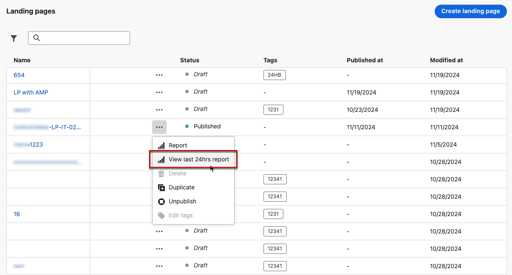

# Landing page live report {#lp-report-live}

>[!CONTEXTUALHELP]
>id="ajo_landing_page_live_report"
>title="Landing page live report"
>abstract="The Landing page live report allows you to measure and visualize in real-time the impact and performances of your landing page only over the last 24 hours. Your report is divided into different widgets detailing your landing page success and errors. Each reporting dashboard can be modified by resizing or removing widgets."

Live reports, accessible from the Last 24 hrs tab, display events that took place within the past 24 hours, with a minimum time interval of two minutes from the event occurrence. In comparison, Customer Journey Analytics reports focus on events that occurred at least two hours ago and cover events over a selected time period.

To access your reports, select **[!UICONTROL View Last 24hrs report]** from the advanced menu of your selected landing page.

The landing page **[!UICONTROL Live report]** is divided into different widgets detailing your delivery's success and errors. Each widget can be resized and deleted if needed. For more information on this refer to this [section](live-report.md).

+++Learn more about the different metrics and widgets available for the Landing page live report.

The **[!UICONTROL Landing page performance]** widget details the main information relative to your message over the last 24 hours through KPIs:

* **[!UICONTROL Total visits]**: Total number of visits to your landing page from a journey or other sources, including multiple visits of one recipient. 

* **[!UICONTROL Conversions]**: Number of persons who interacted with the landing page, e.g. subscribed to a form. 

* **[!UICONTROL Bounces]**: Number of persons who didn't interact with the landing page and didn't complete the action of subscribing.

The **[!UICONTROL Visit sources]** widget represents how visitors are accessing your landing page:

* **[!UICONTROL Journey(s)]**: Number of visits to your landing page coming from a journey.

* **[!UICONTROL Other sources]**: Number of visits to your landing page coming from an external source instead of a journey.

The **[!UICONTROL Top clicked links]** identifies the visitors' interaction with the landing page:

* **[!UICONTROL Clicks]**: Number of times a content was clicked on in the landing page.

The **[!UICONTROL Journey(s)]** widget represents the number of visits to your landing page from a journey.

The **[!UICONTROL Other sources]** widget represents the number of visits to your landing page from an external source instead of a journey.

The **[!UICONTROL Visits by messages]** / **[!UICONTROL Conversions by messages]** graphs represent the total number of visits and persons who interacted successfully with your landing page in the last 24 hours depending on the sent messages.

The **[!UICONTROL Visits by channels]** / **[!UICONTROL Conversions by channels]** graphs represent the total number of visits and persons who interacted successfully with your landing page in the last 24 hours depending on the channels.
+++

For a detailed list of every metric available in Adobe Journey Optimizer, refer to [this page](live-report.md#live-report).
